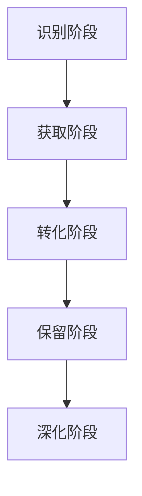
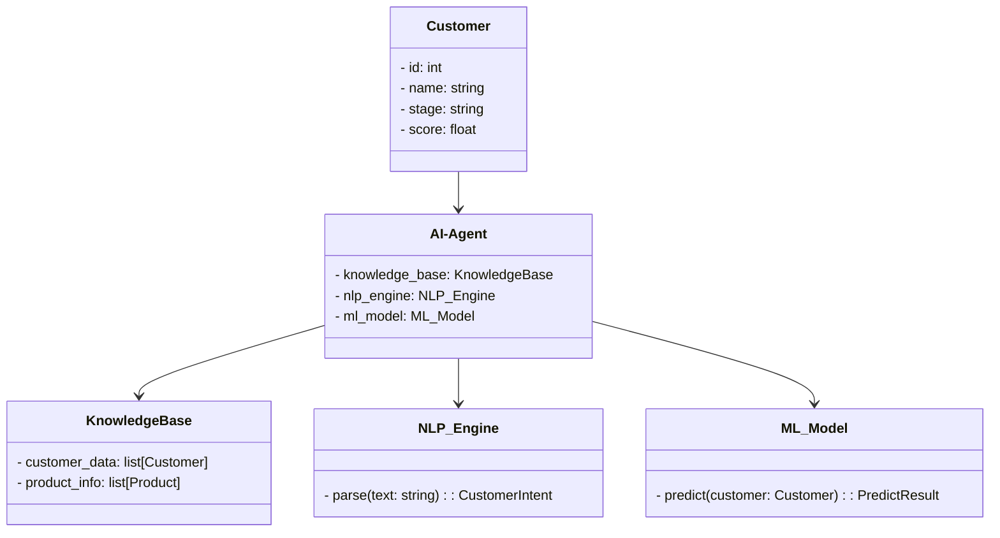
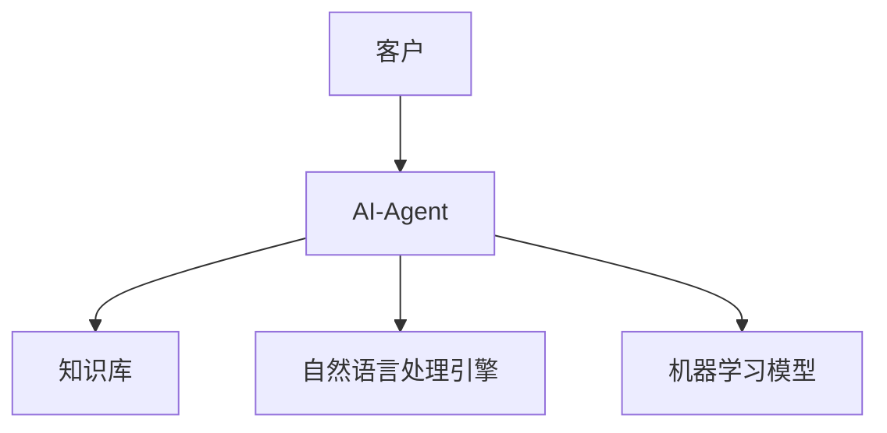
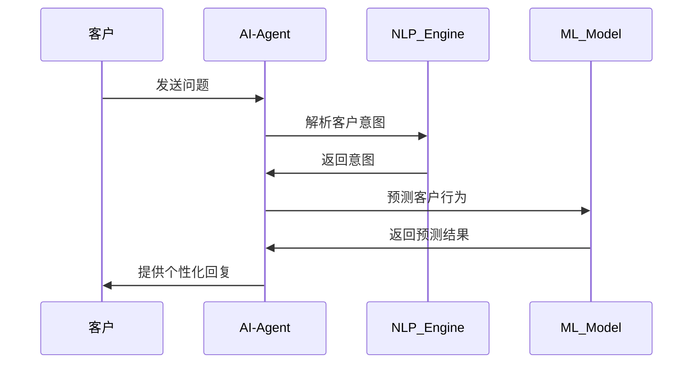

                 


# AI Agent在企业客户生命周期管理中的应用

> 关键词：AI Agent, 客户生命周期管理, 机器学习, 自然语言处理, 企业数字化转型, 智能客服系统

> 摘要：本文深入探讨了AI Agent在企业客户生命周期管理中的应用，从背景介绍、核心概念、算法原理、系统架构设计到项目实战，结合具体案例分析，详细阐述了AI Agent如何通过自然语言处理、机器学习等技术优化客户管理流程。文章还提供了系统架构设计、接口设计和交互流程图，并讨论了系统优化与未来展望。

---

## 第1章: AI Agent与客户生命周期管理概述

### 1.1 客户生命周期管理的背景与重要性

#### 1.1.1 什么是客户生命周期管理
客户生命周期管理（Customer Lifecycle Management，CLM）是指企业通过识别、吸引、保留和提升客户价值，管理客户在整个生命周期中的互动过程。其核心目标是通过数据分析和策略优化，提高客户满意度、忠诚度和企业收益。

#### 1.1.2 客户生命周期管理的阶段划分
客户生命周期通常分为五个阶段：
1. **识别阶段**：发现潜在客户。
2. **获取阶段**：吸引客户并完成初次接触。
3. **转化阶段**：将潜在客户转化为付费客户。
4. **保留阶段**：通过持续服务提高客户忠诚度。
5. **深化阶段**：提升客户价值，挖掘潜在需求。

#### 1.1.3 客户生命周期管理对企业价值的影响
- 提高客户满意度和忠诚度。
- 优化客户互动效率，降低企业成本。
- 通过精准营销提高转化率和客户价值。

### 1.2 AI Agent的定义与核心功能

#### 1.2.1 AI Agent的基本概念
AI Agent（人工智能代理）是指能够感知环境、执行任务并做出决策的智能系统。在客户生命周期管理中，AI Agent通常以虚拟助手或聊天机器人的形式出现，帮助企业在客户互动中实现自动化和智能化。

#### 1.2.2 AI Agent的核心功能与特点
- **自然语言处理（NLP）**：理解客户意图和情感。
- **机器学习**：预测客户行为并优化策略。
- **知识图谱**：整合客户信息，提供个性化服务。
- **自主决策**：基于实时数据做出响应。

#### 1.2.3 AI Agent与传统客户管理工具的区别
| 特性                | AI Agent                       | 传统客户管理工具                 |
|---------------------|-------------------------------|---------------------------------|
| 数据处理能力        | 强大的数据分析与预测能力       | 基于规则的简单数据处理           |
| 交互方式            | 自然语言交互                   | 表单填写或人工客服                |
| 决策能力            | 自主决策并优化策略             | 需人工干预或预设规则              |
| 学习能力            | 可通过反馈不断优化             | 无法主动学习                     |

### 1.3 AI Agent在客户生命周期管理中的应用价值

#### 1.3.1 提高客户满意度与忠诚度
AI Agent通过24/7的实时响应和个性化服务，提升客户体验，增强客户忠诚度。

#### 1.3.2 优化客户互动效率
AI Agent能够快速处理大量客户请求，减少等待时间，提高服务效率。

#### 1.3.3 数据驱动的精准营销
通过分析客户行为数据，AI Agent能够精准识别客户需求，制定个性化营销策略。

---

## 第2章: AI Agent在客户生命周期管理中的核心概念

### 2.1 客户生命周期管理的模型与框架

#### 2.1.1 客户生命周期的五个阶段
- **识别阶段**：通过市场推广发现潜在客户。
- **获取阶段**：通过广告、促销活动吸引客户。
- **转化阶段**：通过销售流程将潜在客户转化为付费客户。
- **保留阶段**：通过优质服务和客户关怀提高客户忠诚度。
- **深化阶段**：通过交叉销售和 upselling 提高客户价值。

#### 2.1.2 每个阶段的核心目标与关键指标
| 阶段               | 核心目标                     | 关键指标                     |
|--------------------|------------------------------|------------------------------|
| 识别阶段           | 发现潜在客户                 | 市场推广点击率、潜在客户数量   |
| 获取阶段           | 吸引客户并完成初次接触       | 转化率、首次购买率             |
| 转化阶段           | 将潜在客户转化为付费客户     | 转化率、客单价                 |
| 保留阶段           | 提高客户忠诚度               | 客户满意度、复购率             |
| 深化阶段           | 提高客户价值                 | 交叉销售率、客户生命周期价值   |

#### 2.1.3 生命周期模型的可视化表示


### 2.2 AI Agent的核心技术与实现原理

#### 2.2.1 自然语言处理（NLP）在AI Agent中的应用
NLP技术使AI Agent能够理解客户的自然语言输入，例如通过分词、实体识别和情感分析等技术提取客户意图。

#### 2.2.2 机器学习算法在客户行为预测中的作用
机器学习算法（如随机森林、XGBoost）用于预测客户在生命周期中的行为，例如预测客户流失风险或购买倾向。

#### 2.2.3 知识图谱在客户信息整合中的应用
知识图谱用于整合客户信息，构建客户画像，从而实现个性化服务。

### 2.3 客户生命周期与AI Agent的关系模型

#### 2.3.1 客户生命周期各阶段与AI Agent的交互方式
| 阶段               | AI Agent 的作用             |
|--------------------|-----------------------------|
| 识别阶段           | 分析市场数据，发现潜在客户   |
| 获取阶段           | 提供个性化广告和优惠券       |
| 转化阶段           | 提供实时咨询和购买支持       |
| 保留阶段           | 发送满意度调查和忠诚度计划   |
| 深化阶段           | 推荐相关产品和服务           |

#### 2.3.2 AI Agent如何影响客户生命周期的每个阶段
- **识别阶段**：通过数据分析挖掘潜在客户。
- **获取阶段**：利用精准营销吸引客户。
- **转化阶段**：提供实时支持提高转化率。
- **保留阶段**：通过个性化服务提升客户忠诚度。
- **深化阶段**：通过交叉销售和 upselling 提高客户价值。

#### 2.3.3 客户生命周期数据对AI Agent优化的反馈机制
客户行为数据（如点击率、购买记录）为AI Agent提供反馈，优化其算法和策略。

---

## 第3章: AI Agent在客户生命周期管理中的核心算法与数学模型

### 3.1 基于机器学习的客户行为预测算法

#### 3.1.1 线性回归模型
线性回归模型用于预测客户在生命周期中的行为，例如预测客户的购买倾向。

公式：
$$ y = \beta_0 + \beta_1x + \epsilon $$

其中：
- \( y \) 是目标变量（如客户是否会购买）。
- \( x \) 是自变量（如客户的浏览次数）。
- \( \beta_0 \) 和 \( \beta_1 \) 是回归系数。
- \( \epsilon \) 是误差项。

#### 3.1.2 支持向量机（SVM）
支持向量机用于分类客户行为，例如预测客户是否会流失。

公式：
$$ \text{max} \{ \frac{1}{2} \|w\|^2 \} $$
$$ \text{subject to} \quad y_i(w \cdot x_i + b) \geq 1, \quad i=1,2,...,n $$

其中：
- \( w \) 是权重向量。
- \( b \) 是偏置项。
- \( y_i \) 是标签（1或-1）。
- \( x_i \) 是输入向量。

#### 3.1.3 随机森林
随机森林是一种基于决策树的集成算法，用于分类和回归任务。

公式：
$$ y = \text{median}(\{y_i\}) $$

其中：
- \( y_i \) 是每棵决策树的预测值。

### 3.2 基于强化学习的客户行为预测算法

#### 3.2.1 强化学习的基本原理
强化学习通过智能体与环境的交互，学习最优策略。

公式：
$$ Q(s, a) = r + \gamma \max_{a'} Q(s', a') $$

其中：
- \( Q(s, a) \) 是状态 \( s \) 和动作 \( a \) 的价值。
- \( r \) 是奖励。
- \( \gamma \) 是折扣因子。
- \( s' \) 是下一个状态。

#### 3.2.2 在客户生命周期管理中的应用
强化学习用于动态优化客户互动策略，例如在客服聊天中选择最佳回复。

---

## 第4章: AI Agent的系统架构设计与实现

### 4.1 问题场景介绍

#### 4.1.1 项目背景
某企业希望通过AI Agent优化其客户生命周期管理流程，提高客户满意度和忠诚度。

#### 4.1.2 项目目标
- 实现客户生命周期管理的自动化。
- 提供个性化客户服务。
- 提高客户转化率和留存率。

### 4.2 系统功能设计

#### 4.2.1 领域模型类图


#### 4.2.2 系统架构图


#### 4.2.3 系统接口设计
- **客户输入接口**：支持文本输入和语音输入。
- **AI-Agent接口**：提供API供其他系统调用。
- **知识库接口**：提供数据存储和检索功能。

#### 4.2.4 系统交互流程图


### 4.3 项目实战

#### 4.3.1 环境安装
- 安装Python和相关库（如NLTK、Scikit-learn、Flask）。
- 安装自然语言处理工具（如spaCy）。

#### 4.3.2 核心代码实现

##### 4.3.2.1 自然语言处理部分
```python
import spacy

nlp = spacy.load("en_core_web_sm")

def parse_customer_intent(text):
    doc = nlp(text)
    intent = "unknown"
    for token in doc:
        if token.text.lower() in ["help", "support"]:
            intent = "support_request"
            break
    return intent
```

##### 4.3.2.2 机器学习部分
```python
from sklearn.ensemble import RandomForestClassifier

# 假设X是特征矩阵，y是标签
model = RandomForestClassifier()
model.fit(X, y)

def predict_customer_behavior(customer_data):
    return model.predict([customer_data])
```

##### 4.3.2.3 知识图谱部分
```python
from kgpedia import KnowledgeGraph

kg = KnowledgeGraph()
customer_info = kg.query("Customer_Info")
```

#### 4.3.3 案例分析与代码解读
- **案例1**：客户发送“我遇到了产品使用问题”，AI Agent解析意图并提供支持。
- **案例2**：客户浏览多个产品页面，AI Agent预测客户可能感兴趣的产品并推荐。

### 4.4 项目小结
通过AI Agent实现客户生命周期管理，企业能够提高客户互动效率和满意度，降低运营成本。

---

## 第5章: 系统优化与未来展望

### 5.1 系统优化策略

#### 5.1.1 性能优化
- 优化自然语言处理引擎，提高响应速度。
- 使用分布式计算优化机器学习模型训练。

#### 5.1.2 可扩展性优化
- 设计模块化架构，方便功能扩展。
- 使用云服务实现弹性扩展。

### 5.2 未来展望

#### 5.2.1 新兴技术的应用
- **生成式AI**：用于自动生成个性化回复。
- **区块链**：用于客户数据的安全管理。

#### 5.2.2 行业发展趋势
- 更加个性化的客户服务。
- AI Agent与物联网（IoT）的结合。

---

## 第6章: 总结与参考文献

### 6.1 总结
本文深入探讨了AI Agent在企业客户生命周期管理中的应用，从理论到实践，详细阐述了其核心概念、算法原理和系统架构设计。通过具体案例分析，展示了AI Agent如何优化客户管理流程。

### 6.2 参考文献
- 章渊跃. (2020). 《人工智能: 理论与实践》. 清华大学出版社.
- LeCun, Y., Bengio, Y., & Hinton, G. (2015). Deep learning. Nature, 521(7555), 436-444.

---

## 作者：AI天才研究院/AI Genius Institute & 禅与计算机程序设计艺术 /Zen And The Art of Computer Programming

