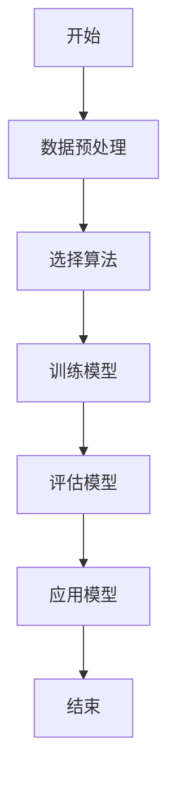
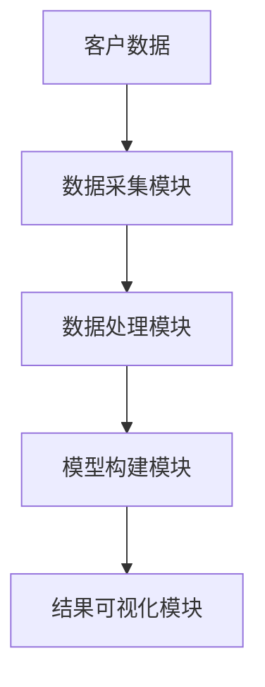

                 


# AI Agent在企业客户画像与细分中的应用

> 关键词：AI Agent，客户画像，客户细分，数据驱动，机器学习

> 摘要：本文深入探讨了AI Agent在企业客户画像与细分中的应用，从核心概念、算法原理到系统架构设计，再到项目实战，全面解析了AI Agent如何帮助企业优化客户管理流程。通过详细的技术分析和实际案例，本文展示了如何利用AI技术实现精准的客户画像构建与细分，为企业制定个性化营销策略提供支持。

---

## 第一部分: AI Agent在企业客户画像与细分中的应用概述

### 第1章: 背景介绍

#### 1.1 问题背景
企业客户管理是现代商业运营的核心环节之一。随着市场竞争的加剧，企业需要更精准地了解客户需求，以便提供个性化的服务和产品。传统的客户管理方法依赖于人工分析和经验判断，存在效率低、精度差的问题。

#### 1.2 问题描述
- **客户数据的复杂性**：企业收集的客户数据包括人口统计信息、行为数据、购买历史等，这些数据往往分散且难以整合。
- **客户行为分析的难点**：客户行为受到多种因素的影响，如市场环境、产品特性、客户偏好等，传统方法难以捕捉这些复杂关系。
- **传统客户管理方法的局限性**：基于规则的传统方法难以应对客户群体的动态变化，且缺乏数据驱动的精准分析。

#### 1.3 问题解决
AI Agent（人工智能代理）通过自动化学习和分析，能够帮助企业高效地构建客户画像，并实现客户细分。AI Agent的核心优势在于其数据驱动的分析能力，能够从海量数据中提取有价值的信息，为企业制定精准的营销策略提供支持。

#### 1.4 边界与外延
- **应用范围**：AI Agent主要应用于客户画像构建和客户细分，适用于电商、金融、医疗等多个行业。
- **与传统客户管理的区别**：AI Agent通过自动化和智能化的方式优化客户管理流程，而传统方法依赖人工操作。
- **与其他AI技术的关联**：AI Agent结合了机器学习、自然语言处理和大数据分析等多种技术，形成完整的客户管理解决方案。

#### 1.5 概念结构与核心要素
- **客户画像**：基于客户数据构建的立体化客户形象，包括人口统计信息、行为特征、偏好等。
- **客户细分**：将客户群体按照特定维度进行划分，以便制定针对性的营销策略。
- **AI Agent**：通过机器学习算法，从数据中提取特征并构建客户画像和细分模型。

---

## 第二部分: 核心概念与联系

### 第2章: AI Agent的核心概念与原理

#### 2.1 AI Agent的定义与特点
AI Agent是一种能够感知环境、做出决策并执行操作的智能系统。其特点包括：
- **感知能力**：通过数据采集和分析，了解客户需求和行为特征。
- **决策能力**：基于分析结果，制定客户细分策略。
- **执行能力**：通过自动化方式，将决策结果应用于实际业务场景。

#### 2.2 客户画像与细分的对比分析
| 特征               | 客户画像                          | 客户细分                          |
|--------------------|-----------------------------------|-----------------------------------|
| 定义               | 描述客户的整体特征                | 将客户划分为不同群体              |
| 分析维度           | 包括人口统计、行为特征、偏好等    | 侧重于客户的相似性和差异性        |
| 目的               | 了解客户特征，制定个性化策略      | 提供针对性的营销方案                |

#### 2.3 ER实体关系图
```mermaid
erDiagram
    customer[客户] {
        id : integer
        name : string
        age : integer
        gender : string
        purchase_history : string
        preferences : string
    }
 
    product[产品] {
        id : integer
        name : string
        category : string
        price : float
    }
 
    transaction[交易] {
        id : integer
        customer_id : integer
        product_id : integer
        timestamp : datetime
    }
 
    customer --> transaction : "购买了"
    product --> transaction : "被购买"
```

---

## 第三部分: 算法原理

### 第3章: 算法原理与实现

#### 3.1 聚类算法
- **K-means算法**：一种常用的无监督学习算法，用于将客户数据划分为若干簇。
  - **数学模型**：$$ \text{目标函数} = \sum_{i=1}^{k} \sum_{j=1}^{n_i} \|x_j - c_i\|^2 $$
  - **实现步骤**：
    1. 初始化质心。
    2. 计算每个数据点到质心的距离。
    3. 重新计算质心，直到收敛。

#### 3.2 分类算法
- **决策树算法**：基于特征的分层决策，用于客户细分。
  - **分类原理**：通过特征分裂，构建决策树模型，用于预测客户类别。
  - **示例**：使用ID3算法，基于信息增益选择最优特征。

#### 3.3 算法流程图


#### 3.4 核心代码
```python
from sklearn.cluster import KMeans
from sklearn.tree import DecisionTreeClassifier
import pandas as pd

# 数据预处理
data = pd.read_csv('customer_data.csv')
data = data.dropna()

# 聚类分析
model = KMeans(n_clusters=3, random_state=0)
model.fit(data)
clusters = model.labels_

# 分类分析
model = DecisionTreeClassifier()
model.fit(X_train, y_train)
predictions = model.predict(X_test)
```

---

## 第四部分: 系统分析与架构设计

### 第4章: 系统分析与架构设计

#### 4.1 项目背景
企业客户管理系统的现状存在数据分散、分析效率低等问题。通过引入AI Agent，可以实现客户画像的自动化构建和客户细分的智能化分析。

#### 4.2 系统功能设计
- **数据采集模块**：从多个数据源获取客户信息。
- **数据处理模块**：清洗和预处理数据，提取特征。
- **模型构建模块**：基于机器学习算法，构建客户画像和细分模型。
- **可视化模块**：将分析结果以图表形式展示，便于决策者理解。

#### 4.3 系统架构设计


#### 4.4 接口设计
- **数据接口**：与企业数据库对接，获取客户数据。
- **API接口**：提供客户画像和细分结果的查询接口。

#### 4.5 交互流程图
```mermaid
sequenceDiagram
    participant 用户
    participant 系统
    用户 -> 系统: 请求客户画像
    系统 -> 数据采集模块: 获取数据
    数据采集模块 -> 数据处理模块: 数据清洗
    数据处理模块 -> 模型构建模块: 训练模型
    模型构建模块 -> 系统: 返回结果
    用户 <- 系统: 显示客户画像
```

---

## 第五部分: 项目实战

### 第5章: 项目实战与案例分析

#### 5.1 环境安装
- **Python 3.8+**
- **安装依赖**：`pip install numpy pandas scikit-learn`

#### 5.2 核心代码
```python
import numpy as np
import pandas as pd
from sklearn.cluster import KMeans
from sklearn.tree import DecisionTreeClassifier
from sklearn.metrics import accuracy_score

# 数据加载
data = pd.read_csv('customer_data.csv')

# 聚类分析
X = data[['age', 'income', 'purchase_frequency']]
model = KMeans(n_clusters=4, random_state=0)
model.fit(X)
print("聚类中心：", model.cluster_centers_)

# 分类分析
X_train, y_train, X_test, y_test = train_test_split(X, y, test_size=0.3)
clf = DecisionTreeClassifier()
clf.fit(X_train, y_train)
print("分类准确率：", accuracy_score(y_test, clf.predict(X_test)))
```

#### 5.3 案例分析
以电商客户细分为例，使用K-means算法将客户分为4个群体：
1. 高消费、高频率客户。
2. 中消费、中频率客户。
3. 低消费、高频率客户。
4. 低消费、低频率客户。

#### 5.4 项目小结
通过AI Agent实现客户画像与细分，企业能够更精准地制定营销策略，提高客户满意度和忠诚度。

---

## 第六部分: 最佳实践与小结

### 第6章: 最佳实践与小结

#### 6.1 实践 tips
- 数据质量是关键：确保数据的完整性和准确性。
- 模型调优：根据业务需求选择合适的算法，并进行参数优化。
- 隐私保护：在处理客户数据时，必须遵守相关法律法规，保护客户隐私。

#### 6.2 项目小结
本文详细介绍了AI Agent在企业客户画像与细分中的应用，从理论到实践，全面解析了技术实现和实际案例。通过AI Agent，企业能够更高效地管理客户数据，制定精准的营销策略。

---

作者：AI天才研究院/AI Genius Institute & 禅与计算机程序设计艺术 /Zen And The Art of Computer Programming

