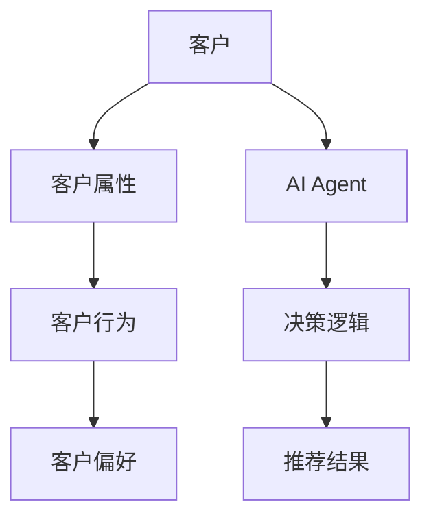
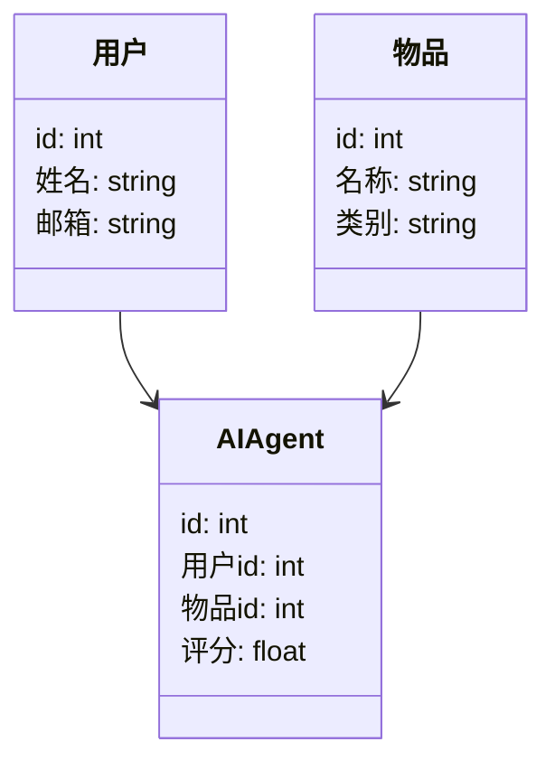
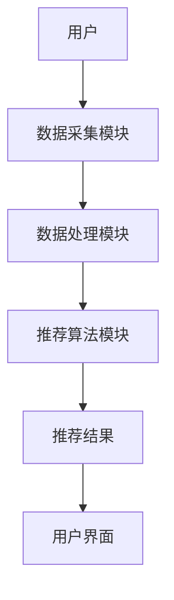
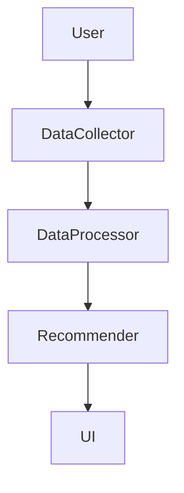
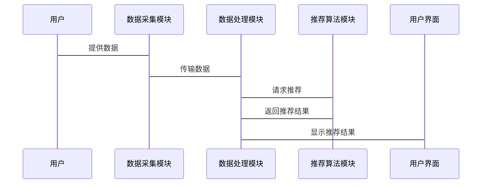

                 


# AI Agent在企业客户细分与个性化服务中的应用

> 关键词：AI Agent, 客户细分, 个性化服务, 机器学习, 推荐系统

> 摘要：本文详细探讨了AI Agent在企业客户细分与个性化服务中的应用，从背景、核心概念、算法原理到系统设计和实战案例，全面解析了AI Agent如何通过智能化手段提升客户体验和企业效率。文章结合理论与实践，为读者提供了从基础到高级的全面指导。

---

## 第1章 AI Agent的基本概念与背景

### 1.1 AI Agent的定义与核心概念

AI Agent（人工智能代理）是指能够感知环境、自主决策并执行任务的智能实体。它结合了机器学习、自然语言处理和推理引擎等技术，能够根据输入的信息生成个性化输出。

#### 1.1.1 AI Agent的定义
- AI Agent是一个智能实体，能够通过数据输入生成个性化输出。
- 它具有感知、决策和执行的能力。
- AI Agent的目标是通过自动化和智能化手段，提升用户体验和企业效率。

#### 1.1.2 AI Agent的核心属性
| 属性 | 描述 |
|------|------|
| 感知能力 | 能够从环境中获取信息（如客户数据、行为等）。 |
| 决策能力 | 基于获取的信息，生成个性化推荐或决策。 |
| 执行能力 | 根据决策结果执行相应操作（如发送邮件、更新系统等）。 |

#### 1.1.3 AI Agent与传统自动化工具的区别
| 特性 | AI Agent | 传统自动化工具 |
|------|---------|----------------|
| 智能性 | 具备学习和推理能力 | 缺乏智能性，仅能执行预定义任务 |
| 个性化 | 能够生成个性化输出 | 输出通常固定或基于简单规则 |
| 自适应性 | 能够根据环境变化调整行为 | 行为固定，无法自适应变化 |

### 1.2 企业客户细分的背景与挑战

#### 1.2.1 客户细分的定义与重要性
客户细分是指将客户群体按照某些特征（如行为、属性、偏好等）进行分类，以便提供针对性的服务。

- **定义**：客户细分是将客户群体划分为不同子群体的过程。
- **重要性**：通过客户细分，企业可以更精准地满足客户需求，提升客户满意度和忠诚度。

#### 1.2.2 传统客户细分方法的局限性
传统客户细分方法通常基于简单的规则或统计分析，存在以下问题：
1. **数据维度有限**：难以捕捉客户的复杂行为和偏好。
2. **缺乏个性化**：无法根据实时数据生成动态推荐。
3. **效率低下**：手动或半自动化的客户细分过程耗时且成本高。

#### 1.2.3 个性化服务的需求与趋势
随着市场竞争的加剧，客户对个性化服务的需求日益增长。企业需要通过智能化手段，提供个性化的客户体验。

### 1.3 AI Agent在客户细分中的作用

#### 1.3.1 AI Agent如何提升客户细分效率
AI Agent通过自动化数据处理和智能分析，显著提升了客户细分的效率。例如：
- **数据采集**：AI Agent可以从多个渠道（如网站、APP）实时采集客户数据。
- **智能分析**：利用机器学习算法，AI Agent能够快速识别客户的特征和偏好。
- **动态更新**：AI Agent可以根据实时数据动态调整客户细分结果。

#### 1.3.2 AI Agent在个性化服务中的应用价值
AI Agent可以通过推荐系统为客户提供个性化服务，提升客户满意度和忠诚度。

- **推荐系统**：AI Agent可以根据客户的偏好和行为，推荐个性化的产品或服务。
- **动态调整**：AI Agent能够根据客户的实时行为调整推荐策略。

#### 1.3.3 企业采用AI Agent的潜在收益
1. **提升客户满意度**：通过个性化服务，客户感受到更高的关怀。
2. **提高转化率**：精准的推荐能够提高客户的购买意愿。
3. **降低运营成本**：自动化客户细分和个性化服务减少了人工干预。

---

## 第2章 AI Agent的核心原理

### 2.1 AI Agent的工作原理

#### 2.1.1 数据采集与处理
AI Agent通过多种渠道采集客户数据，包括：
- **客户属性**：如年龄、性别、职业等。
- **客户行为**：如浏览记录、点击行为等。
- **客户偏好**：如兴趣爱好、消费习惯等。

#### 2.1.2 智能分析与决策
AI Agent利用机器学习算法对数据进行分析，生成个性化推荐。

#### 2.1.3 行为执行与反馈
AI Agent根据分析结果执行相应操作，并根据反馈调整推荐策略。

### 2.2 AI Agent的核心技术

#### 2.2.1 自然语言处理（NLP）
NLP技术使AI Agent能够理解和生成人类语言，例如：
- **情感分析**：分析客户评论的情感倾向。
- **意图识别**：识别客户的意图并生成相应的回复。

#### 2.2.2 机器学习与深度学习
机器学习算法是AI Agent的核心技术之一，常用算法包括：
1. **协同过滤**：基于用户行为的推荐算法。
2. **聚类分析**：将客户分为不同的群体。
3. **深度学习模型**：如神经网络、Transformer模型等。

#### 2.2.3 知识图谱与推理引擎
知识图谱用于表示客户和产品之间的关系，推理引擎用于生成推荐结果。

### 2.3 AI Agent的实体关系图（ER图）



---

## 第3章 AI Agent的算法原理与数学模型

### 3.1 推荐算法概述

#### 3.1.1 协同过滤推荐算法
协同过滤是一种基于用户行为的推荐算法，分为两类：
1. **用户-物品协同过滤**：基于用户对物品的评分进行推荐。
2. **基于矩阵分解的协同过滤**：通过矩阵分解技术（如SVD）生成推荐。

#### 3.1.2 基于内容的推荐算法
基于内容的推荐算法利用物品的属性进行推荐，例如：
- **文本推荐**：基于物品的描述生成推荐。
- **图像推荐**：基于物品的视觉特征生成推荐。

#### 3.1.3 基于深度学习的推荐算法
深度学习模型在推荐系统中表现优异，常用模型包括：
1. **神经网络模型**：如DNN（深度神经网络）。
2. **Transformer模型**：如BERT、GPT等。

### 3.2 协同过滤算法实现

#### 3.2.1 用户-物品协同过滤

假设我们有一个用户-物品评分矩阵`R`，其中`R[i,j]`表示用户`i`对物品`j`的评分。协同过滤的目标是找到与用户`i`相似的用户，然后基于这些用户的评分推荐物品。

#### 3.2.2 基于矩阵分解的协同过滤

矩阵分解是一种常用的协同过滤方法，常用SVD（奇异值分解）算法。SVD将评分矩阵`R`分解为两个低维矩阵`U`和`V`，使得`R ≈ U * V^T`。

#### 3.2.3 协同过滤的优缺点
| 优点 | 缺点 |
|------|------|
| 简单易实现 | 对冷启动问题敏感 |
| 能捕捉用户偏好 | 需要大量的数据支持 |

### 3.3 深度学习推荐模型

#### 3.3.1 基于神经网络的推荐系统

神经网络推荐系统通过多层感知机（MLP）对用户和物品的特征进行非线性变换，生成推荐结果。

#### 3.3.2 Transformer模型在推荐系统中的应用
Transformer模型通过自注意力机制捕捉用户和物品之间的关系，例如：
- **用户注意力**：捕捉用户行为中的重要部分。
- **物品注意力**：捕捉物品特征中的重要部分。

#### 3.3.3 深度学习推荐模型的训练流程
1. **数据预处理**：对数据进行归一化、降维等处理。
2. **模型训练**：利用训练数据优化模型参数。
3. **模型评估**：通过验证集评估模型性能。

### 3.4 推荐算法的数学模型

#### 3.4.1 协同过滤的数学模型

假设我们有一个用户-物品评分矩阵`R`，其中`R[i,j]`表示用户`i`对物品`j`的评分。协同过滤的目标是找到与用户`i`相似的用户，然后基于这些用户的评分推荐物品。

#### 3.4.2 基于矩阵分解的协同过滤模型

矩阵分解是一种常用的协同过滤方法，常用SVD（奇异值分解）算法。SVD将评分矩阵`R`分解为两个低维矩阵`U`和`V`，使得`R ≈ U * V^T`。

---

## 第4章 系统分析与架构设计

### 4.1 系统功能设计

#### 4.1.1 领域模型



#### 4.1.2 系统架构设计



### 4.2 系统架构图



### 4.3 系统接口设计

- **输入接口**：用户输入数据（如评分、点击行为等）。
- **输出接口**：推荐结果（如推荐列表、个性化建议等）。

### 4.4 系统交互流程



---

## 第5章 项目实战

### 5.1 环境安装

安装Python和相关库：
```bash
pip install numpy
pip install scikit-learn
pip install matplotlib
```

### 5.2 核心代码实现

#### 5.2.1 协同过滤实现

```python
from sklearn.metrics.pairwise import cosine_similarity

# 创建用户-物品评分矩阵
R = np.array([[4,3,0],
              [2,0,3],
              [1,5,2]])

# 计算余弦相似性
similarity = cosine_similarity(R)
print(similarity)
```

#### 5.2.2 基于内容的推荐实现

```python
from sklearn.feature_extraction.text import TfidfVectorizer
from sklearn.metrics.pairwise import cosine_similarity

# 创建文本数据
texts = ["apple is a fruit", "banana is a fruit", "car is a vehicle"]

# 创建TF-IDF向量化器
vectorizer = TfidfVectorizer()
tfidf = vectorizer.fit_transform(texts)

# 计算余弦相似性
similarity_matrix = cosine_similarity(tfidf)
print(similarity_matrix)
```

---

## 第6章 总结与展望

### 6.1 总结

AI Agent通过智能化手段显著提升了企业客户细分与个性化服务的效率。本文从背景、核心概念、算法原理到系统设计和实战案例，全面解析了AI Agent的应用。

### 6.2 未来展望

随着AI技术的不断进步，AI Agent在客户细分与个性化服务中的应用将更加广泛。未来的研究方向包括：
1. **多模态推荐**：结合文本、图像等多种数据源进行推荐。
2. **实时推荐**：基于实时数据生成动态推荐。
3. **可解释性推荐**：提升推荐的透明性和可解释性。

---

## 作者信息

作者：AI天才研究院/AI Genius Institute & 禅与计算机程序设计艺术 /Zen And The Art of Computer Programming

---

本文通过系统化的分析和实践，详细探讨了AI Agent在企业客户细分与个性化服务中的应用。从理论到实践，帮助读者全面掌握AI Agent的核心原理和技术实现。

