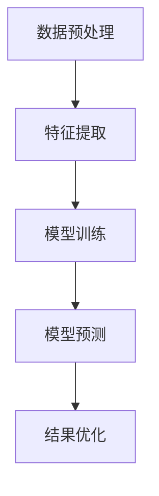
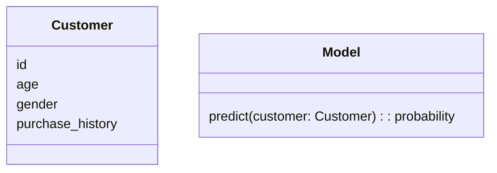
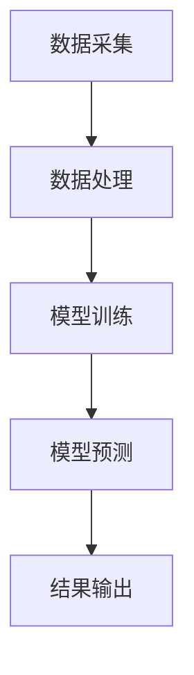

                 


# AI Agent在企业客户行为分析与预测中的应用

**关键词：** AI Agent, 客户行为分析, 预测模型, 数据挖掘, 机器学习, 系统架构

**摘要：**  
本文将深入探讨AI Agent在企业客户行为分析与预测中的应用。首先，我们将介绍AI Agent与客户行为分析的基本概念和背景，分析其在企业中的重要性。接着，我们将详细讲解AI Agent的核心算法原理，包括聚类、分类和关联规则挖掘等方法。随后，通过系统架构设计和项目实战，展示如何构建一个基于AI Agent的客户行为分析系统。最后，我们将总结最佳实践，为企业提供实用的建议。

---

## 第1章: AI Agent与客户行为分析的背景介绍

### 1.1 问题背景与描述

#### 1.1.1 客户行为分析的重要性  
在当今竞争激烈的市场环境中，企业需要通过分析客户的消费行为、购买偏好和互动模式，来优化销售策略、提升客户满意度并提高市场竞争力。客户行为分析帮助企业发现潜在客户、识别高价值客户，并预测未来的消费趋势。

#### 1.1.2 AI Agent在客户行为分析中的作用  
AI Agent（人工智能代理）是一种能够自主感知环境、执行任务并优化决策的智能系统。在客户行为分析中，AI Agent可以通过实时数据处理、模式识别和预测建模，帮助企业快速分析大量数据，发现隐藏的客户行为规律。

#### 1.1.3 企业客户行为分析的挑战与机遇  
客户行为数据通常具有高维性、复杂性和动态性。传统的方法难以应对这些挑战，而AI Agent凭借其强大的数据处理能力和自主学习能力，为企业提供了新的解决方案。

---

### 1.2 问题解决与边界

#### 1.2.1 AI Agent如何解决客户行为分析问题  
AI Agent可以通过以下方式解决客户行为分析问题：  
1. **实时数据处理**：AI Agent能够实时收集和处理客户的交互数据，如点击流数据、社交媒体互动等。  
2. **模式识别**：通过聚类和关联规则挖掘，AI Agent可以识别客户的消费模式和偏好。  
3. **预测建模**：AI Agent可以基于历史数据，预测客户的未来行为，如购买概率、流失风险等。  

#### 1.2.2 问题的边界与外延  
客户行为分析的边界包括：  
- 数据范围：仅限于客户相关的数据，如交易记录、点击流数据等。  
- 时间范围：分析的是过去和当前的行为数据，预测未来的行为。  

外延包括：  
- 行为预测：不仅包括购买行为，还包括客户满意度、忠诚度等。  
- 应用场景：不仅限于电商，还可应用于金融、医疗、教育等多个领域。  

#### 1.2.3 核心概念与组成要素  
客户行为分析的核心概念包括：  
- **客户数据**：包括交易数据、人口统计信息、行为数据等。  
- **行为模式**：通过数据分析发现的客户行为规律。  
- **预测模型**：基于机器学习算法构建的客户行为预测模型。  

---

## 第2章: AI Agent与客户行为分析的核心概念

### 2.1 AI Agent的定义与特点

#### 2.1.1 AI Agent的定义  
AI Agent是一种智能系统，能够感知环境、自主决策并执行任务。它通常具备以下特点：  
1. **自主性**：能够在没有人为干预的情况下独立运行。  
2. **反应性**：能够实时感知环境变化并做出响应。  
3. **学习能力**：能够通过数据学习和优化自身的模型。  

#### 2.1.2 AI Agent的核心特点  
- **数据驱动**：AI Agent依赖于数据进行决策和预测。  
- **动态适应**：能够根据环境变化动态调整其行为。  
- **可扩展性**：能够处理不同类型和规模的数据。  

#### 2.1.3 AI Agent与传统算法的区别  
AI Agent与传统算法的区别主要体现在以下几点：  
1. **自主性**：AI Agent具备自主决策的能力，而传统算法仅是工具。  
2. **学习能力**：AI Agent能够通过数据学习优化自身模型，而传统算法通常需要人工调整。  
3. **实时性**：AI Agent能够实时处理数据并做出响应，而传统算法通常需要批量处理数据。  

---

### 2.2 客户行为分析的原理

#### 2.2.1 客户行为分析的定义  
客户行为分析是指通过对客户在企业系统中的行为数据进行分析，发现行为规律并预测未来行为的过程。

#### 2.2.2 客户行为分析的关键要素  
- **数据来源**：包括交易数据、点击流数据、社交媒体数据等。  
- **分析方法**：包括聚类分析、分类分析、关联规则挖掘等。  
- **预测模型**：基于机器学习算法构建的客户行为预测模型。  

#### 2.2.3 客户行为分析的流程与方法  
客户行为分析的流程通常包括以下步骤：  
1. **数据收集**：收集与客户行为相关的数据。  
2. **数据预处理**：清洗数据，处理缺失值和异常值。  
3. **特征提取**：提取有助于模型构建的特征。  
4. **模型训练**：基于机器学习算法构建预测模型。  
5. **模型评估**：评估模型的性能并优化模型。  

---

### 2.3 AI Agent与客户行为分析的联系

#### 2.3.1 AI Agent在客户行为分析中的优势  
AI Agent在客户行为分析中的优势包括：  
1. **实时性**：AI Agent能够实时处理客户行为数据，快速做出响应。  
2. **自主性**：AI Agent能够自主发现行为规律并优化模型。  
3. **可扩展性**：AI Agent能够处理不同类型和规模的客户行为数据。  

#### 2.3.2 AI Agent与客户行为分析的结合方式  
AI Agent与客户行为分析的结合方式包括：  
1. **实时监控**：AI Agent实时监控客户的互动行为，发现异常行为并发出警报。  
2. **行为预测**：AI Agent基于历史数据，预测客户的未来行为。  
3. **个性化推荐**：AI Agent根据客户的偏好，推荐个性化的产品或服务。  

#### 2.3.3 AI Agent在客户行为预测中的应用  
AI Agent在客户行为预测中的应用包括：  
1. **客户流失预测**：预测客户是否可能流失。  
2. **购买概率预测**：预测客户购买某产品的概率。  
3. **客户分类**：将客户分为不同的群体，以便进行针对性营销。  

---

## 第3章: AI Agent与客户行为分析的算法原理

### 3.1 算法原理概述

#### 3.1.1 基于聚类的客户行为分析  
聚类分析是一种无监督学习方法，用于将客户分为不同的群体。常用的聚类算法包括K-means和DBSCAN。

#### 3.1.2 基于分类的客户行为预测  
分类分析是一种监督学习方法，用于根据客户的特征预测其行为。常用的分类算法包括决策树和随机森林。

#### 3.1.3 基于关联规则挖掘的客户行为分析  
关联规则挖掘用于发现客户的购买模式和偏好。常用的算法包括Apriori和FP-Growth。

---

### 3.2 算法流程图



---

### 3.3 算法实现代码

```python
# 数据预处理
import pandas as pd

# 加载数据
data = pd.read_csv('customer_behavior.csv')

# 填充缺失值
data = data.dropna()

# 特征提取
X = data[['age', 'gender', 'purchase_history']]

# 模型训练
from sklearn.tree import DecisionTreeClassifier
model = DecisionTreeClassifier()
model.fit(X, data['target'])

# 模型预测
predictions = model.predict(X)
```

---

## 第4章: AI Agent与客户行为分析的系统架构设计

### 4.1 项目介绍

#### 4.1.1 项目背景  
本项目旨在通过AI Agent分析客户的在线行为数据，预测客户的购买概率。

### 4.2 系统功能设计

#### 4.2.1 系统功能模块  
1. 数据采集模块：实时采集客户的在线行为数据。  
2. 数据处理模块：清洗和预处理数据。  
3. 模型训练模块：基于机器学习算法训练预测模型。  
4. 模型预测模块：预测客户的购买概率。  

#### 4.2.2 领域模型  


### 4.3 系统架构设计

#### 4.3.1 系统架构图  


---

## 第5章: 项目实战

### 5.1 环境安装

#### 5.1.1 安装Python  
安装Python 3.8或更高版本。

#### 5.1.2 安装依赖库  
安装pandas、scikit-learn等库。

```bash
pip install pandas scikit-learn
```

### 5.2 系统核心实现

#### 5.2.1 数据预处理  
```python
import pandas as pd

data = pd.read_csv('customer_behavior.csv')
data = data.dropna()
```

#### 5.2.2 模型训练  
```python
from sklearn.tree import DecisionTreeClassifier
model = DecisionTreeClassifier()
model.fit(X, y)
```

---

## 第6章: 最佳实践

### 6.1 小结  
AI Agent在企业客户行为分析与预测中的应用具有重要的意义。通过实时数据处理、模式识别和预测建模，AI Agent可以帮助企业优化销售策略、提升客户满意度并提高市场竞争力。

### 6.2 注意事项  
1. 数据隐私和安全问题需要特别注意。  
2. 模型的可解释性是实际应用中的一个重要考量因素。  
3. 模型的实时性和响应速度需要优化。

### 6.3 未来展望  
随着AI技术的不断发展，AI Agent在客户行为分析中的应用将更加广泛和深入。未来，我们可以期待更多创新的应用场景和技术突破。

---

**作者：AI天才研究院/AI Genius Institute & 禅与计算机程序设计艺术 /Zen And The Art of Computer Programming**

