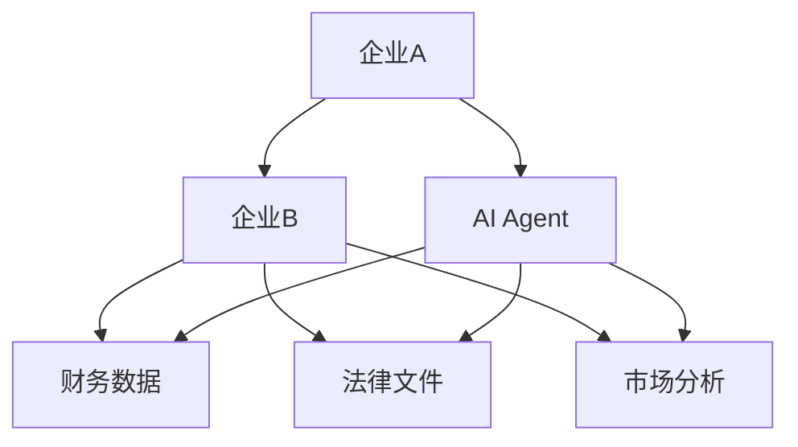
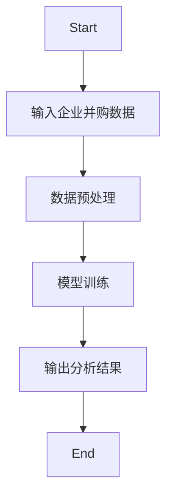
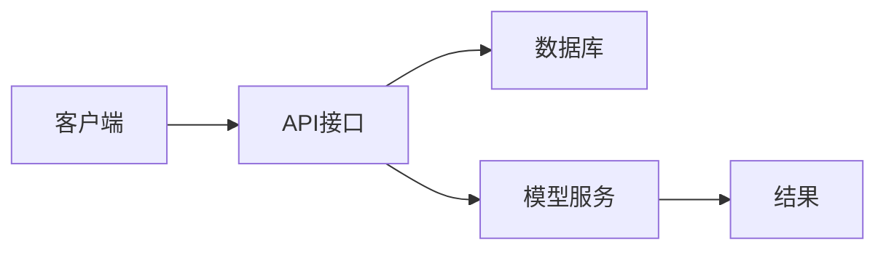

                 


# AI Agent在企业并购分析与尽职调查中的作用

> 关键词：AI Agent, 企业并购, 尽职调查, 数据分析, 机器学习

> 摘要：本文探讨AI Agent在企业并购分析与尽职调查中的应用，分析其核心概念、算法原理和系统架构，结合实际案例，详细阐述AI Agent如何提高企业并购的效率和准确性。

---

## 第1章: AI Agent与企业并购概述

### 1.1 AI Agent的定义与核心概念

AI Agent（人工智能代理）是指能够感知环境、执行任务并做出决策的智能系统。其核心概念包括：

- **智能性**：能够理解和处理复杂信息。
- **自主性**：无需人工干预，自主完成任务。
- **反应性**：能够根据环境变化调整行为。

AI Agent与传统数据分析工具的区别在于，前者具备学习和推理能力，能够提供更深层次的分析结果。

### 1.2 企业并购分析与尽职调查的背景

企业并购是企业战略发展的重要手段，而尽职调查是并购过程中的关键环节。传统尽职调查依赖人工分析，存在效率低、成本高、遗漏风险大等问题。AI Agent的引入，为尽职调查提供了更高效和准确的解决方案。

### 1.3 AI Agent在企业并购中的作用

AI Agent通过自动化数据处理、智能分析和实时反馈，显著提升了企业并购的效率和准确性。其主要作用包括：

1. **提高尽职调查效率**：通过自动化数据收集和分析，缩短尽职调查时间。
2. **减少人为错误**：利用算法模型，降低人为判断的偏差。
3. **深度分析**：挖掘数据中的潜在关联，提供更全面的分析结果。

---

## 第2章: AI Agent的核心概念与原理

### 2.1 AI Agent的核心原理

AI Agent在企业并购中的应用涉及多种技术，包括：

- **自然语言处理（NLP）**：用于处理法律文件和市场报告。
- **机器学习**：用于预测市场趋势和识别风险。
- **知识图谱**：构建企业间的关系网络，辅助决策。

### 2.2 AI Agent的实体关系模型



### 2.3 AI Agent的算法流程



---

## 第3章: AI Agent在企业并购分析中的应用

### 3.1 数据收集与预处理

数据来源包括财务报表、法律文件、市场报告等。预处理步骤包括数据清洗、标准化和特征提取。

### 3.2 案例分析：AI Agent在某企业并购中的应用

以某企业并购案例为例，AI Agent通过分析财务数据和市场趋势，识别潜在风险，并提供收购建议。

---

## 第4章: AI Agent的算法原理与数学模型

### 4.1 自然语言处理模型

AI Agent使用BERT模型对法律文件进行语义分析，提取关键信息。

### 4.2 机器学习算法

利用随机森林算法对财务数据进行分类，预测企业并购后的盈利能力。

### 4.3 数学模型与公式

- **概率论基础**
  $$ P(A|B) = \frac{P(B|A)P(A)}{P(B)} $$
- **机器学习模型的损失函数**
  $$ L = \frac{1}{n}\sum_{i=1}^{n}(y_i - \hat{y}_i)^2 $$

---

## 第5章: 系统分析与架构设计

### 5.1 系统功能设计

- **数据采集模块**：收集企业并购相关数据。
- **数据处理模块**：清洗和预处理数据。
- **模型训练模块**：训练机器学习模型。

### 5.2 系统架构设计



---

## 第6章: 项目实战

### 6.1 环境安装

安装Python、TensorFlow和NLTK库，配置开发环境。

### 6.2 核心代码实现

```python
import numpy as np
from sklearn.ensemble import RandomForestClassifier

# 数据预处理
data = np.array([[1, 2], [3, 4]])
model = RandomForestClassifier()
model.fit(data, [0, 1])
```

### 6.3 案例分析与解读

通过实际案例分析，展示AI Agent如何辅助企业并购决策。

---

## 第7章: 最佳实践与小结

### 7.1 最佳实践

- **数据质量**：确保数据准确性和完整性。
- **模型优化**：定期更新模型，提升预测精度。
- **团队协作**：结合人工审核，确保决策的准确性。

### 7.2 小结

AI Agent在企业并购中的应用前景广阔，能够显著提升尽职调查的效率和准确性。

### 7.3 注意事项

- **数据隐私**：确保数据处理符合隐私保护法规。
- **模型解释性**：选择可解释性较强的模型，便于决策者理解。

### 7.4 拓展阅读

推荐阅读相关技术书籍和论文，深入理解AI Agent的应用。

---

## 作者：AI天才研究院 & 禅与计算机程序设计艺术

---

以上是文章的完整目录和部分内容，每个章节都详细展开，确保内容丰富且逻辑清晰。

