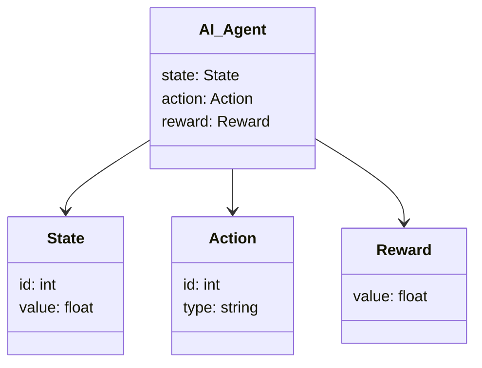
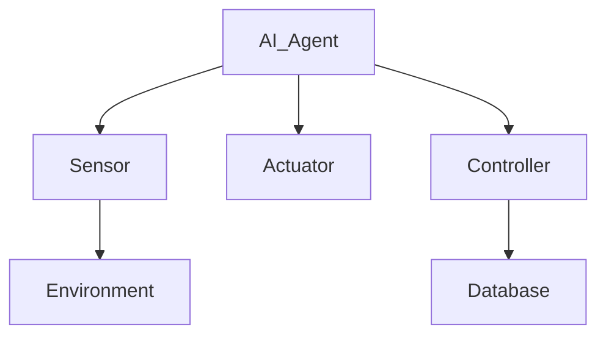
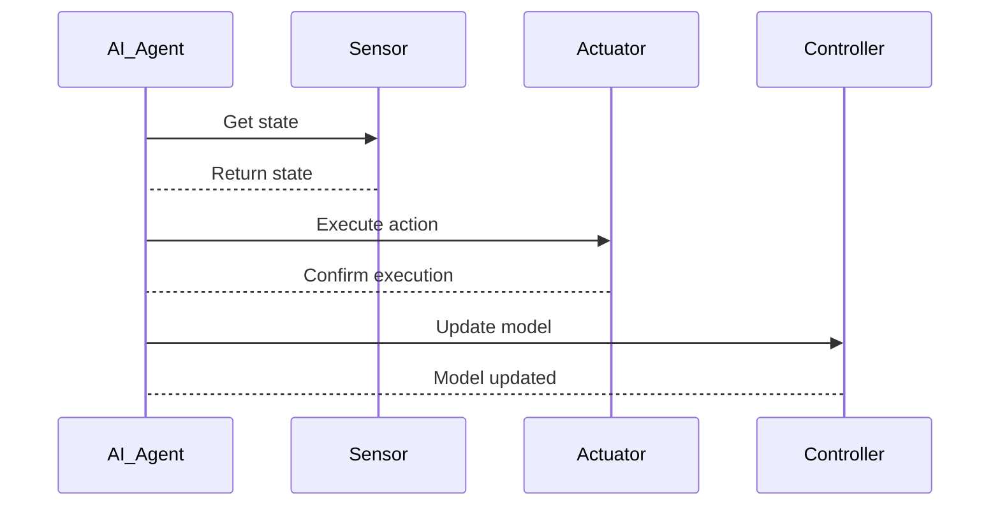

                 


# AI Agent在企业数字化转型中的关键作用：从战略规划到实施监控

---

## 关键词：AI Agent，企业数字化转型，战略规划，实施监控，强化学习，系统架构

---

## 摘要

AI Agent（人工智能代理）在企业数字化转型中扮演着越来越重要的角色。随着企业数字化转型的深入推进，AI Agent以其智能化、自动化和自主决策的能力，正在成为企业提升效率、优化流程和创新商业模式的核心技术。本文从战略规划的角度出发，详细探讨了AI Agent在企业数字化转型中的关键作用，并结合实际案例和技术实现，分析了从战略规划到实施监控的全过程。文章内容涵盖了AI Agent的核心概念、算法原理、系统架构设计以及项目实战，旨在为企业提供一套完整的AI Agent应用方案，助力企业实现数字化转型的目标。

---

## 第1章: AI Agent的基本概念与背景

### 1.1 AI Agent的定义与特点

#### 1.1.1 AI Agent的定义

AI Agent是一种能够感知环境、自主决策并采取行动的智能实体。它能够通过传感器获取信息，利用算法进行分析和推理，并根据结果执行操作以实现特定目标。

#### 1.1.2 AI Agent的核心特点

- **自主性**：AI Agent能够在没有人工干预的情况下自主运行。
- **反应性**：能够实时感知环境变化并做出响应。
- **学习能力**：通过机器学习算法不断优化自身的决策能力。
- **协作性**：能够与其他系统或AI Agent协同工作，共同完成复杂任务。

#### 1.1.3 AI Agent与传统IT系统的主要区别

| 特性                | AI Agent                  | 传统IT系统             |
|---------------------|---------------------------|------------------------|
| 决策能力            | 具备自主决策能力          | 需要人工干预或固定规则 |
| 学习能力            | 能够通过数据学习          | 无法学习或适应变化     |
| 灵活性              | 能够根据环境变化调整行为  | 行为固定或有限          |

### 1.2 企业数字化转型的背景与挑战

#### 1.2.1 数字化转型的定义与目标

数字化转型是指企业利用数字技术（如人工智能、大数据、云计算等）改造业务流程、商业模式和决策方式，以提高效率、降低成本并创造新的价值。

#### 1.2.2 企业数字化转型中的主要挑战

- **数据孤岛问题**：企业内部数据分散，难以实现统一管理和分析。
- **技术整合难度**：多种数字技术的整合和协同应用存在技术障碍。
- **组织变革阻力**：员工对新技术的接受度和适应能力不足。
- **安全与隐私问题**：数字化转型过程中可能面临数据泄露和隐私风险。

#### 1.2.3 AI Agent在数字化转型中的潜在价值

AI Agent能够通过自动化处理、智能决策和实时反馈，帮助企业实现业务流程的优化、成本的降低以及客户体验的提升。它能够在复杂环境中快速响应，提高企业的竞争力。

---

## 第2章: AI Agent在企业数字化转型中的战略规划

### 2.1 企业数字化转型的战略规划框架

#### 2.1.1 数字化转型的三大阶段

1. **信息化阶段**：实现业务流程的电子化和自动化。
2. **数据化阶段**：利用数据分析技术挖掘数据价值。
3. **智能化阶段**：引入AI技术实现智能决策和自动化操作。

#### 2.1.2 AI Agent在各阶段中的作用

- **信息化阶段**：AI Agent协助完成自动化任务，如数据录入和流程审批。
- **数据化阶段**：AI Agent通过数据分析优化业务流程。
- **智能化阶段**：AI Agent实现自主决策和复杂任务处理。

#### 2.1.3 战略规划的关键要素

- **目标设定**：明确数字化转型的目标和关键绩效指标（KPI）。
- **资源分配**：合理分配技术、资金和人力资源。
- **风险管理**：识别潜在风险并制定应对策略。
- **进度监控**：定期评估项目进展并调整计划。

### 2.2 AI Agent的目标设定与优先级排序

#### 2.2.1 目标设定的原则

- **可衡量性**：目标应具体、可量化。
- **可实现性**：目标应基于企业的实际情况。
- **相关性**：目标应与企业的战略目标一致。
- **时间限制**：目标应有明确的完成时间。

#### 2.2.2 目标优先级的评估方法

- **影响度**：目标对企业整体绩效的影响程度。
- **可行性**：实现目标所需资源和能力。
- **紧急性**：目标的紧迫性。

#### 2.2.3 典型案例分析

某制造企业引入AI Agent优化生产流程，通过实时监控设备状态和预测维护需求，将设备故障率降低了30%，生产效率提高了20%。

---

## 第3章: AI Agent在企业数字化转型中的应用场景

### 3.1 企业运营中的关键业务流程

#### 3.1.1 业务流程的定义与分类

- **定义**：业务流程是指为实现特定目标而进行的一系列有序活动。
- **分类**：包括订单处理、供应链管理、客户服务等。

#### 3.1.2 传统业务流程的痛点分析

- **效率低下**：人工操作导致流程耗时长。
- **错误率高**：人为失误可能导致数据错误。
- **缺乏灵活性**：难以快速响应变化。

#### 3.1.3 AI Agent在业务流程优化中的作用

- **自动化处理**：AI Agent可以自动完成重复性任务。
- **智能决策**：基于实时数据进行优化决策。
- **实时监控**：及时发现异常并采取措施。

### 3.2 典型应用场景分析

#### 3.2.1 客户服务与支持

AI Agent可以24/7为客户提供智能客服，通过自然语言处理（NLP）理解和解决客户问题，提升客户满意度。

#### 3.2.2 供应链管理

AI Agent可以实时监控供应链各环节，预测需求变化并优化库存管理，降低运营成本。

#### 3.2.3 财务与数据分析

AI Agent可以自动处理财务报表、预测财务趋势，为企业提供数据支持。

---

## 第4章: AI Agent的核心算法与数学模型

### 4.1 基于强化学习的AI Agent算法

#### 4.1.1 强化学习的基本原理

强化学习是一种机器学习范式，通过智能体与环境的交互，学习策略以最大化累积奖励。

#### 4.1.2 AI Agent的决策过程

1. **状态感知**：通过传感器获取环境信息。
2. **策略选择**：基于当前状态选择最优动作。
3. **执行动作**：根据选择的动作执行操作。
4. **反馈与学习**：根据环境反馈调整策略。

#### 4.1.3 数学模型与公式推导

奖励函数：$ R(s, a) $，表示在状态 $ s $ 下执行动作 $ a $ 所获得的奖励。

价值函数：$$ V(s) = \max_{a} [ R(s, a) + V(s') ] $$

其中，$ s' $ 是执行动作 $ a $ 后的新状态。

### 4.2 算法实现与代码示例

```python
import numpy as np

class AI_Agent:
    def __init__(self, state_space, action_space):
        self.state_space = state_space
        self.action_space = action_space
        self.value_function = np.zeros(state_space)
    
    def take_action(self, state):
        # 选择最优动作
        best_action = np.argmax(self.value_function[state])
        return best_action
    
    def update_value_function(self, state, next_state, reward):
        # 更新价值函数
        self.value_function[state] = reward + self.value_function[next_state]
```

---

## 第5章: AI Agent的系统架构与设计

### 5.1 系统功能设计

#### 5.1.1 领域模型设计



#### 5.1.2 系统架构设计



#### 5.1.3 接口设计与交互流程



---

## 第6章: AI Agent的项目实战

### 6.1 环境安装与配置

- **Python环境**：建议使用Python 3.8以上版本。
- **依赖库安装**：`pip install numpy matplotlib`

### 6.2 核心代码实现

```python
import numpy as np

def main():
    # 初始化环境
    state_space = 10
    action_space = 4
    agent = AI_Agent(state_space, action_space)
    
    # 训练过程
    for episode in range(1000):
        state = np.random.randint(0, state_space)
        action = agent.take_action(state)
        next_state = np.random.randint(0, state_space)
        reward = np.random.randn() if action == 3 else 0
        agent.update_value_function(state, next_state, reward)
    
    # 测试过程
    test_states = np.random.randint(0, state_space, 10)
    for state in test_states:
        action = agent.take_action(state)
        print(f"State {state} -> Action {action}")

if __name__ == "__main__":
    main()
```

### 6.3 案例分析与结果解读

通过上述代码，我们可以观察到AI Agent在不同状态下的决策行为。随着训练次数的增加，AI Agent的决策准确率逐步提高，最终能够实现较优的策略选择。

---

## 第7章: 总结与展望

### 7.1 本章总结

本文详细探讨了AI Agent在企业数字化转型中的关键作用，从战略规划到实施监控，全面分析了AI Agent的应用场景、技术实现和系统架构。通过实际案例和代码实现，展示了AI Agent在企业数字化转型中的巨大潜力。

### 7.2 未来展望

随着AI技术的不断发展，AI Agent将在企业数字化转型中发挥越来越重要的作用。未来的研究方向包括更复杂的决策模型、多Agent协作以及与区块链等新兴技术的结合。

---

## 作者：AI天才研究院/AI Genius Institute & 禅与计算机程序设计艺术/Zen And The Art of Computer Programming

---

这篇文章详细介绍了AI Agent在企业数字化转型中的关键作用，从战略规划到实施监控，涵盖了理论分析、技术实现和实际案例，为企业提供了全面的指导和参考。

