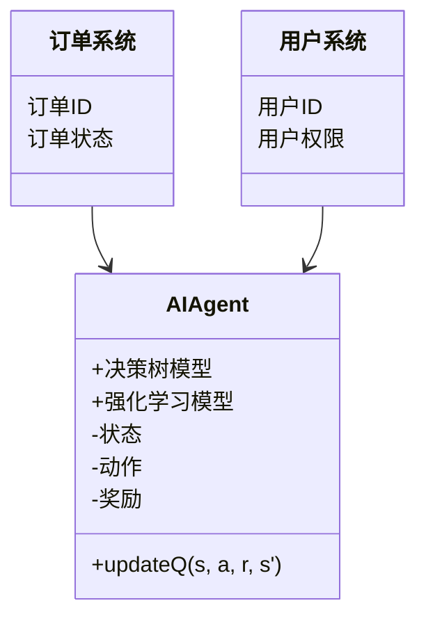
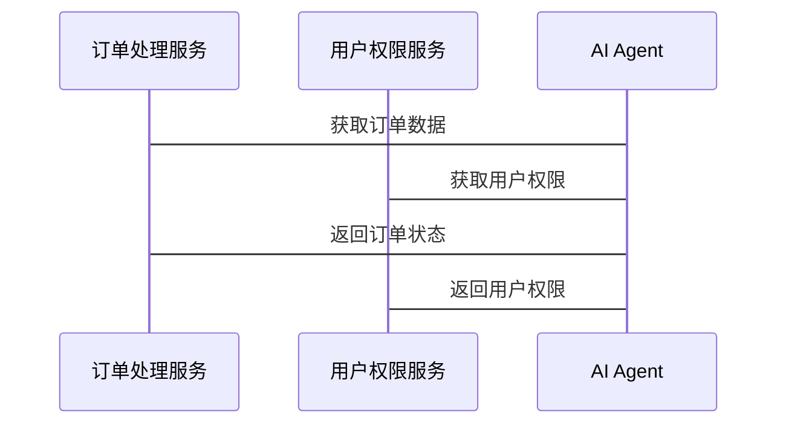

                 


# AI Agent在企业数字化转型中的关键角色与实施策略

## 关键词：AI Agent，企业数字化转型，实施策略，系统架构，算法原理

## 摘要：本文探讨了AI Agent在企业数字化转型中的关键作用，分析了其实现策略，并通过系统架构和算法原理的详细讲解，结合实际案例，展示了如何有效实施AI Agent。文章内容包括核心概念、算法实现、系统设计和项目实战，为读者提供了全面的指导。

---

## 第1章: AI Agent的核心概念与背景

### 1.1 AI Agent的定义与核心要素

#### 1.1.1 AI Agent的定义
AI Agent（人工智能代理）是能够感知环境、做出决策并执行操作的智能体。它通过接收输入、处理信息并输出行动，帮助企业在复杂环境中优化流程和决策。

#### 1.1.2 AI Agent的核心要素
- **感知能力**：通过传感器或数据输入获取环境信息。
- **决策能力**：基于感知信息，使用算法做出决策。
- **执行能力**：通过执行器或系统接口执行决策结果。

#### 1.1.3 AI Agent的分类与特点
AI Agent可分为简单反射型、基于模型型、目标驱动型和效用驱动型。目标驱动型AI Agent广泛应用于企业数字化转型，通过明确目标优化业务流程。

### 1.2 企业数字化转型的背景与挑战

#### 1.2.1 数字化转型的定义与目标
数字化转型是利用数字技术优化业务流程、商业模式和用户体验，目标是提高效率、降低成本和增强竞争力。

#### 1.2.2 企业数字化转型中的主要挑战
- 数据孤岛：部门间数据无法共享，导致效率低下。
- 数据质量：数据不准确或不完整，影响决策。
- 技术集成：传统系统与新技术的集成困难，增加复杂性。

#### 1.2.3 AI Agent在数字化转型中的作用
AI Agent通过自动化处理和智能决策，帮助企业解决数据孤岛、提高数据质量并优化系统集成，从而推动数字化转型。

---

## 第2章: AI Agent的核心概念与原理

### 2.1 AI Agent的感知、决策与执行机制

#### 2.1.1 感知层
AI Agent通过传感器、API或数据库获取环境数据，例如订单系统中的订单信息。

#### 2.1.2 决策层
基于感知数据，AI Agent使用算法做出决策，例如决策树算法选择最优行动。

#### 2.1.3 执行层
AI Agent通过执行器或API将决策转化为实际行动，例如发送邮件或更新数据库。

### 2.2 AI Agent的实体关系分析

#### 2.2.1 实体关系图（ER图）
```mermaid
er
    entity 订单系统 {
        key 订单ID
        属性 订单状态
    }
    entity 用户系统 {
        key 用户ID
        属性 用户权限
    }
    订单系统 -- 用户系统: 用户ID
```

#### 2.2.2 实体属性与关系描述
- **订单系统**：存储订单ID、订单状态等信息。
- **用户系统**：存储用户ID、用户权限等信息。
- **关系**：订单系统通过用户ID关联到用户系统，确定订单的处理权限。

---

## 第3章: AI Agent的算法原理与数学模型

### 3.1 AI Agent的核心算法

#### 3.1.1 决策树算法
决策树是一种常用的分类和回归算法，通过构建树状结构进行分类。

#### 3.1.2 马尔可夫决策过程
马尔可夫决策过程描述在不确定环境中的决策问题，使用状态、动作和奖励的概念。

#### 3.1.3 强化学习算法
强化学习通过试错学习，通过奖励机制优化决策策略。

### 3.2 算法原理的数学模型

#### 3.2.1 决策树的分类模型
决策树构建过程通过信息增益或基尼指数选择最优特征，递归分割数据。

#### 3.2.2 马尔可夫决策过程的公式推导
状态s，动作a，奖励r，下一个状态s'，Q-learning更新公式：
$$ Q(s,a) = Q(s,a) + \alpha [r + \max Q(s',a') - Q(s,a)] $$

#### 3.2.3 强化学习的奖励函数
奖励函数定义状态和动作的奖励值，指导AI Agent的学习方向。

### 3.3 算法实现的Python代码

#### 3.3.1 决策树算法实现
```python
from sklearn.tree import DecisionTreeClassifier

# 训练数据
X = [[...], [...]]
y = [0, 1]

# 创建并训练模型
model = DecisionTreeClassifier()
model.fit(X, y)

# 预测
print(model.predict([[...]]))
```

#### 3.3.2 强化学习算法实现
```python
import numpy as np

# 初始化Q表
Q = np.zeros((state_space, action_space))

# 状态转移
def next_state(state, action):
    return next_state

# Q-learning更新
def update_q(state, action, reward, next_state):
    Q[state, action] += 0.1 * (reward + np.max(Q[next_state, :]) - Q[state, action])
```

---

## 第4章: AI Agent的系统架构与设计

### 4.1 系统分析与功能设计

#### 4.1.1 问题场景分析
AI Agent应用于订单处理系统，解决订单处理中的效率低下问题。

#### 4.1.2 系统功能模块划分
- 数据获取模块
- 决策模块
- 执行模块

#### 4.1.3 领域模型类图设计


### 4.2 系统架构设计

#### 4.2.1 分层架构设计
分层架构包括数据层、服务层和应用层，确保系统模块化和可维护性。

#### 4.2.2 微服务架构设计
微服务架构中，订单处理、用户权限等服务独立部署，通过API通信。

#### 4.2.3 架构组件交互图


---

## 第5章: AI Agent的项目实战与案例分析

### 5.1 项目环境与工具安装

#### 5.1.1 开发环境配置
建议使用Python 3.8及以上版本，安装Jupyter Notebook用于开发和测试。

#### 5.1.2 依赖库安装
安装Scikit-learn、TensorFlow等库：
```bash
pip install scikit-learn tensorflow
```

### 5.2 核心代码实现与解读

#### 5.2.1 AI Agent核心算法实现
```python
from sklearn.tree import DecisionTreeClassifier

# 训练数据
X = [[...], [...]]
y = [0, 1]

# 创建并训练模型
model = DecisionTreeClassifier()
model.fit(X, y)

# 预测
print(model.predict([[...]]))
```

#### 5.2.2 系统功能模块实现
```python
class AI_Agent:
    def __init__(self):
        self.model = DecisionTreeClassifier()
        self.model.fit(X, y)

    def decide(self, state):
        return self.model.predict([state])[0]

    def execute(self, action):
        # 执行具体操作
        pass
```

### 5.3 实际案例分析

#### 5.3.1 案例背景介绍
在某电商企业中，订单处理效率低下，希望通过AI Agent优化流程。

#### 5.3.2 系统实现与应用
AI Agent通过分析订单数据和用户权限，自动分配处理人员，提高效率。

#### 5.3.3 案例效果与总结
订单处理时间减少30%，错误率降低20%，显著提升了业务效率。

---

## 第6章: AI Agent的最佳实践与注意事项

### 6.1 最佳实践指南

#### 6.1.1 数据质量管理
确保数据准确性和完整性，使用数据清洗技术处理脏数据。

#### 6.1.2 模型训练优化
通过交叉验证和超参数调优，提升模型性能和泛化能力。

#### 6.1.3 系统性能调优
优化算法复杂度，减少计算开销，提升系统响应速度。

### 6.2 实施过程中的注意事项

#### 6.2.1 数据隐私与安全
确保数据处理符合隐私法规，防止数据泄露。

#### 6.2.2 系统集成与兼容性
确保AI Agent与现有系统兼容，避免接口冲突和数据丢失。

#### 6.2.3 模型可解释性
选择可解释性较强的算法，便于调试和优化。

### 6.3 拓展阅读

#### 6.3.1 推荐书籍
- 《机器学习实战》
- 《深度学习》

#### 6.3.2 技术博客
- TensorFlow官方博客
- PyTorch官方博客

---

## 结语

AI Agent在企业数字化转型中发挥着关键作用，通过优化业务流程和提高决策效率，帮助企业实现数字化转型。本文从核心概念到实际案例，详细讲解了AI Agent的实现策略，为读者提供了全面的指导。

---

## 作者：AI天才研究院 & 禅与计算机程序设计艺术

