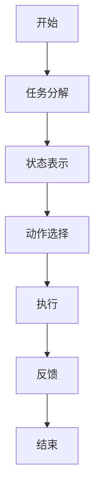
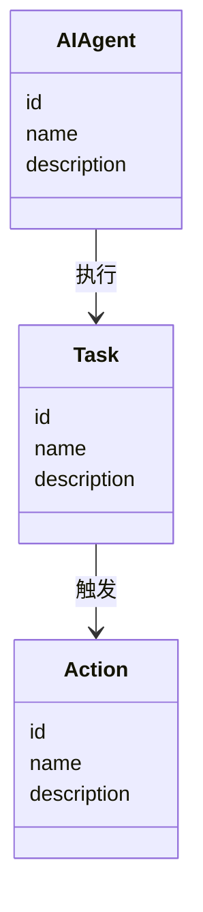

                 


# 《AI Agent在企业数字化转型中的战略定位与实施路径》

---

## 关键词：
AI Agent, 企业数字化转型, 战略定位, 实施路径, 人工智能, 企业架构, 数字化创新

---

## 摘要：
本文系统阐述了AI Agent在企业数字化转型中的战略定位与实施路径，从理论到实践，结合技术原理、系统架构、项目实战等多维度进行深度分析。文章首先介绍了AI Agent的基本概念和核心原理，探讨了其在企业数字化转型中的关键作用。接着，通过算法原理和数学模型的详细解读，分析了AI Agent的核心技术实现。随后，从系统分析与架构设计的角度，详细介绍了AI Agent在企业数字化转型中的应用场景和实施方法。最后，通过项目实战和最佳实践，总结了AI Agent在企业数字化转型中的成功经验与未来发展方向。

---

# 第一部分: AI Agent与企业数字化转型概述

---

## 第1章: AI Agent的基本概念与核心原理

### 1.1 AI Agent的定义与分类

- **1.1.1 AI Agent的定义**  
  AI Agent（人工智能代理）是指能够感知环境、自主决策并执行任务的智能体。它可以基于规则、基于模型或基于学习的方式进行决策。

- **1.1.2 AI Agent的分类**  
  - **简单反射型代理**：基于预定义规则直接执行任务。  
  - **基于模型的反射型代理**：通过内部模型感知环境并动态调整行为。  
  - **目标驱动型代理**：基于目标进行规划和决策。  
  - **效用驱动型代理**：通过最大化效用函数来优化决策。  

- **1.1.3 AI Agent的核心特征**  
  - **智能性**：基于AI算法的能力。  
  - **自主性**：无需外部干预即可执行任务。  
  - **交互性**：能够与人类或其他系统进行交互。  
  - **适应性**：能够适应环境变化并动态调整行为。  

---

### 1.2 企业数字化转型的背景与挑战

- **1.2.1 数字化转型的定义与目标**  
  数字化转型是指通过技术手段将企业的业务流程、组织结构、运营模式等进行数字化重构，以实现业务创新和效率提升。其目标包括提高效率、降低成本、增强客户体验和实现业务模式创新。

- **1.2.2 企业数字化转型的主要挑战**  
  - **技术复杂性**：需要整合多种技术，如AI、大数据、云计算等。  
  - **组织变革阻力**：员工对新技术的接受度和适应能力不足。  
  - **数据孤岛问题**：企业内部数据分散，难以实现高效共享。  
  - **安全与隐私风险**：数字化转型过程中可能面临数据泄露和隐私问题。  

- **1.2.3 AI Agent在数字化转型中的作用**  
  AI Agent可以作为企业数字化转型的核心驱动力，通过自动化、智能化的方式优化业务流程、提升决策效率并增强客户体验。

---

### 1.3 本章小结

本章通过定义和分类AI Agent，探讨了其在企业数字化转型中的核心作用，并分析了数字化转型面临的挑战。AI Agent作为一种智能化的代理，能够帮助企业实现业务流程的自动化和优化，是企业数字化转型的重要推动力。

---

## 第2章: AI Agent的核心概念与属性特征

### 2.1 AI Agent的核心概念

- **2.1.1 AI Agent的主体与客体关系**  
  AI Agent作为主体，通过感知环境（客体）并执行任务，与环境进行交互。

- **2.1.2 AI Agent的目标与任务分解**  
  AI Agent的目标是通过执行任务实现特定的业务目标，任务分解是将复杂目标拆解为可执行的子任务。

---

### 2.2 AI Agent的属性特征对比

- **2.2.1 基于Mermaid的AI Agent属性特征对比表格**

```mermaid
| 属性       | 描述                                   |
|------------|--------------------------------------|
| 智能性      | 基于AI算法的能力                     |
| 自主性      | 独立决策的能力                       |
| 交互性      | 与人或系统交互的能力                 |
| 适应性      | 适应环境变化的能力                   |
| 可扩展性      | 支持多种任务的能力                   |
| 可解释性      | 决策过程可被理解和解释的能力         |
```

---

### 2.3 AI Agent的ER实体关系图

```mermaid
entity AI Agent {
  id: string
  name: string
  description: string
}
entity Task {
  id: string
  name: string
  description: string
}
entity Action {
  id: string
  name: string
  description: string
}
AI Agent -[执行]-> Task
Task -[触发]-> Action
```

---

## 第3章: AI Agent的算法原理

### 3.1 AI Agent的核心算法

- **3.1.1 任务分解算法**



---

- **3.1.2 状态表示与动作选择**

  - **状态表示**：通过传感器或数据源获取环境状态，例如：  
    ```python
    state = {"temperature": 25, "humidity": 50}
    ```
  - **动作选择**：基于当前状态选择最优动作，例如：  
    ```python
    def choose_action(state):
        return max(state.keys(), key=lambda k: state[k])
    ```

---

### 3.2 AI Agent的数学模型

- **3.2.1 Q-learning算法公式**

  $$ Q(s,a) = Q(s,a) + \alpha (r + \gamma \max Q(s',a') - Q(s,a)) $$  

  其中：  
  - $$ Q(s,a) $$：当前状态s和动作a的Q值。  
  - $$ \alpha $$：学习率。  
  - $$ r $$：奖励值。  
  - $$ \gamma $$：折扣因子。  
  - $$ Q(s',a') $$：下一个状态s'和动作a'的Q值。  

---

- **3.2.2 动作选择的概率模型**

  $$ P(a|s) = \frac{e^{\beta Q(s,a)}}{\sum_{a'} e^{\beta Q(s,a')}} $$  

  其中：  
  - $$ \beta $$：温度参数，控制概率分布的集中程度。  

---

## 第4章: AI Agent在企业数字化转型中的系统分析与架构设计

### 4.1 系统分析

- **4.1.1 问题场景介绍**  
  以企业客户关系管理（CRM）为例，AI Agent可以用于客户交互、个性化推荐和客户服务。

---

### 4.2 系统架构设计

- **4.2.1 领域模型（Mermaid类图）**



---

- **4.2.2 系统架构图**


---

## 第5章: AI Agent在企业数字化转型中的项目实战

### 5.1 环境安装与配置

- **5.1.1 Python环境安装**  
  使用Python 3.8及以上版本，安装必要的库：  
  ```bash
  pip install numpy pandas scikit-learn
  ```

---

### 5.2 核心代码实现

- **5.2.1 AI Agent的核心代码**

```python
class AIAgent:
    def __init__(self):
        self.Q = {}

    def learn(self, state, action, reward, next_state):
        key = (state, action)
        if key not in self.Q:
            self.Q[key] = 0
        current_q = self.Q[key]
        next_max_q = max([self.Q.get((next_state, a), 0) for a in self.possible_actions(next_state)])
        self.Q[key] = current_q + alpha * (reward + gamma * next_max_q - current_q)

    def choose_action(self, state):
        actions = self.possible_actions(state)
        return max(actions, key=lambda a: self.Q.get((state, a), 0))
```

---

### 5.3 案例分析与解读

- **5.3.1 案例分析**  
  以智能客服系统为例，AI Agent可以用于客户问题分类、自动回复和客户满意度提升。

---

### 5.4 项目总结与经验分享

- **5.4.1 成功经验**  
  - 明确目标与任务分解。  
  - 选择合适的算法和模型。  
  - 进行充分的测试与优化。  

- **5.4.2 注意事项**  
  - 确保数据质量和完整性。  
  - 处理好算法的可解释性问题。  
  - 加强与业务部门的沟通与协作。  

---

## 第6章: AI Agent在企业数字化转型中的实施路径与最佳实践

### 6.1 实施路径

- **6.1.1 明确目标与范围**  
  确定AI Agent的应用场景和目标，例如：优化业务流程、提升客户体验。

---

### 6.2 最佳实践

- **6.2.1 技术选型**  
  根据具体需求选择合适的AI算法和工具，例如：使用强化学习优化业务流程。

- **6.2.2 数据管理**  
  建立高效的数据采集、存储和分析机制，确保数据质量。

- **6.2.3 人员培训**  
  对员工进行AI技术培训，提升数字化能力。

---

## 第7章: 总结与展望

### 7.1 本章总结

本文系统探讨了AI Agent在企业数字化转型中的战略定位与实施路径，从理论到实践，详细分析了AI Agent的核心概念、算法原理、系统架构和项目实战。通过案例分析和最佳实践，总结了AI Agent在企业数字化转型中的成功经验。

---

### 7.2 未来展望

随着AI技术的不断发展，AI Agent将在企业数字化转型中发挥越来越重要的作用。未来的研究方向包括：更复杂的任务分解算法、多智能体协作、强化学习与推荐系统结合等。

---

## 参考文献

- Russell, S., & Norvig, P. (2010). *Artificial Intelligence: A Modern Approach*.
- Sutton, R. S., & Barto, A. G. (2018). *Reinforcement Learning: An Introduction*.
- LeCun, Y., Bengio, Y., & Hinton, G. (2015). *Deep Learning*.

---

## 附录

### 附录A: AI Agent相关术语表

- AI Agent：人工智能代理。  
- Q-learning：强化学习算法。  
- ER图：实体关系图。  

---

## 作者

作者：AI天才研究院/AI Genius Institute  
联系邮箱：contact@ai-genius.com  

---

以上是《AI Agent在企业数字化转型中的战略定位与实施路径》的完整目录大纲，涵盖了从理论到实践的各个方面，内容详实，结构清晰，适合技术读者深入理解AI Agent在企业数字化转型中的应用与实施。

