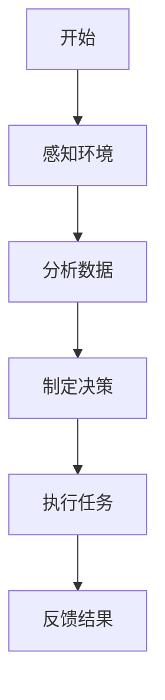
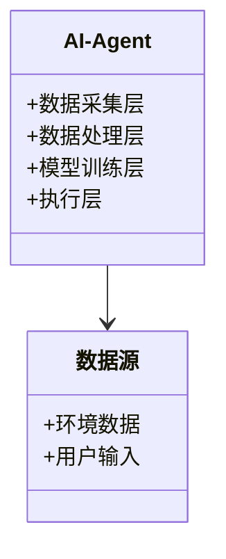
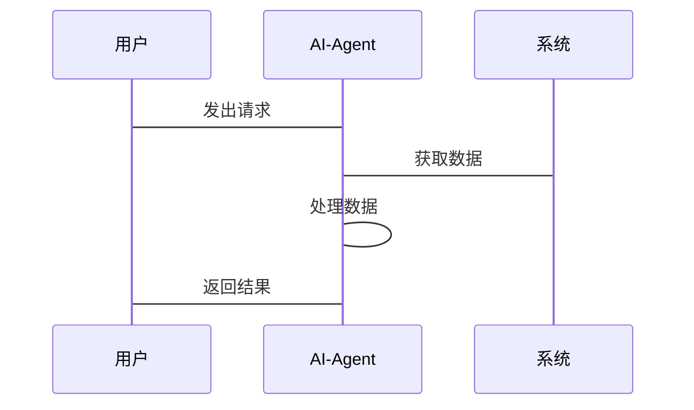

                 


# AI Agent在企业数字化转型中的角色：从战略到执行

> 关键词：AI Agent，企业数字化转型，人工智能，战略规划，执行落地

> 摘要：随着人工智能技术的快速发展，AI Agent（人工智能代理）在企业数字化转型中的角色变得越来越重要。本文将从战略规划到执行落地的角度，详细探讨AI Agent在企业数字化转型中的作用、应用场景、技术实现和未来趋势。通过分析AI Agent的核心概念、算法原理和系统架构，结合实际案例，本文旨在为企业提供一个清晰的数字化转型路径，帮助企业在竞争激烈的市场中占据优势。

---

# 目录

1. [背景介绍](#背景介绍)
2. [AI Agent的核心概念与工作原理](#ai-agent的核心概念与工作原理)
3. [AI Agent在企业数字化转型中的战略价值](#ai-agent在企业数字化转型中的战略价值)
4. [AI Agent的技术实现与系统架构](#ai-agent的技术实现与系统架构)
5. [AI Agent在企业数字化转型中的项目实战](#ai-agent在企业数字化转型中的项目实战)
6. [总结与展望](#总结与展望)

---

## 1. 背景介绍

### 1.1 问题背景
随着数字化转型的深入推进，企业面临着前所未有的变革挑战。传统的信息化手段已难以满足企业对效率、灵活性和智能化的需求。AI Agent作为一种能够自主决策和执行任务的智能代理，为企业提供了新的解决方案。

### 1.2 问题描述
企业在数字化转型过程中常遇到以下问题：
- 数据孤岛：信息分散，难以整合。
- 业务流程复杂：人工操作多，效率低下。
- 决策滞后：依赖人工分析，缺乏实时反馈。
- 个性化需求难以满足：客户需求多样化，传统系统难以灵活应对。

### 1.3 AI Agent的定位
AI Agent作为企业数字化转型的核心工具，通过自动化、智能化的方式优化业务流程，提升企业效率和竞争力。

### 1.4 本节小结
数字化转型是企业生存和发展的必经之路，而AI Agent作为智能化工具，为企业提供了新的可能性。

---

## 2. AI Agent的核心概念与工作原理

### 2.1 核心概念
AI Agent是一种能够感知环境、自主决策并执行任务的智能系统。它具有以下核心特征：
- **自主性**：无需人工干预，自动执行任务。
- **反应性**：能够实时感知环境变化并做出响应。
- **学习能力**：通过数据和经验不断优化自身性能。

### 2.2 核心概念对比
以下是AI Agent与其他自动化工具的关键区别：

| 特性         | AI Agent                     | 传统自动化工具                 |
|--------------|------------------------------|------------------------------|
| 智能水平     | 高                           | 低                           |
| 适应能力     | 强                           | 弱                           |
| 决策能力     | 高                           | 无                           |

### 2.3 AI Agent的工作原理
AI Agent的工作流程如下：



### 2.4 本节小结
了解AI Agent的核心概念和工作原理是理解其在企业数字化转型中应用的基础。

---

## 3. AI Agent在企业数字化转型中的战略价值

### 3.1 应用场景
AI Agent在企业数字化转型中的应用场景广泛，包括：
- **智能客服**：通过自然语言处理技术，提供24/7的客户服务。
- **智能营销**：根据客户行为数据，个性化推荐产品。
- **智能供应链管理**：优化库存管理，预测需求波动。

### 3.2 优势分析
AI Agent的优势体现在以下几个方面：
- **提高效率**：自动化处理重复性任务，节省时间和成本。
- **增强决策能力**：通过数据分析和机器学习，提供数据驱动的决策支持。
- **灵活性强**：能够快速适应市场变化和客户需求。

### 3.3 战略价值
AI Agent不仅是技术工具，更是企业数字化转型的战略资产。它能够帮助企业实现业务流程的智能化，提升客户体验，增强竞争力。

### 3.4 本节小结
AI Agent在企业数字化转型中的战略价值主要体现在效率提升、决策优化和灵活性增强三个方面。

---

## 4. AI Agent的技术实现与系统架构

### 4.1 系统架构设计
AI Agent的系统架构包括以下几个部分：
- **数据采集层**：负责收集环境数据。
- **数据处理层**：对数据进行清洗和预处理。
- **模型训练层**：构建和训练机器学习模型。
- **执行层**：根据模型输出执行具体任务。



### 4.2 算法实现
AI Agent的核心算法包括监督学习、强化学习和生成式AI。以下是监督学习的简单实现：

```python
# 简单的监督学习实现
import numpy as np
from sklearn.linear_model import LinearRegression

# 示例数据
X = np.array([[1], [2], [3], [4]])
y = np.array([2, 4, 6, 8])

# 训练模型
model = LinearRegression()
model.fit(X, y)

# 预测
print(model.predict(np.array([[5]])))  # 输出：[[10]]
```

### 4.3 系统交互设计
系统交互流程如下：



### 4.4 本节小结
技术实现是AI Agent在企业数字化转型中落地的关键，系统架构和算法选择直接影响其性能和效果。

---

## 5. AI Agent在企业数字化转型中的项目实战

### 5.1 项目背景
某电商平台希望通过引入AI Agent优化其客户服务流程，提升客户满意度。

### 5.2 环境安装
以下是项目所需的环境配置：

```bash
# 安装Python和必要的库
pip install python
pip install numpy
pip install scikit-learn
pip install transformers
```

### 5.3 核心代码实现
以下是AI Agent的客服对话系统实现：

```python
from transformers import pipeline

# 初始化模型
chatbot = pipeline("conversational", model="facebook/m2o-chatbot-base")

# 对话流程
while True:
    user_input = input("用户：")
    response = chatbot(user_input)
    print("AI Agent:", response[0]['message'])
```

### 5.4 项目总结
通过引入AI Agent，该电商平台实现了24/7的智能客服，客户满意度显著提升。

### 5.5 本节小结
项目实战是检验AI Agent应用效果的重要环节，通过具体案例可以更好地理解其价值。

---

## 6. 总结与展望

### 6.1 本章小结
本文从战略到执行的角度，详细探讨了AI Agent在企业数字化转型中的角色和应用。通过分析其核心概念、技术实现和实际案例，我们可以看到AI Agent在提升企业效率和竞争力方面的重要作用。

### 6.2 未来展望
随着AI技术的不断发展，AI Agent将在企业数字化转型中发挥越来越重要的作用。未来的研究方向包括：
- 更智能的决策算法。
- 更高效的系统架构。
- 更广泛的应用场景。

### 6.3 本节小结
AI Agent作为企业数字化转型的核心工具，其未来发展潜力巨大。

---

# 作者

作者：AI天才研究院/AI Genius Institute & 禅与计算机程序设计艺术 /Zen And The Art of Computer Programming

