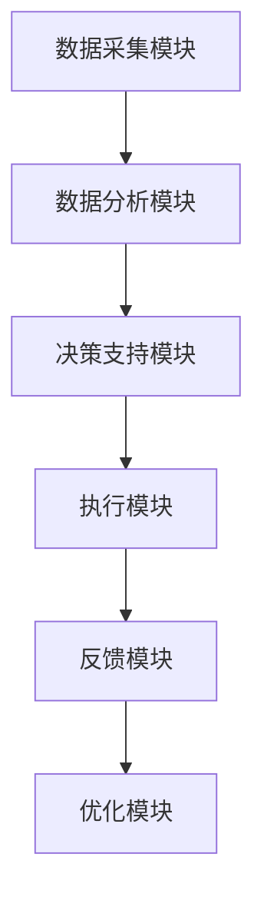

                 


# AI Agent在企业数字化转型评估中的应用

## 关键词：
AI Agent，企业数字化转型，评估框架，算法原理，系统架构，项目实战

## 摘要：
本文详细探讨了AI Agent在企业数字化转型评估中的应用，从基本概念到算法原理，再到系统架构和项目实战，全面解析了AI Agent如何助力企业实现数字化转型的评估与优化。文章通过具体案例分析，展示了AI Agent在评估中的实际应用效果，为企业的数字化转型提供了新的思路和解决方案。

---

## 第1章: AI Agent的基本概念

### 1.1 AI Agent的定义与特点

#### 1.1.1 AI Agent的定义
AI Agent（人工智能代理）是一种能够感知环境、自主决策并执行任务的智能体。它能够通过传感器获取信息，利用算法进行分析，并根据结果采取行动。AI Agent的核心目标是通过智能化的手段，优化企业流程、提高效率并降低成本。

#### 1.1.2 AI Agent的核心特点
1. **自主性**：AI Agent能够在没有人工干预的情况下独立运行。
2. **反应性**：能够实时感知环境变化并做出反应。
3. **学习能力**：通过机器学习算法不断优化自身行为。
4. **协作性**：能够与其他系统或AI Agent协同工作，共同完成任务。

#### 1.1.3 AI Agent与传统自动化工具的区别
AI Agent不仅仅是简单的工具或脚本，它具备以下特点：
- 能够理解上下文并做出决策。
- 具备学习和自适应能力。
- 可以处理复杂和动态的环境。

### 1.2 企业数字化转型的背景与目标

#### 1.2.1 数字化转型的定义
企业数字化转型是指利用数字技术（如人工智能、大数据、云计算等）对业务流程、组织结构、文化等方面进行全方位、全深度的变革，以提升企业的竞争力和创新能力。

#### 1.2.2 数字化转型的核心目标
1. 提高业务效率。
2. 优化客户体验。
3. 创新商业模式。
4. 降低成本。

#### 1.2.3 数字化转型的挑战与机遇
- **挑战**：传统业务流程的复杂性、数据孤岛、技术集成难度等。
- **机遇**：提升企业竞争力、创造新的业务价值、实现业务模式创新。

---

## 第2章: AI Agent在企业数字化转型中的作用

### 2.1 AI Agent在数字化转型中的应用场景

#### 2.1.1 智能决策支持
AI Agent可以通过分析历史数据和实时信息，为企业提供智能决策支持。例如，在供应链管理中，AI Agent可以根据市场需求和库存情况，自动调整采购计划。

#### 2.1.2 流程优化与自动化
AI Agent可以识别企业流程中的瓶颈，并提出优化建议，从而实现流程自动化。例如，在财务部门，AI Agent可以自动处理报销单据、生成财务报表。

#### 2.1.3 数据分析与洞察
AI Agent可以利用机器学习算法，从大量数据中提取有价值的信息，为企业提供数据驱动的洞察。例如，在市场营销中，AI Agent可以分析客户行为数据，制定精准的营销策略。

### 2.2 AI Agent的优势与价值

#### 2.2.1 提高效率
通过自动化处理重复性任务，AI Agent可以显著提高企业的工作效率。

#### 2.2.2 降低成本
AI Agent可以通过优化资源利用，降低企业的运营成本。

#### 2.2.3 增强决策能力
AI Agent能够基于数据和模型提供科学的决策支持，帮助企业做出更明智的选择。

---

## 第3章: 企业数字化转型评估的核心框架

### 3.1 评估框架的构建

#### 3.1.1 评估指标的选择
在企业数字化转型评估中，需要选择合适的指标来衡量转型的效果。例如：
- **技术指标**：系统性能、数据处理能力等。
- **业务指标**：业务效率、成本节约、客户满意度等。

#### 3.1.2 评估方法的确定
常用的评估方法包括：
- **定量分析**：通过数据指标进行量化评估。
- **定性分析**：通过专家访谈、问卷调查等方式进行评估。

#### 3.1.3 评估模型的设计
评估模型的设计需要结合企业的实际情况，选择合适的算法（如回归分析、决策树等）进行建模，并验证模型的准确性和可靠性。

### 3.2 评估框架的实施步骤

#### 3.2.1 数据收集与整理
收集与企业数字化转型相关的数据，包括业务数据、系统数据、用户反馈等。

#### 3.2.2 数据分析与建模
利用数据分析工具（如Python、R、Tableau等）对数据进行分析，并构建评估模型。

#### 3.2.3 结果解读与优化
根据评估结果，提出改进建议，并持续优化评估框架。

---

## 第4章: AI Agent的感知与决策机制

### 4.1 感知模块

#### 4.1.1 数据采集与处理
AI Agent通过传感器或其他数据源获取环境信息，并对其进行清洗、转换和标准化处理。

#### 4.1.2 数据特征提取
从原始数据中提取具有代表性的特征，例如时间序列数据中的趋势、周期性等。

#### 4.1.3 数据分析与理解
利用统计分析、机器学习等方法，对数据进行建模和分析，理解数据背后的规律。

### 4.2 决策模块

#### 4.2.1 决策规则的制定
根据企业目标和业务需求，制定决策规则。例如，在供应链管理中，设定库存警戒线。

#### 4.2.2 决策模型的构建
基于历史数据和业务需求，构建决策模型，例如基于强化学习的动态决策模型。

#### 4.2.3 决策结果的优化
通过不断优化模型参数和调整决策规则，提高决策的准确性和效果。

---

## 第5章: AI Agent的执行与反馈机制

### 5.1 执行模块

#### 5.1.1 行动规划
根据决策结果，制定具体的行动计划。例如，在市场营销中，制定广告投放策略。

#### 5.1.2 行动执行
通过API或其他接口，将决策结果传递给相关系统，执行具体操作。

#### 5.1.3 执行监控
实时监控行动的执行情况，及时发现和解决问题。

### 5.2 反馈机制

#### 5.2.1 反馈数据的收集
收集执行结果的反馈数据，例如客户点击率、订单完成率等。

#### 5.2.2 反馈分析与调整
分析反馈数据，评估决策效果，并根据需要调整决策模型和规则。

#### 5.2.3 反馈结果的优化
通过反馈数据不断优化AI Agent的行为，提高其决策能力和执行效果。

---

## 第6章: 系统架构设计

### 6.1 系统功能模块划分

#### 6.1.1 数据采集模块
负责采集企业数字化转型相关的数据，例如业务数据、用户行为数据等。

#### 6.1.2 数据分析模块
对采集的数据进行清洗、转换和分析，构建评估模型。

#### 6.1.3 决策支持模块
根据分析结果，提供智能决策支持，并生成执行计划。

### 6.2 系统架构设计

#### 6.2.1 系统架构图


#### 6.2.2 系统功能设计
- **数据采集模块**：负责数据的采集和预处理。
- **数据分析模块**：利用机器学习算法进行数据分析和建模。
- **决策支持模块**：基于模型结果提供决策支持。
- **执行模块**：根据决策结果执行具体操作。
- **反馈模块**：收集反馈数据并优化系统。

---

## 第7章: 项目实战

### 7.1 项目背景与目标

#### 7.1.1 项目背景
某制造企业希望通过数字化转型提高生产效率和产品质量。

#### 7.1.2 项目目标
1. 优化生产流程。
2. 提高设备利用率。
3. 实现生产数据的实时监控。

### 7.2 项目实施步骤

#### 7.2.1 环境安装
安装必要的软件和工具，例如Python、TensorFlow、Flask等。

#### 7.2.2 系统核心实现
```python
class AIAgent:
    def __init__(self):
        self.models = {}

    def collect_data(self):
        # 数据采集逻辑
        pass

    def analyze_data(self):
        # 数据分析逻辑
        pass

    def make_decision(self):
        # 决策逻辑
        pass

    def execute_action(self):
        # 执行逻辑
        pass
```

#### 7.2.3 实际案例分析
通过具体案例分析，展示AI Agent在企业数字化转型评估中的实际应用效果。

#### 7.2.4 案例总结
总结项目实施的经验和教训，提出改进建议。

---

## 第8章: 最佳实践与总结

### 8.1 最佳实践

#### 8.1.1 挑战与解决方案
在项目实施过程中，可能会遇到数据不足、模型精度低等问题，需要通过数据增强、模型优化等方法解决。

#### 8.1.2 注意事项
在实际应用中，需要注意数据隐私、系统安全等问题。

#### 8.1.3 拓展阅读
推荐一些相关书籍和资源，供读者深入学习。

### 8.2 项目总结

通过本文的详细讲解，读者可以了解到AI Agent在企业数字化转型评估中的重要作用。从基本概念到算法原理，再到系统架构和项目实战，本文为企业的数字化转型提供了全面的指导和参考。

---

## 作者：AI天才研究院 & 禅与计算机程序设计艺术

