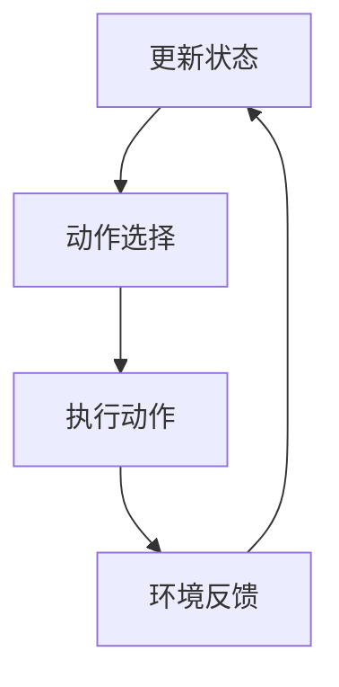
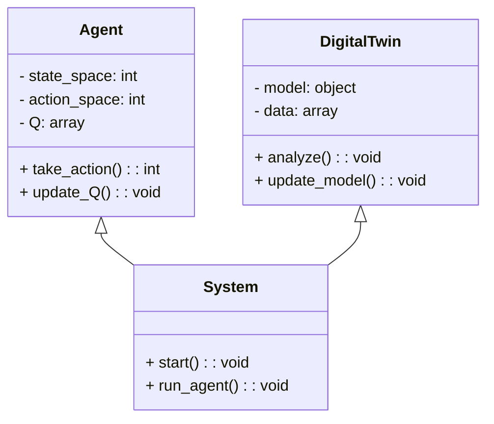
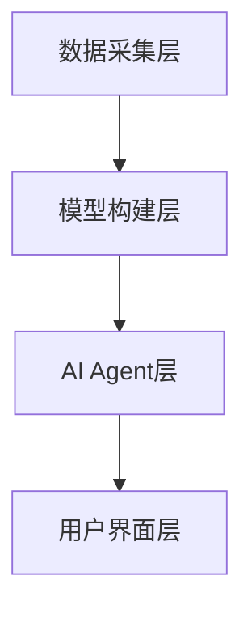

                 


# AI Agent在企业数字孪生技术中的应用

> 关键词：AI Agent, 数字孪生, 企业应用, 强化学习, 系统架构, 项目实战

> 摘要：本文深入探讨了AI Agent在企业数字孪生技术中的应用，分析了AI Agent的核心原理、数字孪生的定义与特点，以及两者如何结合为企业带来智能化的解决方案。通过具体案例和系统设计，详细阐述了AI Agent在企业数字孪生中的算法实现、系统架构设计和实际应用场景，为企业数字化转型提供了理论和实践指导。

---

## 第1章: AI Agent与数字孪生技术的背景与概念

### 1.1 AI Agent的基本概念

AI Agent（人工智能代理）是指能够感知环境、自主决策并执行任务的智能实体。它通过传感器获取信息，利用算法进行分析，然后采取行动以实现目标。AI Agent可以是软件程序、机器人或其他智能设备。

- **定义**：AI Agent是一种能够感知环境、自主决策并执行任务的智能系统。
- **核心特征**：
  - 感知能力：通过传感器或数据源获取信息。
  - 决策能力：基于感知信息进行推理和决策。
  - 执行能力：通过执行器或接口完成任务。
  - 学习能力：通过经验优化行为。

### 1.2 数字孪生技术的定义与特点

数字孪生是将物理世界中的物体或系统在数字空间中建立虚拟模型，并实时同步数据的技术。

- **定义**：数字孪生是物理实体在数字空间中的实时映射，用于模拟、分析和优化物理系统的性能。
- **主要特点**：
  - 实时性：数据实时同步，反映物理系统的动态变化。
  - 互动性：用户可以通过数字孪生模型与物理系统进行交互。
  - 可视化：提供直观的图形界面，便于理解和分析。

### 1.3 AI Agent在企业数字孪生中的应用前景

随着企业数字化转型的推进，AI Agent与数字孪生的结合为企业提供了智能化的解决方案。

- **潜在应用领域**：
  - 制造业：优化生产流程，预测设备故障。
  - 建筑业：模拟建筑设计，优化能源消耗。
  - 供应链管理：优化物流路径，预测库存需求。
- **优势**：
  - 提高效率：AI Agent能够快速处理大量数据，优化决策。
  - 实时反馈：数字孪生提供实时数据，帮助快速调整策略。
  - 降低成本：通过模拟和预测，减少资源浪费。

---

## 第2章: AI Agent与数字孪生的核心概念与联系

### 2.1 AI Agent的核心原理

AI Agent通过感知、决策和执行三个步骤实现目标。

- **感知**：AI Agent通过传感器或数据接口获取环境信息。
- **决策**：基于感知信息，AI Agent利用算法进行推理和决策。
- **执行**：通过执行器或接口将决策转化为实际行动。

### 2.2 数字孪生的核心原理

数字孪生通过数据采集、建模、仿真和分析，帮助优化物理系统的运行。

- **数据采集**：通过传感器收集物理系统的实时数据。
- **建模**：将数据转化为数字模型，反映物理系统的结构和行为。
- **仿真**：在数字模型中模拟物理系统的运行，分析其性能。
- **分析与优化**：基于仿真结果，提出优化建议。

### 2.3 AI Agent与数字孪生的实体关系分析

通过ER图展示AI Agent与数字孪生之间的关系。

```mermaid
er
  actor: 企业用户
  agent: AI Agent
  digital_twin: 数字孪生模型
  action: 行动或决策
  data: 数据流
  actor --> agent: 发起请求
  agent --> digital_twin: 分析数据
  digital_twin --> agent: 提供反馈
  agent --> action: 执行决策
  data --> digital_twin: 更新模型
```

---

## 第3章: AI Agent在企业数字孪生中的算法原理

### 3.1 强化学习算法

强化学习是一种通过试错机制优化决策的算法。



### 3.2 算法实现代码

```python
import numpy as np

class Agent:
    def __init__(self, state_space, action_space):
        self.state_space = state_space
        self.action_space = action_space
        self.Q = np.zeros((state_space, action_space))

    def take_action(self, state):
        if np.random.random() < 0.1:
            return np.random.randint(self.action_space)
        else:
            return np.argmax(self.Q[state, :])

    def update_Q(self, state, action, reward, next_state):
        self.Q[state, action] = self.Q[state, action] * 0.9 + reward + 0.1 * np.max(self.Q[next_state, :])
```

### 3.3 数学模型与公式

强化学习的目标是通过最大化累积奖励来优化策略。数学模型如下：

$$ Q(s, a) = Q(s, a) \times \alpha + \alpha \times (r + \gamma \times \max Q(s', a')) $$

其中：
- \( Q(s, a) \)：状态s动作a的Q值。
- \( \alpha \)：学习率。
- \( r \)：奖励。
- \( \gamma \)：折扣因子。
- \( s' \)：下一个状态。

---

## 第4章: 系统分析与架构设计

### 4.1 问题场景介绍

假设我们有一个智能制造工厂，需要通过数字孪生技术优化生产流程。AI Agent需要实时监控设备状态，预测潜在故障，并优化生产计划。

### 4.2 系统功能设计

设计一个领域模型类图，展示系统的主要组件。



### 4.3 系统架构设计

系统架构分为数据采集层、模型构建层、AI Agent层和用户界面层。



### 4.4 接口设计与交互流程

展示系统交互流程的序列图。

```mermaid
sequenceDiagram
    actor 用户
    system 系统
    actor 发起请求
    system 分析数据
    actor 提供反馈
```

---

## 第5章: 项目实战

### 5.1 环境安装

安装Python和必要的库：

```bash
pip install numpy
pip install matplotlib
```

### 5.2 核心代码实现

实现强化学习算法的AI Agent：

```python
import numpy as np

class Agent:
    def __init__(self, state_space, action_space):
        self.state_space = state_space
        self.action_space = action_space
        self.Q = np.zeros((state_space, action_space))

    def take_action(self, state):
        return np.argmax(self.Q[state, :])

    def update_Q(self, state, action, reward, next_state):
        self.Q[state, action] = self.Q[state, action] * 0.9 + reward + 0.1 * np.max(self.Q[next_state, :])
```

### 5.3 案例分析与解读

通过一个简单的数字孪生案例展示AI Agent的应用效果：

1. 数据采集：收集设备运行状态。
2. 模型构建：建立数字孪生模型。
3. AI Agent分析：预测潜在故障。
4. 优化策略：调整生产计划。

---

## 第6章: 最佳实践与总结

### 6.1 小结

AI Agent与数字孪生的结合为企业数字化转型提供了强大的工具，能够优化生产流程、降低成本并提高效率。

### 6.2 注意事项

- 数据质量：确保数据的准确性和实时性。
- 算法选择：根据具体场景选择合适的算法。
- 系统安全：保护数字孪生模型和AI Agent的安全性。

### 6.3 未来展望

随着AI技术的进步，AI Agent在企业数字孪生中的应用将更加广泛，推动企业向智能化方向发展。

### 6.4 拓展阅读

- 《强化学习实战》
- 《数字孪生技术与应用》

---

## 作者：AI天才研究院 & 禅与计算机程序设计艺术

---

本文详细探讨了AI Agent在企业数字孪生技术中的应用，通过理论分析和实践案例，展示了如何利用AI技术优化企业运营。希望本文能为企业数字化转型提供有价值的参考和指导。

