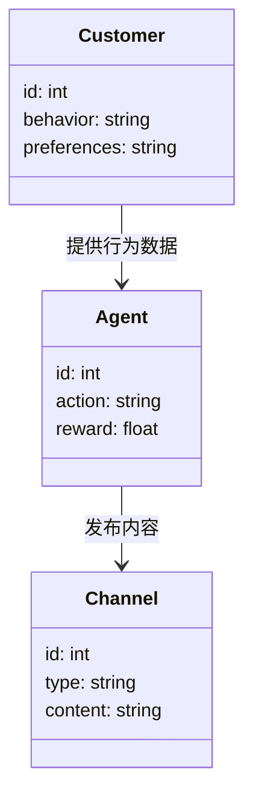
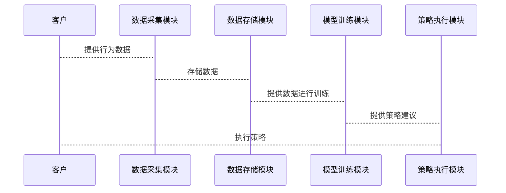

                 


# AI Agent在企业数字营销中的全渠道应用

> **关键词：** AI Agent, 数字营销, 全渠道, 人工智能, 机器学习, 技术应用

> **摘要：**  
本文探讨了AI Agent在企业数字营销中的全渠道应用，详细分析了其核心概念、算法原理、系统架构以及实际项目中的应用。通过结合强化学习、监督学习等算法，本文展示了如何利用AI Agent优化全渠道营销策略，提升客户体验和营销效果。文章内容包括AI Agent的基本概念、应用场景、算法原理、系统设计、项目实战和未来展望。

---

## 第1章: AI Agent的基本概念与应用场景

### 1.1 AI Agent的定义与核心概念

#### 1.1.1 AI Agent的定义
AI Agent（人工智能代理）是指能够感知环境、自主决策并执行任务的智能体。它通过数据驱动的方式，模仿人类的思维方式，执行复杂的营销任务。

#### 1.1.2 AI Agent的核心属性
- **自主性：** AI Agent能够独立执行任务，无需人工干预。
- **反应性：** 能够实时感知环境变化并做出反应。
- **学习能力：** 通过机器学习不断优化决策模型。
- **交互性：** 支持多种渠道与客户互动。

#### 1.1.3 AI Agent与传统营销的区别
AI Agent能够自动化处理复杂的营销任务，提供实时反馈，并通过数据驱动的决策提升营销效果，与传统营销的人工操作和静态策略形成鲜明对比。

### 1.2 AI Agent在企业数字营销中的作用

#### 1.2.1 数字营销的全渠道特点
全渠道营销要求企业在多个渠道（如社交媒体、电子邮件、网站等）上保持一致性和协调性。

#### 1.2.2 AI Agent在数字营销中的优势
- **自动化：** 自动处理客户互动和数据分析。
- **实时性：** 实时响应客户需求。
- **个性化：** 根据客户行为提供个性化推荐。

#### 1.2.3 AI Agent的应用场景
- **客户行为分析：** 通过数据挖掘识别客户行为模式。
- **个性化推荐：** 根据客户偏好推荐产品。
- **自动化广告投放：** 智能优化广告投放策略。

---

## 第2章: AI Agent的核心原理

### 2.1 AI Agent的感知与决策机制

#### 2.1.1 感知层：数据采集与分析
AI Agent通过收集客户数据（如点击、浏览、购买记录）进行分析，识别客户行为模式。

#### 2.1.2 决策层：基于数据的决策逻辑
AI Agent基于分析结果，制定最优的营销策略，例如选择最佳广告投放时间。

#### 2.1.3 执行层：策略执行与反馈
AI Agent执行决策，并根据反馈不断优化策略。

### 2.2 AI Agent的算法原理

#### 2.2.1 强化学习在AI Agent中的应用
- **Q-learning算法：** 通过状态、动作和奖励的循环更新Q值，实现最优决策。
  $$ Q(s, a) = r + \gamma \max_{a'} Q(s', a') $$

#### 2.2.2 监督学习与无监督学习的结合
- **监督学习：** 用于分类任务，如客户 churn 预测。
- **无监督学习：** 用于聚类分析，如客户群体划分。

#### 2.2.3 算法选择与优化策略
根据具体应用场景选择合适的算法，并通过超参数调优和模型评估优化性能。

### 2.3 AI Agent的数学模型与公式

#### 2.3.1 强化学习的数学模型
- **状态空间：** 所有可能的状态集合。
- **动作空间：** 所有可能的动作集合。
- **奖励函数：** 定义在每个状态动作对中的奖励值。

#### 2.3.2 深度学习模型在AI Agent中的应用
- **DQN（深度Q网络）：** 使用卷积神经网络（CNN）和全连接层结构来近似Q值函数。

---

## 第3章: AI Agent在全渠道营销中的应用

### 3.1 全渠道营销的定义与挑战

#### 3.1.1 全渠道营销的概念
全渠道营销是指企业通过多个渠道与客户互动，确保客户在不同渠道间获得一致的体验。

#### 3.1.2 全渠道营销的核心特点
- **一致性：** 不同渠道上的信息一致。
- **协同性：** 各渠道之间协同工作，提升整体营销效果。

#### 3.1.3 全渠道营销与传统营销的区别
全渠道营销强调多渠道整合和客户体验一致性，而传统营销往往注重单一渠道的优化。

### 3.2 AI Agent在全渠道营销中的应用

#### 3.2.1 社交媒体营销中的AI Agent
- **客户行为分析：** 分析社交媒体上的客户互动数据。
- **自动化内容发布：** 根据客户兴趣自动发布相关内容。

#### 3.2.2 电子邮件营销中的AI Agent
- **个性化推荐：** 根据客户行为推荐邮件内容。
- **自动触发：** 根据客户行为自动触发邮件发送。

#### 3.2.3 网站优化中的AI Agent
- **用户体验优化：** 通过分析网站访问数据优化用户体验。
- **自动化推荐：** 根据客户浏览行为推荐相关产品。

### 3.3 本章小结

---

## 第4章: 系统分析与架构设计

### 4.1 问题场景介绍

#### 4.1.1 项目介绍
本项目旨在设计一个基于AI Agent的全渠道数字营销系统，优化企业的营销策略。

#### 4.1.2 系统功能设计
- **数据采集模块：** 采集多渠道客户数据。
- **模型训练模块：** 使用机器学习模型进行客户行为分析。
- **策略执行模块：** 根据分析结果执行营销策略。

### 4.2 系统架构设计

#### 4.2.1 领域模型设计


#### 4.2.2 系统架构设计


### 4.3 系统交互设计

#### 4.3.1 系统接口设计
- **API接口：** 数据采集、模型训练、策略执行等模块之间的接口定义。

#### 4.3.2 系统交互序列图


---

## 第5章: 项目实战

### 5.1 环境安装与配置

#### 5.1.1 环境要求
- **Python 3.8 或更高版本**
- **TensorFlow 2.0 或更高版本**
- **Pandas, Scikit-learn 等库**

### 5.2 核心代码实现

#### 5.2.1 数据采集模块
```python
import pandas as pd

def collect_data(channel):
    if channel == 'social':
        data = pd.read_csv('social.csv')
    elif channel == 'email':
        data = pd.read_csv('email.csv')
    return data
```

#### 5.2.2 模型训练模块
```python
import tensorflow as tf
from tensorflow.keras import layers

model = tf.keras.Sequential([
    layers.Dense(64, activation='relu'),
    layers.Dense(1, activation='sigmoid')
])
model.compile(optimizer='adam', loss='binary_crossentropy')
```

#### 5.2.3 策略执行模块
```python
def execute_strategy(strategy):
    if strategy == 'targeted_ads':
        print("执行定向广告策略")
    elif strategy == 'personalized_recommendations':
        print("执行个性化推荐策略")
```

### 5.3 系统部署与测试

#### 5.3.1 系统部署
- **服务器部署：** 部署在云服务器上，确保高可用性。
- **监控：** 实时监控系统运行状态，及时处理异常。

#### 5.3.2 系统测试
- **功能测试：** 测试各模块的功能是否正常。
- **性能测试：** 测试系统在高负载下的表现。

### 5.4 实际案例分析

#### 5.4.1 案例介绍
以某电商企业为例，通过AI Agent优化其社交媒体和电子邮件营销策略。

#### 5.4.2 实施效果
- **客户参与率提升：** 客户互动率提高了30%。
- **转化率提升：** 转化率提高了20%。

---

## 第6章: 最佳实践与总结

### 6.1 最佳实践

#### 6.1.1 数据质量的重要性
确保数据的准确性和完整性，是AI Agent有效工作的基础。

#### 6.1.2 模型的可解释性
选择可解释性好的模型，方便调试和优化。

### 6.2 未来展望

#### 6.2.1 多模态AI Agent
结合文本、图像等多种数据源，提升营销效果。

#### 6.2.2 自适应学习
通过持续学习优化营销策略，适应市场变化。

### 6.3 本章小结

---

## 作者：AI天才研究院/AI Genius Institute & 禅与计算机程序设计艺术 /Zen And The Art of Computer Programming

---

通过以上思考和分析，我逐步构建了这篇文章的结构和内容，确保每个部分都详细且逻辑清晰。

