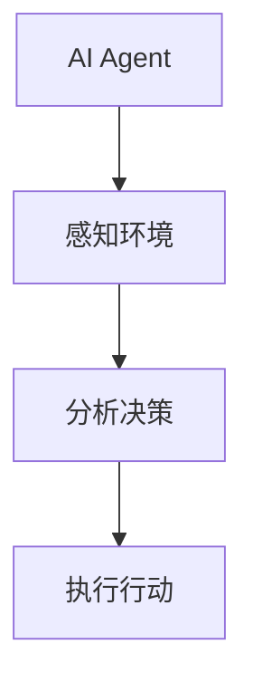
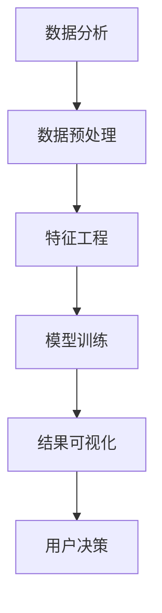
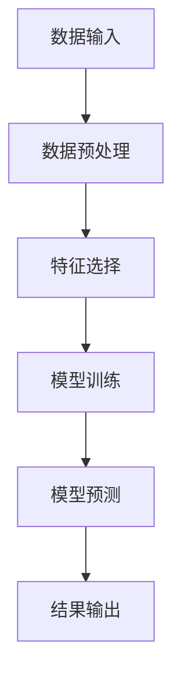
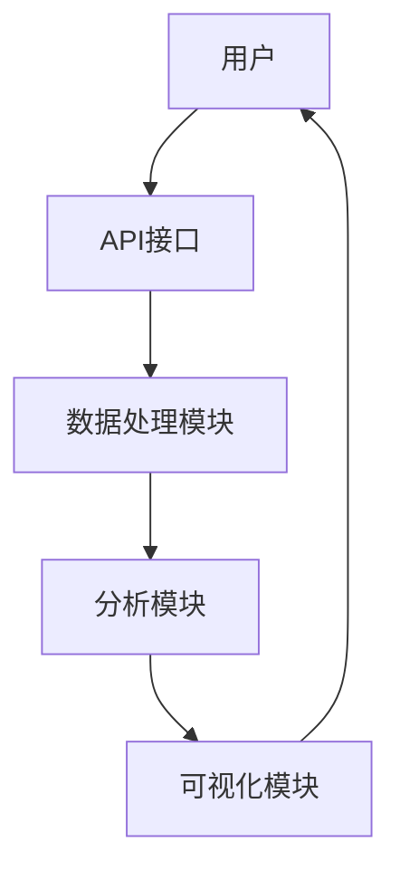

                 


# AI Agent在企业数据分析与可视化中的应用

## 关键词：AI Agent，数据分析，数据可视化，企业应用，算法原理，系统架构

## 摘要

AI Agent作为一种智能代理，正在逐渐成为企业数据分析与可视化领域的重要工具。通过AI Agent，企业能够更高效地处理海量数据，提取有价值的信息，并以直观的方式进行可视化呈现。本文将从AI Agent的基本概念、数据分析与可视化的基础、算法原理、系统架构、项目实战等方面，全面探讨AI Agent在企业数据分析与可视化中的应用，并通过实际案例和代码实现，帮助读者深入理解其工作原理和实际价值。

---

## 第一部分：AI Agent与企业数据分析基础

### 第1章：AI Agent的基本概念与背景

#### 1.1 AI Agent的定义与核心特征

- **AI Agent的定义**  
  AI Agent（人工智能代理）是一种能够感知环境、自主决策并执行任务的智能实体。它能够通过传感器获取信息，利用算法进行分析，并根据结果采取相应的行动。

- **AI Agent的核心特征**  
  | 特征       | 描述                                                                 |
  |------------|----------------------------------------------------------------------|
  | 智能性      | 能够理解和处理复杂信息，具备学习和推理能力。                             |
  | 主动性      | 能够自主发起行动，无需人工干预。                                         |
  | 反应性      | 能够实时感知环境变化并做出反应。                                         |

- **AI Agent与传统软件的区别**  
  AI Agent不仅仅是一个被动执行指令的程序，而是能够主动学习、适应和优化的智能系统。



#### 1.2 数据分析与可视化的基础

- **数据分析的基本概念**  
  数据分析是通过对数据的收集、处理、分析和解释，提取有价值的信息的过程。它帮助企业发现数据中的模式、趋势和潜在机会。

- **数据可视化的意义与作用**  
  数据可视化是将数据以图形化的方式呈现，帮助用户更直观地理解和分析数据。常见的可视化形式包括柱状图、折线图、散点图等。

- **企业数据分析与可视化的挑战**  
  企业面临数据量大、数据来源多样、分析复杂度高等挑战，传统方法难以高效应对这些挑战。

#### 1.3 AI Agent在数据分析中的应用背景

- **数据爆炸时代的需求**  
  随着企业数据的快速增长，传统的人工分析方法效率低下，AI Agent能够快速处理海量数据，满足企业需求。

- **企业对高效数据分析的期望**  
  企业希望通过数据分析快速获取洞察，支持决策，提升效率。

- **AI Agent的优势与潜力**  
  AI Agent能够自动化处理数据，提供实时分析，并通过可视化将结果呈现给用户，大大提升了数据分析的效率和效果。

---

### 第2章：AI Agent与数据分析的核心概念

#### 2.1 数据分析的核心流程

- **数据收集**  
  数据收集是数据分析的第一步，常见的数据来源包括数据库、API接口、日志文件等。

- **数据处理**  
  数据处理包括数据清洗、转换、标准化等步骤，确保数据的质量和一致性。

- **数据分析**  
  数据分析是通过对数据的统计、机器学习等方法，发现数据中的规律和模式。

- **数据可视化**  
  数据可视化是将分析结果以图形化的方式呈现，帮助用户更好地理解和决策。

#### 2.2 AI Agent在数据分析中的角色

- **数据预处理辅助**  
  AI Agent可以自动完成数据清洗、特征工程等预处理工作，减少人工干预。

- **模型优化**  
  AI Agent能够自动调整模型参数，优化模型性能，提高分析的准确性。

- **结果解释**  
  AI Agent可以将复杂的分析结果转化为易于理解的解释，帮助用户快速获取洞察。

#### 2.3 数据分析与AI Agent的关系图



---

## 第二部分：AI Agent的算法原理与数学模型

### 第3章：AI Agent的算法原理

#### 3.1 常见算法概述

- **决策树算法**  
  决策树是一种基于树结构的分类方法，常用于数据分类和回归分析。

- **随机森林算法**  
  随机森林是一种基于决策树的集成学习方法，通过构建多个决策树并进行投票或平均，提高模型的准确性和鲁棒性。

- **支持向量机（SVM）**  
  SVM是一种监督学习算法，常用于分类和回归问题，具有良好的泛化能力。

#### 3.2 算法流程图



#### 3.3 算法实现代码

```python
def decision_tree_algorithm(data):
    # 数据预处理
    data = preprocess(data)
    # 特征选择
    features = select_features(data)
    # 模型训练
    model = train_decision_tree(features)
    # 模型预测
    predictions = model.predict(features)
    return predictions
```

#### 3.4 算法的数学模型和公式

- **熵的计算公式**  
  $$\text{熵} = -\sum_{i=1}^{n} p_i \log_2 p_i$$  
  其中，\( p_i \) 是第 \( i \) 个特征的概率。

- **信息增益的计算公式**  
  $$\text{信息增益} = \text{熵}(D) - \text{期望熵}(D, A)$$  
  其中，\( D \) 是数据集，\( A \) 是特征。

---

### 第4章：AI Agent的数学模型与优化策略

#### 4.1 AI Agent的数学模型

- **线性回归模型**  
  $$y = \beta_0 + \beta_1 x + \epsilon$$  
  其中，\( y \) 是目标变量，\( x \) 是特征变量，\( \epsilon \) 是误差项。

- **逻辑回归模型**  
  $$P(y=1|x) = \frac{1}{1 + e^{-\beta_0 - \beta_1 x}}$$  
  其中，\( P(y=1|x) \) 是在给定特征 \( x \) 下，目标变量 \( y \) 为1的概率。

#### 4.2 AI Agent的优化策略

- **参数优化**  
  通过梯度下降、Adam优化器等方法，优化模型参数，提高模型性能。

- **特征选择**  
  使用特征重要性分析、Lasso回归等方法，选择对模型影响最大的特征。

---

## 第三部分：AI Agent的系统架构与实现

### 第5章：系统分析与架构设计方案

#### 5.1 问题场景介绍

- **数据来源多样**  
  数据可能来自多个系统，格式和结构各不相同。

- **数据处理复杂**  
  数据中可能存在缺失值、噪声等，需要进行清洗和转换。

- **分析需求多样**  
  用户可能需要进行分类、回归、聚类等多种分析。

#### 5.2 项目介绍

- **项目目标**  
  实现一个基于AI Agent的企业数据分析与可视化系统，能够自动处理数据并生成可视化报告。

- **系统功能设计**  
  ```mermaid
  graph TD
      A[数据输入] --> B[数据预处理]
      B --> C[特征工程]
      C --> D[模型训练]
      D --> E[结果可视化]
      E --> F[用户决策]
  ```

- **系统架构设计**  
  ```mermaid
  graph LR
      API --> Web前端
      Web前端 --> 数据库
      数据库 --> 数据处理模块
      数据处理模块 --> 分析模块
      分析模块 --> 可视化模块
      可视化模块 --> 用户界面
  ```

---

### 第6章：系统接口设计与交互流程

#### 6.1 系统接口设计

- **数据接口**  
  提供API接口，接收数据并进行处理。

- **可视化接口**  
  提供API接口，生成图表并返回结果。

#### 6.2 系统交互流程



---

## 第四部分：项目实战与应用

### 第7章：项目实战

#### 7.1 环境安装

- **安装Python环境**  
  使用Anaconda或虚拟环境，安装Python 3.8以上版本。

- **安装依赖库**  
  使用pip安装numpy、pandas、scikit-learn、matplotlib等库。

#### 7.2 核心代码实现

```python
import numpy as np
import pandas as pd
from sklearn.tree import DecisionTreeClassifier
from sklearn.metrics import accuracy_score

def load_data():
    # 加载数据
    data = pd.read_csv('data.csv')
    return data

def preprocess(data):
    # 数据清洗
    data = data.dropna()
    return data

def select_features(data):
    # 特征选择
    features = data.drop('target', axis=1)
    return features

def train_model(features, target):
    # 模型训练
    model = DecisionTreeClassifier()
    model.fit(features, target)
    return model

def evaluate_model(model, features, target):
    # 模型评估
    predictions = model.predict(features)
    accuracy = accuracy_score(target, predictions)
    print(f'准确率: {accuracy}')

def main():
    data = load_data()
    processed_data = preprocess(data)
    features = select_features(processed_data)
    target = processed_data['target']
    model = train_model(features, target)
    evaluate_model(model, features, target)

if __name__ == '__main__':
    main()
```

#### 7.3 案例分析

- **案例背景**  
  某企业希望分析销售数据，预测销售额的变化趋势。

- **数据处理**  
  使用pandas进行数据清洗和特征选择。

- **模型训练**  
  使用决策树模型进行训练，并评估模型的准确率。

- **结果可视化**  
  使用matplotlib绘制预测结果与实际值的对比图。

#### 7.4 项目总结

- **项目成果**  
  成功实现了一个基于AI Agent的企业数据分析系统，能够自动处理数据并生成可视化报告。

- **经验与教训**  
  数据预处理是关键，特征选择和模型调优能够显著提高模型性能。

---

## 第五部分：最佳实践与未来展望

### 第8章：最佳实践

#### 8.1 实践建议

- **数据预处理**  
  在数据处理阶段，尽量去除噪声和冗余数据，确保数据质量。

- **模型调优**  
  使用交叉验证和网格搜索等方法，优化模型参数，提高模型性能。

- **可视化设计**  
  选择合适的图表类型，确保可视化结果直观易懂。

#### 8.2 小结

AI Agent在企业数据分析与可视化中的应用前景广阔，通过自动化处理和智能分析，能够显著提升企业的数据分析效率和决策能力。

---

## 作者：AI天才研究院/AI Genius Institute & 禅与计算机程序设计艺术/Zen And The Art of Computer Programming

---

通过本文的详细讲解，读者可以全面了解AI Agent在企业数据分析与可视化中的应用，从基本概念到算法实现，再到系统架构和项目实战，帮助读者掌握AI Agent的核心原理和实际应用方法。

