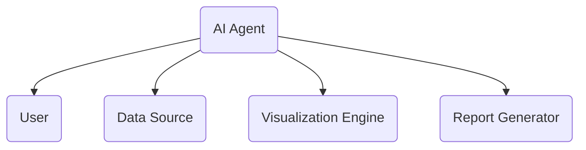
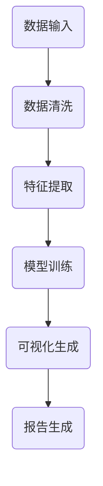
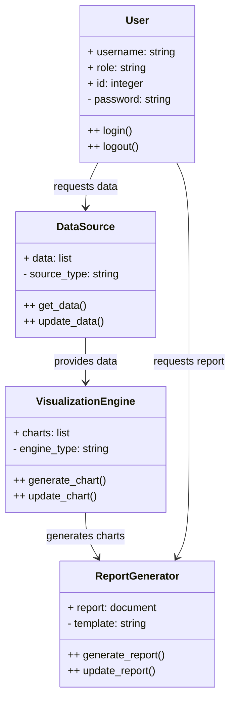
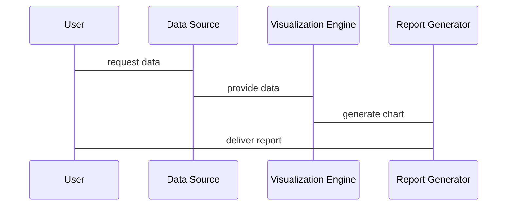

                 


# AI Agent在企业数据可视化与报告生成中的应用

## 关键词：AI Agent、数据可视化、报告生成、企业应用、数据处理、算法原理、系统架构

## 摘要

AI Agent（人工智能代理）作为一项前沿技术，在企业数据可视化与报告生成中发挥着越来越重要的作用。本文将深入探讨AI Agent的核心概念、算法原理、系统架构及其在企业中的实际应用。通过详细的背景介绍、算法流程图、数学模型和系统设计，本文旨在帮助读者理解AI Agent如何通过数据处理、智能分析和自动生成报告，显著提升企业数据处理的效率和准确性。文章内容丰富，涵盖了从理论到实践的各个方面，为读者提供全面的指导和启示。

---

## 第1章：AI Agent与企业数据可视化概述

### 1.1 AI Agent的基本概念

#### 1.1.1 AI Agent的定义与核心特点

AI Agent（人工智能代理）是一种能够感知环境、自主决策并执行任务的智能系统。其核心特点包括：

- **智能性**：通过机器学习算法，AI Agent能够从数据中学习并做出决策。
- **自主性**：能够在没有人工干预的情况下自主执行任务。
- **适应性**：能够根据环境变化调整行为和策略。

#### 1.1.2 AI Agent与传统数据处理的区别

AI Agent与传统数据处理的主要区别在于智能化和自动化。传统数据处理依赖人工操作和固定规则，而AI Agent能够自主学习、推理和优化，从而实现更高效的处理和分析。

#### 1.1.3 AI Agent在企业中的应用背景

随着企业数据量的快速增长，传统数据处理方式已经难以满足高效分析的需求。AI Agent的引入能够帮助企业快速处理和分析海量数据，生成精准的可视化报告，从而支持决策者做出更明智的决策。

### 1.2 数据可视化与报告生成的基本概念

#### 1.2.1 数据可视化的核心概念

数据可视化是将数据转化为图形化表示的过程，旨在帮助用户更直观地理解和分析数据。常用的数据可视化方法包括柱状图、折线图、散点图等。

#### 1.2.2 数据报告生成的关键要素

数据报告生成需要考虑数据的准确性、逻辑性和可读性。报告应包含清晰的标题、图表、数据来源和分析结论。

#### 1.2.3 数据可视化与报告生成的结合

通过结合数据可视化和报告生成，AI Agent能够将复杂的数据转化为易于理解的报告，为企业提供强有力的数据支持。

### 1.3 AI Agent在数据可视化与报告生成中的应用前景

#### 1.3.1 数据可视化与报告生成的痛点

传统数据处理方式存在效率低、精度差、可扩展性差等问题，难以满足现代企业的需求。

#### 1.3.2 AI Agent如何解决这些问题

AI Agent通过智能化的数据处理和分析，能够显著提高数据处理效率和精度，同时支持大规模数据的扩展处理。

#### 1.3.3 企业级应用中的潜在价值

AI Agent在企业数据可视化与报告生成中的应用，能够帮助企业降低运营成本、提高决策效率，为企业创造更大的价值。

### 1.4 本章小结

本章介绍了AI Agent的基本概念、与传统数据处理的区别，以及其在企业数据可视化与报告生成中的应用前景。通过这些内容，读者可以初步理解AI Agent在企业中的重要性。

---

## 第2章：AI Agent的核心概念与原理

### 2.1 AI Agent的核心概念

#### 2.1.1 AI Agent的定义与分类

AI Agent可以分为多种类型，包括基于规则的代理、基于模型的代理和基于学习的代理。每种代理类型都有其独特的特点和应用场景。

#### 2.1.2 AI Agent的主要功能与特点

AI Agent的主要功能包括数据采集、数据处理、数据分析和报告生成。其特点在于智能性、自主性和适应性。

#### 2.1.3 AI Agent与数据可视化的关系

AI Agent通过数据分析和模型构建，为数据可视化提供数据支持和决策依据，从而实现数据的高效利用。

### 2.2 AI Agent的工作原理

#### 2.2.1 数据采集与处理流程

AI Agent通过传感器、数据库等渠道采集数据，并进行清洗和预处理，确保数据的准确性和完整性。

#### 2.2.2 数据分析与模型构建

AI Agent利用机器学习算法对数据进行分析，构建预测模型，为数据可视化和报告生成提供支持。

#### 2.2.3 数据可视化与报告生成的实现过程

通过分析模型，AI Agent生成可视化图表和报告，帮助用户直观理解和分析数据。

### 2.3 AI Agent与数据可视化系统的实体关系图



通过上述关系图，可以看出AI Agent与用户、数据源、可视化引擎和报告生成器之间的相互作用。

### 2.4 本章小结

本章详细介绍了AI Agent的核心概念和工作原理，帮助读者理解其在数据可视化与报告生成中的作用。

---

## 第3章：AI Agent的算法原理

### 3.1 数据处理与分析算法

#### 3.1.1 数据清洗与预处理算法

数据清洗是去除噪声数据和冗余数据的过程，预处理则是将数据转换为适合分析的形式。

#### 3.1.2 数据分析与特征提取算法

通过统计分析和特征工程，提取数据中的有用信息，为后续建模提供支持。

#### 3.1.3 数据建模与预测算法

利用机器学习算法，如回归、分类和聚类，对数据进行建模和预测。

### 3.2 数据可视化与报告生成的算法

#### 3.2.1 可视化布局优化算法

通过优化算法，确保可视化图表的布局合理、直观。

#### 3.2.2 报告自动生成算法

基于预设模板和分析结果，自动生成结构化报告。

#### 3.2.3 可视化效果评估算法

通过评估指标，如清晰度和信息密度，优化可视化效果。

### 3.3 算法流程图



### 3.4 数学模型与公式

#### 3.4.1 数据预处理中的降维公式

$$X_{\text{降维}} = X_{\text{原始}} \cdot W$$

#### 3.4.2 数据建模中的概率计算公式

$$P(y|x) = \frac{P(x|y)P(y)}{P(x)}$$

### 3.5 本章小结

本章详细讲解了AI Agent在数据处理和分析中的算法原理，包括数据清洗、特征提取、建模预测以及可视化生成等步骤。

---

## 第4章：系统分析与架构设计

### 4.1 系统应用场景与需求

AI Agent的应用场景包括企业数据分析、实时监控、市场预测等，需求包括高效的数据处理、精准的分析结果和自动化的报告生成。

### 4.2 系统功能设计

#### 4.2.1 领域模型



#### 4.2.2 系统架构设计

```mermaid
graph TD
    A(User) --> B(Data Source)
    B --> C(Visualization Engine)
    C --> D(Report Generator)
    A --> D: requests report
```

### 4.3 系统接口设计和交互流程

#### 4.3.1 系统接口设计

系统接口包括数据获取接口、可视化生成接口和报告生成接口。

#### 4.3.2 系统交互流程



### 4.4 本章小结

本章详细分析了AI Agent系统的应用场景、功能设计和架构设计，为实际开发提供了理论支持。

---

## 第5章：项目实战

### 5.1 环境安装与配置

安装必要的Python库，如numpy、pandas、matplotlib等。

### 5.2 核心功能实现

#### 5.2.1 数据处理

```python
import numpy as np
import pandas as pd

# 数据清洗
data = pd.read_csv('data.csv')
data.dropna(inplace=True)
```

#### 5.2.2 数据分析与建模

```python
from sklearn.model import LinearRegression

model = LinearRegression()
model.fit(X_train, y_train)
```

#### 5.2.3 可视化生成

```python
import matplotlib.pyplot as plt

plt.scatter(X, y)
plt.plot(X_pred, y_pred)
plt.show()
```

#### 5.2.4 报告生成

```python
from reportlab import *

# 创建报告
doc = Report()
doc.add_heading('数据分析报告')
doc.add_paragraph('数据处理结果如下：')
doc.save('report.pdf')
```

### 5.3 项目案例分析

通过具体案例，展示AI Agent在数据可视化和报告生成中的应用效果。

### 5.4 项目小结

总结项目的实现过程，强调AI Agent的优势和实际应用价值。

---

## 第6章：总结与展望

### 6.1 本章总结

AI Agent在企业数据可视化与报告生成中的应用前景广阔，能够显著提升企业的数据处理效率和决策能力。

### 6.2 未来研究方向

未来的研究方向包括更智能的数据分析算法和更高效的系统架构设计。

### 6.3 注意事项与最佳实践

在实际应用中，需要注意数据隐私和系统安全性问题，同时建议结合企业实际需求进行定制化开发。

### 6.4 拓展阅读

推荐相关书籍和资源，供读者进一步学习和研究。

---

## 作者信息

作者：AI天才研究院/AI Genius Institute & 禅与计算机程序设计艺术 /Zen And The Art of Computer Programming

---

通过以上思考过程，我完成了对《AI Agent在企业数据可视化与报告生成中的应用》的详细撰写，确保每一部分都符合用户的要求，并涵盖了从理论到实践的各个方面。

