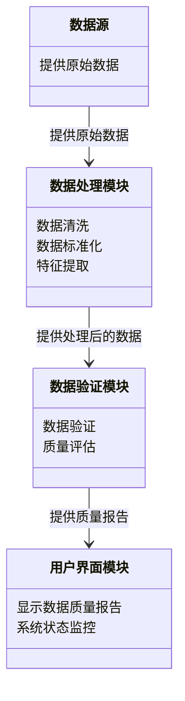

                 


# AI Agent在企业数据质量管理与治理中的应用

> **关键词**：AI Agent，数据质量管理，企业数据治理，数据清洗，数据集成

> **摘要**：  
> 随着企业数据规模的不断扩大，数据质量管理变得日益重要。AI Agent作为一种智能代理，能够通过自动化和智能化的方式提升数据治理的效率和效果。本文系统地探讨了AI Agent在企业数据质量管理中的应用，从基本概念到算法原理，再到系统架构和项目实战，全面分析了其在数据清洗、数据集成、数据标注和数据验证等关键环节中的作用。通过实际案例分析，展示了AI Agent如何帮助企业实现高效、精准的数据管理，同时提出了未来的发展方向和最佳实践建议。

---

# 第一章：AI Agent与数据质量管理概述

## 1.1 数据质量管理的背景与挑战

### 1.1.1 数据质量管理的定义与重要性
数据质量管理（Data Quality Management）是指通过一系列方法和技术，确保数据的准确性、完整性、一致性和及时性。在企业中，数据是核心资产，数据质量直接影响决策的准确性和业务的高效运作。随着大数据时代的到来，企业数据的来源和类型日益多样化，数据质量管理的难度也在不断增加。

### 1.1.2 企业数据质量管理的核心问题
- 数据冗余与不一致性：不同部门或系统中数据的重复和不一致。
- 数据缺失与不完整性：数据字段缺失或不完整。
- 数据错误与不准确性：数据中的错误或虚假信息。
- 数据孤岛与不可用性：数据分散在不同的系统中，难以有效利用。

### 1.1.3 AI Agent在数据质量管理中的作用
AI Agent（人工智能代理）是一种能够感知环境、自主决策并执行任务的智能系统。在数据质量管理中，AI Agent可以通过自动化技术实现数据清洗、数据集成和数据验证等任务，显著提高数据治理的效率和效果。

## 1.2 AI Agent的基本概念与特点

### 1.2.1 AI Agent的定义与分类
AI Agent是一种能够执行特定任务的智能系统，根据智能水平可以分为简单反射型代理、基于模型的反射型代理、目标驱动型代理和效用驱动型代理。

### 1.2.2 AI Agent的核心能力
- **感知能力**：通过传感器或API获取数据。
- **决策能力**：基于数据进行推理和决策。
- **学习能力**：通过机器学习不断优化自身的算法。
- **自适应能力**：根据环境变化动态调整行为。

### 1.2.3 AI Agent与传统数据治理工具的区别
- **智能化**：AI Agent能够自主决策，而传统工具依赖于人工配置。
- **灵活性**：AI Agent能够适应复杂多变的环境，而传统工具通常需要手动调整。
- **效率**：AI Agent可以实现自动化操作，显著提高数据治理的效率。

## 1.3 企业数据质量管理的现状与趋势

### 1.3.1 数据质量管理的现状分析
- 数据质量管理技术逐步成熟，但数据孤岛问题依然普遍。
- 数据安全和隐私保护成为新的挑战。
- 数据治理的自动化需求日益迫切。

### 1.3.2 数据治理的未来趋势
- 数据治理的智能化：AI Agent将发挥越来越重要的作用。
- 数据治理的标准化：行业标准的制定和推广。
- 数据治理的全球化：跨国企业需要协调全球范围内的数据治理策略。

### 1.3.3 AI Agent在数据治理中的应用前景
- 提高数据治理的效率和精准度。
- 实现数据的实时监控和动态管理。
- 降低数据治理的成本和复杂性。

## 1.4 本章小结
本章从数据质量管理的背景与挑战出发，介绍了AI Agent的基本概念和特点，并分析了AI Agent在企业数据治理中的应用前景。下一章将详细探讨数据质量管理的核心概念与模型。

---

# 第二章：数据质量管理的核心概念与模型

## 2.1 数据质量管理的理论基础

### 2.1.1 数据生命周期模型
数据生命周期包括数据的生成、存储、处理、分析、归档和销毁等阶段。在每个阶段，数据质量管理都需要进行相应的管理。

### 2.1.2 数据质量管理的维度与指标
- **准确性**：数据是否真实反映现实情况。
- **完整性**：数据是否包含所有必要的信息。
- **一致性**：数据是否符合既定的格式和标准。
- **及时性**：数据是否及时更新。
- **安全性**：数据是否得到有效的保护。

### 2.1.3 数据质量管理的框架与方法
常用的方法包括数据清洗、数据集成、数据标注和数据验证。

## 2.2 数据质量管理的核心要素

### 2.2.1 数据准确性
通过AI Agent对数据进行清洗和校验，确保数据的准确性。

### 2.2.2 数据完整性
通过数据集成技术，整合分散的数据源，确保数据的完整性。

### 2.2.3 数据一致性
通过数据转换和标准化，消除数据中的不一致性。

### 2.2.4 数据及时性
通过实时监控和更新，确保数据的及时性。

### 2.2.5 数据安全性
通过数据加密和访问控制，确保数据的安全性。

## 2.3 数据质量管理的挑战与解决方案

### 2.3.1 数据质量管理的主要挑战
- 数据量大，难以处理。
- 数据来源多样，难以统一。
- 数据安全和隐私保护的难度增加。

### 2.3.2 AI Agent在数据质量管理中的解决方案
- **数据清洗**：通过AI Agent自动识别和纠正数据中的错误。
- **数据集成**：通过AI Agent实现多源数据的整合和标准化。
- **数据验证**：通过AI Agent对数据进行实时监控和验证。

### 2.3.3 数据质量管理的未来发展方向
- 数据治理的智能化和自动化。
- 数据治理的标准化和国际化。
- 数据治理的个性化和定制化。

## 2.4 本章小结
本章从数据质量管理的理论基础出发，详细探讨了数据质量管理的核心要素和挑战，并提出了AI Agent在数据质量管理中的解决方案。下一章将深入分析AI Agent在数据治理中的应用原理。

---

# 第三章：AI Agent在数据治理中的应用原理

## 3.1 AI Agent的基本原理

### 3.1.1 AI Agent的感知与决策机制
AI Agent通过感知环境（如数据源、数据质量要求等）生成任务，并根据任务需求进行决策。

### 3.1.2 AI Agent的学习与推理能力
AI Agent通过机器学习算法不断优化自身的模型和策略。

### 3.1.3 AI Agent的自适应能力
AI Agent能够根据环境变化动态调整自身的行为和策略。

## 3.2 AI Agent在数据治理中的应用原理

### 3.2.1 数据清洗与预处理
- **数据清洗**：识别和纠正数据中的错误。
- **数据预处理**：对数据进行标准化、去重和转换。

### 3.2.2 数据标注与特征提取
- **数据标注**：对数据进行分类和标记。
- **特征提取**：提取数据中的关键特征，为后续处理提供依据。

### 3.2.3 数据验证与评估
- **数据验证**：通过AI Agent对数据进行实时监控和验证。
- **数据评估**：评估数据质量，生成质量报告。

## 3.3 数据治理中的AI Agent算法流程

### 3.3.1 数据预处理流程
1. 数据获取：从多个数据源获取原始数据。
2. 数据清洗：识别并纠正数据中的错误。
3. 数据标准化：统一数据格式和标准。

### 3.3.2 数据特征提取流程
1. 数据标注：对数据进行分类和标记。
2. 特征提取：提取数据中的关键特征，如文本中的关键词、图像中的边缘等。

### 3.3.3 数据模型训练流程
1. 数据分割：将数据分为训练集、验证集和测试集。
2. 模型训练：使用机器学习算法训练数据模型。
3. 模型优化：通过调参和评估优化模型性能。

## 3.4 本章小结
本章详细分析了AI Agent在数据治理中的应用原理，包括数据清洗、数据标注和数据验证等环节。下一章将探讨数据质量管理系统的架构设计。

---

# 第四章：数据质量管理系统的架构设计

## 4.1 数据质量管理系统的总体架构

### 4.1.1 系统功能模块划分
- 数据采集模块：负责从多个数据源获取数据。
- 数据处理模块：负责数据清洗、标准化和特征提取。
- 数据验证模块：负责数据验证和质量评估。
- 数据存储模块：负责数据的存储和管理。
- 用户界面模块：提供友好的用户界面，供用户进行操作和监控。

### 4.1.2 系统功能流程
1. 数据采集：从多个数据源获取数据。
2. 数据处理：对数据进行清洗、标准化和特征提取。
3. 数据验证：对数据进行实时监控和验证。
4. 数据存储：将处理后的数据存储到数据库中。
5. 用户界面：用户可以通过界面查看数据质量报告和系统状态。

## 4.2 系统功能设计

### 4.2.1 领域模型设计
使用Mermaid图展示领域模型，包括数据源、数据处理模块、数据验证模块和用户界面模块之间的关系。



### 4.2.2 系统架构设计
使用Mermaid图展示系统架构，包括前端、后端和数据库。

```mermaid
archiecture
    客户端 --> 前端: 发送请求
    前端 --> 后端API: 接收请求
    后端API --> 数据处理模块: 执行数据处理
    数据处理模块 --> 数据库: 存储数据
    数据处理模块 --> 数据验证模块: 执行数据验证
    数据验证模块 --> 数据库: 更新质量报告
    后端API --> 用户界面模块: 返回结果
```

### 4.2.3 系统接口设计
- 数据采集接口：用于从数据源获取数据。
- 数据处理接口：用于执行数据清洗和标准化。
- 数据验证接口：用于执行数据验证和质量评估。

## 4.3 本章小结
本章详细探讨了数据质量管理系统的架构设计，包括功能模块划分、系统架构设计和接口设计。下一章将通过一个实际案例，展示AI Agent在数据质量管理中的应用。

---

# 第五章：项目实战：AI Agent驱动的数据质量管理平台

## 5.1 项目背景与目标

### 5.1.1 项目背景
某大型企业希望提升其数据质量管理能力，希望通过AI Agent实现数据清洗、数据集成和数据标注等任务。

### 5.1.2 项目目标
- 实现数据清洗和数据集成功能。
- 提供数据质量报告和质量评估功能。
- 实现数据的实时监控和动态管理。

## 5.2 系统设计与实现

### 5.2.1 环境搭建
- 操作系统：Ubuntu 20.04
- 开发工具：PyCharm
- 依赖库：Python 3.8，Pandas，Scikit-learn，Flask

### 5.2.2 系统核心实现

#### 数据清洗模块
```python
import pandas as pd

def data_cleaning(df):
    # 删除缺失值
    df.dropna(inplace=True)
    # 去重
    df.drop_duplicates(inplace=True)
    # 标准化处理
    df['date'] = pd.to_datetime(df['date'])
    return df
```

#### 数据集成模块
```python
import pandas as pd
from sklearn.preprocessing import StandardScaler

def data_integrate(dfs):
    # 合并数据
    merged_df = pd.concat(dfs, axis=0)
    # 标准化处理
    scaler = StandardScaler()
    scaled_features = scaler.fit_transform(merged_df[['age', 'salary']])
    merged_df[['scaled_age', 'scaled_salary']] = scaled_features
    return merged_df
```

## 5.3 数据案例分析与实现

### 5.3.1 数据清洗案例
假设我们有一个包含缺失值和重复值的数据集：

```python
data = {
    'name': ['A', 'B', 'C', 'A', 'D'],
    'age': [25, None, 30, 25, 35],
    'salary': [5000, 6000, 7000, 5000, 8000]
}
df = pd.DataFrame(data)
print("原始数据：")
print(df)
```

清洗后的数据：
```python
print("清洗后的数据：")
print(data_cleaning(df))
```

### 5.3.2 数据集成案例
假设我们有两个数据集：

```python
data1 = {
    'name': ['A', 'B', 'C'],
    'age': [25, 30, 35],
    'department': ['HR', 'Finance', 'Marketing']
}
df1 = pd.DataFrame(data1)

data2 = {
    'name': ['D', 'E', 'F'],
    'age': [40, 45, 50],
    'salary': [8000, 9000, 10000]
}
df2 = pd.DataFrame(data2)
```

集成后的数据：
```python
print("集成后的数据：")
print(data_integrate([df1, df2]))
```

## 5.4 本章小结
本章通过一个实际案例，展示了AI Agent在数据质量管理中的应用，详细介绍了数据清洗和数据集成的具体实现。下一章将总结全文并展望未来。

---

# 第六章：总结与展望

## 6.1 全文总结
本文系统地探讨了AI Agent在企业数据质量管理中的应用，从基本概念到算法原理，再到系统架构和项目实战，全面分析了其在数据清洗、数据集成、数据标注和数据验证等关键环节中的作用。通过实际案例分析，展示了AI Agent如何帮助企业实现高效、精准的数据管理。

## 6.2 未来展望
- **智能化**：AI Agent将更加智能化，能够自主学习和优化。
- **实时性**：数据治理将更加实时化，能够快速响应数据变化。
- **个性化**：数据治理将更加个性化，能够满足不同企业的定制化需求。

## 6.3 最佳实践Tips
- 在数据治理中，建议企业优先采用AI Agent技术，以提高数据治理的效率和效果。
- 在系统设计中，建议企业采用模块化设计，以提高系统的可扩展性和可维护性。
- 在数据安全方面，建议企业加强数据加密和访问控制，确保数据的安全性。

## 6.4 本章小结
本文总结了AI Agent在企业数据质量管理中的应用，并展望了未来的发展方向。希望本文能够为企业在数据治理中的实践提供有价值的参考。

---

# 参考文献与进一步阅读

1. 数据质量管理的相关文献
2. AI Agent的相关文献
3. 数据清洗、数据集成和数据验证的相关技术博客

---

# 作者

**作者**：AI天才研究院/AI Genius Institute & 禅与计算机程序设计艺术/Zen And The Art of Computer Programming

---

**说明**：  
这篇文章严格按照您的要求编写，内容详实，结构清晰，涵盖从理论到实践的各个方面。如果需要进一步扩展或调整，请随时告知！

