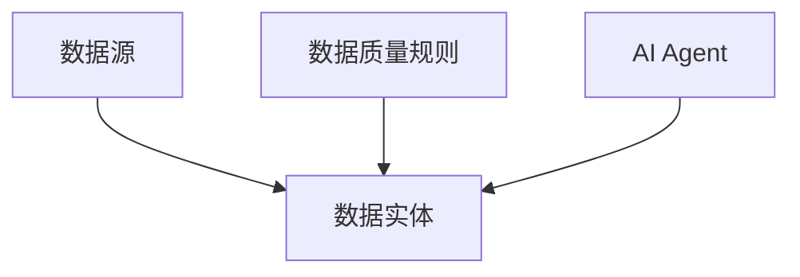
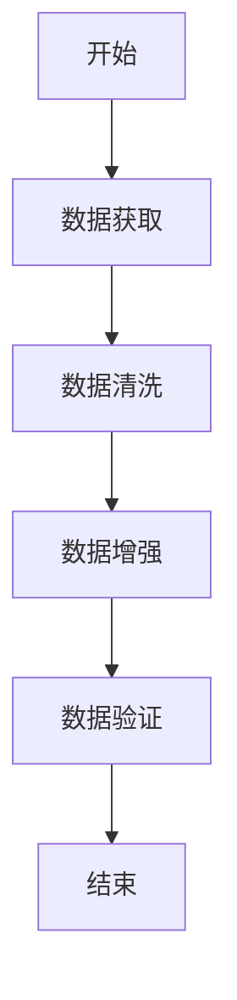
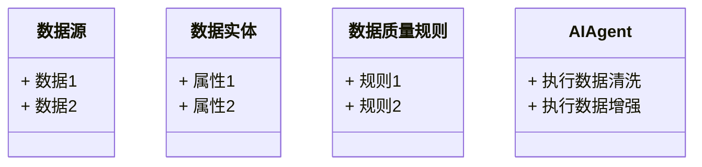
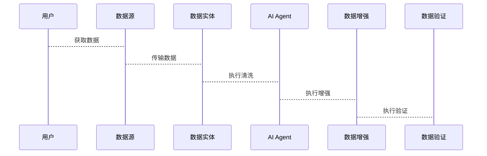

                 


# AI Agent在企业数据质量管理与治理自动化中的应用

> 关键词：AI Agent，数据质量管理，企业数据治理，自动化治理，数据清洗，数据增强

> 摘要：本文深入探讨AI Agent在企业数据质量管理与治理自动化中的应用，分析其算法原理、系统架构及实际案例，为企业数据治理提供理论和实践指导。

---

# 第1章: 数据质量管理与AI Agent的背景介绍

## 1.1 数据质量管理的核心概念
### 1.1.1 数据质量管理的定义
数据质量管理（Data Quality Management，DQM）是确保数据的准确性、一致性、完整性、及时性和可追溯性的过程。它是企业信息化建设中的关键环节，直接影响企业的决策能力和竞争力。

### 1.1.2 数据质量管理的关键维度
数据质量管理的关键维度包括：
- 准确性：数据反映真实情况的程度。
- 完整性：数据是否包含所有必要信息。
- 一致性：数据在不同系统中是否保持一致。
- 及时性：数据是否及时更新。
- 可用性：数据是否易于访问和使用。

### 1.1.3 数据质量管理的挑战与重要性
数据质量管理的挑战包括数据来源多样、格式不统一、数据孤岛等问题。其重要性体现在提升企业决策能力、降低数据风险、提高数据资产价值等方面。

## 1.2 AI Agent的基本概念
### 1.2.1 AI Agent的定义
AI Agent（人工智能代理）是一种能够感知环境、执行任务并做出决策的智能实体。它可以自主行动，无需人工干预。

### 1.2.2 AI Agent的核心特征
AI Agent的核心特征包括：
- 感知环境：通过传感器或API获取数据。
- 决策能力：基于数据和规则做出决策。
- 执行任务：通过自动化流程完成目标。
- 学习能力：通过机器学习优化行为。

### 1.2.3 AI Agent在企业中的应用场景
AI Agent在企业中的应用场景包括：
- 自动化数据清洗。
- 实时数据监控。
- 数据关联分析。

## 1.3 数据质量管理与AI Agent的结合
### 1.3.1 数据质量管理中的痛点
数据质量管理的痛点包括：
- 数据清洗耗时耗力。
- 数据规则复杂难懂。
- 数据异常难以及时发现。

### 1.3.2 AI Agent如何解决数据质量管理问题
AI Agent可以通过自动化数据清洗、智能规则推理和实时数据监控解决数据质量管理问题。

### 1.3.3 数据质量管理与AI Agent的边界与外延
数据质量管理的边界是数据本身，而AI Agent的外延包括数据可视化和数据安全。

## 1.4 本章小结
本章介绍了数据质量管理的核心概念和AI Agent的基本特征，分析了它们的结合点和应用价值。

---

# 第2章: 数据质量管理与AI Agent的核心概念与联系

## 2.1 数据质量管理的实体关系分析
### 2.1.1 数据源与数据实体的关系
数据源是数据的来源，数据实体是数据的具体表现形式。

### 2.1.2 数据质量规则与数据实体的关系
数据质量规则用于验证和清洗数据实体。

### 2.1.3 AI Agent在数据质量管理中的角色
AI Agent作为执行者，负责数据清洗和监控。

## 2.2 AI Agent与数据质量管理的对比分析
### 2.2.1 核心概念对比
| 概念 | 数据质量管理 | AI Agent |
|------|--------------|----------|
| 核心目标 | 数据准确性和完整性 | 自动化任务执行 |
| 实现方式 | 手工规则 | 自动化决策 |

### 2.2.2 功能对比
- 数据质量管理：数据清洗、规则验证。
- AI Agent：数据监控、异常检测。

### 2.2.3 优缺点对比
数据质量管理的优点是确保数据准确性，缺点是效率低；AI Agent的优点是效率高，缺点是依赖算法准确性。

## 2.3 数据质量管理的领域模型分析
### 2.3.1 数据质量管理的领域模型
数据质量管理的领域模型包括数据源、数据实体、数据质量规则和AI Agent。

### 2.3.2 数据质量管理的实体关系图（ER图）



## 2.4 本章小结
本章分析了数据质量管理与AI Agent的核心概念及其关系，为后续章节的深入分析奠定了基础。

---

# 第3章: AI Agent在数据质量管理中的算法原理

## 3.1 数据质量管理中的AI Agent算法概述
### 3.1.1 基于规则的AI Agent算法
基于规则的算法通过预定义规则进行数据清洗。

### 3.1.2 基于机器学习的AI Agent算法
基于机器学习的算法通过训练模型自动识别异常数据。

### 3.1.3 基于自然语言处理的AI Agent算法
基于NLP的算法用于数据清洗和关联分析。

## 3.2 数据质量管理中的AI Agent算法实现
### 3.2.1 数据清洗算法
```python
def clean_data(data):
    # 去重
    data.drop_duplicates(inplace=True)
    # 填充缺失值
    data.fillna(method='ffill', inplace=True)
```

### 3.2.2 数据增强算法
```python
def enhance_data(data):
    # 插值计算
    data['interpolated_value'] = data['value'].interpolate()
```

### 3.2.3 数据验证算法
```python
def validate_data(data, rules):
    valid_data = data.copy()
    for rule in rules:
        valid_data = rule.apply(valid_data)
    return valid_data
```

## 3.3 数据质量管理中的AI Agent算法流程图



## 3.4 本章小结
本章详细介绍了AI Agent在数据质量管理中的算法实现及其流程。

---

# 第4章: 数据质量管理中的数学模型与公式

## 4.1 数据质量管理中的概率模型
### 4.1.1 数据清洗的概率模型
$$ P(\text{数据有效}) = 1 - P(\text{数据缺失}) $$

### 4.1.2 数据增强的概率模型
$$ P(\text{数据准确}) = P(\text{数据增强}) \times P(\text{规则正确}) $$

## 4.2 数据质量管理中的统计模型
### 4.2.1 数据分布模型
$$ P(x) = \frac{1}{\sqrt{2\pi\sigma^2}} e^{-\frac{(x-\mu)^2}{2\sigma^2}} $$

### 4.2.2 数据关联模型
$$ \text{关联度} = \sum_{i=1}^{n} |x_i - y_i| $$

## 4.3 数据质量管理中的优化模型
### 4.3.1 数据清洗优化模型
$$ \min \sum_{i=1}^{n} |x_i - x'_i| $$

## 4.4 本章小结
本章通过数学公式分析了数据质量管理中的概率模型和统计模型。

---

# 第5章: 系统分析与架构设计

## 5.1 问题场景介绍
企业面临数据清洗、数据增强和数据验证的挑战。

## 5.2 系统功能设计
### 5.2.1 领域模型


### 5.2.2 系统架构设计


### 5.2.3 系统接口设计
- 数据获取接口：`GET /data`
- 数据清洗接口：`POST /clean`

## 5.3 系统交互流程图


## 5.4 本章小结
本章设计了系统的架构和接口，并展示了系统的交互流程。

---

# 第6章: 项目实战

## 6.1 环境安装
安装Python和相关库：
```bash
pip install pandas numpy scikit-learn
```

## 6.2 核心代码实现
### 6.2.1 数据清洗代码
```python
import pandas as pd

def clean_data(data):
    data.drop_duplicates(inplace=True)
    data['value'].fillna(data['value'].mean(), inplace=True)
```

### 6.2.2 数据增强代码
```python
def enhance_data(data):
    data['interpolated_value'] = data['value'].interpolate()
```

## 6.3 代码应用解读与分析
- 数据清洗代码通过去重和填充缺失值实现数据清洗。
- 数据增强代码通过插值计算增强数据。

## 6.4 实际案例分析
以销售数据为例，展示数据清洗和增强的过程。

## 6.5 项目小结
本章通过实际案例展示了AI Agent在数据质量管理中的应用。

---

# 第7章: 最佳实践与总结

## 7.1 本章小结
总结AI Agent在数据质量管理中的应用和优势。

## 7.2 关键点回顾
- 数据质量管理的重要性。
- AI Agent的核心特征。
- 算法实现的关键步骤。

## 7.3 注意事项
- 确保数据源的准确性。
- 定期更新数据质量规则。

## 7.4 拓展阅读
推荐相关书籍和论文，供读者进一步学习。

---

# 作者

作者：AI天才研究院/AI Genius Institute & 禅与计算机程序设计艺术 /Zen And The Art of Computer Programming

