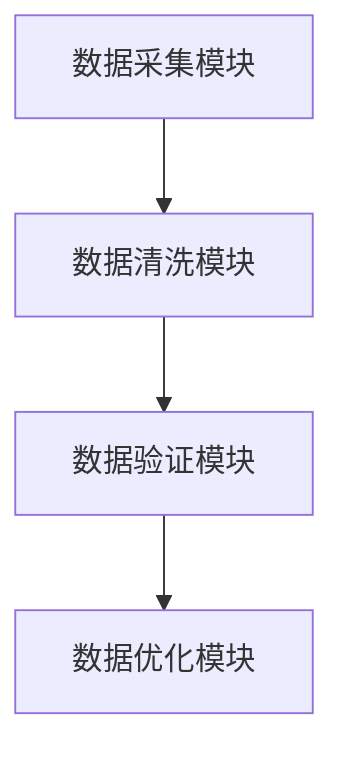
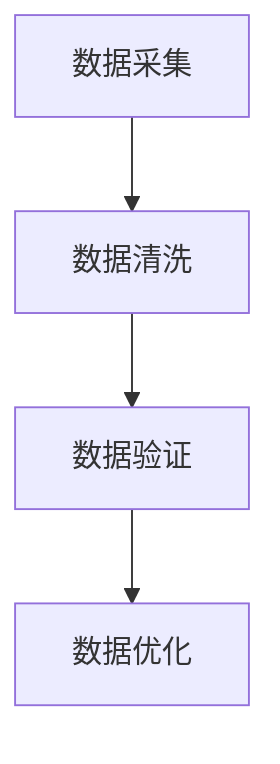
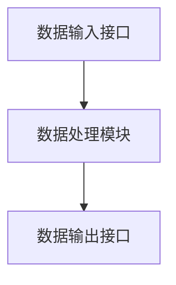
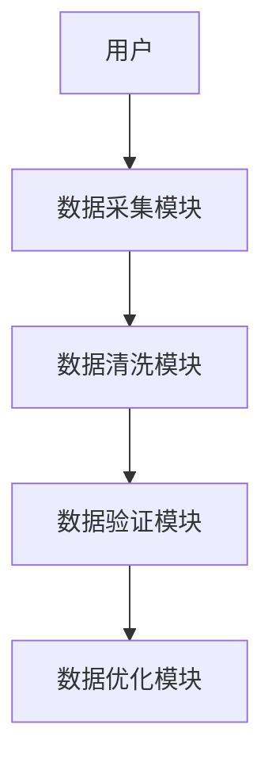

                 


# AI Agent在企业数据质量评估与自动化治理中的应用

> 关键词：AI Agent，数据质量管理，数据清洗，数据验证，数据优化，机器学习

> 摘要：本文深入探讨了AI Agent在企业数据质量评估与自动化治理中的应用。通过分析数据质量管理的核心挑战，结合AI Agent的技术优势，提出了基于强化学习和自然语言处理的智能化数据治理方法。本文详细讲解了AI Agent在数据清洗、数据验证和数据优化中的具体应用，并通过实际案例展示了如何利用AI Agent实现数据质量管理的自动化和智能化。此外，本文还讨论了系统架构设计、算法实现和项目实战，为读者提供了一套完整的数据质量管理解决方案。

---

# 第一部分: AI Agent与企业数据质量概述

## 第1章: 数据质量管理的背景与挑战

### 1.1 数据质量管理的背景与重要性

在当今数字化时代，企业每天都会产生海量的数据。这些数据来自于不同的业务系统、外部合作伙伴以及各种传感器设备。数据的质量直接影响企业的决策能力、运营效率和客户体验。然而，数据质量管理一直是企业面临的一个重要挑战。

#### 1.1.1 数据质量管理的定义与重要性

数据质量管理（Data Quality Management，DQM）是指通过一系列方法和技术，确保数据的准确性、完整性、一致性、及时性和合规性。数据质量管理的重要性体现在以下几个方面：

- **准确性**：确保数据反映真实业务情况。
- **完整性**：确保数据没有缺失。
- **一致性**：确保数据在不同系统中保持一致。
- **及时性**：确保数据能够及时反映业务变化。
- **合规性**：确保数据符合相关法律法规和企业政策。

数据质量管理是企业信息化建设的基础，直接影响企业的数据分析能力、决策能力和创新能力。

#### 1.1.2 传统数据质量管理的局限性

尽管数据质量管理的重要性不言而喻，但传统的方法仍然存在一些局限性：

1. **人工依赖性强**：传统数据质量管理 heavily依赖人工检查和干预，效率低下，且容易出错。
2. **规则静态**：传统的数据清洗和验证规则通常是静态的，难以适应业务变化和数据复杂性。
3. **缺乏智能化**：传统方法缺乏智能化，无法自动识别和解决复杂的数据问题。

#### 1.1.3 AI Agent在数据质量管理中的作用

AI Agent（人工智能代理）是一种能够感知环境、自主决策并执行任务的智能体。AI Agent在数据质量管理中的应用可以显著提升数据治理的效率和效果。其主要作用包括：

1. **自动化数据清洗**：AI Agent可以自动识别和处理数据中的错误、重复和不一致。
2. **智能化数据验证**：AI Agent可以通过机器学习模型自动验证数据的准确性。
3. **自适应数据优化**：AI Agent可以根据业务需求动态调整数据处理策略。

### 1.2 AI Agent的核心概念与工作原理

#### 1.2.1 AI Agent的定义与分类

AI Agent是一种能够感知环境、自主决策并执行任务的智能体。根据应用场景的不同，AI Agent可以分为以下几类：

- **简单反射型Agent**：基于预定义规则执行任务。
- **基于模型的反射型Agent**：通过内部模型感知环境并做出决策。
- **目标驱动型Agent**：根据目标选择最优行动。
- **实用驱动型Agent**：通过效用函数优化决策。

#### 1.2.2 AI Agent在数据治理中的应用场景

在企业数据质量管理中，AI Agent可以应用于以下几个场景：

1. **数据清洗**：AI Agent可以自动识别和处理数据中的错误、重复和不一致。
2. **数据验证**：AI Agent可以通过机器学习模型自动验证数据的准确性。
3. **数据增强**：AI Agent可以自动补充缺失数据，提升数据的完整性。

#### 1.2.3 AI Agent与数据质量管理的结合

AI Agent与数据质量管理的结合可以通过以下步骤实现：

1. **数据采集**：AI Agent从多个数据源采集数据。
2. **数据清洗**：AI Agent自动识别和处理数据中的错误、重复和不一致。
3. **数据验证**：AI Agent通过机器学习模型验证数据的准确性。
4. **数据优化**：AI Agent根据业务需求动态调整数据处理策略。
5. **数据输出**：AI Agent将处理后的数据输出，供企业使用。

### 1.3 本章小结

本章介绍了数据质量管理的背景与重要性，分析了传统数据质量管理的局限性，并详细讲解了AI Agent在数据质量管理中的作用和核心概念。通过本章的学习，读者可以理解AI Agent如何通过智能化的方式提升数据治理的效率和效果。

---

# 第二部分: 数据质量管理的AI Agent驱动方法

## 第2章: 数据质量管理的AI Agent方法论

### 2.1 数据质量管理的流程与关键环节

数据质量管理的流程可以分为以下几个关键环节：

1. **数据采集**：从多个数据源采集数据。
2. **数据清洗**：识别和处理数据中的错误、重复和不一致。
3. **数据标准化**：将数据转换为统一的格式和标准。
4. **数据验证**：验证数据的准确性和完整性。
5. **数据优化**：根据业务需求动态调整数据处理策略。

#### 2.1.1 数据采集与清洗

数据采集是数据质量管理的第一步。AI Agent可以从多个数据源采集数据，并通过自然语言处理技术识别和处理数据中的错误和不一致。

#### 2.1.2 数据标准化与转换

数据标准化是数据质量管理的重要环节。AI Agent可以通过机器学习模型自动识别数据中的异常值，并将其转换为符合标准的格式。

#### 2.1.3 数据验证与评估

数据验证是数据质量管理的关键步骤。AI Agent可以通过分类模型验证数据的准确性，并通过聚类算法识别数据中的异常值。

### 2.2 AI Agent在数据质量管理中的角色

AI Agent在数据质量管理中的角色可以分为以下几个方面：

1. **数据清洗的自动化**：AI Agent可以自动识别和处理数据中的错误、重复和不一致。
2. **数据验证的智能化**：AI Agent可以通过机器学习模型自动验证数据的准确性。
3. **数据优化的自主化**：AI Agent可以根据业务需求动态调整数据处理策略。

#### 2.2.1 数据清洗的自动化

数据清洗的自动化是AI Agent在数据质量管理中的重要应用。通过自然语言处理和机器学习技术，AI Agent可以自动识别和处理数据中的错误、重复和不一致。

#### 2.2.2 数据验证的智能化

数据验证的智能化是AI Agent的另一重要应用。通过分类模型，AI Agent可以自动验证数据的准确性，并识别数据中的异常值。

#### 2.2.3 数据优化的自主化

数据优化的自主化是AI Agent的高级应用。通过强化学习技术，AI Agent可以根据业务需求动态调整数据处理策略，并优化数据质量。

### 2.3 数据质量管理的AI Agent驱动模型

#### 2.3.1 数据质量管理的三要素模型

数据质量管理的三要素模型包括数据质量、数据处理和数据优化三个部分。通过这三个要素的协同作用，AI Agent可以实现数据质量管理的自动化和智能化。

#### 2.3.2 AI Agent驱动的数据质量管理框架

AI Agent驱动的数据质量管理框架包括数据采集、数据清洗、数据验证和数据优化四个环节。通过这一框架，AI Agent可以实现数据质量管理的闭环管理。

#### 2.3.3 数据质量管理的闭环模型

数据质量管理的闭环模型包括数据采集、数据清洗、数据验证和数据优化四个环节。通过这一闭环模型，AI Agent可以实现数据质量管理的持续改进和优化。

## 第3章: 数据质量管理的数学模型与算法

### 3.1 数据质量管理的数学模型

数据质量管理的数学模型包括数据质量度量函数、数据清洗的优化目标函数和数据验证的分类模型。

#### 3.1.1 数据质量的度量函数

数据质量的度量函数可以通过以下公式表示：

$$
\text{数据质量} = f(\text{准确性, 完整性, 一致性, 及时性, 合规性})
$$

其中，f是一个综合函数，用于度量数据的质量。

#### 3.1.2 数据清洗的优化目标函数

数据清洗的优化目标函数可以通过以下公式表示：

$$
\text{目标函数} = \min_{x} \sum_{i=1}^{n} (x_i - \text{真实值})^2
$$

其中，x_i是数据清洗后的值，真实值是数据清洗前的值。

#### 3.1.3 数据验证的分类模型

数据验证的分类模型可以通过逻辑回归或支持向量机等算法实现。以下是逻辑回归的数学模型：

$$
P(y=1|x) = \frac{e^{\beta x}}{1 + e^{\beta x}}
$$

其中，x是输入特征，β是模型参数。

### 3.2 AI Agent的核心算法

AI Agent的核心算法包括数据清洗的聚类算法、数据验证的分类算法和数据优化的强化学习算法。

#### 3.2.1 数据清洗的聚类算法

数据清洗的聚类算法可以通过K-means算法实现。以下是K-means算法的伪代码：

```python
def kmeans_clustering(data, k):
    # 初始化质心
    centroids = initialize_centroids(data, k)
    while True:
        # 分配数据点到最近的质心
        clusters = assign_clusters(data, centroids)
        # 更新质心
        new_centroids = update_centroids(clusters)
        if centroids == new_centroids:
            break
        centroids = new_centroids
    return clusters, centroids
```

#### 3.2.2 数据验证的分类算法

数据验证的分类算法可以通过逻辑回归实现。以下是逻辑回归的Python代码示例：

```python
from sklearn.linear_model import LogisticRegression

# 初始化模型
model = LogisticRegression()

# 训练模型
model.fit(X_train, y_train)

# 预测标签
y_pred = model.predict(X_test)

# 输出准确率
print("准确率:", accuracy_score(y_test, y_pred))
```

#### 3.2.3 数据优化的强化学习算法

数据优化的强化学习算法可以通过深度强化学习实现。以下是深度强化学习的伪代码：

```python
def deep_reinforcement_learning(env, epochs):
    # 初始化网络
    model = create_model(env.state_space, env.action_space)
    # 训练网络
    for epoch in range(epochs):
        state = env.reset()
        while not done:
            action = model.predict(state)
            next_state, reward, done = env.step(action)
            model.update(action, reward)
    return model
```

## 第4章: 数据质量管理的系统架构设计

### 4.1 系统架构概述

数据质量管理的系统架构包括数据采集模块、数据清洗模块、数据验证模块和数据优化模块。以下是系统架构的Mermaid图：



### 4.2 系统功能设计

系统功能设计包括数据采集、数据清洗、数据验证和数据优化四个模块。以下是系统功能的Mermaid图：



### 4.3 系统接口设计

系统接口设计包括数据输入接口、数据处理接口和数据输出接口。以下是系统接口的Mermaid图：



### 4.4 系统交互设计

系统交互设计包括用户与系统的交互、系统与数据源的交互和系统与数据目标的交互。以下是系统交互的Mermaid图：



## 第5章: 数据质量管理的项目实战

### 5.1 项目背景与目标

项目背景：某企业需要提升其数据质量管理的效率和效果。

项目目标：通过AI Agent实现数据质量管理的自动化和智能化。

### 5.2 项目实施步骤

项目实施步骤包括数据采集、数据清洗、数据验证和数据优化。

#### 5.2.1 数据采集

数据采集可以通过数据库连接、API调用和文件读取等方式实现。

#### 5.2.2 数据清洗

数据清洗可以通过聚类算法和分类算法实现。

#### 5.2.3 数据验证

数据验证可以通过逻辑回归和随机森林等算法实现。

#### 5.2.4 数据优化

数据优化可以通过强化学习算法实现。

### 5.3 项目成果与总结

项目成果包括数据清洗的准确率提高、数据验证的效率提升和数据优化的效果显著。通过本项目的实施，企业可以显著提升其数据质量管理的效率和效果。

## 第6章: 数据质量管理的总结与展望

### 6.1 总结

通过本章的学习，读者可以理解AI Agent在数据质量管理中的应用和优势。AI Agent可以通过智能化的方式提升数据治理的效率和效果。

### 6.2 未来展望

未来，随着人工智能技术的不断发展，AI Agent在数据质量管理中的应用将更加广泛和深入。可以通过结合区块链技术和边缘计算技术，进一步提升数据质量管理的智能化和安全性。

---

# 作者：AI天才研究院/AI Genius Institute & 禅与计算机程序设计艺术 /Zen And The Art of Computer Programming

---

通过以上思考，我们可以看到，AI Agent在企业数据质量评估与自动化治理中的应用具有广阔的前景和重要的意义。AI Agent可以通过智能化的方式提升数据治理的效率和效果，为企业创造更大的价值。

