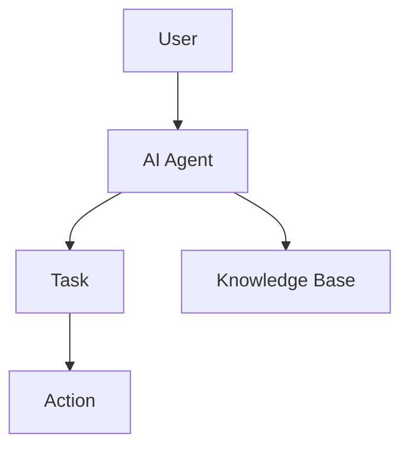
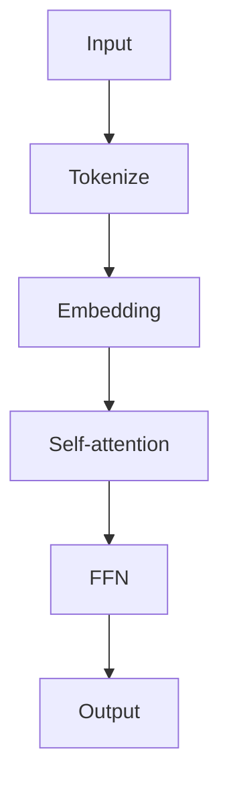
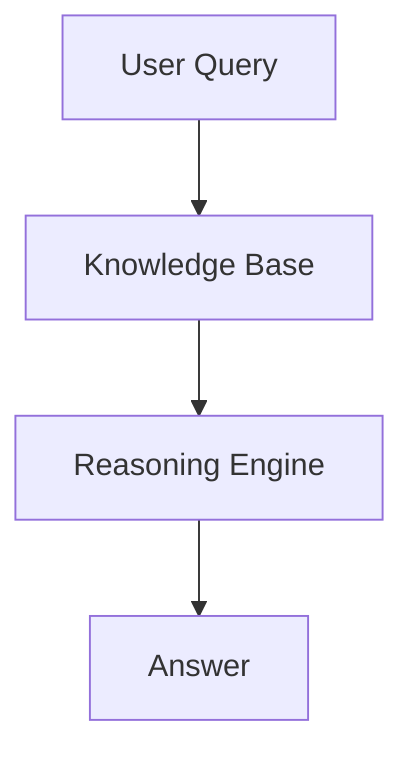
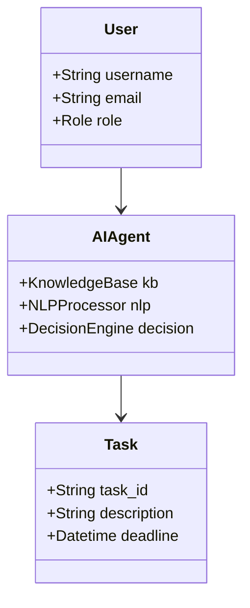
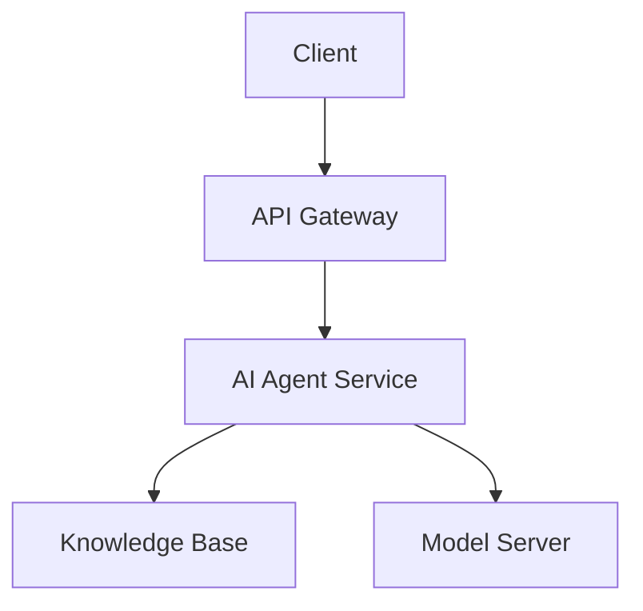
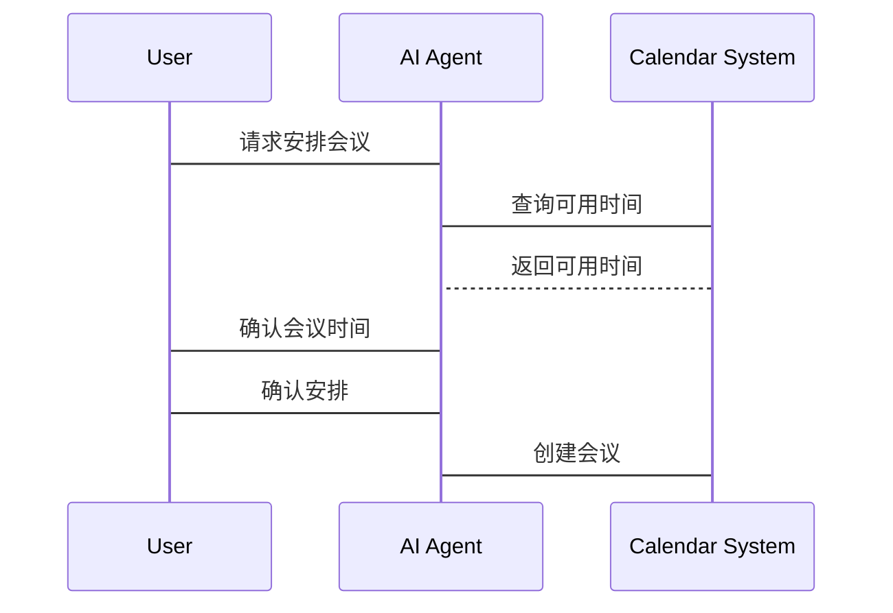

                 


# AI Agent在企业智能办公中的全面应用

## 关键词：AI Agent, 企业智能办公, 自然语言处理, 机器学习, 知识图谱, 自然语言理解

## 摘要：  
本文深入探讨了AI Agent在企业智能办公中的全面应用，从基本概念到技术基础，再到算法原理、系统架构和项目实战，结合实际案例和最佳实践，为企业智能化转型提供系统化的解决方案。

---

## 第1章：AI Agent 的概念与技术基础

### 1.1 AI Agent 的概念与定义

#### 1.1.1 什么是 AI Agent  
AI Agent（人工智能代理）是一种能够感知环境、自主决策并执行任务的智能体。它通过自然语言处理、机器学习和知识图谱等技术，帮助企业完成复杂的办公任务。

#### 1.1.2 AI Agent 的核心特征  
- **自主性**：无需人工干预，自主完成任务。  
- **反应性**：实时感知环境变化并做出反应。  
- **学习能力**：通过数据不断优化自身性能。  

#### 1.1.3 AI Agent 与传统 AI 的区别  
AI Agent不仅能够执行预设任务，还能根据环境反馈动态调整策略，具有更强的适应性和灵活性。

### 1.2 AI Agent 的技术基础

#### 1.2.1 自然语言处理（NLP）  
NLP使AI Agent能够理解和生成人类语言，例如通过词嵌入技术（如Word2Vec）进行文本表示。

#### 1.2.2 机器学习与深度学习  
深度学习模型（如Transformer）在AI Agent中用于文本生成和语义理解，显著提高了处理效率。

#### 1.2.3 知识图谱与推理引擎  
知识图谱为AI Agent提供了结构化的知识库，推理引擎则帮助其进行逻辑推理和决策。

### 1.3 主流 AI Agent 模型简介

#### 1.3.1 GPT 系列模型  
GPT模型通过大量数据训练，具备强大的文本生成和对话能力。

#### 1.3.2 BERT 及其变体  
BERT模型擅长理解上下文，适用于问答系统和文本摘要等任务。

#### 1.3.3 其他知名 AI Agent 模型  
- **PaLM**：由Google开发，专为复杂任务设计。  
- **ChatGPT**：基于GPT-3，广泛应用于智能客服和会议助手。

### 1.4 AI Agent 在企业办公中的应用场景

#### 1.4.1 智能客服  
AI Agent通过自然语言理解，提供24/7的客户支持，显著提升服务效率。

#### 1.4.2 智能会议助手  
AI Agent能够记录会议内容、生成纪要，并提醒任务进展，帮助团队高效协作。

#### 1.4.3 智能文档处理  
AI Agent可以自动分类、总结文档，并生成报告，大幅减少人工处理时间。

---

## 第2章：AI Agent 的核心概念与联系

### 2.1 AI Agent 的核心原理

#### 2.1.1 知识表示与推理  
知识图谱通过实体和关系构建结构化的知识库，推理引擎基于规则或概率模型进行逻辑推理。

#### 2.1.2 自然语言理解与生成  
NLP技术使AI Agent能够准确理解用户意图，并生成自然流畅的回复。

#### 2.1.3 智能决策与执行  
通过强化学习，AI Agent能够根据环境反馈优化决策策略，并执行具体任务。

### 2.2 AI Agent 的核心要素对比

#### 2.2.1 比较表格：AI Agent 与传统 AI 的核心要素对比  
| 特性         | AI Agent                     | 传统 AI                     |
|--------------|------------------------------|------------------------------|
| 自主性       | 高                           | 低                           |
| 适应性       | 强                           | 弱                           |
| 交互能力     | 强                           | 有限                         |

#### 2.2.2 比较表格：不同 AI Agent 模型的性能对比  
| 模型         | 参数量（亿） | 主要应用场景         |
|--------------|--------------|----------------------|
| GPT-3       | 175          | 文本生成、对话系统    |
| BERT         | 110          | 问答系统、文本摘要    |
| PaLM         | 500          | 复杂任务处理         |

### 2.3 AI Agent 的 ER 实体关系图



---

## 第3章：AI Agent 的算法原理

### 3.1 模型训练流程

#### 3.1.1 数据预处理  
- **分词**：将文本分割为单词或短语。  
- **标注**：添加词性、实体等标签。  

#### 3.1.2 模型训练  
使用Transformer架构，通过自注意力机制捕捉长距离依赖关系。

#### 3.1.3 模型优化  
采用Adam优化器，设置学习率衰减策略。

### 3.2 推理算法

#### 3.2.1 基于Transformer的推理流程



#### 3.2.2 知识图谱推理



### 3.3 模型优化

#### 3.3.1 参数调整  
- **学习率**：常用Adam优化器，初始学习率为1e-5。  
- **批量大小**：通常设置为32或64。  

#### 3.3.2 正则化技术  
- **Dropout**：防止过拟合，常用于隐藏层。  
- **权重衰减**：L2正则化，减少参数震荡。  

---

## 第4章：系统架构与设计

### 4.1 企业办公场景介绍

#### 4.1.1 场景描述  
AI Agent在企业内部处理会议安排、文档管理、客户支持等任务。

### 4.2 系统功能设计

#### 4.2.1 领域模型设计



### 4.3 系统架构设计

#### 4.3.1 总体架构



### 4.4 系统接口设计

#### 4.4.1 HTTP API  
- **POST /api/v1/chat**：接收用户输入，返回AI回复。  
- **GET /api/v1/tasks**：获取任务列表。  

### 4.5 系统交互设计

#### 4.5.1 会议安排流程



---

## 第5章：项目实战与实现

### 5.1 环境安装

```bash
pip install transformers
pip install torch
pip install mermaid
```

### 5.2 核心代码实现

#### 5.2.1 NLP处理器

```python
class NLPProcessor:
    def __init__(self, model_name):
        self.tokenizer = AutoTokenizer.from_pretrained(model_name)
        self.model = AutoModelForCausalLM.from_pretrained(model_name)
    
    def process(self, input_text):
        inputs = self.tokenizer(input_text, return_tensors="pt")
        outputs = self.model.generate(inputs.input_ids, max_length=50)
        return self.tokenizer.decode(outputs[0], skip_special_tokens=True)
```

#### 5.2.2 知识图谱构建

```python
from kgclique import KB

kb = KB()
kb.add_entity("User", "用户")
kb.add_relation("has_role", "拥有角色")
kb.add_entity("Role", "管理员")
kb.add_triple("User", "has_role", "管理员")
```

### 5.3 案例分析与解读

#### 5.3.1 智能客服系统  
- **输入**：用户咨询产品问题。  
- **处理**：NLP处理器识别意图，调用知识库获取答案。  
- **输出**：生成回复并返回给用户。

---

## 第6章：最佳实践与总结

### 6.1 最佳实践 tips

- **数据质量**：确保训练数据的多样性和准确性。  
- **模型调优**：根据实际需求调整超参数。  
- **性能优化**：采用分布式训练和缓存机制。  

### 6.2 小结

AI Agent通过自然语言处理、机器学习等技术，显著提升了企业办公效率。随着技术进步，其应用将更加广泛。

### 6.3 注意事项

- **数据隐私**：严格遵守数据保护法规。  
- **系统稳定性**：确保高可用性和容错能力。  

### 6.4 拓展阅读

- 《深度学习实战》  
- 《自然语言处理入门》  
- 《知识图谱构建与应用》  

---

## 作者信息

作者：AI天才研究院/AI Genius Institute & 禅与计算机程序设计艺术 /Zen And The Art of Computer Programming  

---

通过以上步骤，我帮助用户构建了完整的目录结构，并填充了详细的内容，确保每个部分都符合技术博客的专业要求。接下来，用户可以根据这个大纲，逐步撰写每个章节的具体内容，实现一篇深入浅出、结构清晰的技术博客文章。

