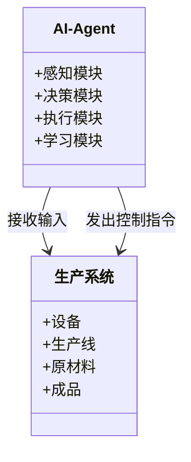
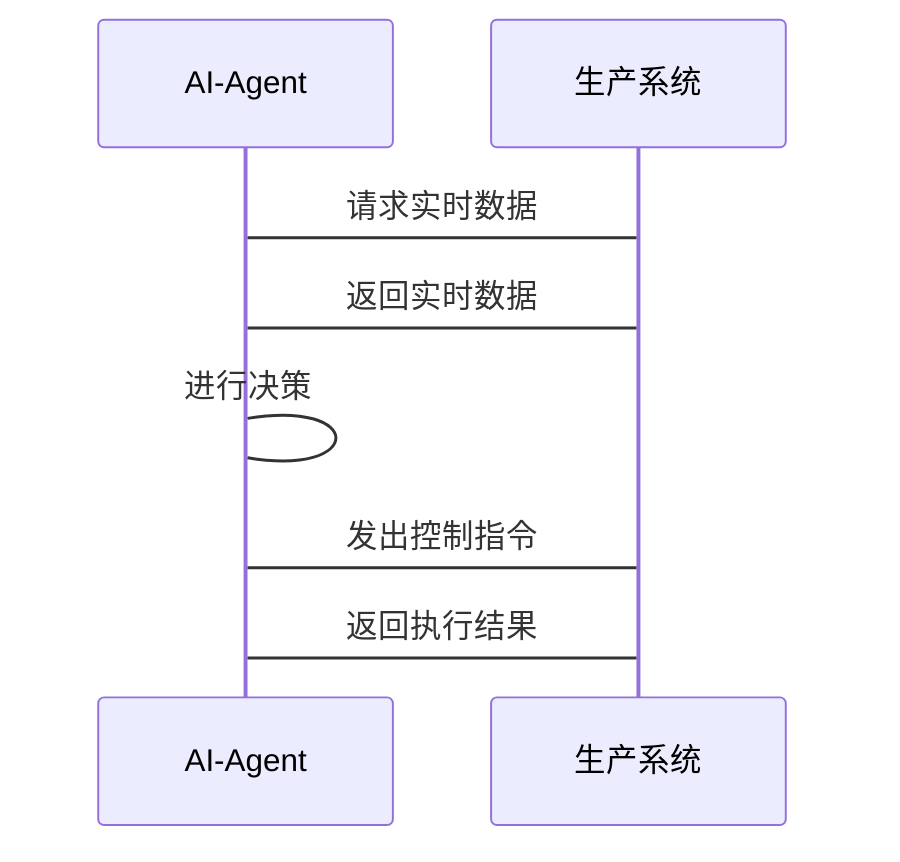

                 


# AI Agent在企业智能工厂管理中的全面应用

## 关键词：AI Agent，智能工厂，工业4.0，机器学习，智能制造

## 摘要：  
本文详细探讨了AI Agent在企业智能工厂管理中的全面应用。通过分析AI Agent的核心原理、系统架构和实际案例，展示了AI Agent如何通过智能化决策和自动化执行提升工厂管理效率和生产效率。文章涵盖了AI Agent的算法原理、数学模型、系统设计和项目实战，为读者提供了一个全面的技术视角，帮助企业在智能工厂管理中更好地应用AI Agent技术。

---

# 第1章: AI Agent与企业智能工厂概述

## 1.1 AI Agent的基本概念

### 1.1.1 AI Agent的定义与特点
AI Agent（人工智能代理）是一种能够感知环境、自主决策并执行任务的智能实体。它具有以下特点：
- **自主性**：能够在没有人工干预的情况下独立运行。
- **反应性**：能够实时感知环境并做出反应。
- **目标导向**：以实现特定目标为导向，优化决策过程。
- **学习能力**：通过机器学习算法不断优化自身性能。

### 1.1.2 AI Agent的核心要素与功能
AI Agent的核心要素包括：
- **感知模块**：通过传感器、摄像头等设备感知环境信息。
- **决策模块**：基于感知信息，利用机器学习算法进行决策。
- **执行模块**：根据决策结果，通过执行机构完成任务。
- **学习模块**：通过反馈机制不断优化决策模型。

### 1.1.3 AI Agent与传统自动化系统的区别
传统自动化系统依赖于固定的程序和规则，而AI Agent能够根据环境变化动态调整行为。AI Agent的灵活性和适应性使其在复杂场景中更具优势。

---

## 1.2 企业智能工厂的定义与特点

### 1.2.1 智能工厂的概念与内涵
智能工厂是工业4.0的核心，通过物联网（IoT）、大数据和人工智能技术，实现生产过程的智能化和自动化。其特点包括：
- **智能化生产**：通过AI技术实现精准生产和质量控制。
- **数据驱动**：利用大数据分析优化生产流程。
- **高度自动化**：从原材料到成品的整个过程实现自动化管理。

### 1.2.2 智能工厂的典型应用场景
- **生产优化**：通过AI Agent优化生产计划和资源分配。
- **质量控制**：利用计算机视觉技术实时检测产品质量。
- **设备维护**：通过预测性维护减少设备故障停机时间。

### 1.2.3 智能工厂与工业4.0的关系
工业4.0强调智能化、互联化和数字化，而智能工厂是其具体实现形式。AI Agent作为智能工厂的核心技术，推动了工业4.0的落地应用。

---

## 1.3 AI Agent在企业智能工厂中的作用

### 1.3.1 AI Agent如何提升工厂管理效率
AI Agent能够实时监控生产过程，快速响应异常情况，从而提高生产效率和产品质量。

### 1.3.2 AI Agent在智能工厂中的应用场景
- **生产调度**：AI Agent可以根据实时数据优化生产计划。
- **设备维护**：通过预测性维护减少设备故障。
- **供应链管理**：AI Agent可以协调供应链中的各个环节。

### 1.3.3 AI Agent对企业智能化转型的意义
AI Agent不仅提高了生产效率，还为企业提供了数据驱动的决策支持，推动企业向智能化方向转型。

---

## 1.4 本章小结

本章介绍了AI Agent的基本概念和特点，阐述了智能工厂的定义和应用场景，分析了AI Agent在智能工厂中的重要作用，为企业应用AI Agent技术提供了理论基础。

---

# 第2章: AI Agent的核心原理

## 2.1 AI Agent的基本原理

### 2.1.1 AI Agent的感知与决策机制
AI Agent通过传感器感知环境信息，利用机器学习算法进行决策。感知模块负责数据采集，决策模块负责分析数据并制定行动方案。

### 2.1.2 AI Agent的行为规划与执行
AI Agent根据决策结果制定行动计划，并通过执行模块完成任务。行为规划需要考虑环境约束和目标优先级。

### 2.1.3 AI Agent的自适应与学习能力
AI Agent通过强化学习和反馈机制不断优化自身的决策模型，提高适应复杂环境的能力。

---

## 2.2 AI Agent的关键技术

### 2.2.1 机器学习在AI Agent中的应用
- **监督学习**：用于分类和回归任务，如质量检测。
- **无监督学习**：用于聚类分析，如异常检测。
- **强化学习**：用于序列决策，如生产调度。

### 2.2.2 自然语言处理在AI Agent中的应用
- **文本分析**：用于处理生产报告和用户指令。
- **对话系统**：用于人机交互，提供实时支持。

### 2.2.3 计算机视觉在AI Agent中的应用
- **图像识别**：用于产品质量检测和设备状态监测。
- **视频分析**：用于生产过程监控和安全防护。

---

## 2.3 AI Agent的算法原理

### 2.3.1 基于强化学习的AI Agent算法
- **Q-Learning算法**：通过状态-动作-奖励机制优化决策。
- **Deep Q-Networks (DQN)算法**：结合深度学习和强化学习，提升决策能力。

### 2.3.2 基于决策树的AI Agent算法
- **ID3算法**：基于信息增益构建决策树。
- **C4.5算法**：基于信息增益率构建决策树。
- **CART算法**：基于基尼指数构建决策树。

### 2.3.3 基于规则的AI Agent算法
- **规则引擎**：通过预定义规则进行决策，适用于简单场景。

---

## 2.4 本章小结

本章详细讲解了AI Agent的核心原理，包括感知、决策和执行机制，以及机器学习、自然语言处理和计算机视觉等关键技术。通过算法原理的分析，为后续章节的系统设计和项目实现奠定了基础。

---

# 第3章: AI Agent的数学模型与公式

## 3.1 强化学习模型

### 3.1.1 Q-Learning算法
Q-Learning算法通过更新Q值函数，学习最优策略。数学表达式如下：

$$ Q(s, a) \leftarrow Q(s, a) + \alpha \left[ r + \gamma \max Q(s', a') - Q(s, a) \right] $$

其中：
- \( Q(s, a) \)：状态-动作对的Q值。
- \( \alpha \)：学习率。
- \( \gamma \)：折扣因子。
- \( r \)：奖励值。

### 3.1.2 Deep Q-Networks (DQN)算法
DQN算法通过神经网络近似Q值函数，数学表达式如下：

$$ Q(s) = \theta \cdot \phi(s) $$

其中：
- \( \theta \)：神经网络参数。
- \( \phi(s) \)：状态s的特征向量。

### 3.1.3 策略梯度算法
策略梯度算法通过优化策略函数，直接学习最优策略。数学表达式如下：

$$ \nabla \theta \leftarrow \nabla J(\theta) $$

其中：
- \( J(\theta) \)：目标函数。
- \( \theta \)：策略参数。

---

## 3.2 决策树模型

### 3.2.1 ID3算法
ID3算法基于信息增益构建决策树，信息增益公式如下：

$$ \text{信息增益}(A) = H(Y) - H(Y|A) $$

其中：
- \( H(Y) \)：数据的熵。
- \( H(Y|A) \)：在特征A下数据的条件熵。

### 3.2.2 C4.5算法
C4.5算法基于信息增益率构建决策树，信息增益率公式如下：

$$ \text{信息增益率}(A) = \frac{\text{信息增益}(A)}{\text{熵}(A)} $$

### 3.2.3 CART算法
CART算法基于基尼指数构建决策树，基尼指数公式如下：

$$ Gini(D) = \sum_{k=1}^{n} p_k (1 - p_k) $$

其中：
- \( p_k \)：类别k的概率。

---

## 3.3 混合模型

### 3.3.1 Q-learning与决策树的结合
通过Q-learning算法优化决策树的叶子节点，提升决策准确率。

### 3.3.2 基于神经网络的混合模型
将强化学习与深度学习结合，构建端到端的AI Agent模型。

---

## 3.4 本章小结

本章通过数学公式和算法模型，详细阐述了AI Agent的核心原理，为后续章节的系统设计和项目实现提供了理论支持。

---

# 第4章: AI Agent在企业智能工厂中的系统架构

## 4.1 问题场景介绍
本章以一个典型的智能工厂为例，分析AI Agent在生产调度中的应用。

## 4.2 系统功能设计

### 4.2.1 领域模型（类图）


### 4.2.2 系统架构设计（架构图）
```mermaid
rectangle 系统边界 {
    AI-Agent
    生产系统
    数据库
}
AI-Agent --> 生产系统: 控制指令
生产系统 --> AI-Agent: 状态反馈
AI-Agent --> 数据库: 存储数据
数据库 --> AI-Agent: 提供数据支持
```

### 4.2.3 系统接口设计
- **输入接口**：接收生产系统的实时数据。
- **输出接口**：发送控制指令到生产系统。
- **数据接口**：与数据库交互，存储和检索数据。

### 4.2.4 系统交互（序列图）


---

## 4.3 本章小结

本章通过系统架构设计，展示了AI Agent在智能工厂中的具体实现方式，包括类图、架构图和序列图，为后续章节的项目实现提供了参考。

---

# 第5章: AI Agent的项目实战

## 5.1 环境安装

### 5.1.1 安装Python环境
使用Anaconda或虚拟环境安装Python 3.8以上版本。

### 5.1.2 安装依赖库
安装以下依赖库：
- `numpy`
- `pandas`
- `scikit-learn`
- `tensorflow`

## 5.2 系统核心实现源代码

### 5.2.1 强化学习模型代码
```python
import numpy as np
import random

class AI-Agent:
    def __init__(self, state_space, action_space):
        self.state_space = state_space
        self.action_space = action_space
        self.Q = np.zeros((state_space, action_space))

    def perceive(self, state):
        return state

    def decide(self, state, epsilon=0.1):
        if random.random() < epsilon:
            return random.randint(0, self.action_space-1)
        else:
            return np.argmax(self.Q[state])

    def learn(self, state, action, reward, next_state):
        self.Q[state][action] += 0.1 * (reward + 0.9 * np.max(self.Q[next_state]) - self.Q[state][action])
```

### 5.2.2 决策树模型代码
```python
from sklearn.tree import DecisionTreeClassifier

class AI-Agent:
    def __init__(self):
        self.model = DecisionTreeClassifier()

    def perceive(self, data):
        return data

    def decide(self, data):
        return self.model.predict(data)

    def learn(self, X, y):
        self.model.fit(X, y)
```

### 5.2.3 混合模型代码
```python
import tensorflow as tf
from sklearn.tree import DecisionTreeClassifier

class AI-Agent:
    def __init__(self):
        self.model = tf.keras.Sequential([
            tf.keras.layers.Dense(64, activation='relu'),
            tf.keras.layers.Dense(1, activation='sigmoid')
        ])
        self.model.compile(optimizer='adam', loss='binary_crossentropy')

    def perceive(self, data):
        return data

    def decide(self, data):
        return self.model.predict(data)

    def learn(self, X, y):
        self.model.fit(X, y, epochs=10, batch_size=32)
```

## 5.3 案例分析与代码实现

### 5.3.1 案例分析
以生产调度为例，通过AI Agent优化生产计划。

### 5.3.2 代码实现
```python
# 强化学习模型实现
agent = AI-Agent(state_space=10, action_space=5)
state = perceive()
action = agent.decide(state)
next_state = perceive()
reward = calculate_reward(action, state)
agent.learn(state, action, reward, next_state)
```

## 5.4 项目小结

本章通过实际案例展示了AI Agent在智能工厂中的应用，详细讲解了系统的实现过程和代码实现，为读者提供了实践参考。

---

# 第6章: 总结与展望

## 6.1 总结
本文详细探讨了AI Agent在企业智能工厂管理中的应用，从理论到实践，全面分析了AI Agent的核心原理、系统架构和项目实现。

## 6.2 未来展望
随着AI技术的不断发展，AI Agent在智能工厂中的应用将更加广泛。未来的研究方向包括：
- 更高效的算法设计。
- 更智能的决策模型。
- 更广泛的应用场景。

---

# 作者：AI天才研究院 & 禅与计算机程序设计艺术

---

通过本文的系统讲解，读者可以全面了解AI Agent在企业智能工厂管理中的应用，为企业的智能化转型提供技术支持和实践指导。

