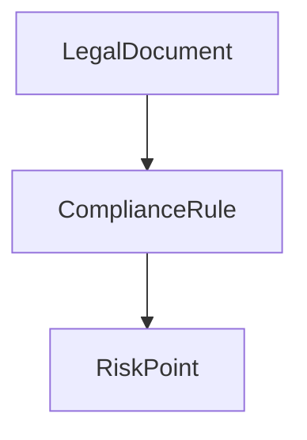
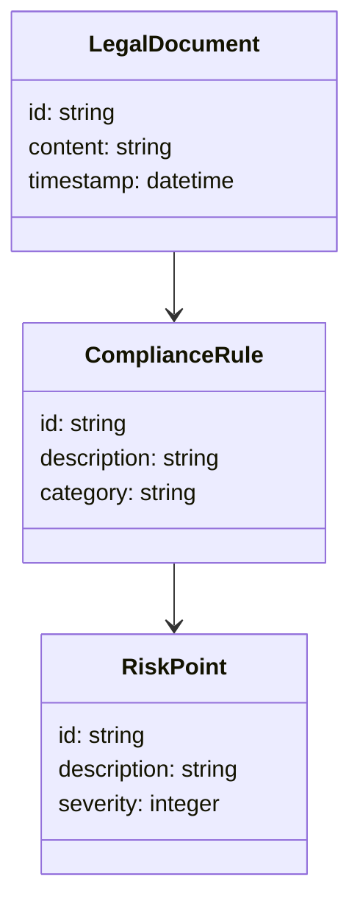
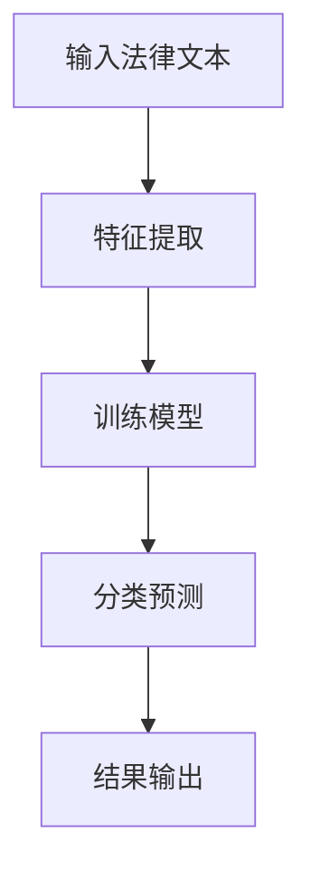

                 


# AI Agent在企业法律合规检查中的应用

> 关键词：AI Agent，企业合规，法律合规检查，自然语言处理，机器学习，合规系统架构

> 摘要：本文深入探讨了AI Agent在企业法律合规检查中的应用，分析了AI Agent的基本原理、法律合规检查的核心概念、算法原理、系统架构设计以及实际项目案例。文章从背景介绍、核心概念、技术实现、系统分析、项目实战等多个维度展开，结合具体的数学模型、流程图和代码示例，详细阐述了AI Agent在企业法律合规检查中的潜力和价值。最后，文章总结了AI Agent在该领域的应用前景，并提出了未来的发展方向。

---

# 第1章: AI Agent与企业法律合规检查的背景

## 1.1 AI Agent的基本概念与技术特点

### 1.1.1 AI Agent的定义与核心特征

AI Agent（人工智能代理）是一种能够感知环境、自主决策并执行任务的智能实体。它通常具备以下核心特征：

- **自主性**：AI Agent能够在没有外部干预的情况下独立运行。
- **反应性**：能够实时感知环境变化并做出响应。
- **学习能力**：通过数据和经验不断优化自身行为。
- **社交能力**：能够与其他AI Agent或人类进行交互和协作。

AI Agent的应用领域非常广泛，包括智能助手、自动驾驶、机器人控制、智能推荐等。在企业法律合规检查中，AI Agent可以通过自然语言处理（NLP）和机器学习（ML）技术，自动分析法律文本、识别合规风险并提出改进建议。

### 1.1.2 AI Agent在企业场景中的应用潜力

企业环境中，AI Agent可以通过以下方式提升法律合规检查的效率和准确性：

- **自动化文档审查**：AI Agent可以快速分析大量法律文档，识别潜在的合规风险。
- **实时监控与预警**：AI Agent可以实时监控企业行为，发现违规行为并立即预警。
- **个性化合规建议**：根据企业的具体业务场景，AI Agent可以提供定制化的合规建议。

### 1.1.3 法律合规检查的核心问题与挑战

传统法律合规检查主要依赖人工审查，存在以下问题：

- **效率低**：人工审查耗时长，成本高。
- **精准度低**：人为因素可能导致遗漏或误判。
- **可扩展性差**：难以应对大量、复杂的法律文档。

AI Agent的应用可以有效解决这些问题，通过自动化和智能化的方式提升合规检查的效率和准确性。

---

## 1.2 企业法律合规检查的现状与痛点

### 1.2.1 传统法律合规检查的流程与问题

传统法律合规检查的流程通常包括以下几个步骤：

1. **文档收集**：收集需要检查的法律文件。
2. **人工审查**：由法务人员逐一阅读并分析文档内容。
3. **风险识别**：识别文档中的合规风险。
4. **结果反馈**：将检查结果反馈给相关部门。

这种流程存在以下问题：

- **效率低**：人工审查耗时长，难以应对大量文档。
- **成本高**：需要大量法务人员参与，增加了企业的运营成本。
- **精准度有限**：由于人为因素，可能出现漏判或误判。

### 1.2.2 企业合规检查中的主要痛点

除了效率和成本问题，企业合规检查还面临以下痛点：

- **复杂性**：法律合规涉及多个领域，如合同法、劳动法、税法等，人工审查难以全面覆盖。
- **动态性**：法律法规不断变化，合规标准也在不断更新，人工审查难以及时适应。
- **一致性**：不同审查人员的判断可能存在差异，影响结果的一致性。

### 1.2.3 AI技术在合规检查中的应用前景

AI技术，尤其是AI Agent，为解决上述问题提供了新的可能性。通过自然语言处理和机器学习技术，AI Agent可以实现以下功能：

- **自动识别合规风险**：通过分析法律文档，快速识别潜在的合规风险。
- **实时监控**：实时跟踪企业的行为，发现违规行为并立即预警。
- **个性化建议**：根据企业的具体需求，提供定制化的合规建议。

---

## 1.3 AI Agent在法律合规检查中的应用价值

### 1.3.1 提高合规效率的潜力

AI Agent可以通过自动化的方式处理大量法律文档，显著提高合规检查的效率。例如，AI Agent可以快速扫描合同中的关键条款，识别潜在的法律风险。

### 1.3.2 降低合规成本的可能性

通过自动化和智能化的方式，AI Agent可以减少对人工审查的依赖，从而降低合规检查的成本。此外，AI Agent还可以通过学习和优化，不断提高审查的精准度，进一步降低错误率。

### 1.3.3 提升合规精准度的优势

AI Agent可以通过机器学习算法，从大量的法律文档中学习，识别潜在的合规风险。与人工审查相比，AI Agent的判断更加客观和精准。

---

## 1.4 本章小结

本章从AI Agent的基本概念和核心特征出发，分析了企业法律合规检查的现状和痛点。通过对比传统合规检查和AI Agent的应用，揭示了AI Agent在提升合规效率、降低成本和提高精准度方面的潜力。

---

# 第2章: AI Agent与法律合规检查的核心概念

## 2.1 AI Agent的基本原理

### 2.1.1 AI Agent的组成与工作流程

AI Agent通常由以下几个部分组成：

1. **感知模块**：负责感知环境中的信息，如法律文档内容。
2. **决策模块**：根据感知到的信息，做出合规判断。
3. **执行模块**：根据决策结果，执行相应的操作，如标记潜在风险。

AI Agent的工作流程可以分为以下几个步骤：

1. **输入法律文档**：AI Agent接收需要检查的法律文档。
2. **文档分析**：通过NLP技术，提取文档中的关键信息。
3. **合规判断**：基于预先设定的合规规则，判断文档是否合规。
4. **结果输出**：将判断结果反馈给用户。

### 2.1.2 AI Agent的核心算法与技术

AI Agent的核心算法包括：

- **自然语言处理（NLP）**：用于理解和分析法律文本。
- **机器学习（ML）**：用于训练分类器，识别合规风险。
- **规则引擎**：用于根据预设规则进行判断。

### 2.1.3 AI Agent的决策机制与学习能力

AI Agent的决策机制通常基于规则和机器学习模型的结合。规则引擎用于处理明确的合规规则，而机器学习模型则用于处理模糊或复杂的情况。

---

## 2.2 法律合规检查的系统模型

### 2.2.1 法律合规检查的流程分解

法律合规检查的流程可以分解为以下几个步骤：

1. **文档输入**：接收需要检查的法律文档。
2. **文档分析**：提取文档中的关键信息，如合同条款、法律条文。
3. **合规判断**：根据预设规则，判断文档是否合规。
4. **结果输出**：将判断结果反馈给用户。

### 2.2.2 合规检查中的关键要素与实体关系

合规检查中的关键要素包括：

- **法律文本**：需要检查的法律文档。
- **合规规则**：预设的合规标准。
- **风险点**：文档中可能存在的合规风险。

实体关系图如下：



### 2.2.3 合规检查的领域模型与数据结构

合规检查的领域模型可以表示为：



---

## 2.3 AI Agent与法律合规检查的结合点

### 2.3.1 AI Agent在合规规则匹配中的应用

AI Agent可以通过自然语言处理技术，将法律文档中的内容与预设的合规规则进行匹配，识别潜在的合规风险。

### 2.3.2 AI Agent在合规数据处理中的作用

AI Agent可以通过机器学习算法，对合规数据进行分类和聚类，帮助识别潜在的合规风险。

### 2.3.3 AI Agent在合规结果反馈中的价值

AI Agent可以将合规检查的结果以可视化的方式反馈给用户，帮助用户快速理解和处理问题。

---

## 2.4 本章小结

本章详细介绍了AI Agent的基本原理和法律合规检查的系统模型。通过分析AI Agent与法律合规检查的结合点，揭示了AI Agent在合规检查中的潜力和价值。

---

# 第3章: AI Agent在法律合规检查中的算法原理

## 3.1 自然语言处理在合规检查中的应用

### 3.1.1 NLP技术在法律文本分析中的作用

NLP技术可以用于法律文本的分词、词性标注、句法分析等，帮助提取文档中的关键信息。

### 3.1.2 基于NLP的合同审查与合规检测

通过NLP技术，AI Agent可以自动分析合同中的条款，识别潜在的合规风险。

### 3.1.3 NLP模型的训练与优化

NLP模型可以通过监督学习的方式进行训练，使用大量的法律文档作为训练数据，优化模型的性能。

---

## 3.2 机器学习在合规检查中的应用

### 3.2.1 机器学习在合规规则匹配中的应用

机器学习算法可以用于合规规则的匹配，通过训练分类器，识别文档中的合规风险。

### 3.2.2 基于监督学习的合规分类算法

常用的监督学习算法包括支持向量机（SVM）、随机森林（Random Forest）和神经网络（Neural Networks）。

### 3.2.3 无监督学习在异常检测中的应用

无监督学习算法，如聚类和异常检测算法，可以用于发现文档中的异常情况，识别潜在的合规风险。

---

## 3.3 算法实现与数学模型

### 3.3.1 合规分类的数学模型

以下是基于支持向量机（SVM）的合规分类模型：

$$ y = \text{sign}(w \cdot x + b) $$

其中，$w$ 是权重向量，$x$ 是输入向量，$b$ 是偏置项。

### 3.3.2 基于决策树的合规规则提取

决策树是一种常用的分类算法，可以通过训练数据生成规则，用于合规检查。

### 3.3.3 算法流程图

以下是合规分类算法的流程图：



---

## 3.4 本章小结

本章详细介绍了自然语言处理和机器学习在法律合规检查中的应用，分析了常用的算法和数学模型，揭示了AI Agent在合规检查中的技术实现细节。

---

# 第4章: AI Agent在法律合规检查中的系统分析与架构设计

## 4.1 系统分析与需求分析

### 4.1.1 问题场景介绍

企业需要对大量的法律文档进行合规检查，但由于人工审查效率低、成本高，难以应对复杂的合规需求。

### 4.1.2 项目介绍

本项目旨在开发一个基于AI Agent的企业法律合规检查系统，通过自动化和智能化的方式提升合规检查的效率和精准度。

### 4.1.3 系统功能设计

系统功能包括：

1. **文档上传**：用户上传需要检查的法律文档。
2. **文档分析**：AI Agent自动分析文档内容。
3. **合规判断**：系统根据预设规则判断文档是否合规。
4. **结果反馈**：系统将检查结果反馈给用户。

---

## 4.2 系统架构设计

### 4.2.1 系统架构图

以下是系统架构图：

```mermaid
graph TD
    User --> API Gateway
    API Gateway --> LawDocumentAnalyzer
    LawDocumentAnalyzer --> ComplianceRuleMatcher
    ComplianceRuleMatcher --> RiskPointIdentifier
    RiskPointIdentifier --> ResultGenerator
    ResultGenerator --> User
```

### 4.2.2 系统接口设计

系统主要接口包括：

1. **文档上传接口**：用户上传法律文档。
2. **文档分析接口**：AI Agent分析文档内容。
3. **合规判断接口**：系统判断文档是否合规。
4. **结果反馈接口**：系统将检查结果反馈给用户。

---

## 4.3 系统交互设计

### 4.3.1 系统交互流程图

以下是系统交互流程图：

```mermaid
graph TD
    User --> API Gateway
    API Gateway --> LawDocumentAnalyzer
    LawDocumentAnalyzer --> ComplianceRuleMatcher
    ComplianceRuleMatcher --> RiskPointIdentifier
    RiskPointIdentifier --> ResultGenerator
    ResultGenerator --> User
```

### 4.3.2 系统功能模块

系统功能模块包括：

1. **文档上传模块**：负责接收用户上传的法律文档。
2. **文档分析模块**：负责分析文档内容，提取关键信息。
3. **合规判断模块**：负责根据预设规则判断文档是否合规。
4. **结果反馈模块**：负责将检查结果反馈给用户。

---

## 4.4 本章小结

本章详细分析了AI Agent在法律合规检查中的系统架构设计，包括功能设计、接口设计和交互设计。通过系统架构图和流程图，揭示了系统的整体结构和工作流程。

---

# 第5章: AI Agent在法律合规检查中的项目实战

## 5.1 项目环境与工具安装

### 5.1.1 开发环境

- **操作系统**：Windows 10/Ubuntu 20.04
- **编程语言**：Python 3.8+
- **开发工具**：PyCharm
- **依赖管理**：pipenv

### 5.1.2 安装依赖

以下是一些常用的依赖库：

```bash
pip install numpy
pip install scikit-learn
pip install spacy
pip install transformers
```

---

## 5.2 系统核心实现

### 5.2.1 文档分析模块实现

以下是文档分析模块的实现代码：

```python
import spacy

nlp = spacy.load("en_core_web_sm")

def analyze_document(text):
    doc = nlp(text)
    entities = [ent.text for ent in doc.ents]
    return entities
```

### 5.2.2 合规判断模块实现

以下是合规判断模块的实现代码：

```python
from sklearn.svm import SVC
from sklearn.feature_extraction.text import TfidfVectorizer

vectorizer = TfidfVectorizer()
model = SVC()

def train_model(X, y):
    vectorizer.fit(X)
    X_vec = vectorizer.transform(X)
    model.fit(X_vec, y)

def predict(X):
    X_vec = vectorizer.transform(X)
    return model.predict(X_vec)
```

### 5.2.3 结果反馈模块实现

以下是结果反馈模块的实现代码：

```python
def generate_report(results):
    report = []
    for result in results:
        if result == 1:
            report.append("合规")
        else:
            report.append("不合规")
    return report
```

---

## 5.3 项目小结

本章通过具体的代码实现，展示了AI Agent在法律合规检查中的实际应用。通过文档分析、合规判断和结果反馈三个模块的实现，揭示了系统的核心功能和实现细节。

---

# 第6章: 总结与展望

## 6.1 本章总结

本文深入探讨了AI Agent在企业法律合规检查中的应用，分析了AI Agent的基本原理、法律合规检查的核心概念、算法原理、系统架构设计以及实际项目案例。通过结合自然语言处理和机器学习技术，AI Agent可以显著提升合规检查的效率和精准度。

---

## 6.2 未来展望

未来，随着AI技术的不断发展，AI Agent在企业法律合规检查中的应用将更加广泛和深入。以下是未来可能的发展方向：

- **智能化升级**：通过深度学习技术，进一步提升AI Agent的智能化水平。
- **多语言支持**：支持多种语言的法律文档分析，扩大应用范围。
- **实时监控**：实现对企业行为的实时监控，发现违规行为并立即预警。

---

# 作者：AI天才研究院/AI Genius Institute & 禅与计算机程序设计艺术 /Zen And The Art of Computer Programming

