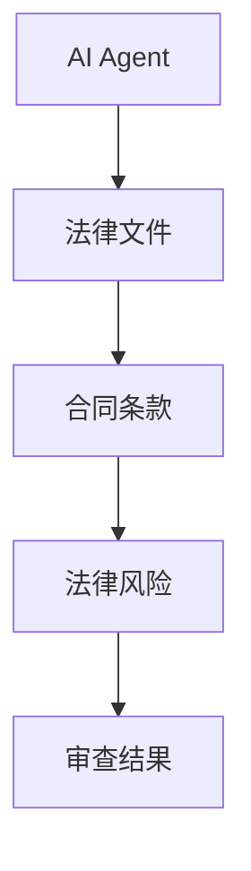
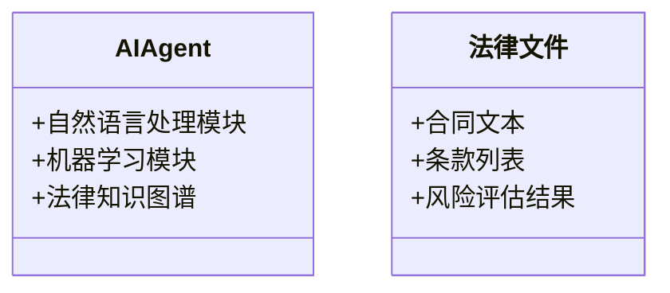
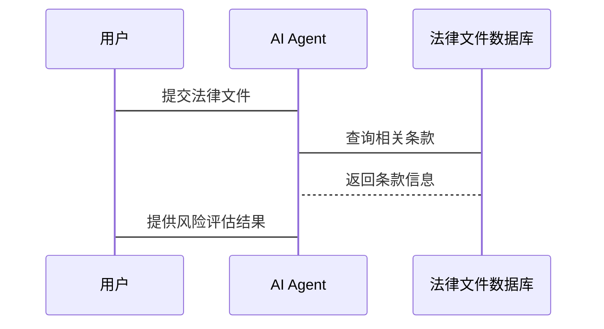

                 


```markdown
# AI Agent在企业法律文件审查与风险识别中的自动化应用

## 关键词：AI Agent, 法律文件审查, 风险识别, 自然语言处理, 机器学习, 知识图谱

## 摘要：本文系统地探讨了AI Agent在企业法律文件审查与风险识别中的自动化应用。通过分析AI Agent的核心技术原理，结合法律文件审查的具体需求，提出了基于NLP、机器学习和知识图谱的解决方案。文章详细介绍了算法实现、系统架构设计及实际案例，展示了AI Agent在提升企业法务效率和降低风险中的巨大潜力。

---

## 第一部分: AI Agent与企业法律文件审查基础

### 第1章: AI Agent与企业法律文件审查概述

#### 1.1 AI Agent的基本概念
##### 1.1.1 AI Agent的定义与特点
人工智能代理（AI Agent）是指能够感知环境并采取行动以实现目标的智能实体。AI Agent具有自主性、反应性、主动性、社会性和社会性五大特点。

##### 1.1.2 AI Agent在企业中的应用领域
AI Agent广泛应用于企业自动化、智能客服、智能监控等领域。在企业法律文件审查中，AI Agent能够帮助快速分析合同条款、识别法律风险。

##### 1.1.3 企业法律文件审查的核心流程
企业法律文件审查通常包括文本预处理、合同条款识别、法律风险评估和审查结果输出四个核心流程。

#### 1.2 企业法律文件审查的背景与挑战
##### 1.2.1 传统法律文件审查的痛点
传统法律文件审查依赖人工操作，效率低、成本高且容易出错。

##### 1.2.2 数字化转型对企业法务的需求
随着企业数字化转型的推进，对高效、智能的法律文件审查系统的需求日益迫切。

##### 1.2.3 AI技术在法律文件审查中的潜力
AI技术可以通过自动化处理大量法律文本，显著提升审查效率和准确性。

#### 1.3 AI Agent在法律文件审查中的应用前景
##### 1.3.1 AI Agent与法律文件审查的结合点
AI Agent可以通过自然语言处理（NLP）技术，实现对法律文本的理解和分析。

##### 1.3.2 企业法务效率提升的可能性
AI Agent能够帮助法务人员快速识别合同中的关键条款和潜在风险，减少人为疏漏。

##### 1.3.3 未来发展趋势与挑战
未来，AI Agent在法律文件审查中的应用将更加智能化和个性化，但数据隐私和模型解释性等问题仍需进一步解决。

#### 1.4 本章小结
本章介绍了AI Agent的基本概念，分析了企业法律文件审查的背景与挑战，并探讨了AI Agent在其中的应用前景。

---

## 第二部分: AI Agent技术原理与法律文件审查结合的核心概念

### 第2章: AI Agent的核心技术原理

#### 2.1 自然语言处理（NLP）技术
##### 2.1.1 NLP的基本原理
自然语言处理（NLP）是研究计算机如何理解和生成人类语言的科学。它包括分词、实体识别、情感分析等关键技术。

##### 2.1.2 常见NLP模型及其特点
常用的NLP模型包括基于规则的模型和统计模型。深度学习模型（如BERT）在法律文本处理中表现出色。

##### 2.1.3 NLP在法律文本处理中的应用
在法律文本处理中，NLP技术可用于合同条款识别、风险评估等任务。

#### 2.2 机器学习与深度学习
##### 2.2.1 机器学习的基本概念
机器学习是一种通过数据训练模型，使其能够从经验中学习并进行预测的技术。

##### 2.2.2 深度学习在法律文本分析中的优势
深度学习模型能够自动提取法律文本中的深层语义信息，显著提升文本分析的准确率。

##### 2.2.3 常见法律文本分析模型
常用的法律文本分析模型包括RNN、LSTM和Transformer等。

#### 2.3 法律知识图谱构建
##### 2.3.1 知识图谱的基本概念
知识图谱是一种以图结构形式表示知识的工具，能够将分散的知识点连接起来。

##### 2.3.2 法律知识图谱的构建方法
法律知识图谱可以通过文本挖掘、信息抽取和知识融合等步骤构建。

##### 2.3.3 法律知识图谱在AI Agent中的应用
法律知识图谱可以为AI Agent提供丰富的法律知识库，支持其进行法律推理和风险评估。

#### 2.4 本章小结
本章详细介绍了AI Agent的核心技术原理，包括NLP、机器学习和法律知识图谱等关键技术。

### 第3章: AI Agent与法律文件审查的核心概念联系

#### 3.1 AI Agent在法律文件审查中的核心功能
##### 3.1.1 文本理解与信息提取
AI Agent通过NLP技术对法律文本进行理解，并提取关键信息。

##### 3.1.2 风险识别与预警
AI Agent能够识别合同中的潜在法律风险，并提供预警。

##### 3.1.3 自动化审查与反馈
AI Agent可以自动化完成法律文件的审查，并提供反馈建议。

#### 3.2 法律文件审查的核心要素分析
##### 3.2.1 合同条款识别
AI Agent需要识别合同中的关键条款，如违约责任、知识产权等。

##### 3.2.2 法律风险评估
通过对合同条款的分析，AI Agent能够评估潜在的法律风险。

##### 3.2.3 审查结果的可解释性
审查结果需要具备可解释性，以便法务人员进行最终决策。

#### 3.3 AI Agent与法律文件审查的实体关系图



#### 3.4 本章小结
本章探讨了AI Agent在法律文件审查中的核心功能，分析了法律文件审查的核心要素，并通过实体关系图展示了AI Agent与法律文件审查之间的联系。

---

## 第三部分: AI Agent在法律文件审查中的算法原理与实现

### 第4章: 基于NLP的法律文本处理算法

#### 4.1 分词与实体识别
##### 4.1.1 分词算法原理
分词算法通过将连续的文本分割成词语或短语，为后续分析提供基础。

##### 4.1.2 实体识别的实现流程
实体识别需要对文本中的实体进行定位和分类，常用的方法包括基于规则的识别和深度学习模型。

#### 4.2 基于深度学习的合同条款识别
##### 4.2.1 深度学习模型的选择
在法律文本处理中，Transformer模型（如BERT）表现出色。

##### 4.2.2 合同条款识别的实现流程
合同条款识别包括文本预处理、模型训练和结果预测三个步骤。

#### 4.3 风险识别算法
##### 4.3.1 风险识别的数学模型
风险识别可以通过分类算法实现，常用的是支持向量机（SVM）和随机森林（Random Forest）。

##### 4.3.2 风险评估指标
风险评估指标包括准确率、召回率和F1值等。

#### 4.4 本章小结
本章详细介绍了基于NLP的法律文本处理算法，包括分词、实体识别和风险识别等关键技术。

### 第5章: 机器学习算法在法律文本分析中的应用

#### 5.1 机器学习算法的选择
##### 5.1.1 常见机器学习算法
常用的机器学习算法包括支持向量机（SVM）、决策树和随机森林等。

#### 5.2 基于机器学习的法律风险预测
##### 5.2.1 数据预处理
数据预处理包括数据清洗、特征提取和数据标准化等步骤。

##### 5.2.2 模型训练与优化
模型训练需要选择合适的特征和优化参数，以提升模型的准确率。

##### 5.2.3 模型评估
模型评估包括训练集评估和测试集评估，常用指标包括准确率、召回率和F1值等。

#### 5.3 本章小结
本章探讨了机器学习算法在法律文本分析中的应用，重点介绍了法律风险预测的实现流程。

---

## 第四部分: AI Agent的系统架构设计与实现

### 第6章: AI Agent的系统架构设计

#### 6.1 问题场景介绍
AI Agent需要处理大量的法律文件，包括合同审查、风险评估和结果反馈等任务。

#### 6.2 系统功能设计
##### 6.2.1 领域模型设计



##### 6.2.2 系统架构设计


##### 6.2.3 系统接口设计
系统接口包括文本输入接口、结果输出接口和用户交互接口。

##### 6.2.4 系统交互流程



#### 6.3 本章小结
本章详细介绍了AI Agent的系统架构设计，包括功能设计、架构图和交互流程图等。

---

## 第五部分: AI Agent的项目实战与案例分析

### 第7章: AI Agent的项目实战

#### 7.1 环境安装
##### 7.1.1 开发环境搭建
需要安装Python、TensorFlow、Keras等开发工具。

##### 7.1.2 数据集准备
需要收集和整理法律文本数据集，进行文本清洗和标注。

#### 7.2 核心代码实现
##### 7.2.1 文本分词代码
```python
import jieba
text = "中华人民共和国合同法"
words = jieba.lcut(text)
print(words)
```

##### 7.2.2 实体识别代码
```python
from flair.models import SequenceTagger
from flair.data import Sentence
tagger = SequenceTagger.load('pos')
sentence = Sentence("中华人民共和国合同法")
tagger.predict(sentence)
print(sentence.get_tags())
```

##### 7.2.3 风险识别代码
```python
from sklearn.svm import SVC
from sklearn.metrics import accuracy_score
# 训练数据
X_train = ...
y_train = ...
# 模型训练
model = SVC()
model.fit(X_train, y_train)
# 模型预测
X_test = ...
y_pred = model.predict(X_test)
print(accuracy_score(y_test, y_pred))
```

#### 7.3 项目小结
本章通过实际案例展示了AI Agent的项目实现过程，包括环境搭建、数据处理和核心代码实现等。

---

## 第六部分: 最佳实践与小结

### 第8章: 最佳实践与注意事项

#### 8.1 最佳实践
##### 8.1.1 数据质量管理
确保数据的准确性和完整性，避免数据偏差。

##### 8.1.2 模型优化
通过交叉验证和超参数调优，提升模型的性能。

##### 8.1.3 可解释性设计
确保AI Agent的决策过程具备可解释性，便于法务人员理解和信任。

#### 8.2 小结
本文系统地探讨了AI Agent在企业法律文件审查与风险识别中的应用，从技术原理到系统架构，再到项目实战，提供了全面的解决方案。

### 第9章: 未来展望与拓展阅读

#### 9.1 未来发展趋势
##### 9.1.1 AI Agent的智能化提升
未来，AI Agent将更加智能化，能够处理更复杂的法律文本分析任务。

##### 9.1.2 多模态技术的应用
多模态技术将增强AI Agent的感知能力，提升其在法律文本分析中的表现。

#### 9.2 拓展阅读
推荐读者进一步阅读《深度学习入门》、《自然语言处理实战》等相关书籍，深入了解AI Agent的核心技术。

---

## 作者：AI天才研究院/AI Genius Institute & 禅与计算机程序设计艺术 /Zen And The Art of Computer Programming
```

