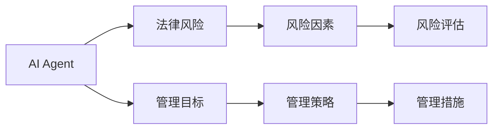
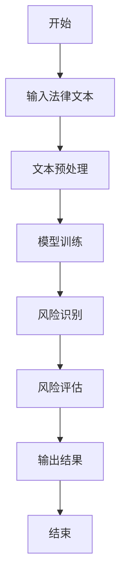
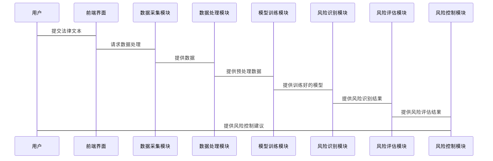

                 


# AI Agent在企业法律风险管理中的应用

## 关键词
AI Agent, 企业法律风险管理, 人工智能, 算法原理, 系统架构, 项目实战

## 摘要
本文探讨了AI Agent在企业法律风险管理中的应用，详细介绍了AI Agent的核心概念、算法原理、系统架构及其实战应用。通过分析企业法律风险管理的传统模式和痛点，阐述了AI Agent如何利用其智能特性解决这些问题，并通过实际案例展示了其在风险识别、评估和管理中的优势。

---

# 第一部分: AI Agent与企业法律风险管理概述

## 第1章: AI Agent与企业法律风险管理概述

### 1.1 问题背景与描述

#### 1.1.1 企业法律风险管理的传统模式
企业法律风险管理 traditionally relies on manual review and expert judgment. Traditional methods include:

- Legal compliance checks
- Risk assessment based on historical data
- Manual document analysis

#### 1.1.2 当前法律风险管理的痛点与挑战
Current challenges include:

- High costs due to manual processes
- Time-consuming and error-prone
- Inability to handle large volumes of data
- Lack of real-time insights

#### 1.1.3 AI Agent在法律风险管理中的应用价值
AI Agent offers the following advantages:

- Automates repetitive tasks
- Provides real-time insights
- Enhances decision-making accuracy
- Reduces costs and improves efficiency

### 1.2 AI Agent的核心概念与定义

#### 1.2.1 AI Agent的基本定义
An AI Agent is a software entity that performs tasks on behalf of a user, using AI techniques to perceive its environment and take actions to achieve specific goals.

#### 1.2.2 法律风险管理中的AI Agent特点
Key characteristics of AI Agent in legal risk management:

- **Data-driven decision-making**: Uses historical and real-time data to identify patterns and predict risks.
- **Automation**: Streamlines repetitive tasks such as contract review and compliance checks.
- **Adaptability**: learns from new data to improve its performance over time.

#### 1.2.3 AI Agent与传统法律风险管理工具的对比
Comparison of traditional tools vs. AI Agent:

| 特性                | 传统工具                  | AI Agent                     |
|---------------------|--------------------------|-----------------------------|
| 数据处理能力        | 有限，依赖手动输入        | 强大，支持大数据分析         |
| 决策能力            | 基于规则，缺乏灵活性      | 基于机器学习，具有自适应性   |
| 处理速度            | 较慢，依赖人工操作        | 快速，自动化处理             |
| 成本                | 较高                     | 较低，长期来看性价比更高     |

### 1.3 问题解决与边界

#### 1.3.1 AI Agent如何解决法律风险管理问题
AI Agent通过以下方式解决法律风险管理问题：

1. **自动化合同审查**: 使用NLP技术快速分析合同条款，识别潜在风险。
2. **实时风险监控**: 监控市场动态，预测潜在法律风险。
3. **合规性检查**: 自动检查企业行为是否符合相关法律法规。

#### 1.3.2 AI Agent的应用边界与外延
AI Agent的应用边界包括：

- **数据隐私**: 需确保数据处理过程中的隐私保护。
- **法律复杂性**: 对于高度复杂的法律问题，AI Agent可能需要结合人类专家的意见。
- **行业特定性**: 不同行业可能需要定制化的解决方案。

#### 1.3.3 核心概念与关键要素的结构化分析

| 核心概念      | 描述                     |
|---------------|--------------------------|
| AI Agent      | 智能代理，用于执行特定任务 |
| 法律风险管理  | 识别、评估和管理法律风险  |
| 数据源        | 合同、法规、市场数据等    |
| 输出结果      | 风险评估、管理建议等      |

---

## 第2章: AI Agent与法律风险管理的核心概念联系

### 2.1 核心概念原理

#### 2.1.1 AI Agent的基本原理
AI Agent的工作原理包括以下几个步骤：

1. **感知环境**: 通过传感器或数据输入接口获取环境信息。
2. **分析数据**: 使用机器学习模型对数据进行分析和处理。
3. **制定策略**: 根据分析结果制定行动策略。
4. **执行任务**: 根据策略执行具体任务。
5. **反馈优化**: 根据执行结果优化模型。

#### 2.1.2 法律风险管理的原理
法律风险管理的基本原理包括：

1. **风险识别**: 识别潜在的法律风险。
2. **风险评估**: 评估风险的严重性和可能性。
3. **风险控制**: 制定和实施风险控制措施。
4. **风险监控**: 监控风险的变化并及时调整策略。

#### 2.1.3 AI Agent在法律风险管理中的作用机制
AI Agent通过以下机制在法律风险管理中发挥作用：

1. **数据收集**: 收集与法律相关的数据，如合同、法规、市场动态等。
2. **数据分析**: 使用NLP和机器学习技术分析数据，识别潜在风险。
3. **风险评估**: 根据分析结果评估风险的严重性和可能性。
4. **风险控制**: 提供风险控制建议，帮助企业在法律框架内运作。

### 2.2 核心概念属性特征对比

#### 2.2.1 AI Agent与传统法律风险管理工具的对比
| 特性                | AI Agent                     | 传统工具                   |
|---------------------|-----------------------------|---------------------------|
| 技术基础            | 机器学习、NLP                | 规则引擎、手动操作         |
| 处理能力            | 强大，支持复杂场景           | 较弱，适用于简单场景         |
| 学习能力            | 具备学习能力，能够优化模型    | 无学习能力，依赖预定义规则   |
| 适应性              | 高度适应性，能够应对变化     | 适应性较低，需要手动调整     |

#### 2.2.2 不同AI Agent模型的特征对比
| 模型类型            | 监督学习                  | 非监督学习                |
|---------------------|--------------------------|---------------------------|
| 数据需求            | 需要标注数据              | 无需标注数据               |
| 适用场景            | 适用于有监督的任务        | 适用于无监督的任务          |
| 输出结果            | 预测结果、分类结果         | 聚类结果、主题分析           |

#### 2.2.3 法律风险管理中的关键属性分析
| 属性                | 描述                     |
|---------------------|--------------------------|
| 数据源              | 合同、法规、市场数据等    |
| 风险类型            | 合同风险、合规风险、市场风险等 |
| 风险评估方法        | 风险矩阵、概率-影响矩阵等  |
| 风险控制措施        | 风险规避、减轻、转移、接受等 |

### 2.3 ER实体关系图



---

## 第3章: AI Agent在法律风险管理中的算法原理

### 3.1 算法原理概述

#### 3.1.1 AI Agent的基本算法流程
1. **数据预处理**: 清洗和标准化数据。
2. **模型训练**: 使用机器学习算法训练模型。
3. **风险识别**: 使用训练好的模型识别潜在风险。
4. **风险评估**: 根据识别结果评估风险的严重性。
5. **风险控制**: 提供风险控制建议。

#### 3.1.2 法律风险管理中的算法选择
常用算法包括：

- **监督学习**: 用于分类和预测任务。
- **无监督学习**: 用于聚类和主题分析。
- **NLP技术**: 用于文本分析和情感计算。

#### 3.1.3 算法的输入与输出
- **输入**: 法律文本、市场数据、历史数据。
- **输出**: 风险评估结果、风险控制建议。

### 3.2 算法流程图



### 3.3 Python核心代码实现

#### 3.3.1 数据预处理

```python
import pandas as pd
import numpy as np

def preprocess_text(text):
    # 分词
    words = text.split()
    # 去除停用词
    stop_words = set(["the", "is", "and", "to", "a", "in"])
    filtered_words = [word for word in words if word not in stop_words]
    return filtered_words
```

#### 3.3.2 模型训练

```python
from sklearn.feature_extraction.text import TfidfVectorizer
from sklearn.svm import SVC

def train_model(X, y):
    vectorizer = TfidfVectorizer()
    X_vec = vectorizer.fit_transform(X)
    model = SVC()
    model.fit(X_vec, y)
    return model, vectorizer
```

#### 3.3.3 风险识别

```python
def identify_risks(model, vectorizer, new_text):
    X_new = vectorizer.transform([new_text])
    risk = model.predict(X_new)
    return risk
```

### 3.4 算法的数学模型和公式

#### 3.4.1 朴素贝叶斯分类器
概率公式：
$$ P(y|X) = \frac{P(X|y)P(y)}{P(X)} $$

#### 3.4.2 支持向量机
目标函数：
$$ \text{minimize } \frac{1}{2} \|w\|^2 + C \sum_{i=1}^n \xi_i $$
约束条件：
$$ y_i(w \cdot x_i + b) \geq 1 - \xi_i $$
$$ \xi_i \geq 0 $$

---

## 第4章: 系统分析与架构设计

### 4.1 系统分析

#### 4.1.1 项目介绍
本项目旨在开发一个基于AI Agent的企业法律风险管理系统，帮助企业在复杂多变的法律环境中降低风险。

#### 4.1.2 系统功能设计

| 功能模块      | 描述                     |
|---------------|--------------------------|
| 数据采集      | 从多种来源收集法律相关数据 |
| 数据处理      | 清洗和预处理数据           |
| 模型训练      | 使用机器学习模型训练数据   |
| 风险识别      | 识别潜在的法律风险         |
| 风险评估      | 评估风险的严重性和可能性   |
| 风险控制      | 提供风险控制建议           |

#### 4.1.3 系统架构设计


#### 4.1.4 系统接口设计
- **输入接口**: 法律文本、市场数据。
- **输出接口**: 风险评估结果、风险控制建议。

#### 4.1.5 系统交互流程



### 4.2 项目实战

#### 4.2.1 环境安装
安装所需环境：

```bash
pip install numpy pandas scikit-learn
```

#### 4.2.2 系统核心实现源代码

```python
import numpy as np
import pandas as pd
from sklearn.feature_extraction.text import TfidfVectorizer
from sklearn.svm import SVC

def preprocess_data(data):
    X = data['text']
    y = data['label']
    return X, y

def train_model(X, y):
    vectorizer = TfidfVectorizer()
    X_vec = vectorizer.fit_transform(X)
    model = SVC()
    model.fit(X_vec, y)
    return model, vectorizer

def predict_risk(model, vectorizer, new_text):
    X_new = vectorizer.transform([new_text])
    risk = model.predict(X_new)
    return risk

if __name__ == "__main__":
    data = pd.read_csv('risk_data.csv')
    X, y = preprocess_data(data)
    model, vectorizer = train_model(X, y)
    new_text = "contract breach"
    risk = predict_risk(model, vectorizer, new_text)
    print(risk)
```

#### 4.2.3 实际案例分析
案例分析：假设一家公司面临合同违约的风险，AI Agent通过分析历史数据和市场动态，识别出潜在的违约风险，并提供风险控制建议。

---

## 第5章: 最佳实践、小结、注意事项与拓展阅读

### 5.1 最佳实践
- **数据质量**: 确保数据的准确性和完整性。
- **模型优化**: 定期更新模型，确保其适应性。
- **隐私保护**: 注意数据隐私和合规性。

### 5.2 小结
本文详细介绍了AI Agent在企业法律风险管理中的应用，从核心概念到算法实现，再到系统设计和项目实战，为读者提供了全面的指导。

### 5.3 注意事项
- **数据隐私**: 在处理数据时，需遵守相关法律法规。
- **模型解释性**: 确保模型的可解释性，便于调整和优化。
- **团队协作**: 法律专家和IT团队需要紧密合作。

### 5.4 拓展阅读
- **书籍**:《Machine Learning for Law: AI and Legal Reasoning》
- **论文**: "AI in Legal Risk Management: A Comprehensive Review"
- **工具**: "Legal Risk Management with AI Agent"

---

# 结语
AI Agent在企业法律风险管理中的应用前景广阔，随着技术的不断进步，AI Agent将为企业提供更高效、更智能的法律风险管理解决方案。

---

# 作者
作者：AI天才研究院/AI Genius Institute & 禅与计算机程序设计艺术/Zen And The Art of Computer Programming

