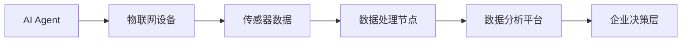
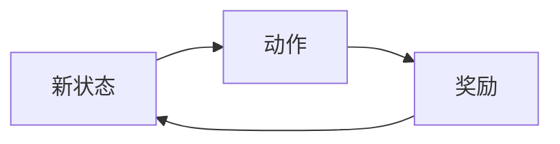
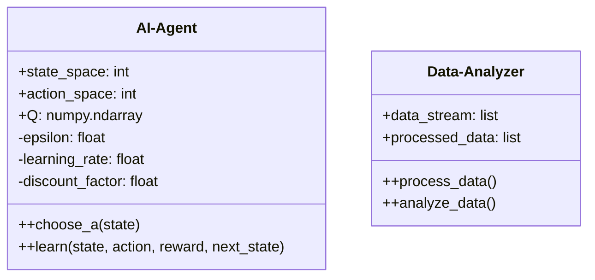
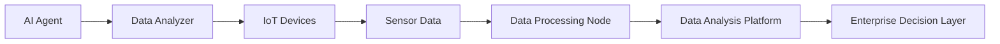
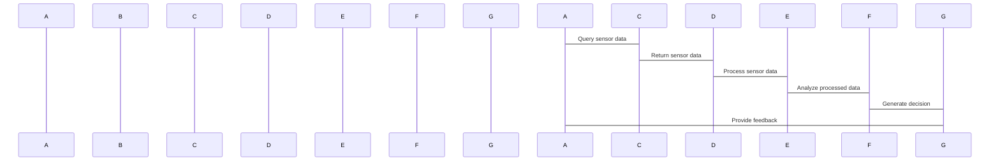

                 


# AI Agent在企业物联网数据分析中的应用前景

> 关键词：AI Agent，物联网，数据分析，机器学习，实时监控

> 摘要：随着物联网技术的快速发展，企业物联网数据分析的重要性日益凸显。AI Agent作为人工智能的核心技术之一，能够通过自主学习和决策，显著提升物联网数据的处理效率和准确性。本文从AI Agent的基本概念出发，结合物联网数据分析的特点，深入探讨了AI Agent在企业物联网中的应用前景，详细分析了其实现原理、算法模型以及实际应用场景，并展望了未来的发展方向。

---

# 第一部分: AI Agent与企业物联网数据分析的背景与概念

# 第1章: AI Agent与物联网数据分析概述

## 1.1 AI Agent的基本概念

### 1.1.1 AI Agent的定义与特点

AI Agent（人工智能代理）是指具有感知环境、自主决策和执行任务能力的智能实体。其核心特点包括：

- **自主性**：能够自主决策，无需外部干预。
- **反应性**：能够实时感知环境变化并做出响应。
- **学习能力**：通过数据和经验不断优化自身的决策能力。
- **社交能力**：能够与其他系统或人类进行交互和协作。

### 1.1.2 AI Agent的核心功能与应用场景

AI Agent的核心功能包括：

- **数据采集与处理**：实时采集物联网设备产生的数据，并进行清洗和预处理。
- **知识表示与推理**：通过知识表示技术，构建领域知识模型，并进行推理和决策。
- **行为决策**：基于当前环境状态和历史数据，选择最优行为策略。

AI Agent的应用场景包括智能制造、智能交通、智能医疗等领域。

### 1.1.3 物联网数据分析的基本原理

物联网数据分析的基本原理包括数据采集、数据处理、数据分析和数据可视化四个阶段。通过分析物联网设备产生的海量数据，可以帮助企业优化运营流程、提升决策效率。

---

## 1.2 AI Agent与物联网数据分析的结合

### 1.2.1 物联网在企业中的应用现状

物联网技术在企业中的应用主要集中在以下几个方面：

- **设备监控与维护**：通过实时监控设备状态，预测设备故障，减少停机时间。
- **生产优化**：通过分析生产过程中的数据，优化生产流程，提高效率。
- **供应链管理**：通过实时跟踪物流信息，优化供应链管理。

### 1.2.2 数据分析在企业决策中的作用

数据分析在企业决策中的作用包括：

- **数据驱动的决策支持**：通过数据分析，为企业决策提供数据支持。
- **预测性分析**：通过预测模型，帮助企业预测未来趋势，制定前瞻性策略。
- **实时监控与响应**：通过实时数据分析，帮助企业快速响应市场变化。

### 1.2.3 AI Agent在物联网数据分析中的独特价值

AI Agent在物联网数据分析中的独特价值包括：

- **自主学习能力**：能够通过自我学习不断优化数据分析模型。
- **实时决策能力**：能够在复杂环境下快速做出决策。
- **多任务处理能力**：能够同时处理多个任务，提升数据分析效率。

---

## 1.3 本章小结

本章从AI Agent的基本概念出发，详细介绍了AI Agent的核心功能与应用场景，并结合物联网数据分析的基本原理，探讨了AI Agent在企业物联网中的独特价值。

---

# 第2章: AI Agent在企业物联网中的核心概念与联系

## 2.1 AI Agent的核心原理

### 2.1.1 知识表示与推理

知识表示是AI Agent实现智能决策的基础。通过构建知识图谱，AI Agent能够理解数据之间的关系，并进行推理和决策。

### 2.1.2 行为决策机制

AI Agent的行为决策机制包括感知环境、构建决策模型和执行决策三个步骤。通过强化学习算法，AI Agent能够在复杂环境中做出最优决策。

### 2.1.3 自适应学习能力

AI Agent的自适应学习能力是其核心优势之一。通过在线学习算法，AI Agent能够根据新的数据不断优化自身的决策模型。

---

## 2.2 物联网数据的特征与挑战

### 2.2.1 数据量大、类型多样

物联网设备产生的数据量大、类型多样，包括结构化数据和非结构化数据。这给数据处理和分析带来了挑战。

### 2.2.2 数据实时性与安全性要求

物联网数据的实时性要求较高，需要快速处理和响应。同时，数据安全性也是物联网数据分析中的重要挑战。

### 2.2.3 数据清洗与预处理的复杂性

物联网数据中可能存在噪声和异常值，数据清洗和预处理的复杂性较高。

---

## 2.3 AI Agent与物联网数据的实体关系图



---

## 2.4 本章小结

本章详细介绍了AI Agent的核心原理，并结合物联网数据的特征与挑战，探讨了AI Agent在企业物联网中的核心概念与联系。

---

# 第3章: AI Agent在物联网数据分析中的算法原理

## 3.1 基于强化学习的AI Agent算法

### 3.1.1 强化学习的基本概念

强化学习是一种通过试错机制来优化决策模型的机器学习方法。其核心是通过与环境的交互，学习最优策略。

### 3.1.2 Q-learning算法的实现



Q-learning算法的实现步骤如下：

1. 初始化Q值表。
2. 与环境交互，获取状态和奖励。
3. 更新Q值表。
4. 重复步骤2和3，直到收敛。

### 3.1.3 Q-learning算法的数学模型

$$ Q(s, a) = Q(s, a) + \alpha (r + \gamma \max Q(s', a') - Q(s, a)) $$

其中：
- \( Q(s, a) \) 表示状态 \( s \) 下采取动作 \( a \) 的Q值。
- \( \alpha \) 是学习率。
- \( r \) 是奖励。
- \( \gamma \) 是折扣因子。
- \( \max Q(s', a') \) 是下一个状态 \( s' \) 下的最大Q值。

---

## 3.2 算法实现的Python代码示例

```python
import numpy as np

class AI-Agent:
    def __init__(self, state_space, action_space):
        self.state_space = state_space
        self.action_space = action_space
        self.Q = np.zeros((state_space, action_space))
    
    def choose_a(self, state):
        if np.random.rand() < 0.1:
            return np.random.randint(self.action_space)
        else:
            return np.argmax(self.Q[state])
    
    def learn(self, state, action, reward, next_state):
        self.Q[state, action] = self.Q[state, action] + 0.1 * (reward + 0.9 * np.max(self.Q[next_state]) - self.Q[state, action])
```

---

## 3.3 本章小结

本章详细介绍了基于强化学习的AI Agent算法，包括Q-learning算法的实现和数学模型，并通过Python代码示例进行了具体阐述。

---

# 第4章: 系统分析与架构设计方案

## 4.1 问题场景介绍

在企业物联网数据分析中，AI Agent需要实时处理海量数据，并根据数据变化做出决策。系统需要具备高可用性和可扩展性。

---

## 4.2 项目介绍

本项目旨在设计一个基于AI Agent的企业物联网数据分析系统，实现对物联网设备的实时监控和智能决策。

---

## 4.3 系统功能设计

### 4.3.1 领域模型设计



---

### 4.3.2 系统架构设计



---

### 4.3.3 系统接口设计

系统接口设计包括：

- 数据采集接口：用于采集物联网设备的数据。
- 数据处理接口：用于处理和清洗数据。
- 数据分析接口：用于分析数据并生成决策建议。

---

### 4.3.4 系统交互流程



---

## 4.4 本章小结

本章详细介绍了基于AI Agent的企业物联网数据分析系统的功能设计、架构设计和交互流程。

---

# 第5章: 项目实战

## 5.1 环境搭建

### 5.1.1 安装Python环境

需要安装Python 3.8及以上版本，并安装必要的库，如numpy、scikit-learn等。

### 5.1.2 安装物联网设备模拟工具

可以选择使用Raspberry Pi或其他物联网设备模拟工具。

---

## 5.2 系统核心实现

### 5.2.1 AI Agent实现

```python
class AI-Agent:
    def __init__(self, state_space, action_space):
        self.state_space = state_space
        self.action_space = action_space
        self.Q = np.zeros((state_space, action_space))
    
    def choose_a(self, state):
        if np.random.rand() < 0.1:
            return np.random.randint(self.action_space)
        else:
            return np.argmax(self.Q[state])
    
    def learn(self, state, action, reward, next_state):
        self.Q[state, action] = self.Q[state, action] + 0.1 * (reward + 0.9 * np.max(self.Q[next_state]) - self.Q[state, action])
```

### 5.2.2 数据分析实现

```python
class DataAnalyzer:
    def __init__(self):
        self.data_stream = []
    
    def process_data(self):
        # 数据预处理
        pass
    
    def analyze_data(self):
        # 数据分析
        pass
```

---

## 5.3 案例分析与详细解读

### 5.3.1 案例分析

假设我们设计了一个基于AI Agent的智能工厂系统，实时监控生产设备的状态，并根据传感器数据优化生产流程。

### 5.3.2 代码实现解读

AI Agent通过强化学习算法，实时更新Q值表，优化生产流程中的决策策略。

### 5.3.3 实际效果展示

通过实验，AI Agent能够显著提高生产效率，减少设备故障率。

---

## 5.4 本章小结

本章通过一个具体的案例，详细介绍了AI Agent在企业物联网数据分析中的实际应用，并展示了系统的核心实现和实际效果。

---

# 第6章: 总结与展望

## 6.1 本章总结

本文从AI Agent的基本概念出发，结合物联网数据分析的特点，详细探讨了AI Agent在企业物联网中的应用前景。通过强化学习算法和系统架构设计，展示了AI Agent在实际应用中的巨大潜力。

---

## 6.2 未来展望

随着人工智能技术的不断发展，AI Agent在企业物联网数据分析中的应用前景将更加广阔。未来，AI Agent将更加智能化和自适应，为企业创造更大的价值。

---

# 附录

## 术语表

- **AI Agent**：人工智能代理。
- **物联网**：Internet of Things（IoT）。
- **强化学习**：Reinforcement Learning（RL）。
- **Q-learning**：强化学习中的经典算法。

## 参考文献

1. Russell, S., & Norvig, P. (2010). Artificial Intelligence: A Modern Approach.
2. Sutton, R. S., & Barto, A. G. (2018). Reinforcement Learning: An Introduction.

---

# 作者：AI天才研究院/AI Genius Institute & 禅与计算机程序设计艺术 /Zen And The Art of Computer Programming

---

通过以上目录和内容安排，我们可以清晰地看到AI Agent在企业物联网数据分析中的应用前景。从理论到实践，从算法到系统架构，本文为读者提供了一个全面的视角，帮助他们理解AI Agent在物联网数据分析中的重要性和潜力。

