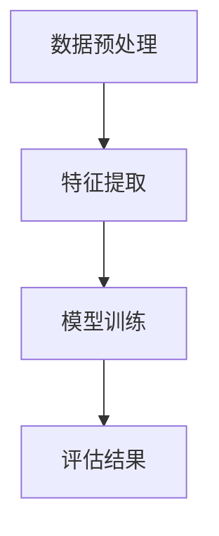
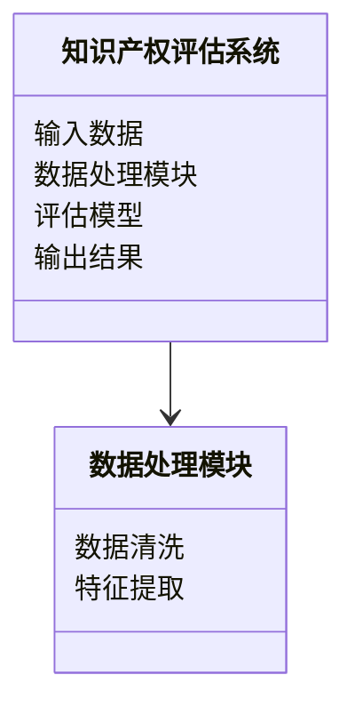

                 


# AI Agent在企业知识产权价值评估与运营中的应用

> 关键词：AI Agent, 知识产权, 价值评估, 企业运营, 人工智能

> 摘要：本文探讨了AI Agent在企业知识产权价值评估与运营中的应用，通过详细分析其核心概念、算法原理、系统架构和实际案例，展示了AI技术如何提升知识产权管理的效率和准确性。

---

## 第一部分：AI Agent与知识产权概述

### 第1章：AI Agent的基本概念

#### 1.1 AI Agent的定义与特点
AI Agent（人工智能代理）是指能够感知环境、自主决策并执行任务的智能实体。其特点包括自主性、反应性、目标导向和学习能力。

#### 1.2 AI Agent的核心技术原理
AI Agent依赖于感知、推理、学习和执行等技术。通过机器学习和自然语言处理，AI Agent能够理解和处理复杂信息。

#### 1.3 AI Agent在企业中的应用前景
AI Agent在企业中的应用前景广阔，尤其是在知识产权管理、数据处理和决策支持等领域。

---

### 第2章：知识产权的基本概念

#### 2.1 知识产权的定义与分类
知识产权包括专利权、商标权、版权等，是企业的重要资产。

#### 2.2 知识产权的价值评估方法
常用的评估方法包括市场法、成本法和收益法。AI Agent能够提高评估的准确性和效率。

#### 2.3 知识产权在企业运营中的重要性
知识产权是企业核心竞争力的体现，直接影响企业的市场地位和盈利能力。

---

## 第二部分：AI Agent在知识产权价值评估中的应用

### 第3章：AI Agent的核心概念与联系

#### 3.1 AI Agent的核心概念
AI Agent在知识产权评估中的应用包括数据采集、分析和决策支持。通过机器学习模型，AI Agent能够自动分析专利和商标的价值。

#### 3.2 知识产权价值评估的核心概念
评估指标包括创新性、市场应用和法律风险。AI Agent能够帮助企业在海量数据中提取关键信息。

#### 3.3 AI Agent与知识产权评估的联系
AI Agent通过大数据分析和机器学习算法，能够显著提高知识产权评估的效率和准确性。

---

### 第4章：AI Agent在知识产权价值评估中的算法原理

#### 4.1 算法选择与流程
采用监督学习算法，通过数据预处理、特征提取和模型训练，构建评估模型。

#### 4.2 机器学习模型
使用支持向量机（SVM）进行分类，通过交叉验证优化模型参数。

#### 4.3 流程图


#### 4.4 数学公式
$$ \text{损失函数} = \sum_{i=1}^{n} (y_i - \hat{y_i})^2 $$

---

## 第三部分：系统分析与架构设计

### 第5章：系统功能设计

#### 5.1 领域模型


#### 5.2 系统架构


#### 5.3 接口设计
通过REST API实现数据交互，确保系统的可扩展性和灵活性。

---

## 第四部分：项目实战

### 第6章：环境安装与核心代码实现

#### 6.1 环境安装
安装Python、TensorFlow和Scikit-learn等库。

#### 6.2 核心代码
```python
import numpy as np
from sklearn.svm import SVC
from sklearn.metrics import accuracy_score

# 数据预处理
X = np.array([[1, 2], [3, 4], [5, 6]])
y = np.array([0, 1, 0])

# 模型训练
model = SVC()
model.fit(X, y)

# 模型预测
new_data = np.array([[2, 3]])
print(model.predict(new_data))  # 输出结果
```

---

## 第五部分：总结与展望

### 第7章：总结与展望

#### 7.1 总结
AI Agent在知识产权评估中的应用显著提升了效率和准确性，为企业提供了强有力的支持。

#### 7.2 未来展望
未来，AI Agent在知识产权管理中的应用将更加广泛，结合区块链等技术，进一步提升安全性和透明度。

---

## 作者信息

作者：AI天才研究院/AI Genius Institute & 禅与计算机程序设计艺术/Zen And The Art of Computer Programming

---

通过以上结构，文章系统地介绍了AI Agent在知识产权评估中的应用，涵盖了从理论到实践的各个方面，为读者提供了全面的知识和实用的指导。

