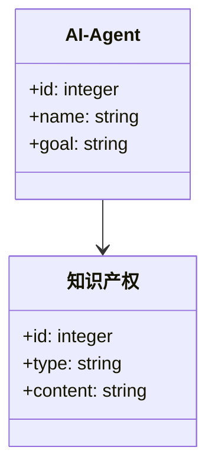

                 


# AI Agent在企业知识产权管理中的应用与价值

## 关键词：AI Agent，知识产权管理，自然语言处理，知识图谱，机器学习

## 摘要：本文探讨AI Agent在企业知识产权管理中的应用，分析其在专利检索、分析、监控和管理中的价值。通过技术原理、系统架构设计和项目实战，揭示AI Agent如何提升知识产权管理的效率和准确性。

---

# 第1章 引言

## 1.1 问题背景与重要性

知识产权是企业核心资产，涉及专利、商标、版权等。传统管理依赖人工，效率低、成本高，且易出错。AI Agent的兴起为企业提供了智能化解决方案。

## 1.2 AI Agent的兴起与潜力

AI Agent通过自然语言处理和机器学习，能自动化执行任务，优化决策。其在知识产权管理中的应用潜力巨大，能显著提升效率。

## 1.3 结合点与价值

AI Agent在知识产权管理中的应用点包括专利检索、侵权分析、竞争分析等。其价值在于提高效率、降低成本和增强决策支持。

---

# 第2章 AI Agent与知识产权管理的核心概念

## 2.1 核心概念与联系

### 2.1.1 AI Agent的定义与特征

AI Agent是智能体，具备感知、决策、执行能力，能主动完成任务。其特征包括自主性、反应性、主动性、社会性。

### 2.1.2 知识产权管理的定义与范围

知识产权管理涉及创造、保护、运用和管理知识产权资产。范围包括专利申请、维护、侵权分析等。

### 2.1.3 两者的结合点与区别

AI Agent通过智能化手段提升知识产权管理效率，区别在于AI Agent更注重自动化和智能性。

---

# 第3章 AI Agent在知识产权管理中的技术原理

## 3.1 技术架构

### 3.1.1 感知模块

感知模块负责数据输入和处理，常用技术包括自然语言处理（NLP）和知识图谱构建。

### 3.1.2 决策模块

决策模块基于感知结果进行分析和推理，常用算法包括分类、聚类和序列标注。

### 3.1.3 执行模块

执行模块根据决策结果采取行动，如自动生成专利申请文件或触发法律程序。

## 3.2 算法原理

### 3.2.1 自然语言处理

NLP技术用于文本分析，如分词、实体识别和情感分析。例如，使用Word2Vec进行词嵌入。

### 3.2.2 知识图谱构建

知识图谱帮助构建结构化知识，便于推理。使用图嵌入技术如TransE进行知识表示。

### 3.2.3 机器学习

机器学习用于模式识别和预测。例如，使用支持向量机（SVM）进行分类任务。

---

# 第4章 系统分析与架构设计

## 4.1 项目介绍

### 4.1.1 项目目标

开发一个AI Agent系统，用于专利检索、分析和管理。

### 4.1.2 项目范围

涵盖专利数据处理、竞争分析和侵权预警等功能。

## 4.2 系统功能设计

### 4.2.1 领域模型



---

# 第5章 项目实战

## 5.1 环境搭建

### 5.1.1 技术选型

选择Python、TensorFlow、Flask等技术栈。

### 5.1.2 工具安装

安装Python、pip、TensorFlow等。

## 5.2 核心代码实现

### 5.2.1 感知模块

```python
def process_text(text):
    # 使用NLP库进行文本处理
    pass
```

### 5.2.2 决策模块

```python
def decide(action):
    # 基于模型进行决策
    pass
```

### 5.2.3 执行模块

```python
def execute(action):
    # 执行具体操作
    pass
```

## 5.3 案例分析与结果解读

### 5.3.1 案例背景

分析竞争对手的专利布局。

### 5.3.2 实施步骤

使用AI Agent进行数据收集、分析和报告生成。

### 5.3.3 结果解读

生成的竞争分析报告帮助企业制定研发策略。

---

# 第6章 总结与展望

## 6.1 总结

AI Agent在知识产权管理中具有巨大潜力，能显著提升效率和准确性。

## 6.2 展望

未来，AI Agent将与区块链等技术结合，推动知识产权管理的智能化和自动化。

---

# 第7章 最佳实践 Tips

## 7.1 注意事项

确保数据隐私和合规性，选择合适的技术栈。

## 7.2 小结

AI Agent是知识产权管理的重要工具，企业应积极采用。

---

# 作者

**作者：AI天才研究院/AI Genius Institute & 禅与计算机程序设计艺术 /Zen And The Art of Computer Programming**

