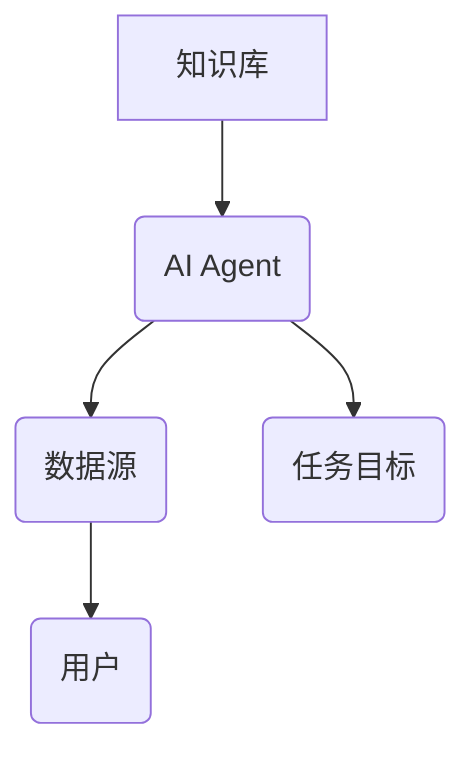
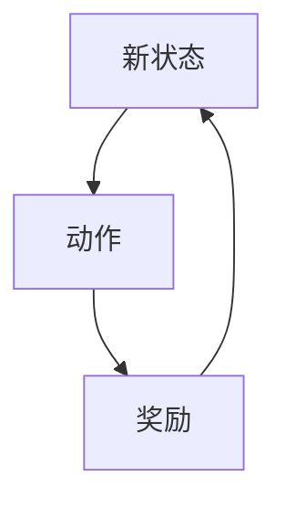
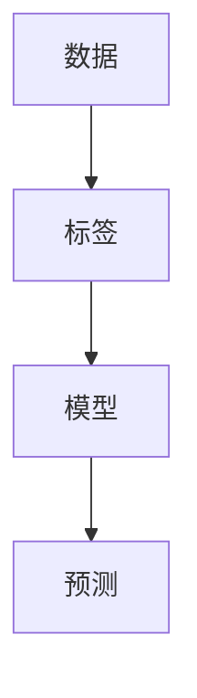
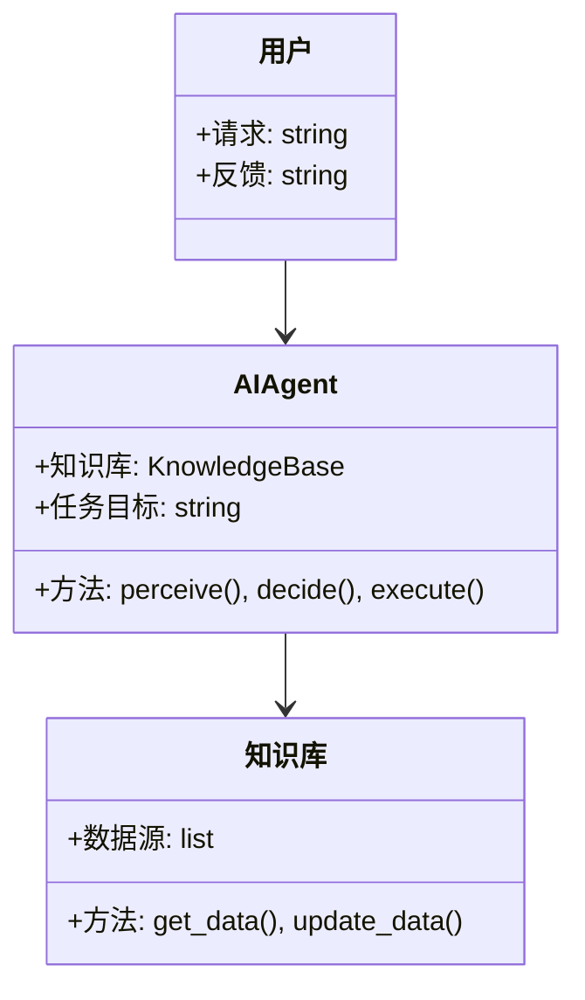
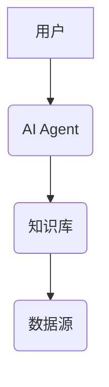
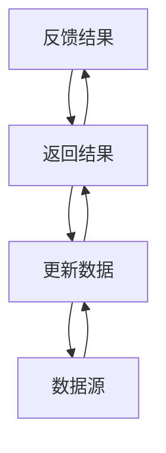

                 


# AI Agent在企业知识管理中的应用与价值

## 关键词：AI Agent, 企业知识管理, 人工智能, 知识图谱, 自然语言处理

## 摘要：本文探讨了AI Agent在企业知识管理中的应用与价值，分析了AI Agent的核心概念、技术原理、系统设计，并通过实际案例展示了其在企业知识管理中的应用场景。文章还总结了AI Agent在企业知识管理中的最佳实践和未来发展趋势。

---

# 第一部分: AI Agent在企业知识管理中的应用背景

## 第1章: AI Agent与企业知识管理概述

### 1.1 问题背景与问题描述

#### 1.1.1 传统企业知识管理的挑战
企业在知识管理中面临以下挑战：
1. 知识分散：员工的知识分布在不同的部门和系统中，难以整合和共享。
2. 知识孤岛：部门之间的知识无法有效流通，导致重复劳动和资源浪费。
3. 知识更新不及时：知识更新速度跟不上业务发展的需求。
4. 知识利用效率低：员工难以快速获取所需知识，影响工作效率。

#### 1.1.2 知识管理在企业中的重要性
知识是企业的核心资产，有效的知识管理能够：
1. 提高企业竞争力。
2. 优化资源配置。
3. 提升员工工作效率。
4. 促进企业创新。

#### 1.1.3 传统知识管理的局限性
传统的知识管理工具主要依赖人工录入和管理，存在以下问题：
1. 知识录入耗时耗力。
2. 知识更新不及时。
3. 知识检索效率低。
4. 知识共享不够广泛。

### 1.2 AI Agent的概念与定义

#### 1.2.1 AI Agent的基本概念
AI Agent（人工智能代理）是一种能够感知环境、自主决策并执行任务的智能体。它能够通过与环境交互，实现特定目标。

#### 1.2.2 AI Agent的核心特征
1. **自主性**：能够在没有外部干预的情况下自主运行。
2. **反应性**：能够实时感知环境并做出反应。
3. **学习能力**：能够通过数据和经验不断优化自身的性能。
4. **协作性**：能够与其他AI Agent或人类协同工作。

#### 1.2.3 AI Agent与传统知识管理工具的区别
| 特性         | AI Agent                     | 传统知识管理工具               |
|--------------|------------------------------|-------------------------------|
| 自主性       | 高                           | 低                           |
| 反应性       | 高                           | 中                           |
| 学习能力     | 高                           | 低                           |
| 协作性       | 高                           | 中                           |

### 1.3 AI Agent在企业知识管理中的价值

#### 1.3.1 提高知识管理效率
AI Agent能够自动识别、整理和分类知识，减少人工干预，提高知识管理效率。

#### 1.3.2 增强知识共享与协作
AI Agent能够通过自然语言处理技术，帮助员工更好地理解和共享知识，促进协作。

#### 1.3.3 优化决策过程
AI Agent能够基于实时数据和历史知识，为企业决策提供支持，优化决策过程。

### 1.4 本章小结
本章介绍了AI Agent的基本概念、核心特征及其在企业知识管理中的价值。通过对比传统知识管理工具，突出了AI Agent的优势和潜力。

---

# 第二部分: AI Agent的核心概念与技术原理

## 第2章: AI Agent的核心概念与原理

### 2.1 AI Agent的核心要素

#### 2.1.1 感知与理解能力
AI Agent需要能够理解外部环境的信息，包括文本、语音、图像等多种形式。

#### 2.1.2 决策与执行能力
AI Agent需要根据感知的信息，做出决策并执行任务。

#### 2.1.3 学习与优化能力
AI Agent需要通过学习不断提升自身的性能，优化决策过程。

### 2.2 AI Agent与相关技术的关系

#### 2.2.1 与知识图谱的关系
知识图谱是AI Agent的重要数据源，AI Agent可以利用知识图谱进行语义理解。

#### 2.2.2 与自然语言处理的关系
自然语言处理技术是AI Agent实现文本理解的核心技术。

#### 2.2.3 与机器学习的关系
机器学习是AI Agent实现自适应优化的基础技术。

### 2.3 AI Agent的实体关系图



---

# 第三部分: AI Agent的算法原理

## 第3章: AI Agent的算法原理

### 3.1 强化学习算法

#### 3.1.1 强化学习流程图



#### 3.1.2 强化学习数学模型
$$ Q(s, a) = r + \gamma \max_{a'} Q(s', a') $$

### 3.2 监督学习算法

#### 3.2.1 监督学习流程图



#### 3.2.2 监督学习数学模型
$$ y = \theta x + b $$

---

# 第四部分: AI Agent的系统设计

## 第4章: AI Agent的系统设计

### 4.1 系统功能设计

#### 4.1.1 领域模型类图



### 4.2 系统架构设计

#### 4.2.1 系统架构图



### 4.3 系统接口设计

#### 4.3.1 接口设计
1. **用户接口**：接收用户的请求并返回结果。
2. **知识库接口**：与知识库交互，获取或更新数据。
3. **AI Agent接口**：与外部系统交互，执行任务。

### 4.4 系统交互流程

#### 4.4.1 交互流程图



---

# 第五部分: AI Agent的项目实战

## 第5章: AI Agent的项目实战

### 5.1 环境安装

#### 5.1.1 安装Python环境
```bash
python --version
pip install --upgrade pip
```

#### 5.1.2 安装依赖库
```bash
pip install numpy
pip install scikit-learn
pip install matplotlib
```

### 5.2 核心代码实现

#### 5.2.1 强化学习代码示例
```python
import numpy as np
import gym

env = gym.make('CartPole-v0')
env.seed(1)

for episode in range(100):
    state = env.reset()
    for _ in range(1000):
        action = env.action_space.sample()
        next_state, reward, done, _ = env.step(action)
        if done:
            break
```

#### 5.2.2 监督学习代码示例
```python
from sklearn import tree

X = [[1, 0], [0, 1], [1, 1], [0, 0]]
y = [1, 1, 0, 0]

clf = tree.DecisionTreeClassifier()
clf = clf.fit(X, y)
```

### 5.3 案例分析

#### 5.3.1 案例背景
某企业希望通过AI Agent优化知识管理系统。

#### 5.3.2 实施步骤
1. **数据收集**：收集企业知识数据。
2. **模型训练**：训练AI Agent模型。
3. **系统部署**：部署AI Agent到企业知识管理系统。
4. **测试与优化**：测试系统性能并进行优化。

### 5.4 代码解读与分析
通过代码实现AI Agent的核心功能，包括感知、决策和执行。

### 5.5 项目小结
本章通过实际案例展示了AI Agent的项目实施过程，从环境安装到代码实现，再到案例分析，帮助读者更好地理解和应用AI Agent技术。

---

# 第六部分: 最佳实践与总结

## 第6章: 最佳实践与总结

### 6.1 最佳实践
1. **数据质量**：确保数据的准确性和完整性。
2. **模型优化**：定期优化AI Agent模型，提升性能。
3. **系统维护**：定期检查和维护系统，确保其稳定运行。

### 6.2 小结
本文详细介绍了AI Agent在企业知识管理中的应用与价值，从核心概念到算法原理，再到系统设计和项目实战，全面覆盖了AI Agent的相关知识。

### 6.3 注意事项
1. **数据隐私**：注意保护企业数据的隐私和安全。
2. **技术选型**：根据实际需求选择合适的技术和工具。
3. **团队协作**：确保团队成员之间的良好协作，共同推动项目进展。

### 6.4 拓展阅读
1. 《机器学习实战》
2. 《深度学习入门：基于Python》
3. 《自然语言处理入门》

---

# 作者：AI天才研究院/AI Genius Institute & 禅与计算机程序设计艺术 /Zen And The Art of Computer Programming

---

**注**：以上内容为文章的目录和部分内容示例，实际文章将按照上述结构进行详细撰写。

