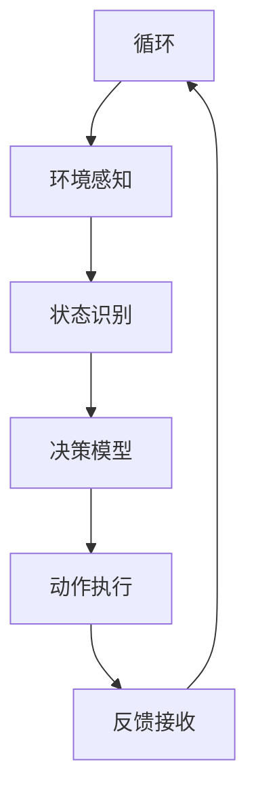
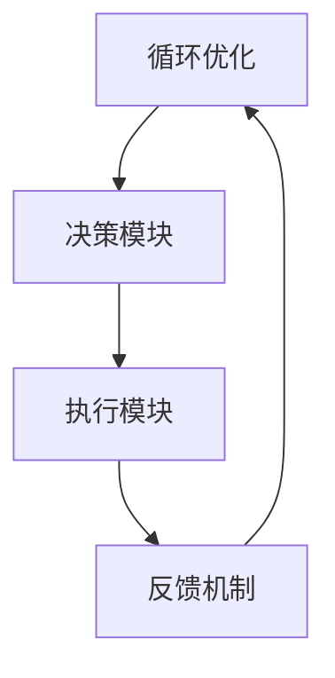

                 


# AI Agent在企业碳中和战略规划与实施中的全面应用

## 关键词：AI Agent, 企业碳中和, 碳排放监测, 能源优化, 可持续发展

## 摘要：  
随着全球对碳中和目标的日益重视，企业需要通过智能化手段实现低碳转型。AI Agent作为一种具备自主决策和执行能力的智能体，正在成为企业碳中和战略中的核心工具。本文将从AI Agent的基本概念、在碳中和中的应用场景、技术实现原理以及实际案例等方面进行详细分析，探讨AI Agent如何助力企业实现碳中和目标。

---

# 第一部分: AI Agent与企业碳中和战略概述

## 第1章: 企业碳中和的背景与挑战

### 1.1 企业碳中和的背景与目标
企业碳中和是指企业在生产、运营和供应链等全生命周期中，通过减少碳排放或增加碳汇，实现净零碳排放的目标。这一目标不仅是企业履行社会责任的表现，也是应对政策法规和市场趋势的关键策略。然而，企业在实现碳中和过程中面临以下挑战：

- **数据复杂性**：企业需要整合来自能源消耗、碳排放、供应链等多个方面的数据，数据来源多样且复杂。
- **决策效率**：传统依赖人工的碳中和策略优化耗时且效率低下，难以应对快速变化的市场环境。
- **动态调整**：碳中和目标的实现需要动态调整策略，但传统方法难以快速响应。

### 1.2 AI Agent的核心概念
AI Agent（人工智能代理）是一种能够感知环境、自主决策并执行任务的智能系统。AI Agent的关键特点包括：

- **自主性**：无需人工干预，能够自主完成任务。
- **反应性**：能够实时感知环境变化并做出响应。
- **目标导向**：通过优化算法实现特定目标。

AI Agent在企业碳中和中的应用，可以显著提高碳中和策略的优化效率和执行能力。

---

## 第2章: AI Agent在企业碳中和中的应用场景

### 2.1 能源消耗优化
企业通过AI Agent实时监控能源使用情况，识别能源浪费点，并优化能源分配策略。例如，AI Agent可以根据实时电价和设备负载情况，动态调整企业的用电策略，降低能源成本。

### 2.2 碳排放监测与管理
AI Agent可以通过物联网（IoT）设备实时采集企业的碳排放数据，结合机器学习模型预测未来排放趋势，并提出减排建议。例如，在制造业中，AI Agent可以优化生产流程，减少碳排放。

### 2.3 可持续发展目标的实现
AI Agent可以帮助企业在供应链管理中选择更环保的供应商，优化物流路径，减少运输过程中的碳排放。同时，AI Agent还可以协助企业制定长期的碳中和规划，确保目标的实现。

---

# 第二部分: AI Agent的技术实现与系统设计

## 第3章: AI Agent的算法原理

### 3.1 算法原理概述
AI Agent的核心算法包括强化学习（Reinforcement Learning）和图神经网络（Graph Neural Networks）。强化学习用于优化决策过程，而图神经网络用于处理复杂的关联关系。

### 3.2 算法流程图
以下是一个基于强化学习的AI Agent算法流程图：



---

## 第4章: 数学模型与公式

### 4.1 碳中和优化模型
以下是一个碳中和优化模型的目标函数：

$$ \text{minimize } \sum_{i=1}^{n} c_i x_i $$

其中，$c_i$ 是第 $i$ 个活动的碳排放强度，$x_i$ 是该活动的投入量。

### 4.2 AI Agent决策模型
以下是一个基于强化学习的Q值更新公式：

$$ Q(s, a) = Q(s, a) + \alpha (r + \gamma \max Q(s', a') - Q(s, a)) $$

其中，$\alpha$ 是学习率，$r$ 是奖励，$\gamma$ 是折扣因子，$s$ 是当前状态，$s'$ 是下一个状态，$a$ 是当前动作。

---

## 第5章: 系统架构与设计

### 5.1 系统功能设计
AI Agent的系统功能模块包括：

- **数据采集模块**：实时采集企业的碳排放数据。
- **决策模块**：基于机器学习模型生成优化策略。
- **执行模块**：将决策结果转化为实际操作。

### 5.2 系统架构图
以下是一个AI Agent系统的架构图：



---

# 第三部分: 项目实战与案例分析

## 第6章: 项目实战

### 6.1 环境安装与核心实现
以下是AI Agent系统的Python实现代码示例：

```python
class AIAgent:
    def __init__(self):
        self.carbon_data = []
        self.actions = ['reduce', 'optimize', 'monitor']

    def perceive(self):
        # 获取实时碳排放数据
        data = get_carbon_data()
        self.carbon_data.append(data)

    def decide(self):
        # 基于强化学习的决策
        state = self.carbon_data[-1]
        action = self.actions[0]  # 示例选择
        return action

    def execute(self, action):
        # 执行决策
        execute_action(action)

if __name__ == "__main__":
    agent = AIAgent()
    while True:
        agent.perceive()
        action = agent.decide()
        agent.execute(action)
```

---

## 第7章: 案例分析与总结

### 7.1 案例分析
某制造企业通过部署AI Agent系统，实现了能源消耗的实时优化和碳排放的动态管理。通过AI Agent的决策支持，该企业将碳排放量减少了15%，能源成本降低了20%。

### 7.2 总结与展望
AI Agent在企业碳中和中的应用前景广阔，未来可以通过多模态学习、边缘计算等技术进一步提升其能力。企业需要结合自身特点，合理部署AI Agent系统，以实现高效、可持续的碳中和目标。

---

# 作者

**作者：AI天才研究院/AI Genius Institute & 禅与计算机程序设计艺术 /Zen And The Art of Computer Programming**

---

这篇文章系统地介绍了AI Agent在企业碳中和战略中的应用，从理论到实践，为企业的低碳转型提供了技术支持和实践指导。

