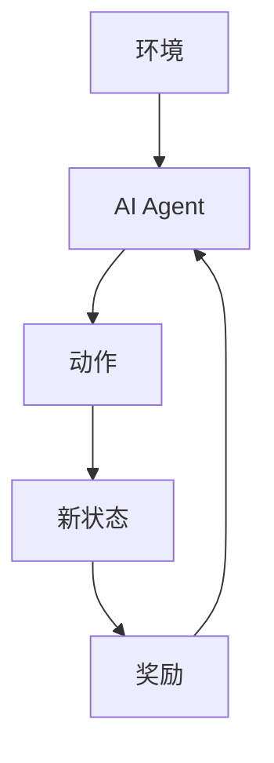
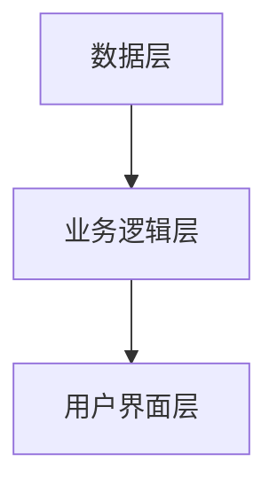
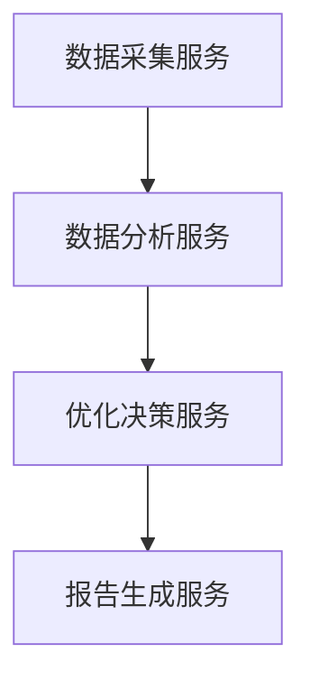
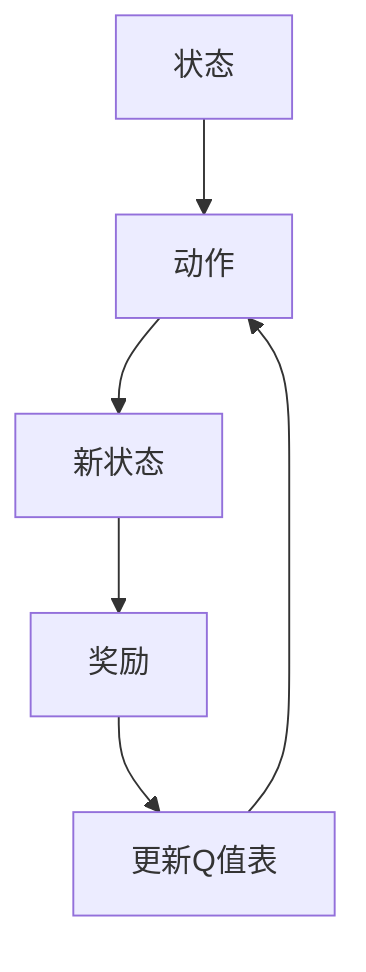
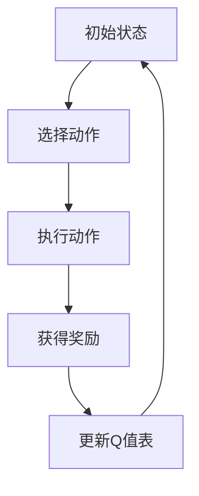

                 


# AI Agent在企业碳排放管理与环保合规中的应用

> 关键词：AI Agent, 碳排放管理, 环保合规, 企业可持续发展, 人工智能技术

> 摘要：本文探讨了AI Agent在企业碳排放管理与环保合规中的应用，从AI Agent的基本概念到其在碳排放管理中的实际应用，详细分析了其在企业碳排放优化、环保合规检查、可持续发展目标中的作用。通过实际案例分析，展示了AI Agent如何通过强化学习算法优化企业碳排放管理，以及如何通过系统架构设计实现环保合规。文章还详细介绍了基于Python的AI Agent实现方法，帮助读者理解AI Agent在碳排放管理中的具体实现方式。

---

# 第1章: AI Agent的基本概念与背景

## 1.1 AI Agent的定义与特点

### 1.1.1 AI Agent的定义
AI Agent（人工智能代理）是指具有感知环境、自主决策和执行任务能力的智能体。它能够通过传感器或数据接口获取环境信息，并基于这些信息做出决策，执行相应的操作以达到目标。

AI Agent的特点包括：
1. **自主性**：能够在没有外部干预的情况下独立运行。
2. **反应性**：能够根据环境变化实时调整行为。
3. **学习能力**：通过机器学习算法不断优化自身的决策能力。
4. **协作性**：能够与其他AI Agent或系统协同工作，完成复杂任务。

### 1.1.2 AI Agent与传统自动化工具的区别
AI Agent的核心区别在于其智能性和适应性。传统自动化工具通常基于固定的规则执行任务，而AI Agent能够通过学习和推理动态调整行为，适应环境的变化。

| 特性       | AI Agent                          | 传统自动化工具                  |
|------------|-----------------------------------|-------------------------------|
| **决策能力** | 基于数据学习和推理               | 基于固定规则                   |
| **灵活性**   | 能够适应环境变化                 | 灵活性较低                     |
| **学习能力** | 具备机器学习能力                 | 无学习能力                     |
| **复杂任务处理** | 能处理复杂和动态的任务           | 通常处理简单和固定的任务         |

### 1.1.3 AI Agent的应用领域
AI Agent广泛应用于多个领域，包括：
1. **智能家居**：控制家庭设备，优化能源使用。
2. **金融交易**：自动执行交易策略，优化投资组合。
3. **医疗健康**：辅助医生诊断，优化治疗方案。
4. **工业自动化**：优化生产流程，提高效率。
5. **环境保护**：用于碳排放管理、环境监测等。

---

## 1.2 企业碳排放管理的现状与挑战

### 1.2.1 碳排放管理的基本概念
碳排放管理是指通过监测、分析和优化企业运营过程中产生的温室气体排放，减少对环境的影响，同时满足相关环保法规和企业可持续发展目标。

### 1.2.2 传统碳排放管理的痛点
1. **数据复杂性**：企业产生的数据种类繁多，包括能源消耗、运输、生产等，数据整合和分析难度大。
2. **实时性要求高**：碳排放管理需要实时监控和调整，传统方法往往无法满足实时性要求。
3. **法规变化快**：环保法规不断更新，企业需要快速响应，调整管理策略。
4. **成本高**：传统管理方式需要大量人工干预，成本较高。

### 1.2.3 环保合规的法律要求与企业责任
随着全球气候变化问题的加剧，各国政府纷纷出台严格的环保法规，要求企业减少碳排放，实现可持续发展目标。企业需要通过技术创新和管理优化，满足环保合规要求，降低碳排放。

---

## 1.3 AI Agent在环保领域的应用背景

### 1.3.1 AI技术在环保领域的应用现状
AI技术已经在环保领域取得了显著进展，例如：
1. **环境监测**：通过卫星图像和传感器数据，监测空气质量、水质等环境指标。
2. **生态预测**：预测气候变化、物种迁徙等生态变化。
3. **能源管理**：优化能源使用，减少碳排放。

### 1.3.2 碳排放管理中引入AI Agent的必要性
AI Agent能够通过实时数据采集、分析和决策，帮助企业优化能源使用，减少碳排放。例如：
1. **动态调整能源使用**：根据实时能源价格和需求，优化能源消耗。
2. **预测碳排放趋势**：基于历史数据和机器学习模型，预测未来的碳排放情况。
3. **自动合规检查**：实时监控企业碳排放数据，确保符合法规要求。

### 1.3.3 企业环保合规的趋势与机遇
随着环保法规的日益严格，企业需要通过技术创新实现环保合规。AI Agent技术为企业提供了新的解决方案，帮助企业实现智能化、高效的碳排放管理，降低成本，提升竞争力。

---

## 1.4 本章小结

本章介绍了AI Agent的基本概念、特点及其在环保领域的应用背景。AI Agent作为一种智能化的工具，能够在企业碳排放管理中发挥重要作用，帮助企业优化能源使用、预测碳排放趋势、实现环保合规。随着环保法规的不断加强，AI Agent的应用将成为企业实现可持续发展的重要手段。

---

# 第2章: AI Agent的核心原理与技术

## 2.1 AI Agent的基本原理

### 2.1.1 AI Agent的感知与决策机制
AI Agent通过感知环境信息，利用机器学习算法进行分析和推理，制定决策并执行操作。感知环境信息可以通过多种方式实现，例如传感器数据、数据库查询等。

### 2.1.2 基于强化学习的AI Agent算法
强化学习是一种通过试错机制优化决策的机器学习方法。AI Agent通过与环境的交互，获得奖励或惩罚，不断优化自身的决策策略。

#### 强化学习流程图（Mermaid）


### 2.1.3 多智能体协作的AI Agent系统
在复杂的环境中，单个AI Agent往往难以完成任务，需要多个AI Agent协作完成。多智能体协作通过通信和协调，实现任务的高效完成。

---

## 2.2 AI Agent的关键技术

### 2.2.1 自然语言处理技术
自然语言处理（NLP）技术用于AI Agent与人类用户之间的交互，理解用户的意图并生成相应的回应。

### 2.2.2 机器学习算法
机器学习算法是AI Agent的核心，用于感知环境、分析数据和制定决策。常用的算法包括支持向量机（SVM）、随机森林（Random Forest）和神经网络等。

### 2.2.3 数据挖掘与分析技术
数据挖掘技术用于从大量数据中提取有用的信息，帮助AI Agent做出更准确的决策。

---

## 2.3 AI Agent在碳排放管理中的应用技术

### 2.3.1 数据采集与处理技术
AI Agent需要实时采集企业的能源消耗数据，包括电力、燃气、水等。数据采集可以通过物联网（IoT）设备实现。

### 2.3.2 碳排放预测模型
基于历史数据和机器学习算法，构建碳排放预测模型，预测未来的碳排放趋势。

### 2.3.3 碳排放优化算法
通过优化算法，例如强化学习，动态调整企业的能源使用策略，减少碳排放。

---

## 2.4 本章小结

本章详细介绍了AI Agent的核心原理与关键技术，包括感知与决策机制、强化学习算法、多智能体协作等。同时，探讨了这些技术在碳排放管理中的具体应用，为后续章节的系统设计和实现奠定了基础。

---

# 第3章: AI Agent在碳排放管理中的系统架构

## 3.1 系统功能模块划分

### 3.1.1 数据采集模块
数据采集模块负责从企业系统中采集能源消耗数据，例如电力、燃气等。

### 3.1.2 数据分析模块
数据分析模块对采集到的数据进行处理和分析，识别异常值和趋势。

### 3.1.3 优化决策模块
优化决策模块基于分析结果，制定碳排放优化策略。

### 3.1.4 报告生成模块
报告生成模块生成碳排放管理报告，帮助企业了解当前的碳排放情况，并制定改进措施。

---

## 3.2 系统架构设计

### 3.2.1 分层架构设计
系统架构采用分层设计，包括数据层、业务逻辑层和用户界面层。

#### 分层架构图（Mermaid）


### 3.2.2 微服务架构设计
微服务架构将系统划分为多个独立的服务，每个服务负责特定的功能，例如数据采集、分析、优化等。

#### 微服务架构图（Mermaid）


### 3.2.3 数据流与交互设计
数据流从数据采集模块开始，经过数据分析模块处理后，传送到优化决策模块，最终生成报告。

---

## 3.3 系统接口设计

### 3.3.1 数据接口
数据接口用于不同模块之间的数据传输，通常采用RESTful API。

### 3.3.2 用户接口
用户接口是系统与用户的交互界面，通常采用Web界面或命令行界面。

### 3.3.3 第三方服务接口
系统可能需要与第三方服务接口，例如天气数据接口、能源价格接口等。

---

## 3.4 本章小结

本章详细描述了AI Agent在碳排放管理中的系统架构设计，包括功能模块划分、架构设计、数据流与交互设计等。通过合理的系统设计，AI Agent能够高效地完成碳排放管理任务，帮助企业实现环保合规。

---

# 第4章: 基于强化学习的AI Agent算法实现

## 4.1 强化学习的基本原理

### 4.1.1 状态、动作、奖励的定义
- **状态（State）**：AI Agent所处的环境状态，例如当前的能源消耗数据。
- **动作（Action）**：AI Agent根据当前状态做出的决策，例如调整能源使用策略。
- **奖励（Reward）**：AI Agent执行动作后获得的反馈，用于评估动作的好坏。

### 4.1.2 Q-learning算法
Q-learning是一种常用的强化学习算法，通过更新Q值表来优化决策策略。

#### Q-learning算法流程图（Mermaid）


#### Q-learning算法代码实现
```python
import numpy as np

class QLearning:
    def __init__(self, state_space_size, action_space_size):
        self.state_space_size = state_space_size
        self.action_space_size = action_space_size
        self.q_table = np.zeros((state_space_size, action_space_size))
    
    def choose_action(self, state, epsilon=0.1):
        if np.random.random() < epsilon:
            return np.random.randint(self.action_space_size)
        else:
            return np.argmax(self.q_table[state])
    
    def update_q_table(self, state, action, reward, next_state, learning_rate=0.1, gamma=0.9):
        self.q_table[state, action] = (1 - learning_rate) * self.q_table[state, action] + \
                                        learning_rate * (reward + gamma * np.max(self.q_table[next_state]))
```

### 4.1.3 策略梯度算法
策略梯度算法通过优化策略直接优化动作的概率分布，避免了Q值表的维护。

#### 策略梯度算法代码实现
```python
import numpy as np
import tensorflow as tf

class PolicyGradient:
    def __init__(self, state_space_size, action_space_size):
        self.state_space_size = state_space_size
        self.action_space_size = action_space_size
        self.model = self.build_model()
    
    def build_model(self):
        model = tf.keras.Sequential([
            tf.keras.layers.Dense(32, activation='relu', input_dim=self.state_space_size),
            tf.keras.layers.Dense(self.action_space_size, activation='softmax')
        ])
        return model
    
    def choose_action(self, state):
        state = np.array([state])
        prediction = self.model.predict(state)
        action = np.random.choice(self.action_space_size, p=prediction[0])
        return action
    
    def update_model(self, state, action, reward, optimizer):
        target = tf.keras.backend.one_hot(action, self.action_space_size)
        target *= reward
        self.model.fit(state, target, epochs=1, verbose=0, optimizer=optimizer)
```

---

## 4.2 基于强化学习的碳排放优化算法

### 4.2.1 算法流程图（Mermaid）


### 4.2.2 算法实现代码
```python
import numpy as np

class CarbonEmissionOptimizer:
    def __init__(self, state_space_size, action_space_size):
        self.agent = QLearning(state_space_size, action_space_size)
    
    def optimize_emission(self, state, epsilon=0.1):
        action = self.agent.choose_action(state, epsilon)
        return action

    def update_agent(self, state, action, reward, next_state):
        self.agent.update_q_table(state, action, reward, next_state)
```

### 4.2.3 算法数学模型
强化学习的数学模型主要基于Q值更新公式：
$$ Q(s, a) = (1 - \alpha) Q(s, a) + \alpha (r + \gamma \max Q(s', a')) $$
其中：
- \( \alpha \) 是学习率
- \( \gamma \) 是折扣因子
- \( s \) 是当前状态
- \( a \) 是当前动作
- \( r \) 是奖励
- \( s' \) 是下一个状态

---

## 4.3 本章小结

本章详细介绍了基于强化学习的AI Agent算法，包括Q-learning和策略梯度算法的实现。通过这些算法，AI Agent能够动态调整企业的能源使用策略，优化碳排放管理。

---

# 第5章: AI Agent碳排放管理系统项目实战

## 5.1 项目背景与目标
本项目旨在通过AI Agent技术，帮助企业优化能源使用，减少碳排放，实现环保合规。

## 5.2 环境配置
项目需要以下环境和工具：
- Python 3.8+
- TensorFlow 2.0+
- NumPy 1.20+
- Mermaid图生成工具

## 5.3 项目实现

### 5.3.1 数据采集模块
数据采集模块通过API接口采集企业的能源消耗数据。

#### 数据采集代码实现
```python
import requests

class DataCollector:
    def __init__(self, api_url):
        self.api_url = api_url
    
    def collect_data(self):
        response = requests.get(f"{self.api_url}/get_emission_data")
        return response.json()
```

### 5.3.2 数据分析模块
数据分析模块对采集到的数据进行处理和分析，识别异常值和趋势。

#### 数据分析代码实现
```python
import pandas as pd

class DataAnalyzer:
    def __init__(self):
        self.data = []
    
    def analyze(self, new_data):
        df = pd.DataFrame(new_data)
        # 数据预处理
        df.dropna(inplace=True)
        df['timestamp'] = pd.to_datetime(df['timestamp'])
        # 数据分析
        df.set_index('timestamp', inplace=True)
        return df
```

### 5.3.3 优化决策模块
优化决策模块基于分析结果，制定碳排放优化策略。

#### 优化决策代码实现
```python
class EmissionOptimizer:
    def __init__(self, q_learning_agent):
        self.agent = q_learning_agent
    
    def optimize(self, state):
        action = self.agent.choose_action(state)
        return action
```

### 5.3.4 报告生成模块
报告生成模块生成碳排放管理报告，帮助企业了解当前的碳排放情况。

#### 报告生成代码实现
```python
import matplotlib.pyplot as plt

class ReportGenerator:
    def __init__(self):
        pass
    
    def generate_report(self, data):
        plt.figure(figsize=(10, 6))
        plt.plot(data['timestamp'], data['emission'], 'b-')
        plt.title('Carbon Emission Trend')
        plt.xlabel('Time')
        plt.ylabel('Emission')
        plt.show()
```

## 5.4 项目运行与测试
项目运行步骤如下：
1. 初始化AI Agent。
2. 采集能源数据。
3. 分析数据。
4. 优化决策。
5. 生成报告。

---

## 5.5 本章小结

本章通过实际项目案例，详细展示了AI Agent在碳排放管理中的具体实现。通过数据采集、分析、优化和报告生成，帮助企业实现智能化的碳排放管理。

---

# 第6章: AI Agent在环保合规中的最佳实践

## 6.1 碳排放管理中的注意事项
1. **数据准确性**：确保数据采集的准确性，避免因数据错误导致决策失误。
2. **算法选择**：根据具体场景选择合适的算法，例如强化学习适合动态环境。
3. **系统安全性**：确保系统的安全性，防止数据泄露和恶意攻击。

## 6.2 环保合规中的最佳实践
1. **建立数据治理机制**：制定数据采集、存储和处理的标准，确保数据的合规性。
2. **与第三方服务集成**：与能源供应商、政府监管机构等第三方服务集成，获取实时数据和法规信息。
3. **持续优化**：定期更新算法和系统，适应环境变化和法规更新。

## 6.3 未来发展趋势
1. **多智能体协作**：未来的碳排放管理将更加依赖多智能体协作，优化企业内外部资源的配置。
2. **边缘计算**：通过边缘计算技术，实现本地化的数据处理和决策，减少数据传输延迟。
3. **可持续发展目标**：AI Agent将在帮助企业实现可持续发展目标中发挥更重要的作用。

---

## 6.4 本章小结

本章总结了AI Agent在环保合规中的最佳实践，包括数据治理、系统安全、持续优化等方面，并展望了未来的发展趋势。

---

# 结语

通过本文的详细分析，我们可以看到AI Agent在企业碳排放管理与环保合规中的巨大潜力。随着技术的不断进步，AI Agent将帮助企业更高效地优化能源使用，减少碳排放，实现可持续发展目标。未来，随着环保法规的不断完善和技术的进步，AI Agent将在更多领域发挥重要作用。

---

# 作者：AI天才研究院/AI Genius Institute & 禅与计算机程序设计艺术 /Zen And The Art of Computer Programming

