                 


# AI Agent在企业精准营销与个性化推荐中的应用

---

## 关键词  
AI Agent, 精准营销, 个性化推荐, 机器学习, 数据分析, 用户画像, 系统架构  

---

## 摘要  
随着人工智能技术的快速发展，AI Agent（人工智能代理）在企业精准营销和个性化推荐中的应用越来越广泛。本文从AI Agent的基本概念出发，深入探讨其在精准营销和个性化推荐中的原理、算法、系统设计及实际应用。通过分析用户行为、构建用户画像、优化推荐算法，本文旨在为企业提供一种高效、智能的营销解决方案，从而提升客户满意度和企业收益。

---

## 第1章: AI Agent与精准营销概述  

### 1.1 AI Agent的基本概念  

#### 1.1.1 什么是AI Agent  
AI Agent（人工智能代理）是一种能够感知环境、自主决策并执行任务的智能系统。它能够通过数据输入、分析和推理，做出最优决策以实现特定目标。  

**AI Agent的特征：**  
- **自主性**：能够自主决策，无需人工干预。  
- **反应性**：能够实时感知环境并做出反应。  
- **目标导向性**：以特定目标为导向，优化决策过程。  

#### 1.1.2 AI Agent的核心特征  
AI Agent的核心特征包括：  
1. **数据驱动**：依赖数据进行分析和决策。  
2. **智能推理**：通过算法进行推理和预测。  
3. **动态适应**：能够根据环境变化进行自适应调整。  

#### 1.1.3 AI Agent与传统营销的区别  
与传统营销相比，AI Agent的优势在于其智能化和自动化能力。传统营销依赖人工经验，而AI Agent能够通过数据驱动的方式实现精准决策。  

---

### 1.2 精准营销的背景与挑战  

#### 1.2.1 精准营销的定义与目标  
精准营销是一种基于用户数据和行为分析的营销方式，其目标是通过个性化服务提高客户满意度和转化率。  

#### 1.2.2 传统营销的局限性  
传统营销存在以下问题：  
- **低效性**：无法精准定位目标客户。  
- **高成本**：资源浪费严重。  
- **缺乏个性化**：难以满足客户的个性化需求。  

#### 1.2.3 数据驱动的精准营销优势  
数据驱动的精准营销通过分析用户数据，实现客户细分和精准推送，从而提高营销效果。  

---

### 1.3 AI Agent在精准营销中的作用  

#### 1.3.1 AI Agent如何实现精准营销  
AI Agent通过分析用户数据、构建用户画像，并结合预测模型，实现精准的客户定位和营销策略制定。  

#### 1.3.2 AI Agent的核心优势  
- **高效性**：快速处理和分析数据。  
- **精准性**：基于数据的精准决策。  
- **可扩展性**：能够处理大规模数据。  

#### 1.3.3 企业应用AI Agent的前景  
随着技术的不断进步，AI Agent在企业营销中的应用前景广阔，将成为企业提升竞争力的重要工具。  

---

## 第2章: AI Agent的原理与技术基础  

### 2.1 AI Agent的基本原理  

#### 2.1.1 AI Agent的工作流程  
AI Agent的工作流程包括数据采集、分析、推理和执行四个阶段。  

**工作流程图：**  
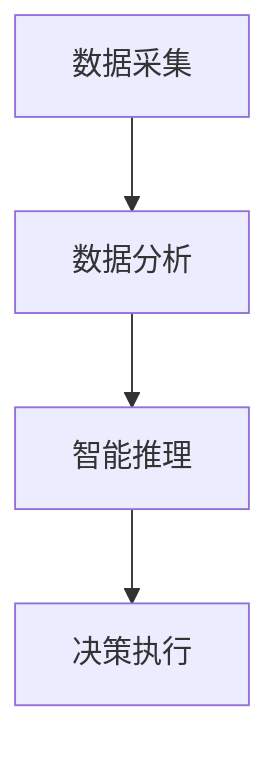

#### 2.1.2 AI Agent的核心算法  
AI Agent的核心算法包括：  
1. **机器学习算法**：用于模式识别和预测。  
2. **自然语言处理算法**：用于文本理解和生成。  
3. **强化学习算法**：用于动态环境中的决策优化。  

#### 2.1.3 AI Agent的数据处理机制  
AI Agent的数据处理机制包括数据清洗、特征提取和数据建模。  

---

### 2.2 精准营销中的AI Agent技术  

#### 2.2.1 数据采集与分析  
数据采集是精准营销的第一步，主要包括用户行为数据、市场数据和产品数据。  

**数据采集流程图：**  
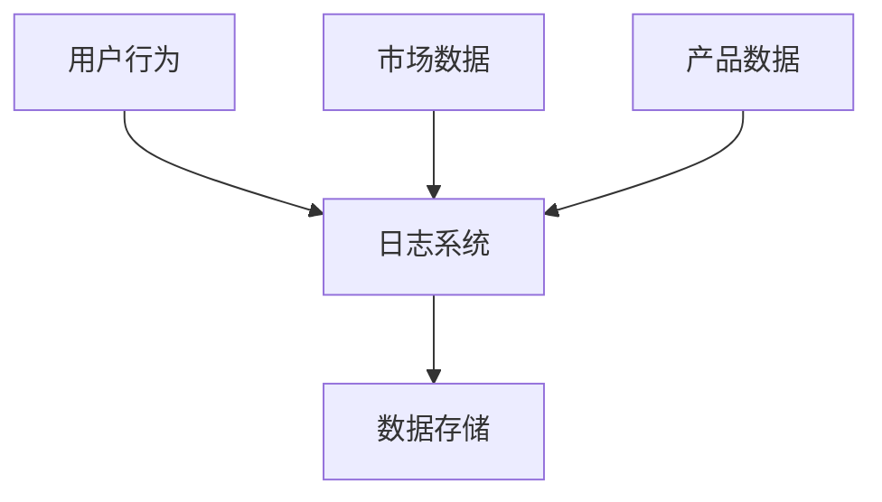

#### 2.2.2 用户画像构建  
用户画像是基于用户数据构建的用户模型，用于精准识别用户需求。  

**用户画像构建过程：**  
1. **数据清洗**：去除无效数据。  
2. **特征提取**：提取用户行为特征。  
3. **模型构建**：基于机器学习算法构建用户画像。  

#### 2.2.3 预测与推荐算法  
AI Agent在精准营销中的预测与推荐算法包括协同过滤和基于内容的推荐算法。  

**协同过滤算法实现代码示例：**  
```python  
def collaborative_filtering(user_matrix):  
    # 计算用户相似度  
    similarity_matrix = user_matrix.T.dot(user_matrix)  
    # 去除对角线上的1  
    similarity_matrix.setdiag(0)  
    # 找出相似度最高的用户  
    top_k_users = similarity_matrix.argsort()[:, -3:-1]  
    return top_k_users  
```  

---

### 2.3 个性化推荐的实现原理  

#### 2.3.1 推荐系统的分类  
推荐系统主要分为基于协同过滤的推荐和基于内容的推荐两大类。  

**推荐系统分类表：**  
| 类别           | 基于协同过滤 | 基于内容的推荐 |  
|----------------|--------------|----------------|  
| 原理           | 用户相似性   | 内容特征匹配   |  
| 优缺点         | 精度高，但需要大量数据 | 内容理解能力强，但可能推荐冷启动问题 |  

#### 2.3.2 基于协同过滤的推荐算法  
基于协同过滤的推荐算法通过计算用户相似度，推荐相似用户的商品。  

**协同过滤算法流程图：**  
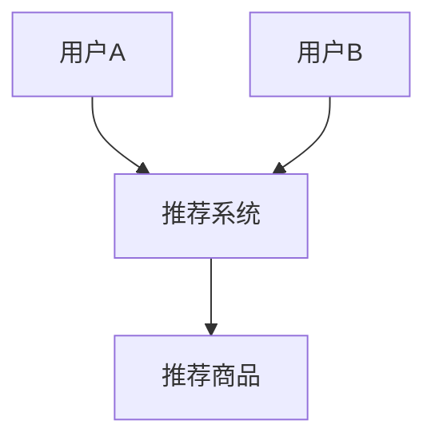

#### 2.3.3 基于内容的推荐算法  
基于内容的推荐算法通过分析商品内容特征，推荐相似商品。  

**内容推荐算法实现代码示例：**  
```python  
from sklearn.feature_extraction.text import TfidfVectorizer  
from sklearn.metrics.pairwise import cosine_similarity  

def content_based_recommendation(items):  
    vectorizer = TfidfVectorizer()  
    item_vectors = vectorizer.fit_transform(items)  
    similarity_matrix = cosine_similarity(item_vectors)  
    return similarity_matrix.argsort()[:,::-1]  
```  

---

## 第3章: 精准营销的理论基础  

### 3.1 精准营销的核心理论  

#### 3.1.1 客户细分理论  
客户细分理论是基于用户特征将客户分成不同群体，以实现精准营销。  

**客户细分模型：**  
- **RFM模型**：基于用户最近一次购买时间（Recency）、购买频率（Frequency）和购买金额（Monetary）进行客户细分。  

#### 3.1.2 客户生命周期理论  
客户生命周期理论将客户分为获取、发展、成熟和衰退四个阶段。  

**客户生命周期阶段图：**  
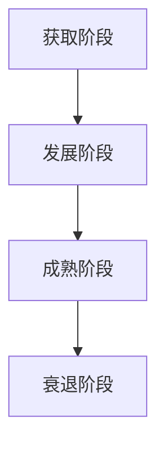

#### 3.1.3 客户价值理论  
客户价值理论通过分析客户对企业的贡献，制定差异化的营销策略。  

---

### 3.2 数据驱动的精准营销模型  

#### 3.2.1 数据采集与清洗  
数据驱动的精准营销模型需要对数据进行清洗，去除噪声数据。  

**数据清洗流程图：**  
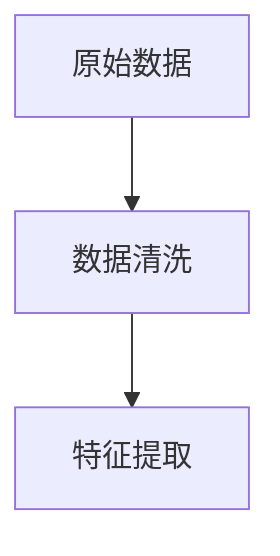

#### 3.2.2 数据分析与建模  
通过数据分析和建模，构建客户画像和预测模型。  

**数据分析与建模流程图：**  
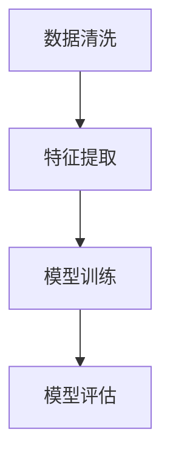

#### 3.2.3 模型评估与优化  
模型评估包括准确率、召回率和F1分数等指标。  

**模型评估指标表：**  
| 指标     | 公式                     |  
|----------|--------------------------|  
| 准确率   | TP + TN / (TP + FP + TN + FN) |  
| 召回率   | TP / (TP + FN)           |  
| F1分数   | 2 * (Precision * Recall) / (Precision + Recall) |  

---

### 3.3 个性化推荐的理论框架  

#### 3.3.1 用户行为分析  
用户行为分析是基于用户点击、浏览和购买数据，分析用户的兴趣和偏好。  

**用户行为分析流程图：**  
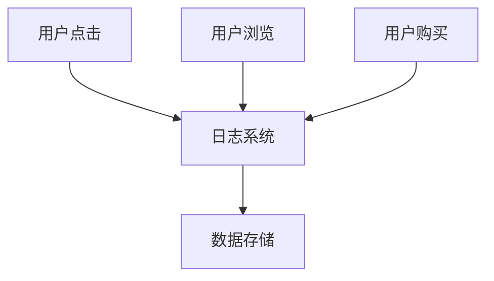

#### 3.3.2 用户偏好预测  
用户偏好预测是基于历史行为数据，预测用户的未来行为。  

**用户偏好预测模型：**  
$$ P(y=1|x) = \frac{e^{w \cdot x}}{1 + e^{w \cdot x}} $$  

#### 3.3.3 推荐策略优化  
推荐策略优化包括基于实时反馈的动态调整和基于用户行为的策略优化。  

---

## 第4章: 个性化推荐的实现机制  

### 4.1 推荐系统的实现流程  

#### 4.1.1 数据预处理  
数据预处理包括数据清洗、特征提取和数据标准化。  

**数据预处理流程图：**  
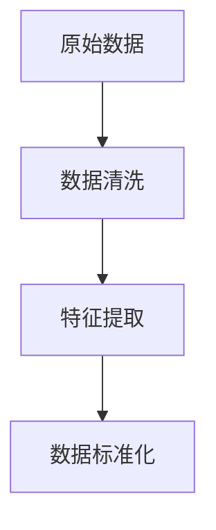

#### 4.1.2 特征提取  
特征提取是通过选择或生成特征，提高推荐系统的准确性。  

**特征提取方法：**  
- **基于统计的特征提取**：如TF-IDF。  
- **基于深度学习的特征提取**：如Word2Vec。  

#### 4.1.3 推荐生成  
推荐生成是基于模型预测结果，生成最终的推荐列表。  

---

### 4.2 基于机器学习的推荐算法  

#### 4.2.1 矩阵分解算法  
矩阵分解算法通过分解用户-商品矩阵，找到潜在的特征向量。  

**矩阵分解算法流程图：**  
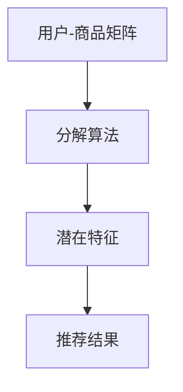

#### 4.2.2 深度学习推荐算法  
深度学习推荐算法通过神经网络模型，学习用户的兴趣特征。  

**深度学习推荐算法实现代码示例：**  
```python  
import tensorflow as tf  

def deep_learning_recommender(input_layer):  
    # 构建神经网络  
    dense_layer = tf.layers.dense(input_layer, 64, activation='relu')  
    output_layer = tf.layers.dense(dense_layer, 1, activation='sigmoid')  
    return output_layer  
```  

#### 4.2.3 混合推荐算法  
混合推荐算法结合多种推荐算法，提高推荐系统的性能。  

---

### 4.3 推荐系统的评估指标  

#### 4.3.1 精准率与召回率  
精准率是正确推荐的比例，召回率是正确推荐的比例。  

**精准率公式：**  
$$ Precision = \frac{TP}{TP + FP} $$  

**召回率公式：**  
$$ Recall = \frac{TP}{TP + FN} $$  

#### 4.3.2 F1分数与  
F1分数是精准率和召回率的调和平均数。  

**F1分数公式：**  
$$ F1 = 2 \cdot \frac{Precision \cdot Recall}{Precision + Recall} $$  

---

## 第5章: 系统分析与架构设计方案  

### 5.1 问题场景介绍  
系统需要实现一个基于AI Agent的精准营销与个性化推荐系统，目标是提高客户满意度和企业收益。  

### 5.2 项目介绍  
本项目旨在构建一个智能化的营销系统，实现精准客户定位和个性化推荐。  

---

### 5.3 系统功能设计  

#### 5.3.1 领域模型  
领域模型描述了系统的功能模块和交互关系。  

**领域模型类图：**  
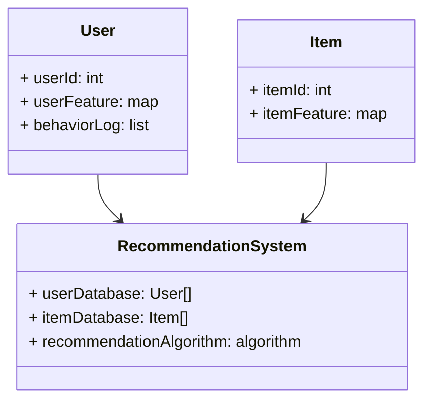

#### 5.3.2 系统架构设计  
系统架构设计包括数据采集层、数据处理层、算法层和应用层。  

**系统架构图：**  
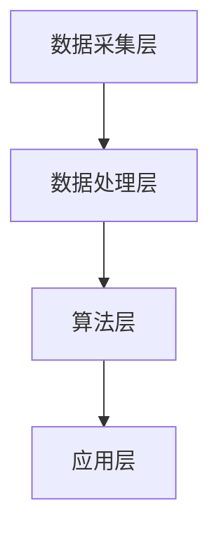

#### 5.3.3 系统接口设计  
系统接口设计包括数据接口和推荐接口。  

**系统接口序列图：**  
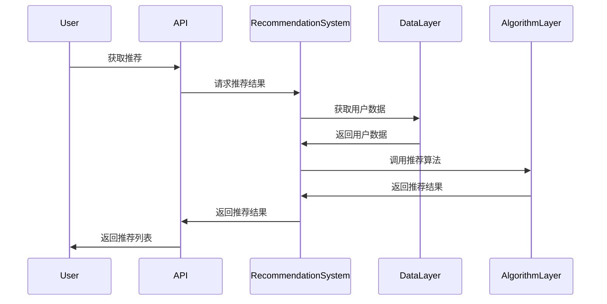

---

## 第6章: 项目实战  

### 6.1 环境安装  
需要安装Python、TensorFlow、Scikit-learn和相关数据处理库。  

### 6.2 核心实现  

#### 6.2.1 用户数据处理  
用户数据处理包括数据清洗和特征提取。  

**用户数据处理代码示例：**  
```python  
import pandas as pd  

def process_user_data(user_data):  
    # 数据清洗  
    user_data = user_data.dropna()  
    # 特征提取  
    user_features = user_data[['age', 'gender', 'purchase_history']]  
    return user_features  
```  

#### 6.2.2 推荐算法实现  
推荐算法实现包括协同过滤和深度学习推荐算法。  

**协同过滤算法实现代码示例：**  
```python  
from sklearn.metrics.pairwise import cosine_similarity  

def collaborative_filtering(user_matrix):  
    similarity_matrix = cosine_similarity(user_matrix)  
    return similarity_matrix.argsort()[:,::-1]  
```  

### 6.3 案例分析与详细解读  

#### 6.3.1 案例分析  
以电商企业的客户数据为例，构建推荐系统。  

**案例分析流程图：**  
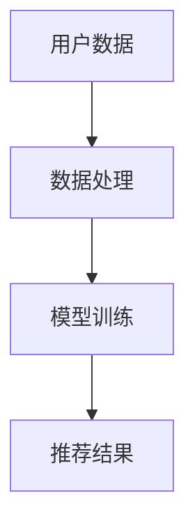

#### 6.3.2 详细解读  
通过分析用户数据，构建用户画像，并基于协同过滤算法生成推荐列表。  

### 6.4 项目小结  
本项目通过数据处理和算法实现，成功构建了一个智能化的推荐系统，能够实现精准营销和个性化推荐。  

---

## 第7章: 总结与展望  

### 7.1 总结  
本文详细介绍了AI Agent在精准营销和个性化推荐中的应用，从理论到实践，系统地分析了其实现原理和系统架构。  

### 7.2 未来展望  
未来，随着AI技术的不断发展，AI Agent在精准营销中的应用将更加广泛和深入，为企业创造更大的价值。  

---

## 附录  

### 附录A: 工具安装指南  
需要安装以下工具：  
- Python  
- TensorFlow  
- Scikit-learn  

### 附录B: 推荐系统API接口  

**API接口说明：**  
- **接口名称**：/api/recommend  
- **请求方法**：POST  
- **请求参数**：用户ID  
- **返回结果**：推荐列表  

---

## 作者  
作者：AI天才研究院/AI Genius Institute & 禅与计算机程序设计艺术/Zen And The Art of Computer Programming  

--- 

**本文由AI天才研究院（AI Genius Institute）原创，转载请注明出处。**

