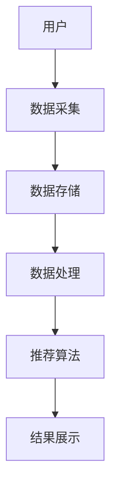
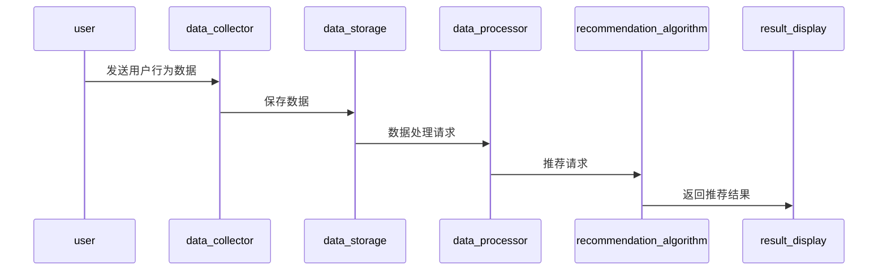

                 


# AI Agent在企业精准营销与个性化推荐中的深度应用

## 关键词：AI Agent, 精准营销, 个性化推荐, 机器学习, 推荐系统, 系统架构

## 摘要：  
随着人工智能技术的飞速发展，AI Agent（人工智能代理）在企业精准营销与个性化推荐中的应用日益广泛。本文系统地探讨了AI Agent的核心技术、算法原理、系统架构以及在实际应用场景中的深度应用。通过分析用户行为数据，构建用户画像，并结合协同过滤、基于内容的推荐和深度学习等算法，AI Agent能够实现精准的个性化推荐。本文还详细介绍了AI Agent在推荐系统中的实现过程，包括数据采集与处理、推荐算法实现和系统架构设计。通过实际案例分析和项目实战，本文展示了AI Agent在企业精准营销中的巨大潜力和应用前景，同时提出了未来的发展方向和优化建议。

---

## 第1章: AI Agent的基本概念与应用背景

### 1.1 AI Agent的定义与特点

#### 1.1.1 AI Agent的定义  
AI Agent（人工智能代理）是一种能够感知环境、执行任务并做出决策的智能实体。它通过数据输入、分析和处理，为用户提供智能化的服务或解决方案。AI Agent的核心在于其自主性、反应性和目标导向性。

#### 1.1.2 AI Agent的核心特点  
1. **自主性**：AI Agent能够自主决策和执行任务，无需人工干预。  
2. **反应性**：AI Agent能够实时感知环境变化并做出相应的反应。  
3. **目标导向性**：AI Agent的行为以实现特定目标为导向。  
4. **学习能力**：通过机器学习算法，AI Agent能够不断优化自身的推荐策略。  

#### 1.1.3 AI Agent与传统营销工具的对比  
传统营销工具如邮件营销、广告投放等，缺乏对用户行为的深度理解和实时反馈能力。而AI Agent能够通过大数据分析和机器学习算法，实时调整营销策略，实现精准营销。

---

### 1.2 企业精准营销与个性化推荐的背景

#### 1.2.1 精准营销的定义与目标  
精准营销是指基于用户的行为数据和偏好，通过个性化策略实现精准用户触达的过程。其目标是提高转化率和客户满意度，降低营销成本。

#### 1.2.2 个性化推荐的定义与优势  
个性化推荐是通过算法为用户推荐符合其兴趣和需求的内容或产品。其优势在于提高用户参与度和满意度，同时为企业创造更高的收益。

#### 1.2.3 现有营销工具的局限性  
传统营销工具难以实现真正的个性化推荐，往往基于简单的规则或历史数据，缺乏对用户实时行为和需求的深度理解。

---

### 1.3 AI Agent在精准营销中的应用前景

#### 1.3.1 AI Agent在精准营销中的优势  
1. **实时性**：AI Agent能够实时分析用户行为数据，快速调整营销策略。  
2. **精准性**：通过机器学习算法，AI Agent能够实现高度个性化的推荐。  
3. **高效性**：AI Agent能够自动化执行营销任务，提高营销效率。  

#### 1.3.2 个性化推荐的市场需求  
随着用户需求的多样化和市场竞争的加剧，企业对个性化推荐的需求日益增长。AI Agent能够满足这种需求，帮助企业实现精准营销。

#### 1.3.3 未来发展趋势与挑战  
未来，AI Agent将在精准营销中发挥更加重要的作用，但同时也面临数据隐私、算法优化和计算资源等挑战。

---

## 第2章: AI Agent的核心技术与实现原理

### 2.1 AI Agent的核心技术

#### 2.1.1 自然语言处理（NLP）  
NLP技术使得AI Agent能够理解和生成自然语言文本，从而更好地与用户交互。例如，通过NLP技术，AI Agent可以分析用户的邮件或聊天记录，提取用户的兴趣和需求。

#### 2.1.2 机器学习算法  
机器学习算法是AI Agent的核心技术之一。通过监督学习、无监督学习和强化学习等算法，AI Agent能够从数据中学习用户的行为模式，并生成推荐策略。

#### 2.1.3 数据挖掘与分析  
数据挖掘技术用于从海量数据中提取有价值的信息。AI Agent通过数据挖掘技术，可以发现用户的潜在需求和行为规律。

---

### 2.2 精准营销与个性化推荐的实现原理

#### 2.2.1 数据采集与处理  
AI Agent通过多种渠道（如网站、APP、社交媒体等）采集用户的行为数据，包括点击、浏览、购买等。数据采集后，需要进行清洗、预处理和特征提取。

#### 2.2.2 用户画像构建  
通过数据挖掘和机器学习技术，AI Agent可以构建用户画像，包括用户的兴趣、偏好、消费习惯等。用户画像是实现个性化推荐的基础。

#### 2.2.3 推荐算法实现  
基于用户画像和行为数据，AI Agent采用协同过滤、基于内容的推荐和深度学习等算法，生成个性化的推荐结果。

---

### 2.3 AI Agent在推荐系统中的应用

#### 2.3.1 协同过滤推荐  
协同过滤是一种经典的推荐算法，基于用户的行为相似性进行推荐。例如，如果用户A和用户B的行为相似，那么用户A喜欢的产品，用户B也可能喜欢。

#### 2.3.2 基于内容的推荐  
基于内容的推荐算法基于产品的属性（如标题、描述、标签等）进行推荐。例如，如果用户喜欢阅读科技类文章，AI Agent会推荐更多科技类的文章。

#### 2.3.3 混合推荐模型  
混合推荐模型结合了协同过滤和基于内容的推荐，能够在一定程度上克服单一算法的局限性。例如，协同过滤可能在冷启动问题上表现不佳，而基于内容的推荐则能够提供更多的上下文信息。

---

## 第3章: AI Agent的算法原理与数学模型

### 3.1 推荐系统算法原理

#### 3.1.1 协同过滤算法  
协同过滤算法基于用户的行为相似性进行推荐。具体实现中，可以采用基于用户的协同过滤（UBCF）和基于物品的协同过滤（IBCF）两种方法。

#### 3.1.2 基于内容的推荐算法  
基于内容的推荐算法通过分析产品的属性，生成推荐结果。例如，通过文本挖掘技术，提取文章的关键词，并基于关键词相似性进行推荐。

#### 3.1.3 深度学习推荐算法  
深度学习推荐算法（如神经网络协同过滤）能够处理复杂的用户行为数据，生成更精准的推荐结果。

---

### 3.2 算法实现的数学模型

#### 3.2.1 协同过滤的矩阵分解模型  
协同过滤的矩阵分解模型是通过矩阵分解技术，将用户-物品的评分矩阵分解为用户特征矩阵和物品特征矩阵。其数学表达式如下：  
$$R_{user-item} = P \cdot Q^T$$  
其中，$P$表示用户特征矩阵，$Q$表示物品特征矩阵。

#### 3.2.2 基于深度学习的推荐模型  
基于深度学习的推荐模型通常采用神经网络结构，例如多层感知机（MLP）或卷积神经网络（CNN）。其数学表达式如下：  
$$y = \sigma(w_1x + w_2h)$$  
其中，$x$表示输入特征，$h$表示隐藏层输出，$w_1$和$w_2$是模型参数，$\sigma$是激活函数。

---

### 3.3 算法实现的代码示例

```python
def collaborative_filtering(user_item_matrix):
    # SVD分解
    U, S, V = np.linalg.svd(user_item_matrix)
    # 选取前k个特征向量
    k = 5
    U_k = U[:, :k]
    V_k = V[:k, :]
    # 计算预测评分
    predicted_ratings = U_k.dot(V_k.T)
    return predicted_ratings
```

---

## 第4章: AI Agent的系统架构与项目实战

### 4.1 系统架构设计

#### 4.1.1 系统功能设计  
AI Agent的推荐系统通常包括数据采集、数据处理、推荐算法实现和结果展示四个模块。

#### 4.1.2 系统架构图  
以下是AI Agent推荐系统的架构图：



#### 4.1.3 系统接口设计  
推荐系统需要与前端和后端进行交互。前端发送用户的请求，后端接收请求并返回推荐结果。

#### 4.1.4 系统交互图  
以下是系统交互图：



---

### 4.2 项目实战

#### 4.2.1 环境安装  
推荐系统实现需要安装以下Python库：  
- numpy  
- pandas  
- scikit-learn  

#### 4.2.2 核心实现源代码  
以下是协同过滤算法的实现代码：

```python
from sklearn.metrics.pairwise import cosine_similarity

def collaborative_filtering(user_item_matrix):
    # 计算余弦相似度
    similarity = cosine_similarity(user_item_matrix)
    # 生成推荐结果
    recommendations = []
    for user in range(user_item_matrix.shape[0]):
        similar_users = np.argsort(similarity[user])[::-1]
        recommendations.append(similar_users)
    return recommendations
```

---

## 第5章: AI Agent在精准营销中的实际应用

### 5.1 实际案例分析

#### 5.1.1 案例背景  
某电商平台希望通过AI Agent实现个性化推荐，提高用户购买率。

#### 5.1.2 数据分析与用户画像  
通过分析用户的行为数据，构建用户画像，包括用户的兴趣、消费习惯等。

#### 5.1.3 推荐策略与结果展示  
基于协同过滤算法，为用户推荐相似商品，提高推荐精准度。

---

### 5.2 项目小结

#### 5.2.1 项目总结  
AI Agent通过协同过滤算法实现了个性化推荐，提高了用户的购买率和满意度。

#### 5.2.2 经验与教训  
在实际应用中，需要结合多种推荐算法，以提高推荐的准确性和多样性。

---

## 第6章: 未来展望与优化建议

### 6.1 未来发展趋势

#### 6.1.1 技术优化  
未来，深度学习和强化学习算法将得到更广泛的应用，推荐系统将更加智能化。

#### 6.1.2 数据隐私与安全  
随着数据隐私的重要性日益增加，推荐系统需要更加注重数据安全和用户隐私保护。

#### 6.1.3 多模态推荐  
多模态推荐（结合文本、图像、视频等多种数据形式）将成为未来的研究热点。

---

### 6.2 优化建议

#### 6.2.1 算法优化  
结合多种推荐算法，提高推荐的准确性和多样性。

#### 6.2.2 数据优化  
优化数据采集和处理流程，提高数据质量。

#### 6.2.3 系统优化  
优化系统架构，提高系统的稳定性和扩展性。

---

## 结语

AI Agent在企业精准营销与个性化推荐中的应用前景广阔。通过不断的技术创新和算法优化，AI Agent将为企业创造更大的价值，同时也将为用户提供更加精准和个性化的服务。

---

## 作者：AI天才研究院 & 禅与计算机程序设计艺术

---

**感谢您的阅读！如果本文对您有所帮助，请点赞、收藏并分享！**

