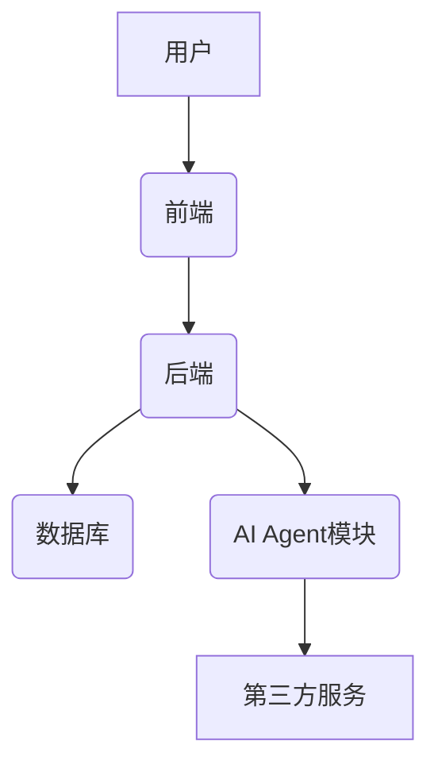
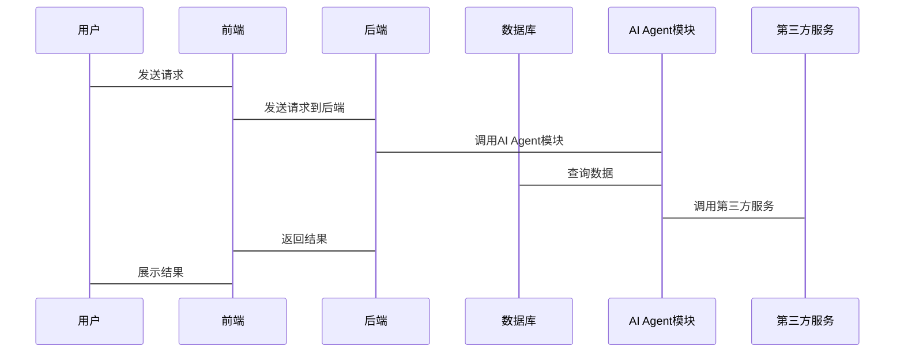

                 


# AI Agent在企业精准营销策略制定中的应用

## 关键词：AI Agent，精准营销，营销策略，人工智能，企业营销，数据驱动

## 摘要：  
本文探讨了AI Agent（人工智能代理）在企业精准营销策略制定中的应用。通过分析AI Agent的核心原理、算法模型以及在营销中的实际应用，本文详细阐述了AI Agent如何通过数据驱动的方式优化企业营销策略，实现精准客户画像、需求预测和个性化推荐。同时，本文还结合实际案例，介绍了AI Agent在系统设计与实现中的关键步骤和方法，为企业的精准营销提供了理论支持和实践指导。

---

# 第一部分: AI Agent与企业精准营销概述

---

# 第1章: AI Agent与精准营销的背景与概念

## 1.1 AI Agent的基本概念与核心原理

### 1.1.1 AI Agent的定义与分类

- **定义**：AI Agent是一种能够感知环境并采取行动以实现特定目标的智能实体。
- **分类**：
  - **简单反射型Agent**：基于简单的规则做出反应。
  - **基于模型的反射型Agent**：利用内部模型进行决策。
  - **目标驱动型Agent**：基于目标进行规划和行动。
  - **实用驱动型Agent**：通过优化效用函数实现目标。

### 1.1.2 AI Agent的核心技术与实现原理

- **核心技术**：
  - **任务规划**：通过算法生成行动序列以实现目标。
  - **自然语言处理（NLP）**：理解和生成人类语言。
  - **机器学习**：从数据中学习模式和规律。
- **实现原理**：
  - **感知**：通过传感器或数据输入获取环境信息。
  - **决策**：基于感知信息，利用算法生成行动方案。
  - **执行**：通过执行机构或接口实施决策。

### 1.1.3 AI Agent在企业中的应用价值

- **提升效率**：自动化处理重复性任务，降低人工成本。
- **优化决策**：通过数据驱动的分析，提高决策的准确性。
- **增强客户体验**：通过个性化服务提升客户满意度和忠诚度。

---

## 1.2 精准营销的定义与特征

### 1.2.1 精准营销的概念与目标

- **定义**：精准营销是以客户为中心，通过数据分析和技术手段，实现对目标客户的精准定位和个性化服务。
- **目标**：
  - 提高营销效率。
  - 增强客户转化率。
  - 提升客户满意度和忠诚度。

### 1.2.2 精准营销与传统营销的区别

| **维度**       | **精准营销**                          | **传统营销**                          |
|-----------------|--------------------------------------|--------------------------------------|
| 客户定位         | 基于数据和算法实现精准定位           | 基于市场和人群划分进行粗略定位         |
| 内容定制化       | 根据客户需求生成个性化内容           | 统一内容适用于所有目标客户             |
| 效果评估         | 可实时跟踪和优化营销效果             | 需要事后分析和评估                     |
| 技术依赖程度     | 高度依赖AI、大数据和机器学习技术       | 依赖市场调研和传统营销手段             |

### 1.2.3 精准营销的实现条件与挑战

- **实现条件**：
  - 数据来源丰富且准确。
  - 具备强大的数据分析和处理能力。
  - 有专业的技术团队支持。
- **挑战**：
  - 数据隐私和安全问题。
  - 技术实现的复杂性和成本。
  - 客户行为的不确定性。

---

## 1.3 AI Agent在精准营销中的作用

### 1.3.1 AI Agent如何赋能精准营销

- **数据处理与分析**：AI Agent能够快速处理大量数据，提取有价值的信息。
- **客户画像构建**：通过机器学习算法，AI Agent能够生成精准的客户画像。
- **个性化推荐**：基于客户行为和偏好，AI Agent能够提供个性化的推荐方案。
- **实时决策**：AI Agent能够在实时条件下做出最优决策，提升营销效果。

### 1.3.2 AI Agent在营销策略制定中的优势

- **数据驱动**：AI Agent能够基于数据进行分析和预测，避免主观判断的偏差。
- **实时响应**：AI Agent能够实时感知市场变化和客户需求，快速调整营销策略。
- **高效执行**：AI Agent能够自动化执行营销任务，提高效率和降低成本。

### 1.3.3 AI Agent与企业营销目标的结合

- **客户获取**：通过精准定位和个性化推荐，提高客户获取效率。
- **客户保留**：通过客户分层管理和个性化服务，提升客户忠诚度。
- **市场拓展**：通过需求预测和市场分析，帮助企业拓展新市场。

---

## 1.4 本章小结

本章介绍了AI Agent的基本概念、核心技术及其在企业中的应用价值，重点阐述了AI Agent在精准营销中的作用和优势。通过对比传统营销和精准营销的差异，揭示了AI Agent在精准营销中的独特价值和潜力。

---

# 第二部分: AI Agent的核心原理与技术实现

---

# 第2章: AI Agent的核心技术与算法原理

## 2.1 AI Agent的任务规划与决策模型

### 2.1.1 任务规划的基本原理

- **任务规划**是AI Agent的核心能力之一，它涉及将目标分解为一系列可执行的动作。
- **基本步骤**：
  1. **目标设定**：明确任务的目标和约束条件。
  2. **动作分解**：将目标分解为具体的动作序列。
  3. **环境感知**：通过传感器或数据源获取环境信息。
  4. **决策执行**：根据感知信息选择最优动作并执行。

### 2.1.2 基于强化学习的决策算法

- **强化学习**是一种通过试错学习来优化决策的算法。
- **基本原理**：
  - **状态（State）**：环境的当前情况。
  - **动作（Action）**：AI Agent采取的行动。
  - **奖励（Reward）**：执行动作后获得的反馈。
  - **策略（Policy）**：决定下一步动作的规则。
- **算法流程**：
  1. AI Agent根据当前状态选择一个动作。
  2. 执行动作并观察环境的变化，获得奖励。
  3. 根据奖励调整策略，优化下一步的动作选择。

### 2.1.3 决策树与规则引擎的应用

- **决策树**是一种树状结构，用于表示可能的决策路径。
- **规则引擎**是一种用于定义和执行业务规则的工具。
- **应用场景**：
  - 客户分层与管理。
  - 个性化推荐。

---

## 2.2 自然语言处理与客户意图识别

### 2.2.1 NLP技术在营销中的应用

- **NLP技术**包括文本分类、实体识别、情感分析等。
- **应用场景**：
  - 客户反馈分析。
  - 聊天机器人对话处理。
  - 文本摘要与总结。

### 2.2.2 基于Transformer的意图识别模型

- **Transformer模型**是一种基于自注意力机制的深度学习模型。
- **意图识别流程**：
  1. **输入文本**：客户反馈或查询。
  2. **文本编码**：将文本转换为向量表示。
  3. **自注意力机制**：计算每个词与其他词的相关性。
  4. **意图分类**：基于向量表示和分类器预测客户意图。

### 2.2.3 实例分析：客户反馈文本的意图识别

- **案例**：客户反馈“这个产品的功能很实用，但价格有点贵”。
- **意图识别**：
  - **情感分析**：负面情绪。
  - **关键词提取**：价格、贵。
  - **意图分类**：价格敏感，可能影响购买决策。

---

## 2.3 机器学习与客户画像构建

### 2.3.1 客户画像的概念与构建步骤

- **客户画像**：基于客户数据构建的客户特征模型。
- **构建步骤**：
  1. **数据收集**：收集客户的基本信息、行为数据和交互记录。
  2. **数据清洗**：处理缺失值、异常值和重复数据。
  3. **特征提取**：提取有助于客户分群的关键特征。
  4. **模型训练**：利用聚类或分类算法构建客户画像。

### 2.3.2 聚类算法在客户分群中的应用

- **聚类算法**包括K-means、DBSCAN等。
- **应用案例**：将客户分为高价值客户、潜在客户和低价值客户。

### 2.3.3 深度学习模型在客户行为预测中的应用

- **深度学习模型**包括神经网络、卷积神经网络和循环神经网络。
- **应用场景**：
  - 客户 churn 预测。
  - 购买行为预测。

---

## 2.4 本章小结

本章详细讲解了AI Agent的核心技术与算法原理，包括任务规划与决策模型、自然语言处理与客户意图识别以及机器学习与客户画像构建。这些技术为AI Agent在精准营销中的应用奠定了理论基础。

---

# 第三部分: AI Agent在精准营销中的应用

---

# 第3章: 精准营销策略的制定与实施

## 3.1 精准营销策略的制定框架

### 3.1.1 精准营销的策略层次

- **战略层**：制定长期营销目标和战略。
- **战术层**：设计具体的营销活动和实施方案。
- **执行层**：具体执行营销任务和活动。

### 3.1.2 策略制定的关键步骤

1. **市场分析**：分析市场趋势和竞争对手。
2. **客户画像**：构建精准的客户画像。
3. **目标设定**：明确营销目标和关键绩效指标。
4. **策略设计**：制定具体的营销策略和实施方案。

### 3.1.3 策略实施的保障措施

- **数据支持**：确保数据的准确性和及时性。
- **技术支持**：提供强大的技术平台和工具。
- **团队协作**：建立高效的团队协作机制。

---

## 3.2 AI Agent在需求预测中的应用

### 3.2.1 需求预测的模型选择

- **模型选择**：
  - 时间序列模型：ARIMA、LSTM。
  - 机器学习模型：随机森林、梯度提升树。
  - 深度学习模型：卷积神经网络、变压器模型。

### 3.2.2 时间序列分析与需求预测

- **时间序列分析**：通过历史数据预测未来趋势。
- **需求预测流程**：
  1. 数据预处理：清洗和转换数据。
  2. 模型训练：选择合适的模型进行训练。
  3. 预测与优化：根据预测结果进行调整和优化。

### 3.2.3 基于机器学习的需求预测优化

- **机器学习模型**：随机森林和梯度提升树。
- **优化方法**：
  - 调参：调整模型参数以提高预测精度。
  - 集成学习：结合多个模型的结果进行预测。

---

## 3.3 AI Agent在个性化推荐中的应用

### 3.3.1 推荐系统的分类与特点

- **推荐系统分类**：
  - 基于协同过滤的推荐。
  - 基于内容的推荐。
  - 基于混合模型的推荐。
- **特点**：
  - 个性化：根据客户需求提供定制化推荐。
  - 实时性：快速响应客户需求。
  - 可解释性：推荐结果可以被理解和解释。

### 3.3.2 基于协同过滤的推荐算法

- **协同过滤**：基于用户行为相似性推荐商品或内容。
- **算法实现**：
  1. 数据预处理：构建用户-商品矩阵。
  2. 相似度计算：计算用户或商品之间的相似度。
  3. 推荐生成：基于相似度进行推荐。

### 3.3.3 基于深度学习的推荐模型

- **深度学习模型**：神经网络、自动编码器、变压器模型。
- **应用场景**：
  - 个性化推荐。
  - 内容推荐。

---

## 3.4 AI Agent在客户分层与管理中的应用

### 3.4.1 客户分层的策略与方法

- **客户分层策略**：
  - 根据客户价值、行为特征和需求偏好进行分层。
  - 分层方法：聚类分析、决策树、随机森林。
- **客户分层应用**：
  - 高价值客户：提供个性化服务。
  - 潜在客户：制定针对性营销策略。
  - 低价值客户：优化服务或降低流失风险。

### 3.4.2 基于AI Agent的客户生命周期管理

- **客户生命周期**：
  - 获取阶段：吸引新客户。
  - 培育阶段：提升客户忠诚度。
  - 成熟阶段：最大化客户价值。
  - 衰退阶段：减少客户流失。

### 3.4.3 客户流失预测与干预策略

- **客户流失预测**：
  - 基于机器学习的流失预测模型。
  - 预测方法：逻辑回归、随机森林、XGBoost。
- **干预策略**：
  - 提供个性化优惠。
  - 改善客户体验。
  - 加强客户沟通。

---

## 3.5 本章小结

本章详细探讨了AI Agent在精准营销策略制定中的具体应用，包括需求预测、个性化推荐和客户分层管理。通过结合AI Agent的核心技术，展示了如何利用这些技术优化企业的营销策略，提升营销效果。

---

# 第四部分: 系统设计与实现

---

# 第4章: AI Agent精准营销系统的设计与架构

## 4.1 系统功能需求分析

### 4.1.1 系统目标与功能模块划分

- **系统目标**：构建一个基于AI Agent的精准营销系统，实现客户画像、需求预测和个性化推荐功能。
- **功能模块**：
  1. 数据采集模块：收集客户数据和市场信息。
  2. 数据处理模块：清洗和预处理数据。
  3. 客户画像模块：构建客户画像和分层。
  4. 需求预测模块：基于机器学习进行需求预测。
  5. 个性化推荐模块：提供个性化推荐服务。
  6. 系统管理模块：管理用户和权限。

### 4.1.2 用户角色

- **用户角色**：
  - **管理员**：系统管理员，负责系统配置和管理。
  - **营销人员**：负责营销策略的制定和实施。
  - **客户**：系统服务的最终用户。

---

## 4.2 系统架构设计

### 4.2.1 系统架构图



### 4.2.2 系统交互流程

1. **用户请求**：用户发送请求到前端。
2. **前端处理**：前端接收请求并进行初步处理。
3. **后端处理**：后端接收请求，调用AI Agent模块进行处理。
4. **数据库操作**：后端与数据库进行数据交互。
5. **AI Agent处理**：AI Agent模块进行数据分析和处理。
6. **第三方服务调用**：后端调用第三方服务（如支付网关）。
7. **响应返回**：后端将结果返回到前端，前端展示给用户。

---

## 4.3 系统实现细节

### 4.3.1 数据采集与处理

- **数据采集**：通过API接口、爬虫或其他数据源获取数据。
- **数据清洗**：处理缺失值、异常值和重复数据。
- **特征提取**：提取有助于模型训练的关键特征。

### 4.3.2 AI Agent模块实现

- **任务规划**：基于强化学习的决策算法。
- **自然语言处理**：基于Transformer的意图识别模型。
- **机器学习**：基于随机森林的需求预测模型。

### 4.3.3 系统接口设计

- **接口定义**：
  - `/api/v1/customer_data`：客户数据接口。
  - `/api/v1/predict_demand`：需求预测接口。
  - `/api/v1/recommend_products`：个性化推荐接口。

### 4.3.4 系统交互设计

- **交互流程**：
  1. 用户发送请求。
  2. 系统处理请求并返回结果。
  3. 用户接收结果并进行下一步操作。

---

## 4.4 本章小结

本章详细设计了AI Agent精准营销系统的架构和实现方案，包括系统功能模块划分、系统架构设计和系统实现细节。通过具体的接口设计和交互流程，展示了如何将AI Agent技术应用于实际的营销系统中。

---

# 第五部分: 项目实战

---

# 第5章: 项目实战：AI Agent精准营销系统开发

## 5.1 项目背景与目标

### 5.1.1 项目背景

- **行业背景**：随着市场竞争的加剧，企业需要更加精准的营销策略。
- **技术背景**：AI Agent技术的成熟为企业提供了技术支持。

### 5.1.2 项目目标

- **目标**：开发一个基于AI Agent的精准营销系统，实现客户画像、需求预测和个性化推荐功能。

---

## 5.2 系统核心实现

### 5.2.1 数据采集与预处理

```python
import pandas as pd

# 数据采集
data = pd.read_csv('customer_data.csv')

# 数据清洗
data.dropna(inplace=True)
data = data[~data['age'].isnull()]
```

### 5.2.2 客户画像构建

```python
from sklearn.cluster import KMeans

# 特征提取
X = data[['age', 'income', 'purchase_frequency']]

# 模型训练
model = KMeans(n_clusters=3, random_state=42)
model.fit(X)

# 分群结果
data['cluster'] = model.predict(X)
```

### 5.2.3 个性化推荐系统

```python
from surprise import SVD
from surprise.dataset import Dataset
from surprise.model_selection import train_test_split

# 数据加载
data = Dataset.load_from_file('interactions.csv', format='csv', sep=',', header=None)

# 数据划分
train_set, test_set = train_test_split(data, test_size=0.2)

# 模型训练
model = SVD()
model.fit(train_set)

# 预测与推荐
for user in range(model.n_users):
    for article in model.get_top_n(user, n=3):
        print(f'User {user}推荐{article}')
```

---

## 5.3 实际案例分析与解读

### 5.3.1 案例背景

- **行业**：电子商务。
- **目标**：提高客户转化率和满意度。

### 5.3.2 案例分析

- **客户画像**：将客户分为高价值客户、潜在客户和低价值客户。
- **需求预测**：预测未来三个月的销售额。
- **个性化推荐**：为高价值客户提供个性化推荐，为潜在客户提供促销活动。

---

## 5.4 项目总结与优化

### 5.4.1 项目总结

- **成果**：成功开发了一个基于AI Agent的精准营销系统，实现了客户画像、需求预测和个性化推荐功能。
- **经验**：数据质量和模型选择对系统性能有重要影响。
- **挑战**：数据隐私和模型优化是未来需要关注的重点。

### 5.4.2 项目优化

- **数据优化**：引入更多数据源，提高数据的准确性和全面性。
- **模型优化**：尝试不同的算法和模型组合，进一步提高预测精度。
- **系统优化**：优化系统架构，提高系统的稳定性和可扩展性。

---

# 第五部分: 总结与展望

---

# 第6章: 总结与展望

## 6.1 本章总结

本文详细探讨了AI Agent在企业精准营销策略制定中的应用，从理论到实践，全面分析了AI Agent的核心技术、算法原理以及在精准营销中的具体应用。通过系统设计与实现，展示了如何将AI Agent技术应用于实际的营销系统中。

## 6.2 对未来研究的展望

- **技术发展**：随着AI技术的不断进步，AI Agent在精准营销中的应用将更加广泛和深入。
- **数据隐私**：数据隐私和安全问题将受到更多关注。
- **多模态营销**：结合图像、视频等多种形式的数据，提升营销效果。
- **实时营销**：通过实时数据分析和决策，实现真正的实时营销。

---

## 作者：AI天才研究院/AI Genius Institute & 禅与计算机程序设计艺术 /Zen And The Art of Computer Programming

---

# 附录: 算法代码与模型实现

---

**附录A: 客户画像构建代码**

```python
import pandas as pd
from sklearn.cluster import KMeans

# 数据加载
data = pd.read_csv('customer.csv')

# 数据清洗
data.dropna(inplace=True)

# 特征提取
X = data[['age', 'income', 'purchase_frequency']]

# 模型训练
model = KMeans(n_clusters=3, random_state=42)
model.fit(X)

# 分群结果
data['cluster'] = model.predict(X)

# 输出结果
print(data.head())
```

---

**附录B: 个性化推荐系统代码**

```python
from surprise import SVD
from surprise.dataset import Dataset
from surprise.model_selection import train_test_split

# 数据加载
data = Dataset.load_from_file('interactions.csv', format='csv', sep=',', header=None)

# 数据划分
train_set, test_set = train_test_split(data, test_size=0.2)

# 模型训练
model = SVD()
model.fit(train_set)

# 推荐生成
for user in range(model.n_users):
    for article in model.get_top_n(user, n=3):
        print(f'User {user}推荐{article}')
```

---

**附录C: 需求预测模型代码**

```python
import pandas as pd
from sklearn.ensemble import RandomForestRegressor

# 数据加载
data = pd.read_csv('demand.csv')

# 数据清洗
data.dropna(inplace=True)

# 特征提取
X = data[['price', 'promotion', 'season']]
y = data['demand']

# 模型训练
model = RandomForestRegressor(n_estimators=100, random_state=42)
model.fit(X, y)

# 预测结果
print(model.predict([[100, 1, 'summer']]))
```

---

**附录D: 系统架构图**


---

**附录E: 系统交互流程图**



---

通过本文的详细讲解和代码示例，读者可以全面理解AI Agent在企业精准营销策略制定中的应用，并能够将这些技术应用于实际的营销场景中。

