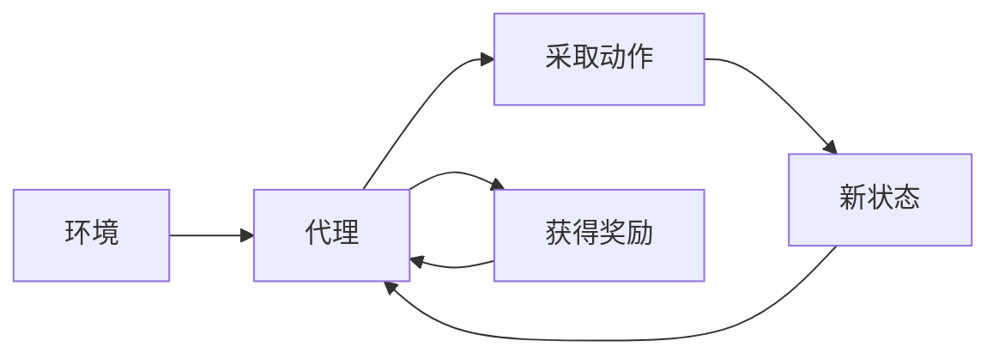

                 

# AI Agent在企业精准营销策略制定中的数据驱动应用

> 关键词：AI Agent, 数据驱动, 精准营销, 强化学习, 企业营销策略

> 摘要：  
> 在数字化转型的浪潮中，企业精准营销的核心竞争力逐渐从“经验驱动”转向“数据驱动”。AI Agent（人工智能代理）作为数据驱动营销的核心工具，通过自动化数据采集、分析和决策，帮助企业实现精准营销目标。本文从AI Agent的基本概念、算法原理、数据驱动的营销策略制定、系统架构设计到项目实战，全面解析AI Agent在企业精准营销中的应用。通过案例分析和数学模型的深入探讨，为企业提供可操作的AI Agent营销解决方案。

---

# 第一部分: AI Agent与企业精准营销概述

## 第1章: AI Agent与精准营销概述

### 1.1 AI Agent的基本概念

#### 1.1.1 AI Agent的定义与特点
AI Agent（人工智能代理）是一种能够感知环境、自主决策并执行任务的智能系统。其核心特点包括：
- **自主性**：能够在没有人工干预的情况下自主运行。
- **反应性**：能够实时感知环境变化并做出响应。
- **学习能力**：通过数据学习优化决策模型。
- **可扩展性**：能够根据需求扩展功能和服务范围。

#### 1.1.2 AI Agent与传统营销的区别
传统营销依赖于人工经验判断和固定规则，而AI Agent通过数据驱动的方式，能够实时分析海量数据并动态优化营销策略。AI Agent的优势在于：
- **实时性**：能够快速响应市场变化。
- **精准性**：基于数据的决策更加精准。
- **可扩展性**：能够处理大规模数据和复杂场景。

#### 1.1.3 数据驱动在精准营销中的重要性
数据是AI Agent的核心驱动力。通过数据驱动，企业可以：
- **精准识别目标客户**：基于客户行为数据进行画像。
- **优化营销策略**：通过数据建模预测最佳营销方案。
- **动态调整策略**：实时跟踪数据变化，动态优化策略。

### 1.2 AI Agent在企业营销中的应用背景

#### 1.2.1 传统营销的局限性
传统营销主要依赖人工经验判断，存在以下问题：
- **效率低下**：人工筛选客户和制定策略耗时长、成本高。
- **精准度不足**：缺乏对海量数据的深度分析，导致策略执行效果不理想。
- **灵活性差**：难以快速响应市场变化和客户需求。

#### 1.2.2 数据驱动营销的优势
数据驱动营销通过AI Agent技术，能够实现以下优势：
- **高效性**：通过自动化数据处理和决策，提高营销效率。
- **精准性**：基于数据建模，精准识别目标客户并制定个性化策略。
- **灵活性**：能够快速响应市场变化，动态调整营销策略。

#### 1.2.3 企业精准营销的核心目标
企业精准营销的核心目标是：
1. **提高客户转化率**：通过精准识别目标客户，制定个性化营销策略。
2. **降低营销成本**：通过数据驱动优化营销资源配置。
3. **提升客户满意度**：通过个性化服务提高客户忠诚度。

### 1.3 本章小结
本章介绍了AI Agent的基本概念及其在企业精准营销中的应用背景，重点分析了数据驱动营销的优势和核心目标。通过对比传统营销与数据驱动营销的差异，为后续章节的深入分析奠定了基础。

---

# 第二部分: AI Agent的核心概念与原理

## 第2章: AI Agent的核心概念与原理

### 2.1 AI Agent的核心概念

#### 2.1.1 AI Agent的组成要素
AI Agent的组成要素包括：
- **感知模块**：负责数据采集和环境感知。
- **决策模块**：基于数据进行分析和决策。
- **执行模块**：根据决策结果执行具体操作。
- **学习模块**：通过数据学习优化决策模型。

#### 2.1.2 AI Agent与企业营销目标的关系
AI Agent通过数据驱动的方式，帮助企业实现精准营销目标。具体体现在：
- **客户画像**：通过数据建模精准识别目标客户。
- **策略优化**：基于数据反馈动态调整营销策略。
- **效果评估**：通过数据监测和分析，评估营销效果。

#### 2.1.3 数据驱动在AI Agent中的作用
数据是AI Agent的核心驱动力。通过数据驱动，AI Agent能够：
- **实时分析客户行为**：基于实时数据优化营销策略。
- **预测客户需求**：通过数据建模预测客户行为。
- **优化营销渠道**：基于数据反馈优化营销渠道分配。

### 2.2 AI Agent的核心原理

#### 2.2.1 数据采集与处理
数据采集与处理是AI Agent的核心步骤之一。主要包括：
- **数据采集**：通过API接口、爬虫等方式采集客户行为数据、交易数据等。
- **数据清洗**：对采集到的数据进行去重、去噪、填充缺失值等处理。
- **数据预处理**：将数据转换为适合建模的形式，例如标准化、归一化等。

#### 2.2.2 数据分析与建模
数据分析与建模是AI Agent的核心步骤。主要包括：
- **数据分析**：通过统计分析、可视化分析等方式，发现数据中的规律和趋势。
- **数据建模**：基于数据特征构建预测模型，例如回归模型、分类模型、聚类模型等。
- **模型优化**：通过调整模型参数、特征选择等方式，提升模型预测准确率。

#### 2.2.3 AI Agent的决策过程
AI Agent的决策过程包括以下几个步骤：
1. **数据采集与预处理**：采集并清洗数据，确保数据质量。
2. **数据建模与分析**：基于数据特征构建预测模型，进行数据分析。
3. **策略制定**：根据模型预测结果，制定精准营销策略。
4. **策略执行**：通过API或自动化工具执行营销策略。
5. **效果评估**：通过数据反馈，评估营销策略的效果，并进行优化。

### 2.3 本章小结
本章详细介绍了AI Agent的核心概念与原理，包括其组成要素、数据驱动的作用以及决策过程。通过分析数据采集与处理、数据分析与建模等关键步骤，为后续章节的深入分析奠定了理论基础。

---

# 第三部分: AI Agent的核心算法与数学模型

## 第3章: AI Agent的核心算法与数学模型

### 3.1 强化学习算法

#### 3.1.1 强化学习的基本原理
强化学习是一种基于奖励机制的机器学习方法。其基本原理是：
- **环境与代理**：代理（AI Agent）通过与环境互动，获取奖励或惩罚。
- **策略优化**：通过不断试错，优化策略以最大化累积奖励。

#### 3.1.2 Q-Learning算法的数学模型
Q-Learning算法是强化学习中的经典算法，其数学模型如下：

状态转移方程：
$$ Q(s, a) = Q(s, a) + \alpha [r + \max_{a'} Q(s', a') - Q(s, a)] $$

其中：
- \( Q(s, a) \) 表示在状态 \( s \) 下执行动作 \( a \) 的价值。
- \( \alpha \) 表示学习率。
- \( r \) 表示奖励值。
- \( \max_{a'} Q(s', a') \) 表示在新状态 \( s' \) 下的最大价值动作。

#### 3.1.3 算法流程图

### 3.2 监督学习算法

#### 3.2.1 监督学习的基本原理
监督学习是一种基于标签数据的机器学习方法。其基本原理是：
- **训练数据**：包含输入特征 \( X \) 和目标标签 \( Y \)。
- **模型训练**：通过优化目标函数，找到输入特征与目标标签之间的映射关系。

#### 3.2.2 线性回归模型的数学公式
线性回归模型是最简单的监督学习模型之一，其数学公式为：
$$ y = \beta_0 + \beta_1 x + \epsilon $$

其中：
- \( y \) 表示目标变量。
- \( x \) 表示输入特征。
- \( \beta_0 \) 和 \( \beta_1 \) 表示模型参数。
- \( \epsilon \) 表示误差项。

#### 3.2.3 决策树算法的实现流程
决策树算法是一种基于树状结构的分类算法。其实现流程如下：
1. **特征选择**：选择能够最好地划分数据集的特征。
2. **数据分割**：根据选择的特征将数据集分割成子数据集。
3. **树的构建**：递归地构建决策树，直到满足停止条件（例如叶子节点样本数小于某个阈值）。
4. **剪枝**：为了防止过拟合，对决策树进行剪枝处理。

### 3.3 聚类算法

#### 3.3.1 聚类分析的基本原理
聚类分析是一种无监督学习方法，其基本原理是：
- **数据分组**：将数据集分成若干个簇，使得同一簇内的数据点相似，不同簇之间的数据点差异较大。

#### 3.3.2 K-Means算法的数学公式
K-Means算法是一种经典的聚类算法，其数学公式如下：
$$ \arg \min_{K} \sum_{i=1}^{n} \min_{k=1}^{K} (x_i - c_k)^2 $$

其中：
- \( n \) 表示数据点的数量。
- \( K \) 表示簇的数量。
- \( c_k \) 表示第 \( k \) 个簇的中心点。

#### 3.3.3 聚类算法的应用场景
聚类算法广泛应用于客户分群、市场细分等领域。例如，在客户分群中，可以通过聚类算法将客户分为不同的群体，从而制定个性化的营销策略。

### 3.4 本章小结
本章详细介绍了AI Agent的核心算法，包括强化学习、监督学习和聚类算法。通过数学公式和流程图的展示，帮助读者理解这些算法的基本原理和实现流程。

---

# 第四部分: 数据驱动的营销策略制定

## 第4章: 数据驱动的营销策略制定

### 4.1 数据采集与处理

#### 4.1.1 数据来源与采集方法
数据来源主要包括：
- **第一方数据**：企业自有数据，例如客户行为数据、交易数据等。
- **第三方数据**：通过外部数据源获取的数据，例如社交媒体数据、行业数据等。

数据采集方法包括：
- **API接口**：通过API接口获取实时数据。
- **网络爬虫**：通过爬虫技术获取网页数据。
- **数据库查询**：通过数据库查询获取结构化数据。

#### 4.1.2 数据清洗与预处理
数据清洗与预处理是数据驱动营销的重要步骤。主要包括：
- **去重**：去除重复数据。
- **去噪**：去除异常值和噪声数据。
- **数据补全**：填充缺失值。
- **数据转换**：将数据转换为适合建模的形式，例如标准化、归一化等。

#### 4.1.3 数据存储与管理
数据存储与管理是数据驱动营销的基础。常用的数据存储方式包括：
- **关系型数据库**：例如MySQL、PostgreSQL等。
- **非关系型数据库**：例如MongoDB、Redis等。
- **大数据平台**：例如Hadoop、Spark等。

### 4.2 数据分析与建模

#### 4.2.1 数据分析的基本方法
数据分析的基本方法包括：
- **描述性分析**：通过统计分析和可视化分析，描述数据的基本特征。
- **预测性分析**：通过建模和预测，预测未来趋势。
- **诊断性分析**：通过分析数据背后的原因，找出问题的根源。
- **规范性分析**：通过制定规则和优化建议，指导实际操作。

#### 4.2.2 数据建模的流程与工具
数据建模的流程包括：
1. **问题定义**：明确建模目标和需求。
2. **数据准备**：进行数据清洗和预处理。
3. **模型选择**：选择适合的建模方法。
4. **模型训练**：基于训练数据训练模型。
5. **模型评估**：通过测试数据评估模型性能。
6. **模型优化**：通过调整参数和特征选择优化模型。
7. **模型部署**：将模型部署到实际业务中。

常用的数据建模工具包括：
- **Python**：例如P

