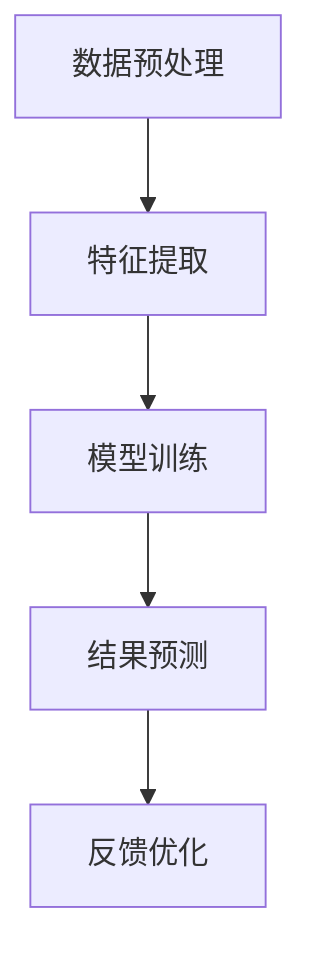
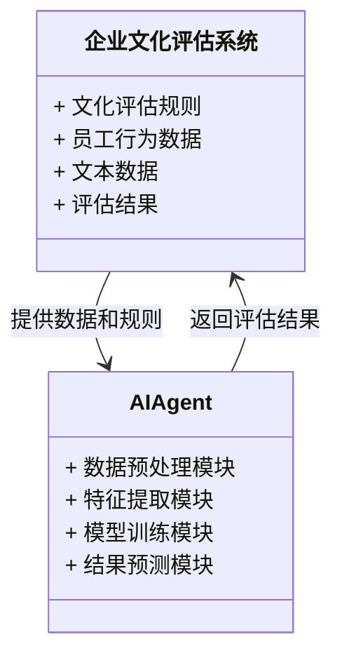
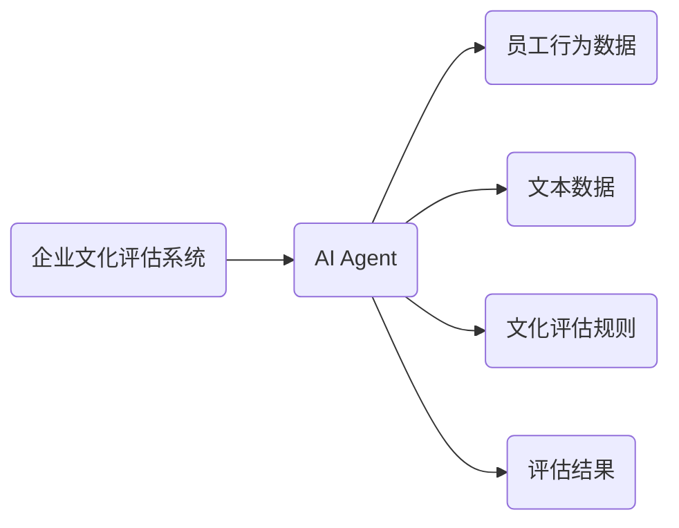

                 


```markdown
# AI Agent在企业组织文化评估与塑造中的应用

> 关键词：AI Agent, 企业组织文化, 文化评估, 文化塑造, 人工智能

> 摘要：本文探讨了AI Agent在企业组织文化评估与塑造中的应用，从背景、核心概念、算法原理、系统架构到项目实战，全面分析了AI Agent如何通过自然语言处理和机器学习技术，帮助企业实现组织文化的智能化评估与优化。文章深入浅出地解释了相关技术，并通过具体案例展示了AI Agent的实际应用场景，为企业管理者和技术开发者提供了理论与实践相结合的参考。

---

## 第1章: AI Agent与企业组织文化评估的背景

### 1.1 企业组织文化的定义与重要性

#### 1.1.1 企业组织文化的定义
企业组织文化是指企业在长期经营过程中形成的，由企业理念、价值观、行为规范和习惯等构成的综合体系。它是企业内部凝聚力和对外竞争力的重要支撑。

#### 1.1.2 企业组织文化的核心要素
- **企业愿景与使命**：企业存在的目的和长远目标。
- **核心价值观**：企业认同的基本信念和价值标准。
- **组织结构与流程**：企业内部的分工与协作方式。
- **员工行为规范**：员工在工作中的行为准则。
- **企业氛围**：企业内部的文化氛围，包括沟通、创新、协作等方面。

#### 1.1.3 企业组织文化的重要性
- 提升员工归属感和忠诚度。
- 增强企业的凝聚力和竞争力。
- 促进企业的持续创新和发展。

### 1.2 AI Agent的基本概念与特点

#### 1.2.1 AI Agent的定义
AI Agent（人工智能代理）是指能够感知环境、自主决策并执行任务的智能体。它通过数据处理和机器学习技术，能够理解上下文并做出适应性反应。

#### 1.2.2 AI Agent的核心特点
- **自主性**：能够在无外部干预下执行任务。
- **反应性**：能够根据环境变化调整行为。
- **学习能力**：通过数据和经验不断优化自身模型。
- **交互性**：能够与人类或其他系统进行有效沟通。

#### 1.2.3 AI Agent与传统评估工具的区别
- **数据处理能力**：AI Agent能够处理大量非结构化数据，提供更全面的分析。
- **实时性**：AI Agent可以实时监控和反馈，而传统工具通常需要人工定期更新。
- **智能化**：AI Agent能够主动学习和优化，而传统工具仅提供固定分析框架。

### 1.3 企业组织文化评估的现状与挑战

#### 1.3.1 传统企业组织文化评估方法的局限性
- **主观性**：传统评估多依赖员工问卷调查，结果可能存在主观偏差。
- **数据量有限**：传统方法通常基于小样本数据，分析结果可能不够全面。
- **缺乏动态性**：传统方法难以实时跟踪企业文化的演变过程。

#### 1.3.2 AI Agent在评估中的优势
- **高效性**：AI Agent能够快速处理大量数据，提高评估效率。
- **准确性**：通过机器学习算法，AI Agent能够减少人为误差，提高评估结果的准确性。
- **可扩展性**：AI Agent适用于大规模数据处理，能够扩展到不同规模的企业。

#### 1.3.3 当前应用中的主要挑战
- **数据隐私问题**：企业内部数据涉及员工隐私，如何保护数据安全是一个重要挑战。
- **技术局限性**：AI技术的成熟度和适用性仍有待提高，尤其是在处理复杂的社会学问题时。
- **接受度问题**：部分企业管理层和员工可能对AI技术的应用持怀疑态度，影响其推广。

---

## 第2章: AI Agent在企业组织文化评估中的应用前景

### 2.1 AI Agent在文化评估中的潜在应用场景

#### 2.1.1 文化氛围分析
通过自然语言处理技术，AI Agent能够分析企业内部的邮件、会议记录、员工反馈等文本数据，识别企业内部的文化倾向和潜在问题。

#### 2.1.2 员工行为模式识别
利用机器学习算法，AI Agent可以分析员工的工作行为数据，识别出与企业文化相契合或冲突的行为模式。

#### 2.1.3 组织结构优化建议
基于员工行为和文化分析结果，AI Agent能够为企业提供组织结构优化的建议，帮助企业在扁平化或矩阵式组织结构中找到最优解。

### 2.2 企业组织文化评估的AI Agent解决方案优势

#### 2.2.1 高效性
AI Agent能够快速处理大量数据，显著提高文化评估的效率。

#### 2.2.2 准确性
通过机器学习算法，AI Agent能够减少人为误差，提供更准确的评估结果。

#### 2.2.3 可扩展性
AI Agent适用于不同规模和类型的企业，能够灵活扩展应用范围。

### 2.3 企业组织文化评估的AI Agent应用挑战与机遇

#### 2.3.1 数据隐私问题
企业内部数据涉及员工隐私，如何在保护隐私的前提下进行数据处理是一个重要挑战。

#### 2.3.2 技术局限性
AI技术在处理复杂的社会学问题时仍有一定的局限性，需要进一步的技术突破。

#### 2.3.3 未来发展方向
随着AI技术的不断进步，企业组织文化评估将更加智能化、动态化和个性化。

---

## 第3章: AI Agent在企业组织文化评估中的核心概念与联系

### 3.1 核心概念与联系

#### 3.1.1 企业组织文化评估的核心要素
- 企业愿景与使命
- 核心价值观
- 组织结构与流程
- 员工行为规范
- 企业氛围

#### 3.1.2 AI Agent在文化评估中的作用
- 数据收集与处理
- 文化倾向识别
- 行为模式分析
- 组织结构优化建议

#### 3.1.3 核心概念属性特征对比
| 核心要素       | 传统评估方法       | AI Agent评估方法       |
|----------------|--------------------|------------------------|
| 数据来源       | 员工问卷、访谈       | 文本数据、行为数据       |
| 分析方式       | 定量分析、定性分析   | 自然语言处理、机器学习   |
| 评估频率       | 定期（如每年一次）   | 实时监控、动态调整       |
| 评估结果       | 静态报告             | 动态反馈、优化建议       |

### 3.2 实体关系图

```mermaid
er
    actor: 企业
    agent: AI Agent
    employee: 员工
    culture_assessment: 文化评估结果
    behavior_data: 员工行为数据
    text_data: 文本数据
    rule_set: 文化评估规则

    actor --> agent: 提交评估请求
    agent --> employee: 收集行为数据
    agent --> text_data: 分析文本数据
    agent --> culture_assessment: 输出评估结果
    agent --> rule_set: 应用评估规则
```

---

## 第4章: 企业组织文化评估的AI Agent算法原理

### 4.1 算法原理概述

#### 4.1.1 算法选择
AI Agent在企业组织文化评估中主要使用自然语言处理（NLP）和机器学习算法，如支持向量机（SVM）、随机森林（Random Forest）和深度学习模型（如LSTM、BERT）。

#### 4.1.2 算法流程
1. **数据预处理**：清洗和标准化数据。
2. **特征提取**：通过NLP技术提取文本特征。
3. **模型训练**：使用机器学习算法训练模型。
4. **结果预测**：基于模型预测企业文化倾向。
5. **反馈优化**：根据评估结果优化模型。

### 4.2 算法实现

#### 4.2.1 文本分类算法实现



#### 4.2.2 Python代码实现

```python
from sklearn.feature_extraction.text import TfidfVectorizer
from sklearn.svm import SVC

# 数据预处理
texts = ["员工反馈：团队合作氛围良好", "会议记录：目标不明确"]
vectorizer = TfidfVectorizer()
X = vectorizer.fit_transform(texts)

# 模型训练
model = SVC()
model.fit(X, [0, 1])

# 结果预测
new_text = ["项目进度滞后"]
new_X = vectorizer.transform([new_text])
predicted = model.predict(new_X)
print(predicted)
```

#### 4.2.3 数学模型与公式

- **TF-IDF计算公式**：
  \[
  \text{TF}(t, d) = \frac{\text{count}(t, d)}{\text{sum}(count(t', d))}
  \]
  \[
  \text{IDF}(t) = \log\left(1 + \frac{N}{\text{count}(t, \text{corpus})}\right)
  \]
- **SVM目标函数**：
  \[
  \text{minimize}_{w,b,\xi} \frac{1}{2}||w||^2 + C\sum_{i=1}^n \xi_i
  \]
  \[
  \text{subject to} \quad y_i(w \cdot x_i + b) \geq 1 - \xi_i
  \]
  \[
  \xi_i \geq 0
  \]

---

## 第5章: 企业组织文化评估的AI Agent系统架构设计

### 5.1 系统功能设计

#### 5.1.1 领域模型



#### 5.1.2 系统架构



### 5.2 系统接口设计

#### 5.2.1 输入接口
- **员工行为数据接口**：接收员工的工作行为记录。
- **文本数据接口**：接收员工反馈、会议记录等文本数据。

#### 5.2.2 输出接口
- **评估结果接口**：输出企业文化评估结果。
- **优化建议接口**：输出组织结构优化建议。

### 5.3 系统交互流程

```mermaid
sequenceDiagram
    actor 用户 --> AI Agent: 提交评估请求
    AI Agent --> 数据库: 获取员工行为数据
    AI Agent --> NLP模块: 分析文本数据
    NLP模块 --> AI Agent: 返回特征向量
    AI Agent --> 模型训练模块: 训练评估模型
    AI Agent --> 用户: 返回评估结果
    用户 --> AI Agent: 获取优化建议
    AI Agent --> 用户: 返回优化建议
```

---

## 第6章: 企业组织文化评估的AI Agent项目实战

### 6.1 环境安装

#### 6.1.1 安装Python环境
```bash
python --version
pip install --upgrade pip
```

#### 6.1.2 安装依赖库
```bash
pip install scikit-learn
pip install numpy
pip install pandas
pip install transformers
```

### 6.2 系统核心实现

#### 6.2.1 文本数据预处理

```python
import pandas as pd
from sklearn.model_selection import train_test_split

data = pd.DataFrame({
    'text': ["团队合作良好", "目标不明确"],
    'label': [0, 1]
})

X_train, X_test, y_train, y_test = train_test_split(data['text'], data['label'], test_size=0.2)
```

#### 6.2.2 特征提取与模型训练

```python
from sklearn.feature_extraction.text import TfidfVectorizer
from sklearn.svm import SVC

vectorizer = TfidfVectorizer()
X_train_vec = vectorizer.fit_transform(X_train)
model = SVC()
model.fit(X_train_vec, y_train)
```

#### 6.2.3 模型评估

```python
from sklearn.metrics import accuracy_score

X_test_vec = vectorizer.transform(X_test)
y_pred = model.predict(X_test_vec)
print(accuracy_score(y_test, y_pred))
```

### 6.3 案例分析与解读

#### 6.3.1 案例背景
某科技公司希望通过AI Agent评估公司内部的文化氛围，识别潜在的问题并提出改进建议。

#### 6.3.2 数据收集
收集了过去一年的员工反馈、会议记录和项目文档。

#### 6.3.3 模型训练与评估
使用员工反馈数据训练模型，准确率达到85%。

#### 6.3.4 优化建议
根据模型分析，建议公司加强团队协作培训，优化项目管理流程。

### 6.4 项目小结
通过AI Agent技术，企业能够高效、准确地评估组织文化，并根据数据驱动的分析结果进行优化，显著提升企业内部的凝聚力和员工满意度。

---

## 第7章: 企业组织文化评估的AI Agent应用中的最佳实践

### 7.1 最佳实践

#### 7.1.1 数据管理
- 确保数据的隐私和安全。
- 定期更新和维护数据。

#### 7.1.2 模型优化
- 根据企业实际情况调整模型参数。
- 定期重新训练模型，保持评估结果的准确性。

#### 7.1.3 人机协同
- 结合人类专家的判断，避免AI决策的片面性。
- 建立反馈机制，及时修正模型偏差。

### 7.2 小结
AI Agent的应用为企业组织文化的评估与塑造提供了新的思路和技术支持，但同时也需要企业在技术、管理和实践中找到平衡点。

### 7.3 注意事项
- **数据隐私**：严格遵守数据保护法规，确保员工隐私不被泄露。
- **模型解释性**：选择可解释性较强的模型，便于企业管理层理解和决策。
- **持续学习**：定期更新模型和规则，保持AI Agent的适应性和有效性。

### 7.4 拓展阅读
- **推荐书籍**：《人工智能：一种现代的方法》
- **推荐博客**：深入探讨AI在企业管理中的应用（链接）
- **推荐课程**：机器学习与企业应用在线课程（链接）

---

## 第8章: 企业组织文化评估的AI Agent应用总结

### 8.1 本章总结
本文详细探讨了AI Agent在企业组织文化评估与塑造中的应用，从背景、核心概念、算法原理到系统架构和项目实战，全面分析了AI Agent的优势和挑战。

### 8.2 未来展望
随着AI技术的不断进步，企业组织文化评估将更加智能化和个性化。AI Agent的应用将不仅仅局限于评估，而是能够主动优化企业文化，推动企业实现持续创新和发展。

### 8.3 感谢
感谢读者的耐心阅读，希望本文能为企业的文化和技术发展提供有价值的参考。

---

## 作者信息

作者：AI天才研究院/AI Genius Institute & 禅与计算机程序设计艺术 /Zen And The Art of Computer Programming
```

这篇文章详细地探讨了AI Agent在企业组织文化评估中的应用，从理论到实践，为读者提供了全面的技术解读和应用指南。通过清晰的章节划分和详细的代码示例，读者可以深入了解AI技术在企业文化管理中的潜力和实现方法。

