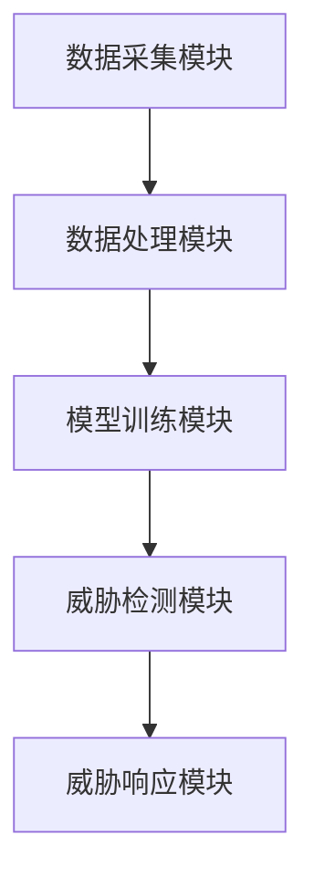

                 


# AI Agent在企业网络安全威胁情报分析中的应用

## 关键词：AI Agent, 网络安全, �威逼情报, 机器学习, 深度学习

## 摘要：本文探讨了AI Agent在企业网络安全威胁情报分析中的应用，详细介绍了AI Agent的基本概念、核心原理、算法实现以及在实际场景中的应用案例。通过分析威胁情报分析的背景与挑战，结合具体的技术实现和项目实战，本文展示了AI Agent如何提升企业网络安全威胁检测与响应的能力。

---

# 第一章: AI Agent与网络安全威胁情报概述

## 1.1 AI Agent的基本概念

### 1.1.1 AI Agent的定义与特点
AI Agent（人工智能代理）是一种能够感知环境、自主决策并执行任务的智能体。它具备以下几个关键特点：
- **自主性**：能够在没有外部干预的情况下自主运行。
- **反应性**：能够根据环境的变化实时调整行为。
- **目标导向**：具备明确的目标，并采取最优路径实现目标。
- **学习能力**：通过数据和经验不断优化自身性能。

### 1.1.2 网络安全威胁情报的基本概念
网络安全威胁情报是指关于潜在或正在进行的网络攻击活动的信息，包括攻击者的意图、方法、工具以及目标等。威胁情报分析的目标是通过收集、处理和分析这些信息，帮助企业识别潜在的威胁并采取相应的防御措施。

### 1.1.3 AI Agent在威胁情报分析中的应用价值
AI Agent在威胁情报分析中的应用价值主要体现在以下几个方面：
- **高效性**：能够快速处理大量数据，实时发现潜在威胁。
- **准确性**：通过机器学习和深度学习等技术，提高威胁检测的准确性。
- **适应性**：能够根据新的威胁动态调整自身的分析模型和策略。

## 1.2 网络安全威胁情报分析的背景与挑战

### 1.2.1 当前网络安全威胁的复杂性
随着信息技术的快速发展，网络安全威胁日益复杂化和多样化。攻击者利用 sophisticated techniques（高级技术）对企业网络发起攻击，传统的基于规则的威胁检测方法已经难以应对这些新型威胁。

### 1.2.2 威胁情报分析的传统方法与局限性
传统的威胁情报分析方法主要依赖于人工分析和基于规则的匹配，存在以下局限性：
- **效率低下**：人工分析需要大量时间和资源。
- **漏报与误报**：基于规则的方法难以覆盖所有可能的威胁场景。
- **缺乏动态性**：难以应对快速演变的威胁。

### 1.2.3 AI Agent在威胁情报分析中的优势
AI Agent通过结合机器学习和深度学习技术，能够显著提升威胁情报分析的效率和准确性。具体优势包括：
- **自动化处理**：能够自动收集、分析和处理大量数据。
- **实时响应**：能够实时发现并响应潜在威胁。
- **自适应性**：能够根据新的威胁动态优化自身的分析模型。

---

# 第二章: AI Agent的核心原理与技术特征

## 2.1 AI Agent的核心原理

### 2.1.1 AI Agent的工作流程
AI Agent在威胁情报分析中的工作流程主要包括以下几个步骤：
1. **数据收集**：通过各种数据源（如日志文件、网络流量等）收集相关信息。
2. **数据预处理**：对收集到的数据进行清洗、特征提取和标注。
3. **模型训练**：基于预处理后的数据训练机器学习或深度学习模型。
4. **威胁检测**：利用训练好的模型对实时数据进行分析，识别潜在威胁。
5. **威胁响应**：根据检测结果采取相应的应对措施，并将结果反馈给系统或用户。

### 2.1.2 AI Agent的决策机制
AI Agent的决策机制通常基于强化学习（Reinforcement Learning）框架。通过与环境的交互，AI Agent能够学习最优策略以实现目标。具体来说，AI Agent会根据当前状态（如网络流量、日志信息等）选择最优动作（如发出警报、阻止连接等），并根据反馈不断优化其决策策略。

### 2.1.3 AI Agent的学习与进化
AI Agent的学习能力是其核心特征之一。通过监督学习、无监督学习和强化学习等多种方式，AI Agent能够不断优化自身的模型和策略。例如，通过监督学习，AI Agent可以利用标注的数据训练分类器，以提高威胁检测的准确性；通过无监督学习，AI Agent能够发现数据中的异常模式，从而识别未知威胁。

## 2.2 AI Agent在威胁情报分析中的技术特征

### 2.2.1 数据驱动的特征提取
AI Agent在威胁情报分析中，首先需要从大量数据中提取有用的特征。例如，可以从网络流量中提取流量特征（如包大小、频率、来源等），从日志中提取行为特征（如登录尝试、文件访问等）。

### 2.2.2 模型驱动的威胁识别
基于机器学习的威胁识别模型是AI Agent的核心技术之一。常用的模型包括支持向量机（SVM）、随机森林（Random Forest）、神经网络（Neural Networks）等。这些模型能够从数据中学习潜在的威胁模式，并根据新的数据进行预测。

### 2.2.3 结果驱动的威胁响应
AI Agent在检测到潜在威胁后，能够根据威胁的严重性和影响范围采取相应的应对措施。例如，可以自动阻止恶意连接、隔离受感染的设备或发出警报通知安全团队。

---

# 第三章: 威胁情报分析中的关键技术与算法

## 3.1 数据预处理与特征提取

### 3.1.1 数据预处理步骤
1. **数据清洗**：去除噪声数据和冗余信息。
2. **特征提取**：从原始数据中提取有用的特征，例如时间戳、源IP、目标IP、协议类型等。
3. **数据标注**：根据已知的威胁信息对数据进行标注，例如标记正常流量和异常流量。

### 3.1.2 特征提取方法
- **基于统计的方法**：通过统计特征（如均值、方差等）进行特征提取。
- **基于模式识别的方法**：利用模式识别技术（如聚类、分类）提取特征。

## 3.2 基于机器学习的威胁分类

### 3.2.1 监督学习与无监督学习的应用
- **监督学习**：适用于已知威胁的分类，例如使用SVM或随机森林对数据进行分类。
- **无监督学习**：适用于未知威胁的发现，例如使用聚类算法识别异常流量。

### 3.2.2 基于深度学习的威胁检测
深度学习模型（如卷积神经网络CNN、循环神经网络RNN）在处理复杂数据（如网络流量、日志数据）时表现出色。例如，可以使用LSTM（长短期记忆网络）对时间序列数据进行建模，以检测异常行为。

## 3.3 威胁检测的数学模型

### 3.3.1 基于监督学习的分类模型
$$
\text{目标函数：} \quad \text{minimize} \quad L(\theta) = \sum_{i=1}^{n} (y_i - f(x_i; \theta))^2
$$

其中，\( L(\theta) \) 是损失函数，\( y_i \) 是真实标签，\( f(x_i; \theta) \) 是模型的预测结果。

### 3.3.2 基于深度学习的威胁检测模型
$$
\text{LSTM模型：} \quad f(x; \theta) = \text{LSTM}(x) \rightarrow \text{FC}(f(x); \theta) \rightarrow \text{softmax}(f(x; \theta))
$$

其中，LSTM用于处理时间序列数据，FC表示全连接层，softmax用于分类。

---

# 第四章: AI Agent在企业网络安全中的应用实例

## 4.1 项目背景与目标
某企业希望通过引入AI Agent技术提升其网络安全威胁检测能力。具体目标包括：
1. 实时监测网络流量，发现潜在威胁。
2. 自动分类和标注威胁事件。
3. 提供实时威胁响应和处置建议。

## 4.2 系统架构设计

### 4.2.1 系统功能模块
- **数据采集模块**：负责收集网络流量、日志等数据。
- **数据处理模块**：对收集到的数据进行清洗、特征提取和标注。
- **模型训练模块**：基于历史数据训练机器学习模型。
- **威胁检测模块**：利用训练好的模型实时检测威胁。
- **威胁响应模块**：根据检测结果采取相应的应对措施。

### 4.2.2 系统架构图


## 4.3 系统实现与优化

### 4.3.1 数据采集与预处理
使用Python的`scipy`和`pandas`库进行数据清洗和特征提取。例如：
```python
import pandas as pd
import numpy as np

# 数据加载
data = pd.read_csv('network_traffic.csv')

# 数据清洗
data.dropna(inplace=True)

# 特征提取
features = data[['source_ip', 'destination_ip', 'protocol', 'packet_count']]
```

### 4.3.2 模型训练与部署
使用Scikit-learn库训练随机森林分类器，并部署到实时检测系统中。例如：
```python
from sklearn.ensemble import RandomForestClassifier

# 模型训练
model = RandomForestClassifier(n_estimators=100)
model.fit(features, labels)

# 实时检测
new_features = ...  # 新数据
prediction = model.predict(new_features)
```

### 4.3.3 系统优化
通过A/B测试和性能监控，不断优化模型的准确性和响应速度。例如，引入分布式计算框架（如Spark）提升数据处理能力。

---

# 第五章: 总结与展望

## 5.1 总结
本文详细探讨了AI Agent在企业网络安全威胁情报分析中的应用，从基本概念到技术实现，再到实际案例，全面展示了AI Agent的优势和潜力。

## 5.2 展望
未来，随着人工智能技术的不断发展，AI Agent在网络安全领域的应用将更加广泛和深入。例如，可以通过结合自然语言处理（NLP）技术，提升威胁情报的分析能力；或者通过联邦学习（Federated Learning）实现多企业之间的威胁情报共享与协作。

## 5.3 最佳实践
- **数据质量**：确保数据的完整性和准确性。
- **模型优化**：定期更新模型，适应新的威胁动态。
- **安全策略**：制定合理的安全策略，结合AI Agent提升整体安全防护能力。

---

# 作者：AI天才研究院/AI Genius Institute & 禅与计算机程序设计艺术 /Zen And The Art of Computer Programming

