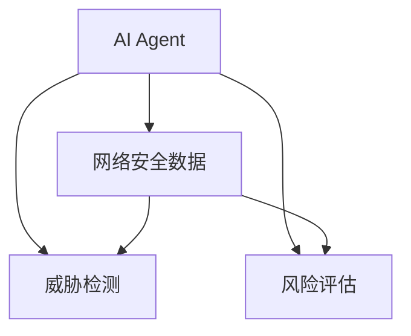
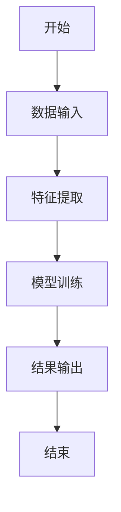
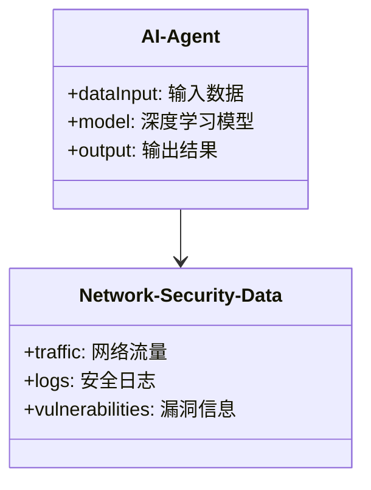
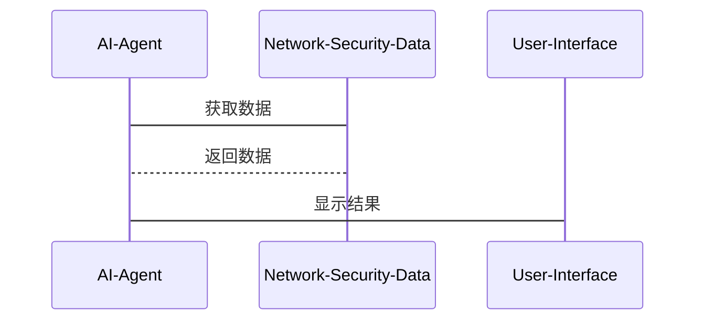

                 


# AI Agent在企业网络安全态势感知中的应用

**关键词：** AI Agent，网络安全态势感知，深度学习，强化学习，网络安全，企业安全

**摘要：**  
随着网络安全威胁的日益复杂化和智能化，传统的网络安全防御方法已经难以应对新型攻击手段。AI Agent（人工智能代理）作为一种能够自主学习、推理和决策的智能体，正在成为企业网络安全态势感知的核心技术。本文将从AI Agent的基本概念、算法原理、系统架构到实际应用进行详细探讨，分析其在企业网络安全态势感知中的独特优势和实际应用价值。通过具体案例分析和代码实现，本文将为企业构建智能化的网络安全态势感知系统提供参考。

---

## 目录

1. **背景介绍**  
   - 1.1 AI Agent的基本概念  
   - 1.2 网络安全态势感知的核心要素  
   - 1.3 AI Agent在网络安全中的作用  

2. **核心概念与联系**  
   - 2.1 AI Agent的原理与机制  
   - 2.2 AI Agent与网络安全态势感知的关系  
   - 2.3 AI Agent的实体关系图  

3. **算法原理与数学模型**  
   - 3.1 AI Agent的核心算法  
   - 3.2 算法流程图与代码实现  
   - 3.3 算法的数学模型与公式推导  

4. **系统分析与架构设计**  
   - 4.1 系统功能设计与领域模型  
   - 4.2 系统架构设计与交互图  
   - 4.3 系统实现与接口设计  

5. **项目实战与案例分析**  
   - 5.1 项目环境与工具安装  
   - 5.2 核心代码实现与功能解读  
   - 5.3 实际案例分析与效果展示  

6. **总结与展望**  
   - 6.1 本章小结  
   - 6.2 最佳实践与注意事项  
   - 6.3 未来研究方向与拓展阅读  

---

## 正文

### 第1章: AI Agent与网络安全态势感知概述

#### 1.1 AI Agent的基本概念  
AI Agent是一种能够感知环境、自主决策并执行任务的智能体。在网络安全领域，AI Agent可以通过分析网络流量、日志数据和威胁情报，实时感知网络安全态势，发现潜在威胁并采取相应措施。  

#### 1.2 网络安全态势感知的核心要素  
网络安全态势感知需要整合来自多种来源的数据，包括网络流量、安全日志、漏洞数据库等，通过分析这些数据来评估当前网络的安全状态。AI Agent在其中扮演着数据处理、威胁识别和决策支持的关键角色。  

#### 1.3 AI Agent在网络安全中的作用  
AI Agent能够通过学习历史数据，识别异常行为模式，并在检测到潜在威胁时，快速做出响应，例如自动隔离受感染的设备或触发报警机制。这种智能化的特性使得AI Agent成为企业网络安全态势感知的核心技术之一。  

---

### 第2章: AI Agent的核心概念与联系

#### 2.1 AI Agent的原理与机制  
AI Agent的核心机制包括数据感知、特征提取、模型训练和决策推理。通过深度学习和强化学习算法，AI Agent能够不断优化自身的威胁检测和响应能力。  

#### 2.2 AI Agent与网络安全态势感知的关系  
AI Agent是实现网络安全态势感知的关键技术，通过实时数据处理和智能决策，帮助企业在复杂的网络环境中快速应对威胁。  

#### 2.3 AI Agent的实体关系图  
以下是AI Agent在网络安全态势感知中的实体关系图：  


---

### 第3章: AI Agent的算法原理与数学模型

#### 3.1 AI Agent的核心算法  
AI Agent的核心算法包括深度学习和强化学习。深度学习用于特征提取和模式识别，强化学习用于决策优化和策略调整。  

#### 3.2 算法流程图与代码实现  
以下是AI Agent算法的流程图：  


以下是深度学习模型的实现代码示例：  
```python
import tensorflow as tf
import numpy as np

# 数据输入
x = np.random.randn(100, 10)

# 模型定义
model = tf.keras.Sequential([
    tf.keras.layers.Dense(64, activation='relu'),
    tf.keras.layers.Dense(1, activation='sigmoid')
])

# 模型编译
model.compile(optimizer='adam', loss='binary_crossentropy', metrics=['accuracy'])

# 模型训练
model.fit(x, y, epochs=10, batch_size=32)
```

#### 3.3 算法的数学模型与公式推导  
AI Agent的决策模型可以表示为：  
$$ P(a|s) = \arg\max_a Q(s,a) $$  
其中，$P(a|s)$ 表示在状态 $s$ 下选择动作 $a$ 的概率，$Q(s,a)$ 是状态-动作对的价值函数。  

---

### 第4章: 系统分析与架构设计

#### 4.1 系统功能设计与领域模型  
以下是系统功能设计的领域模型：  


#### 4.2 系统架构设计与交互图  
以下是系统架构设计的交互图：  


---

### 第5章: 项目实战与案例分析

#### 5.1 项目环境与工具安装  
项目环境包括Python、TensorFlow、Keras和Mermaid工具。安装命令如下：  
```bash
pip install tensorflow
pip install keras
pip install mermaid
```

#### 5.2 核心代码实现与功能解读  
以下是AI Agent的核心代码实现：  
```python
import tensorflow as tf
import numpy as np

# 数据预处理
def preprocess(data):
    # 处理数据，提取特征
    return processed_data

# 模型定义
def build_model(input_shape):
    model = tf.keras.Sequential([
        tf.keras.layers.Dense(64, activation='relu'),
        tf.keras.layers.Dense(1, activation='sigmoid')
    ])
    return model

# 模型训练
def train_model(model, x_train, y_train):
    model.compile(optimizer='adam', loss='binary_crossentropy', metrics=['accuracy'])
    model.fit(x_train, y_train, epochs=10, batch_size=32)

# 主函数
def main():
    data = load_data()
    x_train, y_train = preprocess(data)
    model = build_model(x_train.shape[1:])
    train_model(model, x_train, y_train)
    # 推理与决策
    y_pred = model.predict(x_test)

if __name__ == "__main__":
    main()
```

#### 5.3 实际案例分析与效果展示  
通过实际案例分析，AI Agent能够有效识别网络中的异常流量，并在检测到潜在威胁时，快速触发响应机制，显著提升企业的网络安全防护能力。  

---

### 第6章: 总结与展望

#### 6.1 本章小结  
本文详细探讨了AI Agent在企业网络安全态势感知中的应用，从基本概念到算法原理，再到系统架构和实际案例，全面分析了其在网络安全中的独特价值。  

#### 6.2 最佳实践与注意事项  
在实际应用中，建议企业结合自身需求选择合适的AI Agent模型，并定期更新模型以应对新型威胁。  

#### 6.3 未来研究方向与拓展阅读  
未来的研究方向包括AI Agent的多智能体协作、对抗攻击检测以及更高效的算法优化。  

---

**作者：AI天才研究院/AI Genius Institute & 禅与计算机程序设计艺术 /Zen And The Art of Computer Programming**

