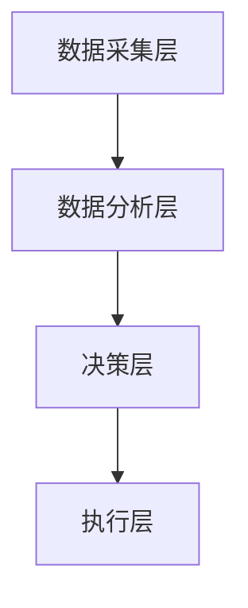

                 


# AI Agent在企业网络安全防御中的前沿应用

## 关键词
AI Agent, 企业网络安全, 机器学习, 强化学习, 网络威胁检测

## 摘要
本文详细探讨了AI Agent在企业网络安全中的前沿应用，涵盖了AI Agent的核心概念、算法原理、系统架构设计、实际案例分析以及未来发展趋势。通过结合理论与实践，本文为读者提供了全面了解AI Agent在网络安全中的潜力和应用方法。

---

## 第1章: AI Agent与企业网络安全概述

### 1.1 AI Agent的基本概念
#### 1.1.1 AI Agent的定义
AI Agent（人工智能代理）是一种能够感知环境、自主决策并执行任务的智能实体。在企业网络安全中，AI Agent通常用于实时监控网络流量、检测异常行为和自动响应威胁。

#### 1.1.2 AI Agent的核心特征
- **自主性**：无需人工干预，自主完成任务。
- **反应性**：能够实时感知环境变化并做出反应。
- **学习能力**：通过机器学习不断优化自身的决策能力。

#### 1.1.3 企业网络安全中的AI Agent应用场景
- **入侵检测**：实时监控网络流量，识别潜在威胁。
- **恶意软件检测**：分析系统行为，识别恶意代码。
- **漏洞管理**：自动识别和修复系统漏洞。

### 1.2 企业网络安全的挑战与需求
#### 1.2.1 传统网络安全的局限性
传统网络安全依赖规则-based系统，难以应对复杂多变的威胁。

#### 1.2.2 AI技术在网络安全中的优势
AI技术能够处理海量数据，识别复杂模式，提供实时响应。

#### 1.2.3 企业网络安全防御的未来趋势
- **智能化**：AI Agent将成为企业网络安全的核心工具。
- **自动化**：实现从威胁检测到响应的自动化流程。

---

## 第2章: AI Agent的核心技术与原理

### 2.1 AI Agent的核心技术
#### 2.1.1 机器学习算法
- **监督学习**：基于标记数据进行分类。
- **无监督学习**：发现数据中的隐藏模式。
- **强化学习**：通过奖励机制优化决策。

#### 2.1.2 自然语言处理
用于分析日志和文本数据，识别异常行为。

#### 2.1.3 强化学习与决策树
- **强化学习**：通过试错优化策略。
- **决策树**：用于分类和预测。

### 2.2 AI Agent的算法原理
#### 2.2.1 基于强化学习的威胁检测算法
**步骤：**
1. 状态识别：分析当前网络状态。
2. 动作选择：基于状态选择最优动作。
3. 奖励机制：根据结果调整策略。

**代码示例：**
```python
import numpy as np
from collections import deque

class AI_Agent:
    def __init__(self, state_size, action_size):
        self.state_size = state_size
        self.action_size = action_size
        self.gamma = 0.99
        self.epsilon = 1.0
        self.epsilon_min = 0.01
        self.memory = deque(maxlen=1000)
        self.model = self.build_model()

    def build_model(self):
        # 构建神经网络模型
        pass

    def act(self, state):
        # 根据状态选择动作
        pass

    def remember(self, state, action, reward, next_state):
        # 存储经验
        pass

    def replay(self, batch_size):
        # 回放经验以优化模型
        pass

    def decay_epsilon(self):
        # 衰减epsilon
        pass
```

**数学模型：**
$$ Q(s, a) = Q(s, a) + \alpha (r + \gamma \max_{a'} Q(s', a') - Q(s, a)) $$

---

## 第3章: AI Agent在企业网络安全中的应用

### 3.1 网络入侵检测系统（IDS）
#### 3.1.1 基于AI Agent的实时监控
通过实时数据分析，快速识别入侵行为。

#### 3.1.2 异常流量识别
使用机器学习算法检测异常网络流量。

#### 3.1.3 入侵行为预测
基于历史数据预测潜在威胁。

### 3.2 恶意软件检测
#### 3.2.1 AI Agent在恶意代码分析中的应用
通过行为分析识别恶意软件。

#### 3.2.2 基于模式识别的恶意软件检测
使用深度学习模型识别恶意代码特征。

#### 3.2.3 AI Agent的自我学习与进化
通过持续学习提升检测能力。

---

## 第4章: 系统架构与设计

### 4.1 系统架构设计
#### 4.1.1 分层架构设计
- **数据采集层**：收集网络数据。
- **数据分析层**：处理和分析数据。
- **决策层**：生成响应策略。

#### 4.1.2 微服务架构设计
- **服务发现**：自动识别服务。
- **负载均衡**：分配请求到最优服务。
- **容错机制**：确保系统稳定性。

**架构图：**


### 4.2 系统功能设计
#### 4.2.1 数据采集模块
- **数据来源**：网络流量、日志文件。
- **数据预处理**：清洗和归一化。

#### 4.2.2 数据分析模块
- **特征提取**：提取关键特征。
- **模型训练**：训练分类器。

#### 4.2.3 决策与执行模块
- **决策制定**：基于分析结果做出决策。
- **执行操作**：自动响应威胁。

---

## 第5章: 项目实战与案例分析

### 5.1 环境搭建与工具安装
#### 5.1.1 开发环境配置
- **操作系统**：Linux
- **编程语言**：Python
- **框架**：TensorFlow、Keras

#### 5.1.2 数据集准备
- **来源**：公开数据集（如KDD Cup）。
- **预处理**：清洗和标注数据。

### 5.2 系统核心实现源代码
```python
import numpy as np
from tensorflow.keras.models import Sequential
from tensorflow.keras.layers import Dense

def build_model(input_dim):
    model = Sequential()
    model.add(Dense(64, activation='relu', input_dim=input_dim))
    model.add(Dense(32, activation='relu'))
    model.add(Dense(1, activation='sigmoid'))
    model.compile(optimizer='adam', loss='binary_crossentropy', metrics=['accuracy'])
    return model

# 示例训练
model = build_model(100)
model.fit(X_train, y_train, epochs=10, batch_size=32)
```

### 5.3 实际案例分析
#### 5.3.1 入侵检测案例
- **数据特征**：流量、时间戳、用户行为。
- **模型训练**：使用训练数据训练分类器。
- **结果分析**：评估模型准确率和召回率。

#### 5.3.2 恶意软件检测案例
- **样本分析**：分析恶意软件行为特征。
- **模型优化**：调整参数提升检测精度。

---

## 第6章: 未来趋势与最佳实践

### 6.1 未来趋势
- **AI与IoT结合**：提升物联网安全。
- **多模态学习**：整合多种数据源。
- **自适应防御**：动态调整防御策略。

### 6.2 最佳实践 tips
- **持续学习**：保持模型更新。
- **多团队协作**：结合安全专家经验。
- **监控与反馈**：实时监控系统性能。

---

## 作者：AI天才研究院 & 禅与计算机程序设计艺术

---

以上是完整的文章内容，涵盖从理论到实践的各个方面，帮助读者系统地理解AI Agent在企业网络安全中的应用。

