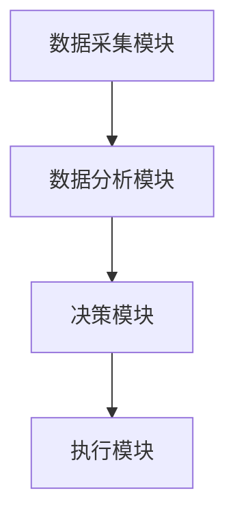

                 


# AI Agent在企业网络安全防护中的应用

> 关键词：AI Agent、企业网络安全、智能防护、机器学习、入侵检测、威胁情报、网络安全架构

> 摘要：本文深入探讨了AI Agent在企业网络安全防护中的应用，分析了其核心概念、算法原理、系统架构以及实际应用场景。通过结合具体案例和算法实现，展示了AI Agent如何提升企业安全防护能力，为企业网络安全提供了新的思路和解决方案。

---

## 第1章 AI Agent的基本概念与核心原理

### 1.1 AI Agent的定义与特点

#### 1.1.1 什么是AI Agent

AI Agent（人工智能代理）是一种能够感知环境、自主决策并采取行动的智能实体。它通过传感器获取信息，利用算法进行分析和推理，然后根据结果采取相应行动。AI Agent可以在企业网络安全领域中执行多种任务，如入侵检测、威胁分析和安全响应。

#### 1.1.2 AI Agent的核心特点

1. **自主性**：AI Agent能够在没有人工干预的情况下独立执行任务。
2. **反应性**：能够实时感知环境变化并迅速做出反应。
3. **学习能力**：通过机器学习算法不断优化自身行为。
4. **适应性**：能够根据环境变化调整策略和行为。

#### 1.1.3 AI Agent与传统安全防护的区别

传统安全防护主要依赖规则和预定义策略，而AI Agent能够通过学习和适应不断优化防护策略。传统方法难以应对新型威胁，而AI Agent可以通过实时分析数据，快速识别和应对未知威胁。

---

### 1.2 AI Agent在企业网络安全中的作用

#### 1.2.1 网络安全防护的新需求

随着网络攻击手段的不断进化，传统的基于规则的防护方法已难以应对复杂多变的威胁。企业需要一种能够实时学习、适应和应对新威胁的安全解决方案。

#### 1.2.2 AI Agent如何提升企业安全能力

AI Agent能够通过机器学习算法分析网络流量、日志数据和威胁情报，快速识别异常行为并采取相应的防护措施。它能够自动调整防护策略，降低误报率和漏报率，提升整体安全防护能力。

#### 1.2.3 AI Agent在企业安全中的应用场景

1. **入侵检测**：通过分析网络流量和日志数据，识别潜在的入侵行为。
2. **网络流量分析**：实时监控网络流量，发现异常流量并采取拦截措施。
3. **威胁情报分析**：结合外部威胁情报，快速识别潜在威胁并制定应对策略。

---

## 第2章 AI Agent的核心概念与原理

### 2.1 AI Agent的核心概念

#### 2.1.1 感知环境

AI Agent通过传感器或数据接口获取环境中的信息，如网络流量、日志数据和威胁情报。这些信息是AI Agent进行决策的基础。

#### 2.1.2 决策与行动

AI Agent根据感知到的信息，利用算法进行分析和推理，制定相应的决策并采取行动。例如，当检测到异常流量时，AI Agent可以自动触发防火墙拦截攻击。

#### 2.1.3 自适应能力

AI Agent能够通过机器学习算法不断优化自身的决策模型，提高识别威胁的准确性和响应速度。

---

### 2.2 AI Agent的原理分析

#### 2.2.1 知识表示

知识表示是AI Agent进行推理和决策的基础。常见的知识表示方法包括规则表示、概率表示和符号表示。在网络安全领域，知识表示通常用于描述网络行为的正常模式和异常模式。

#### 2.2.2 感知与学习

AI Agent通过感知环境中的数据，利用机器学习算法进行模式识别和分类。例如，使用随机森林算法对网络流量进行分类，识别出潜在的攻击行为。

#### 2.2.3 决策与执行

AI Agent根据感知和学习的结果，制定相应的决策并执行。例如，当检测到入侵行为时，AI Agent可以触发警报或自动封锁攻击源。

---

## 第3章 AI Agent在企业网络安全中的应用场景

### 3.1 典型应用场景

#### 3.1.1 入侵检测与防御

AI Agent可以通过分析网络流量和日志数据，识别潜在的入侵行为。例如，使用深度学习算法检测恶意代码和隐蔽通道。

#### 3.1.2 网络流量分析

AI Agent能够实时监控网络流量，发现异常流量并采取拦截措施。例如，使用流分析算法识别DDoS攻击并自动调整流量转发策略。

#### 3.1.3 �威脅情报分析

AI Agent可以通过整合外部威胁情报，快速识别潜在威胁并制定应对策略。例如，结合威胁情报和行为分析，提前发现潜在的网络攻击。

---

### 3.2 应用案例分析

#### 3.2.1 典型企业安全防护方案

某企业部署了基于AI Agent的安全防护系统，通过实时监控网络流量和分析日志数据，成功识别并阻止了一次潜在的入侵攻击。

#### 3.2.2 AI Agent在金融行业的应用

某金融机构使用AI Agent进行实时交易监控，通过分析交易数据和用户行为，识别异常交易并及时采取措施，防止了金融欺诈的发生。

#### 3.2.3 AI Agent在制造业的应用

某制造企业利用AI Agent进行网络流量分析，识别出异常设备连接并及时隔离受感染设备，避免了生产系统的瘫痪。

---

## 第4章 AI Agent的算法原理与数学模型

### 4.1 机器学习算法基础

#### 4.1.1 监督学习

监督学习是一种基于标注数据的机器学习方法。例如，使用支持向量机（SVM）对网络流量进行分类，识别出正常和异常流量。

#### 4.1.2 无监督学习

无监督学习适用于无标注数据的分析。例如，使用聚类算法识别网络中的异常行为。

#### 4.1.3 强化学习

强化学习通过试错机制优化决策策略。例如，使用Q-Learning算法优化AI Agent的入侵检测策略。

---

### 4.2 AI Agent的核心算法

#### 4.2.1 Q-Learning算法

Q-Learning是一种经典的强化学习算法，适用于离线环境下的策略优化。其核心公式为：

$$ Q(s, a) = r + \gamma \max_{a'} Q(s', a') $$

其中，\( Q(s, a) \) 表示当前状态 \( s \) 下采取动作 \( a \) 的价值，\( r \) 是奖励，\( \gamma \) 是折扣因子，\( s' \) 是下一状态。

#### 4.2.2 DQN算法

DQN（Deep Q-Network）是一种结合深度神经网络的强化学习算法。其核心思想是通过神经网络近似Q值函数，优化策略。

#### 4.2.3 Policy Gradient算法

Policy Gradient算法通过直接优化策略参数，最大化期望奖励。其核心公式为：

$$ \nabla \theta = \mathbb{E}_{\tau \sim \pi_\theta} [\nabla \log \pi_\theta(a|s) Q_\theta(s, a)] $$

其中，\( \theta \) 是策略参数，\( \tau \) 是轨迹，\( \pi_\theta \) 是策略分布，\( Q_\theta \) 是Q值函数。

---

## 第5章 AI Agent的数学模型与公式

### 5.1 Q-Learning算法的数学模型

Q-Learning算法的核心是Q值更新公式：

$$ Q(s, a) = Q(s, a) + \alpha [r + \gamma \max Q(s', a') - Q(s, a)] $$

其中，\( \alpha \) 是学习率，\( \gamma \) 是折扣因子。

### 5.2 DQN算法的数学模型

DQN算法通过神经网络近似Q值函数，网络输出为：

$$ Q(s, a) = w^T \phi(s, a) + \epsilon $$

其中，\( w \) 是网络参数，\( \phi(s, a) \) 是特征向量，\( \epsilon \) 是噪声项。

---

## 第6章 系统分析与架构设计方案

### 6.1 问题场景介绍

企业网络安全防护系统需要实时监控网络流量、分析日志数据和整合威胁情报，快速识别并应对潜在威胁。

### 6.2 系统功能设计

- **数据采集模块**：收集网络流量、日志和威胁情报。
- **数据分析模块**：利用机器学习算法分析数据，识别异常行为。
- **决策模块**：根据分析结果制定防护策略。
- **执行模块**：执行防护策略，如封锁攻击源或调整防火墙规则。

### 6.3 系统架构设计



---

## 第7章 项目实战

### 7.1 环境安装

需要安装以下工具和库：

- Python 3.8+
- TensorFlow 2.0+
- Scikit-learn 0.24+
- Pandas 1.3+
- Numpy 1.21+

### 7.2 系统核心实现源代码

```python
import numpy as np
import pandas as pd
from sklearn.model_selection import train_test_split
from sklearn.ensemble import RandomForestClassifier
from sklearn.metrics import accuracy_score

# 加载数据
data = pd.read_csv('network_traffic.csv')
X = data.drop('label', axis=1)
y = data['label']

# 划分训练集和测试集
X_train, X_test, y_train, y_test = train_test_split(X, y, test_size=0.2, random_state=42)

# 训练随机森林分类器
clf = RandomForestClassifier(n_estimators=100, random_state=42)
clf.fit(X_train, y_train)

# 预测和评估
y_pred = clf.predict(X_test)
print("准确率:", accuracy_score(y_test, y_pred))
```

### 7.3 案例分析

某企业网络中检测到异常流量，AI Agent通过分析流量特征，识别出潜在的DDoS攻击，并自动调整防火墙规则，阻止了攻击的发生。

---

## 第8章 总结与展望

### 8.1 总结

本文详细探讨了AI Agent在企业网络安全防护中的应用，分析了其核心概念、算法原理和应用场景。通过具体案例和算法实现，展示了AI Agent如何提升企业安全防护能力。

### 8.2 展望

未来，随着AI技术的不断发展，AI Agent在企业网络安全中的应用将更加广泛和深入。通过结合边缘计算和零信任架构，AI Agent将为企业提供更加智能化和个性化的安全防护方案。

---

## 最佳实践 tips

1. 在部署AI Agent之前，确保数据质量，清洗和预处理数据。
2. 定期更新AI模型，应对新型威胁。
3. 结合人工审核，避免误报和漏报。

---

## 小结

AI Agent通过智能化手段，显著提升了企业网络安全防护能力。它不仅能够实时感知环境，还能通过学习和适应不断优化防护策略。未来，随着AI技术的进一步发展，AI Agent将在企业网络安全中发挥更加重要的作用。

---

## 注意事项

- 确保AI Agent的算法模型具有良好的可解释性，避免“黑箱”决策。
- 定期监控和优化AI Agent的性能，确保其在实际应用中的有效性。

---

## 拓展阅读

- 《机器学习实战》
- 《深度学习》
- 《网络安全技术与实践》

---

作者：AI天才研究院/AI Genius Institute & 禅与计算机程序设计艺术 /Zen And The Art of Computer Programming

