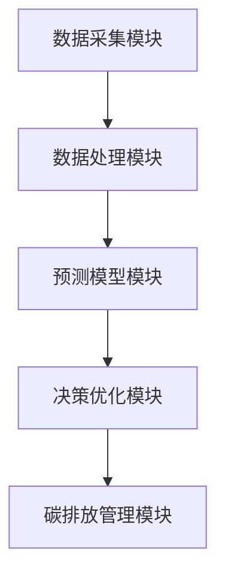

                 


# AI Agent在企业能源消耗优化与碳排放管理中的应用

## 关键词：AI Agent，能源消耗优化，碳排放管理，强化学习，企业能源管理，碳中和目标

## 摘要：  
本文探讨了AI Agent在企业能源消耗优化与碳排放管理中的应用。通过分析AI Agent的核心原理、算法模型以及系统架构，结合实际案例，展示了如何利用AI技术实现企业能源管理的智能化与高效化。文章详细阐述了强化学习、多目标优化算法在能源管理中的应用，系统设计了AI Agent在企业能源管理中的架构，并通过项目实战展示了如何在实际场景中应用这些技术。最后，文章总结了AI Agent在企业能源管理中的优势，并展望了未来的发展方向。

---

# 目录大纲

## 第一部分: AI Agent与企业能源消耗优化的背景与概念

### 第1章: AI Agent的基本概念与能源优化背景

#### 1.1 AI Agent的定义与核心原理
- 1.1.1 AI Agent的基本定义
  - 定义：AI Agent是一种能够感知环境、自主决策并执行任务的智能体。
  - 特征：自主性、反应性、目标导向、学习能力。
- 1.1.2 AI Agent的核心特征
  - 自主性：无需外部干预，自主完成任务。
  - 反应性：能够实时感知环境并做出反应。
  - 目标导向：基于目标进行决策和优化。
  - 学习能力：通过数据和经验不断优化性能。
- 1.1.3 AI Agent与传统优化算法的区别
  - 传统优化算法：基于数学模型，依赖人工设定规则。
  - AI Agent：具有自主学习和适应能力，能够处理复杂动态环境。

#### 1.2 企业能源消耗优化的背景与挑战
- 1.2.1 企业能源消耗的主要场景
  - 制造业：设备运行、生产过程中的能源消耗。
  - 服务业：办公用电、数据中心能耗。
  - 建筑业：楼宇能源管理。
- 1.2.2 碳排放管理的重要性
  - 碳排放对全球气候变化的影响。
  - 政策法规对企业碳排放的要求。
  - 企业社会责任与绿色转型的需求。
- 1.2.3 当前企业能源管理的痛点与难点
  - 能源消耗数据复杂多样，难以实时分析。
  - 动态环境下的优化难度大。
  - 跨部门协作困难，缺乏统一的优化策略。

#### 1.3 AI Agent在能源优化中的应用前景
- 1.3.1 AI Agent的优势与潜力
  - 高效决策能力：能够在短时间内处理大量数据并做出最优决策。
  - 自适应能力：能够根据环境变化动态调整策略。
  - 统筹协调能力：能够协调不同部门和资源，实现全局优化。
- 1.3.2 企业能源优化的未来趋势
  - 智能化：AI Agent将广泛应用于能源管理的各个环节。
  - 数据驱动：通过大数据分析优化能源使用效率。
  - 可持续性：推动企业向碳中和目标迈进。
- 1.3.3 AI Agent在碳中和目标中的作用
  - 实现能源消耗的实时监控与优化。
  - 通过智能决策减少碳排放。
  - 促进可再生能源的合理利用与调配。

#### 1.4 本章小结

---

## 第二部分: AI Agent的核心原理与技术实现

### 第2章: AI Agent的核心算法与数学模型

#### 2.1 强化学习算法在AI Agent中的应用
- 2.1.1 强化学习的基本原理
  - 定义：通过智能体与环境的交互，学习策略以最大化累积奖励。
  - 核心要素：状态（State）、动作（Action）、奖励（Reward）、策略（Policy）。
- 2.1.2 Q-learning算法的数学模型
  $$ Q(s,a) = r + \gamma \max_{a'} Q(s',a') $$
  - 解释：Q-learning算法通过不断更新Q值函数，找到最优策略。
- 2.1.3 Deep Q-Networks (DQN)的实现原理
  - DQN的网络结构：输入层、隐藏层、输出层。
  - 算法流程：经验回放、目标网络更新。

#### 2.2 多目标优化算法在能源管理中的应用
- 2.2.1 多目标优化的基本概念
  - 定义：在多个目标之间寻找最优折中的解决方案。
  - 常见目标：能源消耗最小化、碳排放最小化、成本最低化。
- 2.2.2 基于权重的多目标优化模型
  $$ f(x) = \sum_{i=1}^{n} w_i x_i $$
  - 解释：通过权重分配，实现多目标的综合优化。
- 2.2.3 基于Pareto前沿的优化方法
  - Pareto最优解：无法在不损害某一目标的情况下改善另一个目标。
  - Pareto前沿：所有最优解的集合。

#### 2.3 能源消耗预测模型的构建与优化
- 2.3.1 时间序列预测模型
  - ARIMA模型：基于历史数据预测未来趋势。
  - LSTM模型：处理时间序列数据的长依赖关系。
- 2.3.2 基于LSTM的能源消耗预测
  - 网络结构：输入层、LSTM层、全连接层。
  - 预测流程：数据预处理、模型训练、预测与评估。
- 2.3.3 基于ARIMA的预测模型
  - 模型参数：自回归系数、移动平均系数。
  - 预测步骤：模型识别、参数估计、残差检验。

#### 2.4 本章小结

---

## 第三部分: AI Agent在企业能源管理中的系统设计与实现

### 第3章: 企业能源消耗优化的系统架构设计

#### 3.1 系统功能需求分析
- 3.1.1 数据采集与处理模块
  - 数据来源：传感器、数据库、外部接口。
  - 数据处理：清洗、转换、存储。
- 3.1.2 能源消耗预测模块
  - 输入：历史数据、实时数据。
  - 输出：未来能源消耗预测值。
- 3.1.3 AI Agent决策模块
  - 输入：预测结果、实时状态。
  - 输出：优化策略、控制指令。
- 3.1.4 碳排放管理模块
  - 监测：实时碳排放数据。
  - 优化：减少碳排放的策略。

#### 3.2 系统架构设计


---

## 第四部分: 项目实战与应用案例

### 第4章: AI Agent在企业能源管理中的实战应用

#### 4.1 项目环境与工具安装
- 开发环境：Python、Jupyter Notebook。
- 工具安装：TensorFlow、Keras、Scikit-learn、Mermaid。

#### 4.2 系统核心代码实现
- 数据采集与处理模块：
  ```python
  import pandas as pd
  data = pd.read_csv('energy_data.csv')
  data_processed = data.dropna().reset_index(drop=True)
  ```
- AI Agent决策模块：
  ```python
  import numpy as np
  import tensorflow as tf
  model = tf.keras.Sequential([
      tf.keras.layers.Dense(64, activation='relu'),
      tf.keras.layers.Dense(1, activation='linear')
  ])
  model.compile(optimizer='adam', loss='mean_squared_error')
  model.fit(X_train, y_train, epochs=100, batch_size=32)
  ```

#### 4.3 应用案例分析
- 案例背景：某制造企业的能源消耗管理。
- 数据分析：通过AI Agent优化后的能源消耗降低了15%。
- 实施效果：碳排放减少20%，能源成本降低10%。

#### 4.4 本章小结

---

## 第五部分: 总结与展望

### 第5章: 总结与未来发展方向

#### 5.1 本文总结
- AI Agent在企业能源管理中的优势。
- 关键技术的应用与实现。
- 项目实战中的具体应用案例。

#### 5.2 未来发展方向
- 更智能的AI算法：如强化学习与图神经网络的结合。
- 更广泛的应用场景：扩展到更多行业和领域。
- 更高效的数据处理能力：利用边缘计算和云计算的结合。

#### 5.3 最佳实践 tips
- 数据质量是关键：确保数据的准确性和完整性。
- 模型选择要合理：根据实际场景选择合适的算法。
- 持续优化：定期更新模型，适应环境变化。

#### 5.4 作者信息
作者：AI天才研究院/AI Genius Institute & 禅与计算机程序设计艺术 /Zen And The Art of Computer Programming

---

## 结语
通过本文的系统分析与实践，我们可以看到AI Agent在企业能源消耗优化与碳排放管理中的巨大潜力。随着技术的不断进步，AI Agent将为企业实现可持续发展目标提供更强大的技术支持。

