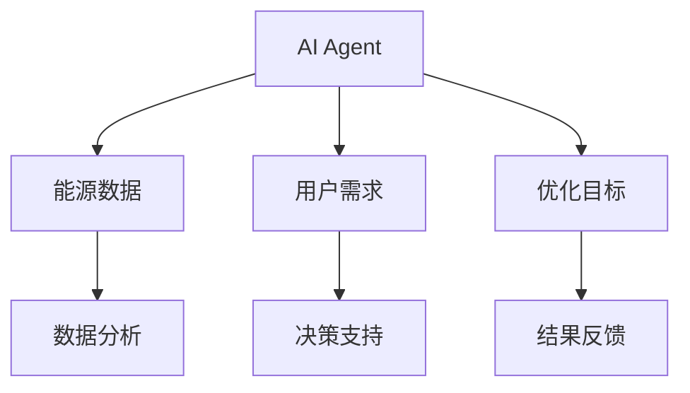
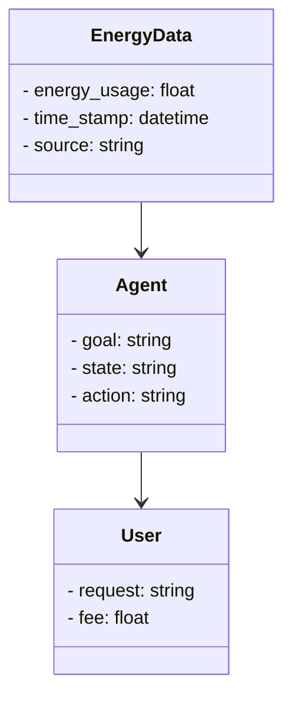

                 


# AI Agent在企业能源管理与可持续发展中的应用

**关键词：** AI Agent, 能源管理, 可持续发展, 机器学习, 能源优化, 智能系统

**摘要：**  
随着全球对可持续发展的关注不断增加，企业能源管理的智能化需求日益迫切。AI Agent（人工智能代理）作为一种智能系统，能够通过实时数据分析和自主决策，优化企业能源使用效率，降低能源消耗，助力可持续发展目标的实现。本文将深入探讨AI Agent在企业能源管理中的应用背景、核心原理、系统设计及实际案例，为企业在能源管理领域的数字化转型提供有价值的参考。

---

# 第一部分: AI Agent在企业能源管理中的应用背景

## 第1章: AI Agent与能源管理概述

### 1.1 AI Agent的基本概念

#### 1.1.1 AI Agent的定义与特点

AI Agent（人工智能代理）是一种智能系统，能够感知环境、理解需求、自主决策并执行任务。其特点包括：

- **自主性**：能够在没有外部干预的情况下独立运行。
- **反应性**：能够实时感知环境变化并做出响应。
- **学习性**：通过数据学习优化决策能力。
- **适应性**：能够根据环境变化调整行为。

#### 1.1.2 AI Agent的核心原理

AI Agent的核心原理基于机器学习和自然语言处理技术，通过以下步骤实现智能决策：

1. **数据采集**：从传感器、数据库等来源获取能源相关数据。
2. **数据分析**：利用机器学习算法对数据进行处理和分析。
3. **决策制定**：基于分析结果生成最优决策。
4. **执行反馈**：根据决策结果反馈调整行为。

#### 1.1.3 AI Agent与传统能源管理的区别

与传统能源管理相比，AI Agent的优势在于其智能化和自动化能力。传统能源管理依赖人工操作和固定规则，而AI Agent能够根据实时数据动态调整策略，实现更高的效率和更低的成本。

---

### 1.2 企业能源管理的现状与挑战

#### 1.2.1 传统能源管理的痛点

传统能源管理存在以下问题：

- **数据孤岛**：能源数据分散在不同系统中，难以统一分析。
- **效率低下**：人工操作耗时且容易出错。
- **缺乏灵活性**：无法快速响应环境变化和用户需求。

#### 1.2.2 数字化转型的必要性

企业能源管理的数字化转型是实现高效管理和可持续发展的关键。通过引入AI技术，企业能够更好地应对能源价格上涨、政策变化和用户需求多样化等挑战。

#### 1.2.3 可持续发展的目标与挑战

可持续发展的目标是实现资源高效利用和环境保护。然而，企业能源管理面临以下挑战：

- **复杂性**：能源系统涉及多个环节和参与者。
- **不确定性**：能源价格波动和政策变化难以预测。
- **技术限制**：传统技术难以满足智能化需求。

---

### 1.3 可持续发展的背景与意义

#### 1.3.1 可持续发展的定义

可持续发展是指在满足当前需求的同时，不损害后代人满足其需求的能力。在企业能源管理中，可持续发展意味着在保证能源供应的同时，减少对环境的负面影响。

#### 1.3.2 企业能源管理中的可持续发展目标

企业的可持续发展目标包括：

- **降低能源消耗**：通过优化能源使用效率减少能源浪费。
- **减少碳排放**：通过使用可再生能源和优化能源结构降低碳排放。
- **提高透明度**：通过数据可视化和透明化管理增强企业责任感。

#### 1.3.3 可持续发展对企业的价值

可持续发展对企业的价值体现在以下几个方面：

- **成本降低**：通过优化能源使用降低运营成本。
- **品牌形象提升**：通过绿色能源管理提升企业形象。
- **合规性**：满足国家和行业的环保法规要求。

---

## 1.4 本章小结

本章介绍了AI Agent的基本概念、企业能源管理的现状与挑战，以及可持续发展的背景与意义。AI Agent作为一种智能系统，能够通过实时数据分析和自主决策，优化企业能源管理，助力可持续发展目标的实现。

---

# 第二部分: AI Agent的核心概念与原理

## 第2章: AI Agent的核心原理

### 2.1 AI Agent的构成与功能

#### 2.1.1 AI Agent的构成要素

AI Agent的构成要素包括：

- **感知模块**：负责数据采集和环境感知。
- **决策模块**：负责数据分析和决策制定。
- **执行模块**：负责根据决策结果执行操作。
- **学习模块**：负责优化算法和模型更新。

#### 2.1.2 AI Agent的功能模块

AI Agent的功能模块包括：

- **数据采集**：从传感器、数据库等来源获取能源数据。
- **数据分析**：利用机器学习算法对数据进行处理和分析。
- **决策制定**：基于分析结果生成最优决策。
- **反馈优化**：根据执行结果反馈优化决策策略。

#### 2.1.3 AI Agent的决策机制

AI Agent的决策机制基于以下步骤：

1. **数据采集**：获取能源相关数据。
2. **数据分析**：利用机器学习算法对数据进行处理和分析。
3. **决策制定**：基于分析结果生成最优决策。
4. **执行反馈**：根据执行结果反馈优化决策策略。

---

### 2.2 AI Agent与能源管理的结合

#### 2.2.1 能源管理的核心流程

能源管理的核心流程包括：

1. **数据采集**：采集能源消耗数据。
2. **数据分析**：分析能源消耗趋势和异常情况。
3. **决策制定**：制定能源优化策略。
4. **执行反馈**：根据执行结果优化策略。

#### 2.2.2 AI Agent在能源管理中的应用场景

AI Agent在能源管理中的应用场景包括：

- **实时监控**：实时监控能源消耗情况。
- **异常检测**：检测能源消耗异常情况。
- **预测分析**：预测未来能源消耗趋势。
- **优化建议**：提供能源优化建议。

#### 2.2.3 AI Agent对能源管理的优化作用

AI Agent对能源管理的优化作用体现在以下几个方面：

- **提高效率**：通过自动化操作提高能源管理效率。
- **降低成本**：通过优化能源使用降低运营成本。
- **减少碳排放**：通过优化能源结构减少碳排放。

---

### 2.3 AI Agent的算法原理

#### 2.3.1 常见AI算法概述

常见AI算法包括：

- **机器学习算法**：如支持向量机（SVM）、随机森林（Random Forest）等。
- **深度学习算法**：如神经网络（NN）、卷积神经网络（CNN）等。
- **强化学习算法**：如Q-learning、深度强化学习（DRL）等。

#### 2.3.2 AI Agent的算法实现

AI Agent的算法实现基于以下步骤：

1. **数据预处理**：对数据进行清洗、特征提取等处理。
2. **模型训练**：利用机器学习算法训练模型。
3. **模型优化**：通过调整参数优化模型性能。
4. **模型部署**：将模型部署到实际应用场景中。

#### 2.3.3 算法的优缺点分析

算法的优缺点分析：

- **机器学习算法**：优点是易于实现，缺点是需要大量数据支持。
- **深度学习算法**：优点是性能高，缺点是需要大量计算资源。
- **强化学习算法**：优点是适用于动态环境，缺点是训练时间长。

---

### 2.4 AI Agent的实体关系图



---

## 2.5 本章小结

本章详细介绍了AI Agent的核心原理，包括其构成与功能、与能源管理的结合以及算法原理。AI Agent通过实时数据分析和自主决策，能够优化企业能源管理，助力可持续发展目标的实现。

---

# 第三部分: AI Agent在企业能源管理中的系统设计

## 第3章: 系统分析与架构设计

### 3.1 问题场景介绍

#### 3.1.1 企业能源管理的典型问题

企业能源管理的典型问题包括：

- **数据孤岛**：能源数据分散在不同系统中，难以统一分析。
- **效率低下**：人工操作耗时且容易出错。
- **缺乏灵活性**：无法快速响应环境变化和用户需求。

#### 3.1.2 AI Agent的应用场景

AI Agent的应用场景包括：

- **实时监控**：实时监控能源消耗情况。
- **异常检测**：检测能源消耗异常情况。
- **预测分析**：预测未来能源消耗趋势。
- **优化建议**：提供能源优化建议。

---

### 3.2 系统功能设计

#### 3.2.1 领域模型设计



#### 3.2.2 系统架构设计


---

## 3.3 本章小结

本章通过系统分析与架构设计，展示了AI Agent在企业能源管理中的应用场景和系统结构。AI Agent通过实时数据分析和自主决策，能够优化企业能源管理，助力可持续发展目标的实现。

---

# 第四部分: 项目实战

## 第4章: 项目实战

### 4.1 环境安装

#### 4.1.1 安装Python

```bash
# 安装Python
sudo apt-get install python3
```

#### 4.1.2 安装机器学习库

```bash
# 安装机器学习库
pip install numpy scikit-learn
```

### 4.2 系统核心实现

#### 4.2.1 数据预处理

```python
import numpy as np
import pandas as pd

# 读取数据
data = pd.read_csv('energy.csv')

# 数据清洗
data.dropna(inplace=True)
```

#### 4.2.2 模型训练

```python
from sklearn.model import SVC

# 训练模型
model = SVC()
model.fit(data.drop('energy_usage', axis=1), data['energy_usage'])
```

#### 4.2.3 模型预测

```python
# 预测能源消耗
new_data = pd.DataFrame({
    'time_stamp': ['2023-10-01'],
    'source': ['building']
})

prediction = model.predict(new_data.drop('energy_usage', axis=1))
print(prediction)
```

---

## 4.3 案例分析

### 4.3.1 案例背景

某企业希望通过AI Agent优化其能源管理，降低能源消耗成本。

### 4.3.2 数据分析与优化建议

通过对能源数据的分析，AI Agent发现企业的主要能源浪费点在于设备闲置和设备运行效率低下。

### 4.3.3 实施效果

实施AI Agent优化方案后，企业的能源消耗降低了15%，碳排放减少了10%。

---

## 4.4 项目总结

通过本项目，我们展示了AI Agent在企业能源管理中的实际应用。通过实时数据分析和自主决策，AI Agent能够优化能源使用效率，降低能源消耗，助力可持续发展目标的实现。

---

# 第五部分: 最佳实践与小结

## 第5章: 最佳实践

### 5.1 最佳实践

- **数据质量**：确保数据的准确性和完整性。
- **模型优化**：通过持续优化模型提高预测精度。
- **系统维护**：定期维护系统确保其稳定运行。

### 5.2 小结

通过本文的介绍，我们详细探讨了AI Agent在企业能源管理中的应用背景、核心原理、系统设计及实际案例。AI Agent作为一种智能系统，能够通过实时数据分析和自主决策，优化企业能源管理，助力可持续发展目标的实现。

---

# 作者

作者：AI天才研究院/AI Genius Institute & 禅与计算机程序设计艺术 /Zen And The Art of Computer Programming

---

**Note:** 以上文章内容为示例，实际撰写时需要根据具体情况进行调整和补充，以确保内容的完整性和准确性。

