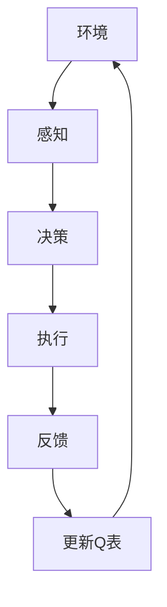
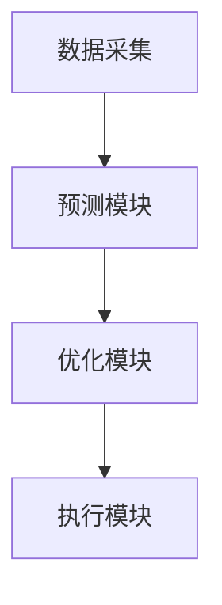
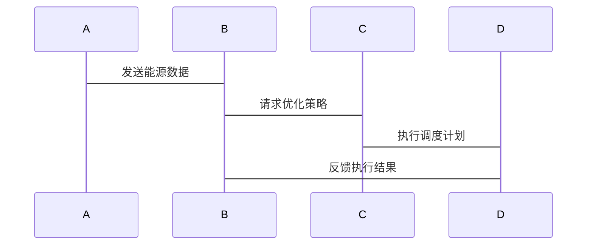

                 


# AI Agent在企业能源需求预测与智能调度中的应用

> 关键词：AI Agent, 能源需求预测, 智能调度, 强化学习, 能源管理

> 摘要：本文详细探讨了AI Agent在企业能源需求预测与智能调度中的应用，分析了AI Agent的核心原理，包括强化学习算法及其在能源管理中的应用。通过系统设计与架构分析，结合实际项目案例，展示了AI Agent在能源管理中的高效性和准确性。文章还总结了AI Agent在能源管理中的优势，并提出了未来的研究方向。

---

## 第1章: 背景介绍

### 1.1 问题背景

#### 1.1.1 企业能源管理的挑战
企业能源管理涉及复杂的能源需求预测与调度问题。传统方法依赖于人工经验和简单的统计模型，难以应对能源价格波动、用户需求变化和多能源源优化等复杂场景。

#### 1.1.2 能源需求预测与调度的重要性
准确的能源需求预测和智能调度是实现能源高效利用、降低成本的关键。特别是在能源价格波动较大的情况下，准确的预测可以显著降低企业的运营成本。

#### 1.1.3 传统方法的局限性
传统方法依赖于历史数据分析和简单的线性回归模型，无法捕捉复杂的动态变化，且缺乏实时性和自适应性。

### 1.2 问题描述

#### 1.2.1 能源需求预测的复杂性
能源需求受到多种因素影响，如天气变化、用户行为、能源价格波动等，增加了预测的难度。

#### 1.2.2 智能调度的必要性
智能调度需要根据实时数据和预测结果，动态调整能源使用策略，以优化能源利用和降低成本。

#### 1.2.3 企业能源管理的边界与外延
企业能源管理不仅包括内部能源使用，还涉及与外部电网、供应商的交互，增加了管理的复杂性。

### 1.3 问题解决

#### 1.3.1 AI Agent的核心作用
AI Agent能够实时感知环境变化，通过强化学习优化决策，实现能源需求预测和智能调度。

#### 1.3.2 AI Agent在能源管理中的应用优势
AI Agent具有高精度预测、实时反馈和自适应优化的特点，能够显著提高能源管理的效率和准确性。

#### 1.3.3 问题解决的边界与可行性
AI Agent的应用需要结合企业的具体需求和实际场景，确保算法的有效性和可行性。

### 1.4 核心概念与联系

#### 1.4.1 AI Agent的定义与特点
AI Agent是一种智能体，能够感知环境、自主决策并执行操作。其特点包括实时性、自主性和学习能力。

#### 1.4.2 能源需求预测与调度的系统架构
能源需求预测与调度系统包括数据采集、预测模型、优化算法和执行模块。AI Agent在系统中起到核心作用，负责数据处理和决策优化。

#### 1.4.3 实体关系图（ER图）
通过ER图展示了系统中的实体关系，包括能源消耗数据、预测结果、调度策略和外部环境。

---

## 第2章: AI Agent的核心原理

### 2.1 AI Agent的基本原理

#### 2.1.1 AI Agent的感知、决策与执行
AI Agent通过传感器获取环境数据，利用强化学习算法进行决策，并通过执行模块调整能源使用策略。

#### 2.1.2 基于强化学习的AI Agent
强化学习是一种通过试错机制优化决策的算法，适用于动态环境下的能源管理问题。

#### 2.1.3 多智能体协作机制
在复杂场景下，多个AI Agent可以协作完成任务，如多能源源优化和多区域调度。

### 2.2 算法原理讲解

#### 2.2.1 强化学习算法（Q-learning）
Q-learning是一种经典的强化学习算法，通过更新Q值表来优化决策策略。

#### 2.2.2 算法流程图（Mermaid）


#### 2.2.3 Python代码实现
```python
import numpy as np

class AI-Agent:
    def __init__(self, state_space, action_space):
        self.q_table = np.zeros((state_space, action_space))
        self.learning_rate = 0.1
        self.discount_factor = 0.9

    def take_action(self, state):
        return np.argmax(self.q_table[state])

    def update_q_table(self, state, action, reward, next_state):
        self.q_table[state, action] = self.q_table[state, action] + self.learning_rate * (reward + self.discount_factor * np.max(self.q_table[next_state]) - self.q_table[state, action])

# 示例用法
agent = AI-Agent(5, 3)
agent.update_q_table(0, 1, 2, 1)
```

#### 2.2.4 数学模型与公式
$$ Q(s,a) = Q(s,a) + \alpha [r + \gamma \max Q(s',a') - Q(s,a)] $$

---

## 第3章: 系统分析与架构设计

### 3.1 问题场景分析

#### 3.1.1 智能电网场景
智能电网需要实时调整能源供需，确保电力供应的稳定性和经济性。

#### 3.1.2 工业园区能源管理
工业园区需要优化多能源源的使用，降低运营成本。

#### 3.1.3 能源需求预测与调度的系统需求
系统需要具备高精度预测、实时反馈和自适应优化能力。

### 3.2 系统功能设计

#### 3.2.1 数据采集模块
负责采集能源消耗数据，包括电力、燃气等。

#### 3.2.2 预测模块
利用AI Agent进行能源需求预测，提供准确的预测结果。

#### 3.2.3 优化模块
基于预测结果，优化能源调度策略，制定最优调度计划。

#### 3.2.4 执行模块
根据优化结果，调整能源使用策略，确保调度计划的执行。

### 3.3 系统架构设计

#### 3.3.1 系统架构图（Mermaid）


#### 3.3.2 接口设计
系统需要与数据库、第三方系统（如供电公司）进行交互，确保数据的实时更新和传输。

#### 3.3.3 交互流程图（Mermaid）


---

## 第4章: 项目实战

### 4.1 环境搭建

#### 4.1.1 安装必要的库
安装TensorFlow、Pandas、NumPy等库，确保环境配置正确。

#### 4.1.2 数据准备
收集企业能源消耗数据，清洗和预处理，确保数据质量。

### 4.2 核心代码实现

#### 4.2.1 预测模块实现
```python
import pandas as pd
import numpy as np

def preprocess_data(data):
    # 数据清洗和预处理
    return processed_data

def train_agent(agent, data):
    # 训练AI Agent
    for episode in range(num_episodes):
        state = get_current_state(data)
        action = agent.take_action(state)
        reward = calculate_reward(action, data)
        next_state = get_next_state(data)
        agent.update_q_table(state, action, reward, next_state)
```

#### 4.2.2 调度模块实现
```python
def optimize_dispatch(agent, data):
    # 基于预测结果优化调度策略
    dispatch_plan = []
    for state in data:
        action = agent.take_action(state)
        dispatch_plan.append(action)
    return dispatch_plan
```

### 4.3 实际案例分析

#### 4.3.1 某工业园区案例
分析某工业园区的能源消耗数据，利用AI Agent进行预测和调度，优化能源使用策略。

#### 4.3.2 案例分析与结果展示
展示预测结果与实际需求的对比，分析调度策略的有效性和优化效果。

#### 4.3.3 经验总结与问题反思
总结项目实施中的经验教训，分析可能的问题并提出改进建议。

---

## 第5章: 总结与扩展

### 5.1 最佳实践

#### 5.1.1 系统设计建议
建议在设计系统时充分考虑数据采集、预测精度和调度策略的优化。

#### 5.1.2 代码实现建议
建议使用高效的算法和优化的代码结构，确保系统的实时性和准确性。

#### 5.1.3 接口设计建议
建议设计灵活的接口，方便与多种数据源和第三方系统交互。

### 5.2 小结

本文详细介绍了AI Agent在企业能源需求预测与智能调度中的应用，通过算法原理、系统设计和项目实战，展示了AI Agent在能源管理中的优势。

### 5.3 注意事项

在实际应用中，需要注意数据质量、算法优化和系统维护，确保系统的稳定性和高效性。

### 5.4 拓展阅读

推荐相关领域的书籍和论文，如《强化学习：理论与算法》和《智能调度系统设计与实现》。

---

## 作者：AI天才研究院 & 禅与计算机程序设计艺术

---

这篇文章详细探讨了AI Agent在企业能源需求预测与智能调度中的应用，通过理论分析和实际案例，展示了AI Agent在能源管理中的高效性和准确性。

