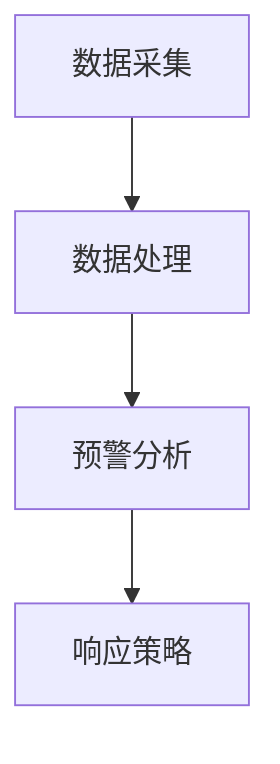
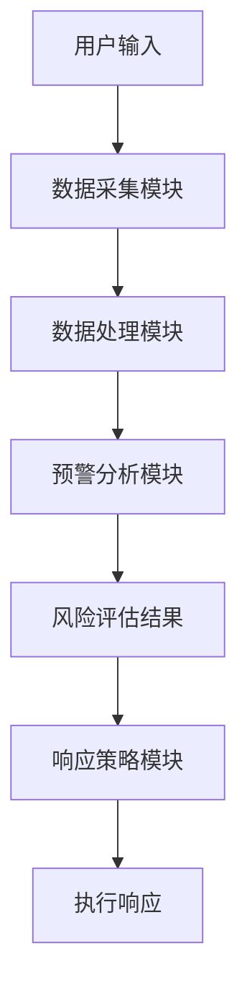

                 


# AI Agent在企业舆情危机预警与响应中的应用

## 关键词：AI Agent，企业舆情，危机预警，自然语言处理，舆情分析

## 摘要：本文深入探讨了AI Agent在企业舆情危机预警与响应中的应用，分析了舆情管理的核心概念、AI Agent的技术原理、系统架构设计及实际案例，为读者提供了从理论到实践的全面指导。

---

# 第一部分: AI Agent与企业舆情危机管理概述

## 第1章: AI Agent与企业舆情危机管理背景

### 1.1 企业舆情的概念与特点

#### 1.1.1 企业舆情的定义
企业舆情是指企业在市场中面临的公众意见和反馈，这些信息可能来自社交媒体、新闻媒体、客户评论等多个渠道。舆情信息的传播速度快、影响范围广，对企业声誉和市场表现有直接影响。

#### 1.1.2 舆情信息的传播特性
舆情信息具有实时性、扩散性、多样性和情感性的特点。实时性指舆情信息即时发生，需快速处理；扩散性指信息通过网络传播迅速扩散；多样性指信息来源和内容多样化；情感性指信息中蕴含的情感倾向（如正面、负面、中性）。

#### 1.1.3 企业舆情危机的分类与影响
企业舆情危机可以分为产品质量危机、服务投诉危机、高管丑闻危机等。危机的影响包括企业声誉受损、客户信任度下降、股价波动等。

### 1.2 AI Agent的基本概念与技术原理

#### 1.2.1 AI Agent的定义与核心功能
AI Agent是一种智能代理，能够感知环境、理解信息、自主决策并采取行动。其核心功能包括信息采集、分析判断、决策制定和执行响应。

#### 1.2.2 AI Agent与传统舆情监控工具的区别
传统舆情工具通常只能进行被动监控和简单的数据统计，而AI Agent能够主动分析、实时响应，并具备自我学习能力。

#### 1.2.3 AI Agent在企业中的应用场景
AI Agent可应用于舆情实时监控、风险预警、自动响应、危机处理等场景，帮助企业快速应对舆情危机。

### 1.3 本章小结
本章介绍了企业舆情的概念、特点及危机分类，详细阐述了AI Agent的定义、技术原理及其在企业舆情管理中的应用价值。

---

# 第二部分: AI Agent在舆情危机预警中的核心原理

## 第2章: 舆情危机预警的AI Agent模型构建

### 2.1 舆情数据的特征提取与分析

#### 2.1.1 文本数据的预处理方法
文本预处理包括分词、去停用词、词向量化等步骤。例如，使用jieba进行中文分词，去除无意义的停用词，将文本转换为词向量表示。

#### 2.1.2 基于NLP的情感分析模型
情感分析模型用于判断舆情文本的情感倾向。常用模型包括词袋模型（Bag of Words）和词嵌入模型（如Word2Vec、GloVe）。情感分类采用机器学习算法（如SVM、随机森林）或深度学习模型（如LSTM、BERT）。

#### 2.1.3 舆情敏感性分析的数学模型
敏感性分析通过计算文本中关键词的出现频率和情感强度，评估舆情的敏感程度。数学模型如下：
$$ S = \sum_{i=1}^{n} (w_i \times e_i) $$
其中，$S$为敏感性得分，$w_i$为关键词权重，$e_i$为情感强度。

### 2.2 AI Agent的舆情预警算法设计

#### 2.2.1 基于概率的舆情风险评估模型
风险评估模型基于贝叶斯定理，计算舆情为负面的概率：
$$ P(负评|文本) = \frac{P(文本|负评)P(负评)}{P(文本)} $$

#### 2.2.2 舆情传播路径的预测算法
传播路径预测算法通过分析舆情信息的转发和评论行为，预测其传播范围和速度。常用算法包括社会网络分析（SNA）和信息传播模型（如SEIR模型）。

#### 2.2.3 多源数据融合的预警机制
多源数据融合通过整合社交媒体、新闻媒体、搜索引擎等多渠道数据，利用加权融合方法提高预警准确性。

### 2.3 算法原理的数学模型与公式

#### 2.3.1 情感分析的数学表达式
$$ P(positive|text) = \frac{P(text|positive)P(positive)}{P(text)} $$

#### 2.3.2 风险评估的贝叶斯模型
$$ P(risk|text) = \frac{P(text|risk)P(risk)}{P(text)} $$

### 2.4 本章小结
本章详细介绍了舆情数据的特征提取与分析方法，设计了AI Agent的舆情预警算法，包括情感分析、风险评估和传播路径预测等模块。

---

# 第三部分: 系统架构与实现方案

## 第3章: 舆情危机预警系统的架构设计

### 3.1 系统功能模块划分

#### 3.1.1 数据采集模块
数据采集模块负责从社交媒体、新闻网站等多渠道获取舆情数据。

#### 3.1.2 数据处理模块
数据处理模块对采集的数据进行清洗、结构化处理和特征提取。

#### 3.1.3 预警分析模块
预警分析模块基于AI算法进行舆情分析和风险评估。

#### 3.1.4 响应策略模块
响应策略模块根据预警结果触发自动响应或通知相关人员。

### 3.2 系统架构设计

#### 3.2.1 分层架构设计
系统分为数据层、业务逻辑层和表现层，各层之间通过API进行交互。

#### 3.2.2 微服务架构实现
采用微服务架构，将系统功能模块化，提高系统的可扩展性和可维护性。

#### 3.2.3 数据流与模块交互关系



### 3.3 系统接口设计

#### 3.3.1 数据采集接口
提供API接口，支持从不同数据源采集舆情数据。

#### 3.3.2 预警触发接口
当风险评估超过阈值时，触发预警通知。

#### 3.3.3 响应策略执行接口
根据预警结果，执行预定义的响应策略。

### 3.4 系统交互流程图（Mermaid）



### 3.5 本章小结
本章详细设计了舆情预警系统的架构，包括功能模块划分、系统架构设计和数据流交互关系。

---

# 第四部分: 项目实战与案例分析

## 第4章: 基于AI Agent的舆情预警系统实现

### 4.1 项目背景与目标

#### 4.1.1 项目背景
本项目旨在开发一个基于AI Agent的企业舆情预警系统，帮助企业在舆情危机中快速响应。

#### 4.1.2 项目目标
实现舆情数据采集、情感分析、风险评估和自动响应功能。

### 4.2 系统核心功能实现

#### 4.2.1 环境配置与依赖安装
安装Python、TensorFlow、Keras、Flask等工具。

#### 4.2.2 数据采集模块实现

```python
import requests

def fetch_data(url):
    response = requests.get(url)
    return response.text
```

#### 4.2.3 预警算法实现

```python
from tensorflow import keras

model = keras.Sequential([
    keras.layers.Dense(64, activation='relu'),
    keras.layers.Dense(1, activation='sigmoid')
])

model.compile(optimizer='adam', loss='binary_crossentropy', metrics=['accuracy'])
model.fit(x_train, y_train, epochs=10, batch_size=32)
```

#### 4.2.4 响应策略实现

```python
def trigger_response(risk_level):
    if risk_level > 0.8:
        send_email("High risk detected")
    elif risk_level > 0.5:
        send_alert("Moderate risk detected")
```

### 4.3 项目实战小结
本章通过具体案例展示了AI Agent在舆情预警系统中的实现，包括数据采集、算法实现和响应策略的代码示例。

---

# 第五部分: 总结与展望

## 第5章: 总结与展望

### 5.1 本章总结
本文详细探讨了AI Agent在企业舆情危机预警与响应中的应用，从技术原理到系统实现进行了全面分析。

### 5.2 未来展望
未来，AI Agent在舆情管理中的应用将更加智能化和自动化，结合区块链、边缘计算等新技术，提升系统的实时性和安全性。

### 5.3 最佳实践 tips
- 数据质量是关键，需确保数据的完整性和准确性。
- 系统需具备自适应能力，根据反馈不断优化模型。
- 注意数据隐私和合规性，遵守相关法律法规。

### 5.4 本章小结
总结本文的主要内容，并展望未来的发展方向。

---

# 作者：AI天才研究院/AI Genius Institute & 禅与计算机程序设计艺术 /Zen And The Art of Computer Programming

---

这篇文章系统地介绍了AI Agent在企业舆情危机预警与响应中的应用，从理论到实践，为读者提供了全面的技术指导。

