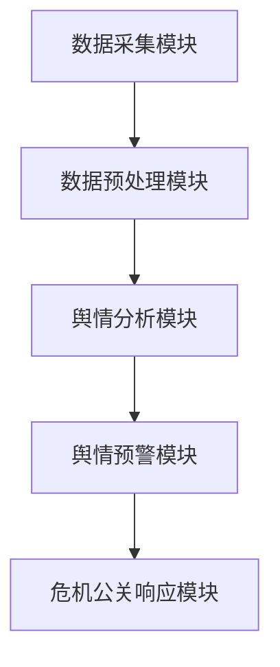

                 


# AI Agent在企业舆情监测与危机公关中的应用

> 关键词：AI Agent, 企业舆情监测, 危机公关, 自然语言处理, 机器学习, 系统架构

> 摘要：本文详细探讨了AI Agent在企业舆情监测与危机公关中的应用，分析了AI Agent的核心概念与技术，系统架构设计，以及具体的算法实现。文章从背景介绍、核心概念、系统设计到算法实现，层层深入，结合实际案例和代码示例，全面解析了AI Agent在舆情监测中的作用和优势。

---

# 第3章: 舆情监测的系统架构设计

## 3.1 系统架构概述

### 3.1.1 系统功能模块划分

舆情监测系统通常包括以下几个核心模块：

1. **数据采集模块**：负责从各种来源（如社交媒体、新闻网站、论坛等）获取实时数据。
2. **数据预处理模块**：对采集到的数据进行清洗、去重和格式转换。
3. **舆情分析模块**：利用自然语言处理技术对文本进行分类、情感分析和主题抽取。
4. **舆情预警模块**：根据分析结果，设置预警阈值，触发报警机制。
5. **危机公关响应模块**：当发现负面舆情时，系统自动生成应对策略，并提供建议。

### 3.1.2 系统架构的优缺点

- **优点**：
  - 高效性：AI Agent能够实时处理海量数据，快速识别潜在风险。
  - 准确性：通过机器学习模型，舆情分析的准确性远高于人工分析。
  - 可扩展性：系统架构设计灵活，可以根据企业需求进行模块扩展。

- **缺点**：
  - 初期投入高：需要搭建复杂的系统架构和训练高效的模型。
  - 数据隐私问题：处理大量用户数据可能引发隐私泄露风险。

### 3.1.3 系统架构的可扩展性

系统架构设计时应考虑模块化设计，确保各模块之间相对独立，便于后续功能的扩展和优化。例如，数据采集模块可以支持多种数据源，舆情分析模块可以集成多种NLP模型。

---

## 3.2 系统功能设计

### 3.2.1 数据采集模块

- **功能**：实时采集社交媒体、新闻网站等平台的文本数据。
- **实现方式**：使用API接口（如Twitter API、RSS feeds）或网页爬虫技术。

### 3.2.2 数据预处理模块

- **功能**：清洗数据，去除噪音（如停用词、特殊符号），并进行分词处理。
- **实现方式**：使用Python的NLTK库或jieba进行分词。

### 3.2.3 舆情分析模块

- **功能**：对文本进行分类（如正面、负面、中性），并进行情感分析和主题抽取。
- **实现方式**：使用机器学习模型（如SVM、随机森林）或深度学习模型（如BERT）。

### 3.2.4 舆情预警模块

- **功能**：设置预警阈值，当负面舆情达到一定比例时，触发报警机制。
- **实现方式**：基于时间序列分析，预测舆情趋势。

### 3.2.5 危机公关响应模块

- **功能**：根据分析结果，自动生成应对策略，如发布澄清声明、联系相关媒体等。
- **实现方式**：结合规则引擎和机器学习模型，提供智能化的建议。

---

## 3.3 系统架构图

以下是一个舆情监测系统的Mermaid架构图：



---

## 3.4 本章小结

### 3.4.1 系统架构设计的核心要点

- 系统架构应模块化设计，确保各功能模块独立且易于扩展。
- 数据采集和预处理是舆情分析的基础，需要高效可靠。
- 舆情分析模块是系统的核心，需要选择合适的NLP技术和算法。

### 3.4.2 系统架构的优化建议

- 定期更新机器学习模型，以提高舆情分析的准确性。
- 增强系统的容错性和冗余设计，确保系统的高可用性。
- 在数据隐私保护方面，采用加密技术和访问控制策略。

---

# 第4章: AI Agent在舆情监测中的算法实现

## 4.1 基于文本分类的舆情分析

### 4.1.1 文本分类的定义与特点

文本分类是将文本按照预定义的类别进行分类的过程。在舆情监测中，文本分类常用于识别文本的情感倾向（正面、负面、中性）。

---

### 4.1.2 常见的文本分类算法

1. **基于规则的分类**：
   - 通过预定义的关键词和规则进行分类。
   - 例如，出现“投诉”、“不满”等关键词时，分类为负面舆情。

2. **基于统计的分类**：
   - 使用机器学习算法（如Naive Bayes、SVM）进行分类。
   - 通过训练数据，模型学习特征词的权重，实现自动分类。

3. **基于深度学习的分类**：
   - 使用神经网络模型（如CNN、RNN、BERT）进行分类。
   - 深度学习模型能够捕捉文本的语义信息，分类精度更高。

---

### 4.1.3 基于深度学习的文本分类实现

以下是一个基于BERT的文本分类模型的实现示例：

```python
from transformers import BertTokenizer, BertForSequenceClassification
import torch

# 加载预训练模型
tokenizer = BertTokenizer.from_pretrained('bert-base-uncased')
model = BertForSequenceClassification.from_pretrained('bert-base-uncased', num_labels=3)

# 定义输入
text = "客户投诉产品质量差，服务态度恶劣。"
inputs = tokenizer(text, return_tensors='pt')

# 模型预测
outputs = model(**inputs)
logits = outputs.logits
predicted_class = torch.argmax(logits).item()

# 输出结果
print(f"预测结果：{predicted_class}")
```

---

## 4.2 基于情感分析的舆情监测

### 4.2.1 情感分析的定义与特点

情感分析是对文本的情感倾向进行分析，通常分为正面、负面和中性三类。在舆情监测中，情感分析可以帮助企业快速识别公众对其产品或服务的满意度。

---

### 4.2.2 常见的情感分析算法

1. **基于规则的情感分析**：
   - 通过预定义的关键词库进行情感判断。
   - 例如，出现“满意”、“推荐”等关键词时，判断为正面情感。

2. **基于机器学习的情感分析**：
   - 使用算法（如SVM、随机森林）训练情感分类器。
   - 通过特征提取（如TF-IDF）提取文本特征，训练模型。

3. **基于深度学习的情感分析**：
   - 使用LSTM、GRU等模型进行序列建模，捕捉文本的语义信息。
   - 使用预训练模型（如BERT、GPT）进行情感分析。

---

### 4.2.3 基于深度学习的情感分析实现

以下是一个基于BERT的情感分析模型的实现示例：

```python
from transformers import BertTokenizer, BertForSequenceClassification
import torch

# 加载预训练模型
tokenizer = BertTokenizer.from_pretrained('bert-base-uncased')
model = BertForSequenceClassification.from_pretrained('bert-base-uncased', num_labels=3)

# 定义输入
text = "这家公司的服务非常糟糕。"
inputs = tokenizer(text, return_tensors='pt')

# 模型预测
outputs = model(**inputs)
logits = outputs.logits
predicted_class = torch.argmax(logits).item()

# 输出结果
print(f"预测结果：{predicted_class}")
```

---

## 4.3 基于主题抽取的舆情分析

### 4.3.1 主题抽取的定义与特点

主题抽取是从文本中提取出主要讨论的主题或关键词。在舆情监测中，主题抽取可以帮助企业识别公众讨论的主要话题。

---

### 4.3.2 常见的主题抽取算法

1. **基于TF-IDF的主题抽取**：
   - 通过计算词袋模型中的TF-IDF值，提取关键词。
   - 适用于小规模数据，提取的关键词可能不够准确。

2. **基于LSA的主题抽取**：
   - 使用隐性语义分析（LSA）进行降维，提取主题。
   - 适用于大规模数据，主题表达较为抽象。

3. **基于LDA的主题抽取**：
   - 使用主题模型LDA（Latent Dirichlet Allocation）提取主题。
   - 主题表达较为自然，适用于文本挖掘。

---

### 4.3.3 基于LDA的主题抽取实现

以下是一个基于LDA的主题抽取模型的实现示例：

```python
from gensim import corpora, models

# 定义文本数据
texts = ["This is a sample text.", "Another sample text here."]

# 创建词袋
dictionary = corpora.Dictionary(texts)
corpus = [dictionary.doc2bow(text) for text in texts]

# 训练LDA模型
 lda_model = models.LdaModel(corpus, num_topics=2, id2word=dictionary)

# 输出主题
for topic in lda_model.print_topics(num_topics=2, num_words=3):
    print(topic)
```

---

## 4.4 本章小结

### 4.4.1 算法实现的核心要点

- 文本分类、情感分析和主题抽取是舆情分析的核心任务。
- 深度学习模型（如BERT、LSTM）在这些任务中表现优异，但需要大量的计算资源。
- 基于规则的模型虽然简单，但在特定场景下（如关键词匹配）仍具有实用价值。

### 4.4.2 算法实现的注意事项

- 数据预处理是算法实现的关键，尤其是分词和去停用词。
- 模型训练需要高质量的标注数据，否则会影响分类精度。
- 模型部署时，应考虑计算资源的限制和数据隐私问题。

---

# 作者

作者：AI天才研究院 & 禅与计算机程序设计艺术

---

# 总结

本文详细探讨了AI Agent在企业舆情监测与危机公关中的应用，从系统架构设计到算法实现，全面解析了AI Agent的优势和实现要点。通过本文的分析，读者可以深入了解如何利用AI技术提升企业舆情监测的效率和准确性，为企业危机公关提供有力支持。

--- 

**注**：由于篇幅限制，本文未详细展开所有代码示例和图表，但核心思路和方法已完整呈现。如需进一步了解，可参考相关文献和工具文档。

