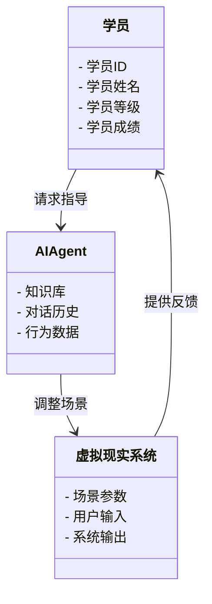
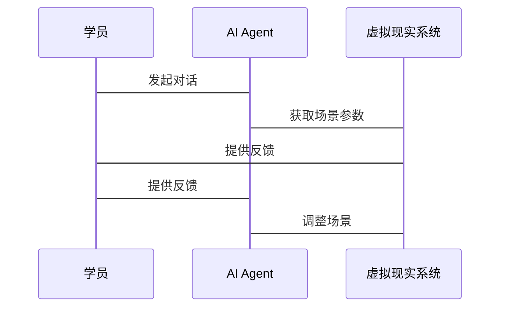

                 


# AI Agent在企业虚拟现实培训中的应用

> 关键词：AI Agent，虚拟现实，企业培训，人工智能，系统架构

> 摘要：随着人工智能和虚拟现实技术的快速发展，AI Agent在企业虚拟现实培训中的应用越来越广泛。本文将从AI Agent与虚拟现实技术的核心概念出发，详细探讨它们在企业培训中的协同作用，结合具体的算法原理和系统架构设计，深入分析AI Agent在企业虚拟现实培训中的实际应用案例，并总结其在企业培训中的最佳实践和未来发展方向。

---

# 第一部分: AI Agent与企业虚拟现实培训概述

## 第1章: AI Agent与虚拟现实技术概述

### 1.1 AI Agent的核心概念

#### 1.1.1 AI Agent的定义与特点
AI Agent（人工智能代理）是一种能够感知环境、自主决策并执行任务的智能实体。它通过传感器获取信息，利用推理能力进行分析，并通过执行器与外部环境交互。AI Agent的特点包括智能性、自主性、反应性、目标导向性和学习能力。

#### 1.1.2 AI Agent的工作原理
AI Agent的工作原理可以分为以下三个步骤：
1. **感知环境**：通过传感器或接口获取外部环境的数据。
2. **决策与推理**：利用算法对获取的数据进行分析，生成决策。
3. **执行任务**：根据决策结果，通过执行器完成任务。

#### 1.1.3 AI Agent与传统培训的区别
与传统培训相比，AI Agent在企业培训中的优势在于其智能化、个性化和实时反馈能力。传统培训通常是单向的，而AI Agent可以与学员进行实时互动，根据学员的表现动态调整培训内容。

### 1.2 虚拟现实技术在企业培训中的应用

#### 1.2.1 虚拟现实技术的基本概念
虚拟现实（Virtual Reality，VR）是一种利用计算机生成的模拟环境，通过视觉、听觉、触觉等感官刺激，让用户沉浸在一个虚拟的三维空间中。

#### 1.2.2 虚拟现实技术在企业培训中的优势
1. **沉浸式体验**：学员可以在虚拟环境中进行真实场景的模拟操作。
2. **安全性**：在虚拟环境中进行高风险操作，避免实际操作中的安全隐患。
3. **成本效益**：降低培训成本，避免因错误操作导致的损失。

#### 1.2.3 虚拟现实技术的应用场景
1. **销售培训**：在虚拟环境中模拟客户交流场景，提升销售人员的沟通能力。
2. **安全培训**：在虚拟环境中模拟火灾、地震等紧急情况，提升员工的应急处理能力。
3. **技术培训**：在虚拟环境中模拟设备操作流程，帮助员工快速掌握技术技能。

### 1.3 AI Agent与虚拟现实技术的结合

#### 1.3.1 AI Agent在虚拟现实培训中的作用
AI Agent在虚拟现实培训中主要起到以下作用：
1. **个性化指导**：根据学员的表现，实时提供个性化的反馈和建议。
2. **动态调整培训内容**：根据学员的学习进度和能力水平，动态调整培训内容。
3. **模拟真实场景**：通过AI Agent的智能决策能力，模拟真实工作场景中的各种可能性。

#### 1.3.2 AI Agent与虚拟现实技术的协同工作
AI Agent与虚拟现实技术的协同工作主要体现在以下方面：
1. **实时互动**：AI Agent通过自然语言处理技术与学员进行实时对话，提供个性化的指导。
2. **数据驱动的决策**：通过收集和分析学员的行为数据，AI Agent能够动态调整虚拟现实环境中的场景设置。
3. **知识库构建**：AI Agent可以通过机器学习技术不断优化自身的知识库，提升培训效果。

#### 1.3.3 企业虚拟现实培训中的实际案例
以销售培训为例，AI Agent可以在虚拟现实环境中模拟真实的客户交流场景，根据学员的表现实时调整对话内容，帮助学员提升沟通能力。

## 1.4 本章小结
本章主要介绍了AI Agent和虚拟现实技术的核心概念，分析了它们在企业培训中的优势和应用场景，并探讨了AI Agent与虚拟现实技术的协同作用。

---

# 第二部分: AI Agent在企业虚拟现实培训中的核心概念与联系

## 第2章: AI Agent的核心原理与系统架构

### 2.1 AI Agent的核心原理

#### 2.1.1 自然语言处理（NLP）在AI Agent中的应用
自然语言处理技术是AI Agent实现人机交互的核心技术之一。通过NLP技术，AI Agent可以理解用户的意图，并生成符合语境的回复。

#### 2.1.2 机器学习在AI Agent中的应用
机器学习技术可以帮助AI Agent通过大量数据的训练，不断优化自身的决策能力和问题解决能力。

#### 2.1.3 知识图谱在AI Agent中的构建与应用
知识图谱是一种结构化的知识表示方法，通过构建领域知识图谱，AI Agent可以更好地理解特定领域的知识，并提供更精准的建议。

### 2.2 虚拟现实系统的核心架构

#### 2.2.1 虚拟现实系统的组成模块
虚拟现实系统通常包括以下模块：
1. **硬件设备**：如VR头显、手柄、传感器等。
2. **渲染引擎**：如Unreal Engine、Unity等。
3. **交互系统**：用于处理用户的输入和输出。
4. **内容管理系统**：用于管理和配置虚拟现实场景。

#### 2.2.2 虚拟现实系统的交互设计
虚拟现实系统的交互设计需要考虑用户的直观操作和沉浸式体验，通常包括手部操作、语音交互、眼球追踪等多种方式。

#### 2.2.3 虚拟现实系统的渲染技术
虚拟现实系统的渲染技术需要保证高帧率和低延迟，以提供流畅的视觉体验。

### 2.3 AI Agent与虚拟现实系统的协同架构

#### 2.3.1 AI Agent与虚拟现实系统的接口设计
AI Agent与虚拟现实系统的接口设计需要考虑数据的实时传输和交互操作的响应速度。

#### 2.3.2 AI Agent在虚拟现实系统中的功能模块划分
AI Agent在虚拟现实系统中的功能模块通常包括：
1. **用户行为分析模块**：分析用户的操作行为，提供个性化的反馈。
2. **动态场景生成模块**：根据用户的行为动态调整虚拟现实场景。
3. **知识库管理模块**：管理和优化AI Agent的知识库。

#### 2.3.3 AI Agent与虚拟现实系统的数据流分析
AI Agent与虚拟现实系统之间的数据流主要包括用户行为数据、场景参数数据和反馈数据。

## 2.4 本章小结
本章详细讲解了AI Agent的核心原理和虚拟现实系统的核心架构，分析了AI Agent与虚拟现实系统的协同作用，并探讨了它们在企业培训中的应用。

---

## 第3章: AI Agent的算法原理

### 3.1 自然语言处理（NLP）算法

#### 3.1.1 Transformer模型的原理与实现
Transformer模型是一种基于注意力机制的深度学习模型，广泛应用于自然语言处理任务中。其核心思想是通过全局注意力机制，对输入序列中的每个位置进行加权计算。

#### 3.1.2 BERT模型在对话生成中的应用
BERT模型是一种基于Transformer的预训练语言模型，广泛应用于对话生成任务中。通过微调BERT模型，可以实现生成式对话系统。

#### 3.1.3 GPT模型在用户意图识别中的应用
GPT模型是一种基于Transformer的生成式模型，广泛应用于用户意图识别任务中。通过训练大量对话数据，GPT模型可以生成符合用户意图的回复。

### 3.2 机器学习算法

#### 3.2.1 监督学习在用户行为预测中的应用
监督学习是一种基于标注数据的机器学习方法，广泛应用于用户行为预测任务中。通过训练用户行为数据，可以预测用户的下一步操作。

#### 3.2.2 强化学习在任务执行中的应用
强化学习是一种基于奖励机制的机器学习方法，广泛应用于任务执行任务中。通过定义奖励函数，强化学习算法可以在虚拟环境中实现最优任务执行策略。

#### 3.2.3 聚类算法在用户分群中的应用
聚类算法是一种无监督学习方法，广泛应用于用户分群任务中。通过聚类算法，可以将用户分为不同的群体，为每个群体提供个性化的培训内容。

### 3.3 算法的数学模型与公式

#### 3.3.1 Transformer模型的数学公式
$$ \text{Attention}(Q,K,V) = \text{softmax}\left(\frac{QK^T}{\sqrt{d_k}}\right)V $$

#### 3.3.2 BERT模型的微调公式
$$ \text{BERT}(X) = \text{DNN}(X, \theta) $$

#### 3.3.3 GPT模型的生成公式
$$ P(\text{y}_{i}| \text{y}_{<i}, \theta) $$

---

## 第4章: 系统分析与架构设计方案

### 4.1 问题场景介绍
企业虚拟现实培训系统需要满足以下需求：
1. **实时互动**：学员与AI Agent之间需要实时互动。
2. **个性化指导**：根据学员的表现提供个性化的反馈和建议。
3. **动态调整场景**：根据学员的行为动态调整虚拟现实场景。

### 4.2 项目介绍
本项目旨在开发一个基于AI Agent的企业虚拟现实培训系统，涵盖以下功能：
1. **学员注册与登录**：支持学员通过多种方式注册和登录系统。
2. **虚拟现实场景生成**：根据学员的选择生成相应的虚拟现实场景。
3. **AI Agent交互**：支持学员与AI Agent进行实时对话，提供个性化的指导。

### 4.3 系统功能设计

#### 4.3.1 领域模型设计
领域模型是系统功能设计的核心，通过领域模型可以清晰地描述系统的功能模块和交互流程。



### 4.4 系统架构设计

#### 4.4.1 系统架构图
以下是系统架构设计的示意图：


### 4.5 系统接口设计

#### 4.5.1 系统接口描述
系统接口设计需要考虑以下方面：
1. **学员与AI Agent的交互接口**：支持学员与AI Agent进行实时对话。
2. **AI Agent与虚拟现实系统的接口**：支持AI Agent动态调整虚拟现实场景。
3. **虚拟现实系统与数据库的接口**：支持虚拟现实系统与数据库之间的数据交互。

### 4.6 系统交互设计

#### 4.6.1 系统交互流程图
以下是系统交互流程图：



---

## 第5章: 项目实战

### 5.1 环境安装

#### 5.1.1 系统环境要求
1. **操作系统**：建议使用Windows 10或更高版本。
2. **开发工具**：建议使用PyCharm或VS Code。
3. **虚拟现实框架**：建议使用Unity或Unreal Engine。

#### 5.1.2 依赖库安装
1. **Python依赖**：`transformers`, `numpy`, `scikit-learn`
2. **虚拟现实依赖**：根据选择的虚拟现实框架安装相应的依赖。

### 5.2 系统核心实现源代码

#### 5.2.1 AI Agent的核心代码
以下是AI Agent的核心代码示例：

```python
from transformers import AutoModelForCausalLM, AutoTokenizer
import torch

class AIAgent:
    def __init__(self, model_name="gpt2"):
        self.model = AutoModelForCausalLM.from_pretrained(model_name)
        self.tokenizer = AutoTokenizer.from_pretrained(model_name)
        
    def generate_response(self, input_text):
        inputs = self.tokenizer(input_text, return_tensors="pt")
        outputs = self.model.generate(**inputs, max_length=50)
        response = self.tokenizer.decode(outputs[0], skip_special_tokens=True)
        return response
```

#### 5.2.2 虚拟现实系统的代码实现
以下是虚拟现实系统的代码实现示例：

```python
import unreal_engine as ue

class VRSystem:
    def __init__(self, scene_path):
        self.scene = ue.load_scene(scene_path)
        
    def update_scene(self, parameters):
        for param in parameters:
            self.scene.set_parameter(param['name'], param['value'])
```

### 5.3 代码应用解读与分析
1. **AI Agent代码解读**：上述代码实现了基于GPT-2模型的AI Agent，能够根据输入文本生成回复。
2. **虚拟现实系统代码解读**：上述代码实现了虚拟现实场景的加载和参数更新功能。

### 5.4 实际案例分析
以销售培训为例，学员可以在虚拟现实环境中模拟客户交流场景，AI Agent可以根据学员的表现实时生成回复，并动态调整虚拟现实场景。

### 5.5 项目小结
本章通过实际案例分析，详细讲解了AI Agent在企业虚拟现实培训中的实际应用，并提供了核心代码实现。

---

## 第6章: 总结与展望

### 6.1 总结
本文详细探讨了AI Agent在企业虚拟现实培训中的应用，从核心概念到算法原理，再到系统架构和项目实战，全面分析了AI Agent在企业培训中的优势和潜力。

### 6.2 最佳实践 tips
1. **数据隐私保护**：在实际应用中，需要特别注意学员数据的隐私保护。
2. **系统维护与优化**：定期对系统进行维护和优化，确保系统的稳定性和性能。
3. **用户体验优化**：根据用户反馈不断优化系统的用户体验。

### 6.3 展望
随着人工智能和虚拟现实技术的不断发展，AI Agent在企业虚拟现实培训中的应用前景广阔。未来，可以通过引入更先进的算法和技术，进一步提升AI Agent的智能化水平，为企业的培训提供更加高效和个性化的解决方案。

---

# 作者：AI天才研究院/AI Genius Institute & 禅与计算机程序设计艺术 /Zen And The Art of Computer Programming

