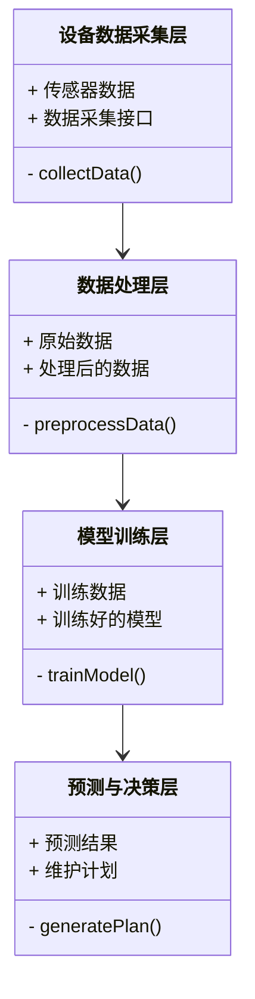

                 


# AI Agent在企业设备预测性维护中的应用

> 关键词：AI Agent，预测性维护，企业设备，机器学习，深度学习，系统架构，算法原理，故障预测

> 摘要：本文探讨了AI Agent在企业设备预测性维护中的应用，从背景概念、算法原理到系统架构和项目实战，详细分析了AI Agent如何通过机器学习和深度学习模型实现预测性维护，提升企业设备管理效率和降低维护成本。

---

# 第一部分: AI Agent与预测性维护的背景与概念

## 第1章: AI Agent与预测性维护的背景介绍

### 1.1 预测性维护的基本概念

#### 1.1.1 预测性维护的定义

预测性维护（Predictive Maintenance）是一种基于设备运行数据和状态，通过分析和预测设备可能出现的故障，从而提前安排维护活动的策略。其核心目标是通过预防性措施减少设备故障的发生，提高设备利用率和降低维护成本。

#### 1.1.2 预测性维护的核心目标

- 最大化设备利用率：通过预测潜在故障，避免因设备突发故障导致的停机时间。
- 降低维护成本：通过提前安排维护，减少紧急维修的成本和时间。
- 提高设备寿命：通过及时维护延长设备的使用寿命。

#### 1.1.3 预测性维护的实施优势

- 提高生产效率：减少设备停机时间。
- 降低维护成本：避免不必要的维护操作。
- 增强设备可靠性：通过预测性维护，设备可以在潜在故障发生前得到修复。

### 1.2 AI Agent的定义与特点

#### 1.2.1 AI Agent的基本定义

AI Agent（人工智能代理）是一种能够感知环境、自主决策并执行任务的智能实体。它能够通过传感器或数据源获取信息，利用算法进行分析，并根据结果采取相应行动。

#### 1.2.2 AI Agent的核心特点

- **自主性**：能够在没有外部干预的情况下自主完成任务。
- **反应性**：能够根据环境变化实时调整行为。
- **学习能力**：通过数据和经验不断优化自身的决策能力。
- **交互能力**：能够与外部系统或人员进行信息交互。

#### 1.2.3 AI Agent与传统维护的区别

- **主动性**：AI Agent能够主动监测设备状态，而传统维护通常是被动响应故障。
- **智能化**：AI Agent通过机器学习和深度学习模型进行预测，而传统维护主要依赖人工经验和简单的规则。

### 1.3 AI Agent在预测性维护中的应用前景

#### 1.3.1 AI Agent的潜在应用场景

- **制造业**：设备预测性维护可以减少生产线的停机时间，提高生产效率。
- **能源行业**：通过对设备状态的实时监测，预防重大设备故障，保障能源供应的安全性。
- **物流行业**：通过对物流设备的预测性维护，减少运输中断的风险。

#### 1.3.2 企业采用AI Agent的优势

- **提高效率**：通过自动化预测和维护，减少人工干预，提高维护效率。
- **降低成本**：通过提前预测和维护，降低突发故障带来的高昂维修成本。
- **增强决策能力**：AI Agent能够基于大量历史数据和实时数据，提供更精准的预测和决策支持。

#### 1.3.3 AI Agent应用的挑战与机遇

- **挑战**：数据质量、模型精度、系统集成复杂性。
- **机遇**：技术进步带来的效率提升和成本降低。

### 1.4 本章小结

本章介绍了预测性维护的基本概念和AI Agent的核心特点，分析了AI Agent在预测性维护中的应用前景。通过对比传统维护和AI Agent的优势，为后续章节的详细分析奠定了基础。

---

## 第2章: AI Agent与预测性维护的核心概念

### 2.1 AI Agent与预测性维护的关系

#### 2.1.1 AI Agent在预测性维护中的角色

AI Agent在预测性维护中扮演着关键角色，主要负责设备状态的监测、故障预测和维护决策的执行。通过实时数据分析和机器学习模型，AI Agent能够提前识别潜在故障，优化维护计划。

#### 2.1.2 预测性维护的实现流程

预测性维护的实现流程通常包括以下几个步骤：

1. **数据采集**：通过传感器或其他数据源收集设备运行数据。
2. **数据预处理**：清洗和标准化数据，去除噪声和异常值。
3. **模型训练**：利用机器学习或深度学习算法训练预测模型。
4. **故障预测**：基于训练好的模型，预测设备未来可能出现的故障。
5. **维护决策**：根据预测结果，制定和执行维护计划。

#### 2.1.3 AI Agent与预测性维护的协同工作

AI Agent通过整合预测性维护的各个步骤，实现设备状态的实时监测和预测，从而优化维护流程和提高维护效率。

### 2.2 AI Agent的核心原理

#### 2.2.1 数据采集与处理

AI Agent通过传感器、SCADA系统或其他数据源获取设备的运行数据，包括温度、压力、振动等参数。数据采集后需要进行预处理，确保数据的准确性和完整性。

#### 2.2.2 模型训练与预测

AI Agent利用机器学习和深度学习算法，对设备运行数据进行建模和训练，生成预测模型。模型能够根据输入的数据预测设备未来可能出现的故障。

#### 2.2.3 决策与执行

AI Agent根据预测结果，生成维护计划，并通过与企业资源计划系统（ERP）或其他管理系统进行交互，执行维护任务。

### 2.3 预测性维护的数学模型与算法

#### 2.3.1 时间序列分析模型

时间序列分析模型是一种常用的预测方法，适用于设备运行数据的时间序列预测。常见的模型包括ARIMA（自回归积分滑动平均）和LSTM（长短期记忆网络）。

#### 2.3.2 基于机器学习的故障预测模型

基于机器学习的故障预测模型通过训练数据，学习设备故障的特征和模式，从而实现故障预测。常用的算法包括支持向量机（SVM）、随机森林（Random Forest）和K近邻算法（KNN）。

#### 2.3.3 基于深度学习的故障预测模型

基于深度学习的故障预测模型通过多层神经网络结构，学习设备运行数据的深层特征，从而实现更准确的故障预测。常用的模型包括卷积神经网络（CNN）、循环神经网络（RNN）和图神经网络（Graph Neural Network）。

### 2.4 AI Agent与预测性维护的系统架构

#### 2.4.1 系统架构的组成

预测性维护系统通常由以下几个部分组成：

1. **数据采集层**：负责采集设备运行数据。
2. **数据处理层**：对数据进行清洗和预处理。
3. **模型训练层**：训练预测模型。
4. **预测与决策层**：生成维护计划并执行。

#### 2.4.2 数据流与信息交互

数据流从设备传感器流向数据处理层，经过预处理后输入模型训练层，生成预测结果后传递给决策层，最后执行维护任务。

#### 2.4.3 系统的可扩展性与灵活性

系统架构需要具备良好的可扩展性和灵活性，以适应不同设备和不同规模的企业需求。

### 2.5 本章小结

本章详细分析了AI Agent在预测性维护中的核心原理和系统架构，介绍了常用的数学模型和算法，为后续章节的算法原理和系统设计奠定了基础。

---

## 第3章: AI Agent的算法原理

### 3.1 时间序列分析模型

#### 3.1.1 ARIMA模型

ARIMA（自回归积分滑动平均）模型是一种常用的时间序列预测模型。它通过自回归和滑动平均的组合，预测未来的趋势和季节性变化。

#### 3.1.2 LSTM模型

LSTM（长短期记忆网络）模型是一种基于循环神经网络的变体，能够有效捕捉时间序列数据中的长期依赖关系，适用于复杂的设备运行数据预测。

#### 3.1.3 Prophet模型

Prophet模型是一种基于时间序列分解的预测模型，能够自动处理时间序列数据中的趋势和周期性变化。

### 3.2 基于机器学习的故障预测模型

#### 3.2.1 支持向量机（SVM）

支持向量机（SVM）是一种监督学习算法，适用于分类和回归任务。在故障预测中，SVM可以通过训练数据学习设备故障的特征，实现故障分类和预测。

#### 3.2.2 随机森林（Random Forest）

随机森林是一种基于决策树的集成学习算法，具有较高的鲁棒性和抗过拟合能力。在故障预测中，随机森林可以通过训练数据生成多个决策树，并进行投票或平均，实现故障预测。

#### 3.2.3 K近邻算法（KNN）

K近邻算法是一种基于距离的分类算法，适用于小规模数据集的故障预测。通过计算测试样本与训练样本之间的距离，选择最近的K个样本进行分类或回归。

### 3.3 基于深度学习的故障预测模型

#### 3.3.1 卷积神经网络（CNN）

卷积神经网络是一种常用的深度学习模型，适用于图像和时间序列数据的特征提取。在设备故障预测中，CNN可以通过卷积层提取设备运行数据的深层特征，实现故障分类和预测。

#### 3.3.2 循环神经网络（RNN）

循环神经网络是一种适用于序列数据的深度学习模型，能够捕捉时间序列数据中的长期依赖关系。在设备故障预测中，RNN可以通过循环层处理设备运行数据，生成预测结果。

#### 3.3.3 图神经网络（Graph Neural Network）

图神经网络是一种适用于图结构数据的深度学习模型，能够处理设备之间复杂的关联关系。在设备故障预测中，图神经网络可以通过图结构数据捕捉设备之间的相互影响，实现更准确的故障预测。

### 3.4 算法的优缺点对比

#### 3.4.1 时间序列模型的优缺点

- **优点**：适用于时间序列数据，能够捕捉趋势和周期性变化。
- **缺点**：对异常值和噪声较为敏感，模型复杂度较高。

#### 3.4.2 机器学习模型的优缺点

- **优点**：能够处理多种类型的数据，模型灵活性高。
- **缺点**：需要大量的训练数据，模型解释性较差。

#### 3.4.3 深度学习模型的优缺点

- **优点**：能够捕捉数据的深层特征，模型表现优异。
- **缺点**：需要大量的计算资源，模型训练时间较长。

### 3.5 本章小结

本章详细介绍了AI Agent在预测性维护中常用的算法原理，包括时间序列分析模型、机器学习模型和深度学习模型，分析了不同算法的优缺点，为后续章节的系统设计和项目实现提供了理论基础。

---

## 第4章: 系统分析与架构设计

### 4.1 系统需求分析

#### 4.1.1 问题场景介绍

企业在设备管理中面临的主要问题包括设备故障的突发性、维护成本的高昂以及维护计划的不合理。通过引入AI Agent实现预测性维护，可以有效解决这些问题。

#### 4.1.2 项目目标与范围

项目目标是开发一个基于AI Agent的预测性维护系统，实现设备状态的实时监测和故障预测。项目范围包括数据采集、模型训练、预测分析和维护执行。

#### 4.1.3 系统功能需求

系统需要具备以下功能：

- 数据采集与处理：采集设备运行数据并进行预处理。
- 模型训练与预测：训练预测模型并生成故障预测结果。
- 维护计划与执行：根据预测结果制定和执行维护计划。

### 4.2 系统功能设计

#### 4.2.1 领域模型设计

领域模型描述了系统的功能模块及其交互关系。以下是领域模型的Mermaid类图：



#### 4.2.2 系统架构设计

系统架构设计包括以下几个部分：

- **数据采集层**：通过传感器或其他数据源采集设备运行数据。
- **数据处理层**：对数据进行清洗、标准化和特征提取。
- **模型训练层**：利用机器学习或深度学习算法训练预测模型。
- **预测与决策层**：基于训练好的模型生成故障预测结果，并制定和执行维护计划。

#### 4.2.3 系统接口设计

系统接口设计包括以下内容：

- 数据采集接口：用于采集设备运行数据。
- 数据处理接口：用于对数据进行预处理。
- 模型训练接口：用于训练预测模型。
- 维护计划接口：用于生成和执行维护计划。

#### 4.2.4 系统交互设计

系统交互设计包括以下内容：

- 设备数据采集层通过数据采集接口向数据处理层传递数据。
- 数据处理层通过数据处理接口向模型训练层传递处理后的数据。
- 模型训练层通过模型训练接口生成训练好的模型。
- 预测与决策层通过预测接口生成故障预测结果，并通过维护计划接口制定和执行维护计划。

### 4.3 本章小结

本章详细分析了系统的功能需求和架构设计，通过Mermaid图展示了系统的领域模型和架构图，为后续章节的项目实现提供了指导。

---

## 第5章: 项目实战

### 5.1 环境安装与配置

#### 5.1.1 环境要求

- 操作系统：Linux/Windows/MacOS
- Python版本：3.6+
- 依赖库：numpy, pandas, scikit-learn, tensorflow, pytorch

#### 5.1.2 安装步骤

1. 安装Python环境：使用Anaconda或virtualenv创建虚拟环境。
2. 安装依赖库：通过pip安装所需的依赖库。
3. 配置开发环境：安装Jupyter Notebook或PyCharm作为开发环境。

### 5.2 核心实现源代码

#### 5.2.1 数据采集与处理

```python
import numpy as np
import pandas as pd

# 数据采集
data = pd.read_csv('equipment_data.csv')

# 数据处理
def preprocess_data(data):
    # 数据清洗
    data = data.dropna()
    # 标准化处理
    from sklearn.preprocessing import StandardScaler
    scaler = StandardScaler()
    data_scaled = scaler.fit_transform(data)
    return data_scaled

processed_data = preprocess_data(data)
```

#### 5.2.2 模型训练与预测

```python
from sklearn.ensemble import RandomForestClassifier
from sklearn.metrics import accuracy_score

# 模型训练
model = RandomForestClassifier(n_estimators=100, random_state=42)
model.fit(processed_data, labels)

# 模型预测
 predictions = model.predict(test_data)
 accuracy = accuracy_score(test_labels, predictions)
 print(f'Accuracy: {accuracy}')
```

#### 5.2.3 维护计划与执行

```python
from datetime import datetime, timedelta

# 生成维护计划
def generate_maintenance_plan(predicted_failure_time):
    current_time = datetime.now()
    maintenance_time = current_time + predicted_failure_time
    return maintenance_time

# 执行维护
def execute_maintenance():
    print('开始执行维护...')
    # 执行维护操作，例如停止设备、通知相关人员等
    print('维护完成.')

predicted_failure_time = model.predict([test_sample])
maintenance_time = generate_maintenance_plan(predicted_failure_time)
execute_maintenance()
```

### 5.3 代码应用解读与分析

#### 5.3.1 数据采集与处理

上述代码展示了如何使用Pandas库读取CSV格式的设备数据，并通过标准化处理对数据进行预处理。数据预处理是预测性维护系统中的关键步骤，确保数据的准确性和一致性。

#### 5.3.2 模型训练与预测

上述代码展示了如何使用随机森林算法训练分类模型，并对测试数据进行预测。随机森林是一种基于决策树的集成学习算法，具有较高的预测准确性和鲁棒性。

#### 5.3.3 维护计划与执行

上述代码展示了如何根据预测的故障时间生成维护计划，并执行维护操作。通过与实际维护时间的对比，可以评估模型的预测准确性和维护计划的合理性。

### 5.4 项目小结

本章通过一个实际案例展示了AI Agent在预测性维护中的应用，详细介绍了项目的环境配置、核心实现代码以及代码的解读与分析。通过项目的实战，读者可以更好地理解AI Agent在预测性维护中的具体应用和实现过程。

---

## 第6章: 总结与展望

### 6.1 总结

本文详细探讨了AI Agent在企业设备预测性维护中的应用，从背景概念、算法原理到系统架构和项目实战，全面分析了AI Agent如何通过机器学习和深度学习模型实现预测性维护，提升企业设备管理效率和降低维护成本。

### 6.2 展望

随着人工智能技术的不断发展，AI Agent在预测性维护中的应用将更加广泛和深入。未来的研究方向包括：

- 更加智能化的预测模型：结合强化学习和自监督学习，提高故障预测的准确性和实时性。
- 更加高效的系统架构：通过边缘计算和云计算的结合，优化系统的计算效率和扩展性。
- 更加多样化的应用场景：将AI Agent应用于更多行业的设备预测性维护，推动智能化设备管理的普及。

---

## 附录: AI Agent在预测性维护中的相关技术资料

### 附录A: 机器学习与深度学习算法的详细介绍

- **时间序列分析模型**：ARIMA、LSTM、Prophet
- **机器学习模型**：SVM、随机森林、KNN
- **深度学习模型**：CNN、RNN、Graph Neural Network

### 附录B: 系统架构设计的详细说明

- **数据采集层**：传感器数据采集接口的设计与实现
- **数据处理层**：数据预处理的具体步骤和方法
- **模型训练层**：模型训练的参数设置和优化方法
- **预测与决策层**：预测结果的处理和维护计划的生成

### 附录C: 项目实现的详细代码与注释

- **数据采集与处理**：完整的代码实现和注释说明
- **模型训练与预测**：完整的代码实现和注释说明
- **维护计划与执行**：完整的代码实现和注释说明

---

## 作者：AI天才研究院/AI Genius Institute & 禅与计算机程序设计艺术 /Zen And The Art of Computer Programming

---

这篇文章从背景概念、算法原理到系统设计和项目实战，全面分析了AI Agent在企业设备预测性维护中的应用。通过理论分析和实践案例的结合，帮助读者深入理解AI Agent在预测性维护中的核心作用和实现方法。

