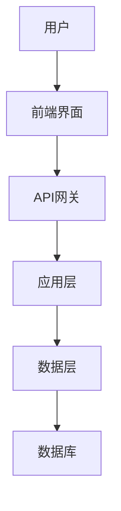
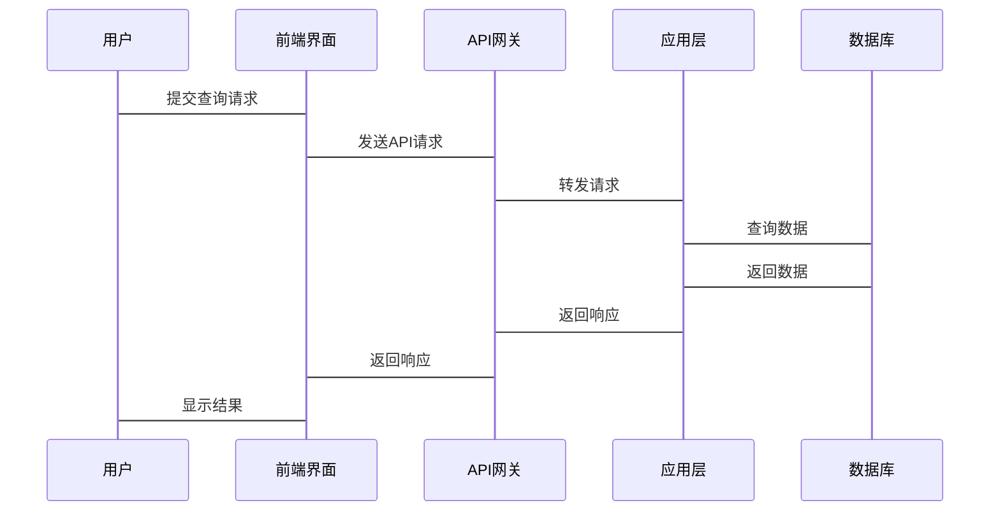
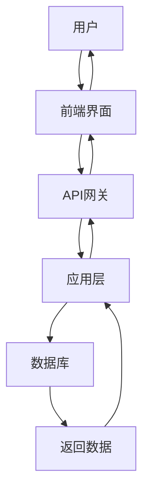
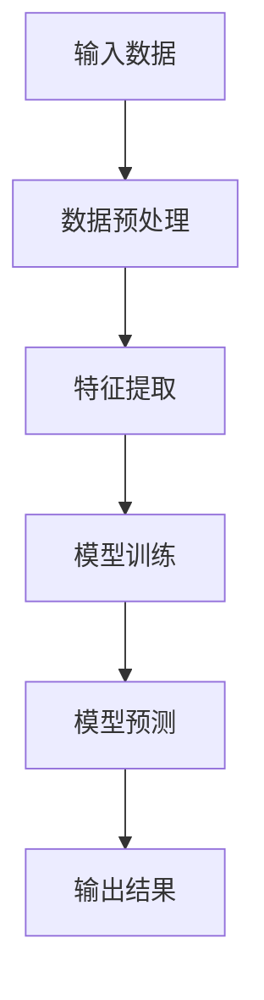

                 


# AI Agent在企业质量控制与产品追溯中的应用

## 关键词：AI Agent，企业质量控制，产品追溯，智能制造，工业4.0

## 摘要：本文详细探讨了AI Agent在企业质量控制与产品追溯中的应用，分析了AI Agent的技术基础、应用场景，以及其如何通过智能检测、数据分析和预测性维护优化企业质量控制流程。同时，本文还介绍了AI Agent在产品追溯中的应用，包括产品生命周期管理、供应链透明度提升和数据安全保护，并通过实际案例展示了AI Agent如何帮助企业在质量和追溯方面实现高效管理和优化。

---

# 第一部分：AI Agent基础与企业应用概述

## 第1章：AI Agent的基本概念与技术基础

### 1.1 AI Agent的定义与核心特征

#### 1.1.1 什么是AI Agent
AI Agent（人工智能代理）是指能够感知环境、自主决策并执行任务的智能实体。它能够通过传感器获取信息，利用算法进行分析和推理，并采取行动以实现特定目标。

#### 1.1.2 AI Agent的核心特征
- **自主性**：能够在没有外部干预的情况下自主运行。
- **反应性**：能够实时感知环境变化并做出响应。
- **目标导向**：所有行为都以实现特定目标为导向。
- **学习能力**：通过机器学习算法不断优化自身的决策能力。

#### 1.1.3 AI Agent与传统软件的区别
- **智能性**：AI Agent具备学习和推理能力，而传统软件仅执行预设指令。
- **适应性**：AI Agent能够自适应环境变化，传统软件则不具备这种能力。
- **交互性**：AI Agent能够与人类或其他系统进行自然交互，传统软件则依赖固定的接口。

### 1.2 AI Agent的分类与应用场景

#### 1.2.1 基于智能水平的分类
- **反应式AI Agent**：基于当前感知做出反应，适用于实时任务。
- **认知式AI Agent**：具备高级推理和决策能力，适用于复杂任务。

#### 1.2.2 基于功能类型的分类
- **执行型AI Agent**：负责执行具体任务，如机器人控制。
- **协调型AI Agent**：负责协调多个AI Agent或系统的工作，如供应链管理。

#### 1.2.3 AI Agent在企业中的典型应用场景
- **智能监控**：实时监控生产过程，及时发现异常。
- **预测性维护**：通过数据分析预测设备故障，提前维护。
- **自动化决策**：基于数据自动做出最优决策。

### 1.3 AI Agent的技术基础

#### 1.3.1 机器学习基础
- **监督学习**：通过标记数据训练模型，用于分类和回归任务。
- **无监督学习**：通过未标记数据发现数据结构，用于聚类和异常检测。
- **强化学习**：通过奖励机制训练模型，用于策略优化。

#### 1.3.2 自然语言处理
- **文本分析**：从文本中提取信息，用于舆情分析和文档处理。
- **对话系统**：实现人与AI Agent之间的自然对话，提升用户体验。

#### 1.3.3 计算机视觉
- **图像识别**：识别图像中的物体或场景，用于质量检测。
- **视频分析**：分析视频流中的动态信息，用于实时监控。

#### 1.3.4 知识图谱与推理
- **知识表示**：将领域知识表示为图结构，用于知识推理。
- **逻辑推理**：基于知识图谱进行逻辑推理，用于决策支持。

---

## 第2章：AI Agent在企业中的应用价值

### 2.1 企业质量控制中的痛点与挑战

#### 2.1.1 传统质量控制的局限性
- **效率低下**：依赖人工检查，效率低且易出错。
- **数据孤岛**：各环节数据分散，难以整合分析。
- **缺乏预测性**：无法提前预测潜在问题，导致被动维护。

#### 2.1.2 数据孤岛与信息不透明
- **数据分散**：企业内部数据分布在不同系统中，难以共享。
- **信息滞后**：传统质量控制依赖人工记录，信息更新不及时。

#### 2.1.3 效率低下与成本高昂
- **人工成本**：大量依赖人工检查，成本高且效率低。
- **返工成本**：质量问题导致的返工成本高昂。

### 2.2 AI Agent如何解决企业质量控制问题

#### 2.2.1 智能检测与实时监控
- **图像识别**：通过AI Agent进行图像识别，实时检测产品质量。
- **实时监控**：AI Agent实时监控生产过程，及时发现异常。

#### 2.2.2 数据分析与预测性维护
- **数据分析**：利用机器学习算法分析历史数据，预测潜在质量问题。
- **预测性维护**：基于设备运行数据，预测设备故障，提前维护。

#### 2.2.3 自动化决策与优化
- **自动化决策**：AI Agent基于实时数据自动做出最优决策。
- **流程优化**：通过数据分析优化生产流程，降低成本。

### 2.3 产品追溯中的关键问题

#### 2.3.1 产品生命周期管理
- **全生命周期管理**：从原材料采购到产品交付，全程追踪。
- **版本控制**：管理产品不同版本的信息，确保可追溯性。

#### 2.3.2 供应链透明度与可追溯性
- **供应链透明**：通过AI Agent实现供应链信息透明，确保产品来源可追溯。
- **透明化管理**：消费者可以追溯产品信息，增强信任。

#### 2.3.3 数据安全与隐私保护
- **数据加密**：保护产品追溯数据的安全性。
- **隐私保护**：在追溯过程中保护消费者隐私。

---

## 第3章：AI Agent在企业质量控制中的应用

### 3.1 质量控制的流程与关键环节

#### 3.1.1 原材料采购与验收
- **采购流程**：从供应商采购原材料，通过AI Agent进行质量检查。
- **验收标准**：根据质量标准进行验收，确保原材料符合要求。

#### 3.1.2 生产过程监控
- **实时监控**：AI Agent实时监控生产过程中的各项参数。
- **异常检测**：通过机器学习算法检测生产过程中的异常情况。

#### 3.1.3 成品检验与不合格品处理
- **成品检验**：通过AI Agent进行成品检验，确保产品质量。
- **不合格品处理**：对不合格品进行分类处理，确保问题产品不流入市场。

### 3.2 AI Agent在质量检测中的应用

#### 3.2.1 图像识别与缺陷检测
- **图像采集**：通过摄像头采集产品图像。
- **图像处理**：利用计算机视觉技术对图像进行处理。
- **缺陷检测**：通过图像识别技术检测产品中的缺陷。

#### 3.2.2 声学分析与异常声音识别
- **声学传感器**：通过声学传感器采集设备运行声音。
- **声音分析**：利用机器学习算法分析声音，识别设备异常。

### 3.3 AI Agent在质量控制中的价值

#### 3.3.1 提高效率
- **自动化检测**：通过AI Agent实现自动化检测，提高效率。
- **减少人工干预**：减少对人工的依赖，降低错误率。

#### 3.3.2 提高准确性
- **精准检测**：通过AI Agent实现精准检测，减少人为误差。
- **实时监控**：实时监控生产过程，及时发现异常。

#### 3.3.3 降低成本
- **预测性维护**：通过预测性维护减少设备故障，降低维护成本。
- **减少返工**：通过提前发现质量问题，减少返工成本。

---

## 第4章：AI Agent在产品追溯中的应用

### 4.1 产品追溯的需求与挑战

#### 4.1.1 追溯需求
- **消费者需求**：消费者希望了解产品信息，增强信任。
- **监管需求**：政府监管机构需要追溯产品信息，确保产品质量。

#### 4.1.2 追溯挑战
- **数据分散**：产品信息分散在不同系统中，难以整合。
- **数据安全**：产品信息涉及隐私和商业机密，需要确保数据安全。

### 4.2 AI Agent实现产品追溯的方法

#### 4.2.1 产品追踪系统设计
- **系统架构**：设计产品追溯系统架构，确保数据流畅通。
- **数据采集**：通过传感器和条码扫描设备采集产品信息。
- **数据存储**：将产品信息存储在数据库中，确保数据可追溯。

#### 4.2.2 产品信息管理
- **信息整合**：将产品信息整合到统一的系统中，确保信息准确。
- **信息查询**：消费者可以通过系统查询产品信息，实现追溯。

#### 4.2.3 数据安全与隐私保护
- **数据加密**：通过数据加密技术保护产品信息。
- **访问控制**：通过访问控制确保只有授权人员可以访问数据。

### 4.3 产品追溯系统的优势

#### 4.3.1 提高透明度
- **供应链透明**：通过AI Agent实现供应链透明，增强消费者信任。
- **信息共享**：企业内部信息共享，提升协作效率。

#### 4.3.2 提高效率
- **自动化处理**：通过AI Agent实现自动化处理，提高效率。
- **快速响应**：快速响应消费者查询，提升用户体验。

#### 4.3.3 降低成本
- **减少人工干预**：通过自动化处理减少人工干预，降低成本。
- **减少召回成本**：通过提前发现质量问题，减少产品召回成本。

---

## 第5章：系统架构与实现

### 5.1 系统架构设计

#### 5.1.1 系统设计目标
- **模块化设计**：系统设计模块化，便于维护和扩展。
- **高可用性**：系统设计高可用性，确保稳定运行。
- **可扩展性**：系统设计可扩展性，便于未来扩展。

#### 5.1.2 系统架构图


#### 5.1.3 模块划分
- **前端界面**：用户与系统交互的界面。
- **API网关**：处理用户的API请求。
- **应用层**：处理业务逻辑。
- **数据层**：处理数据存储和检索。
- **数据库**：存储产品追溯数据。

### 5.2 接口设计

#### 5.2.1 API接口设计
- **RESTful API**：采用RESTful API设计，确保接口简洁和易用。
- **认证与授权**：通过JWT实现认证与授权，确保数据安全。

#### 5.2.2 数据接口
- **数据采集接口**：采集产品信息。
- **数据查询接口**：查询产品信息。
- **数据更新接口**：更新产品信息。

### 5.3 交互流程设计

#### 5.3.1 用户查询流程


#### 5.3.2 系统处理流程


### 5.4 数学模型与算法

#### 5.4.1 算法流程


#### 5.4.2 数学模型
- **线性回归**：用于预测性维护，预测设备故障概率。
  $$ y = \beta_0 + \beta_1x + \epsilon $$
- **支持向量机**：用于图像识别，分类产品缺陷。
  $$ \text{最大化} \quad \frac{1}{2}\|w\|^2 $$
  $$ \text{subject to} \quad y_i(w \cdot x_i + b) \geq 1, \quad i = 1, ..., n $$

---

## 第6章：项目实战与应用案例

### 6.1 项目部署与环境安装

#### 6.1.1 环境要求
- **操作系统**：Linux/Windows/MacOS
- **Python版本**：Python 3.8+
- **依赖库**：TensorFlow, Keras, OpenCV, Flask

#### 6.1.2 安装步骤
1. 安装Python
2. 安装依赖库
   ```bash
   pip install tensorflow keras opencv-python flask
   ```

### 6.2 系统核心实现

#### 6.2.1 核心代码实现
- **图像识别代码**
  ```python
  import cv2
  import numpy as np

  def detect_defects(image_path):
      img = cv2.imread(image_path)
      gray = cv2.cvtColor(img, cv2.COLOR_BGR2GRAY)
      edges = cv2.Canny(gray, 100, 200)
      return edges
  ```

- **预测性维护代码**
  ```python
  import pandas as pd
  import tensorflow as tf

  def predict_failure(model, data):
      predictions = model.predict(data)
      return predictions
  ```

#### 6.2.2 代码应用解读
- **图像识别代码**：通过OpenCV库实现图像处理，识别产品缺陷。
- **预测性维护代码**：通过TensorFlow库训练模型，预测设备故障概率。

### 6.3 实际案例分析

#### 6.3.1 案例背景
某汽车制造企业希望利用AI Agent实现产品质量追溯，从原材料采购到成品交付，全程追踪。

#### 6.3.2 系统实现
- **数据采集**：通过传感器和摄像头采集产品信息。
- **数据存储**：将产品信息存储在数据库中。
- **数据查询**：消费者可以通过扫描二维码查询产品信息。

#### 6.3.3 应用效果
- **提高效率**：通过自动化处理，提高了产品质量检查效率。
- **降低成本**：通过预测性维护，降低了设备维护成本。

---

## 第7章：总结与展望

### 7.1 总结

AI Agent在企业质量控制与产品追溯中的应用，不仅提高了效率和准确性，还为企业带来了显著的成本节约。通过AI Agent，企业能够实现智能化的质量控制和产品追溯，提升竞争力。

### 7.2 展望

随着AI技术的不断发展，AI Agent在企业质量控制与产品追溯中的应用将更加广泛。未来，AI Agent将与5G、物联网等技术结合，进一步提升企业的智能化水平。

---

## 作者：AI天才研究院/Zen And The Art of Computer Programming

