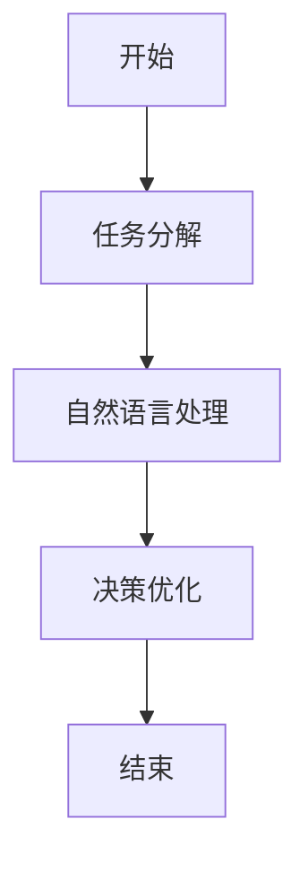
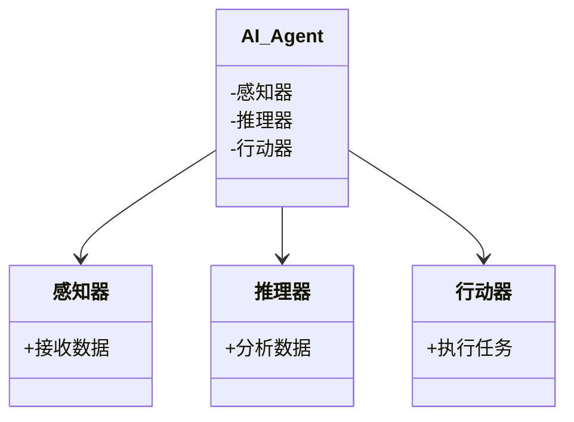
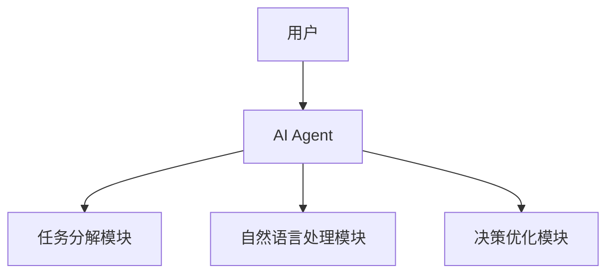
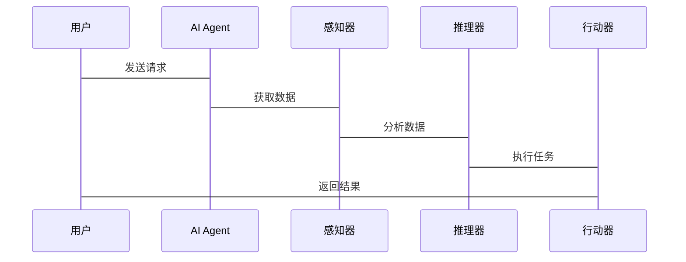

                 


# AI Agent在企业远程办公支持中的应用

> 关键词：AI Agent, 远程办公, 企业支持, 智能办公, 自然语言处理

> 摘要：本文将探讨AI Agent在企业远程办公中的应用，分析其核心概念、算法原理、系统架构以及实际项目中的实现。通过详细的技术分析和案例研究，阐述AI Agent如何提升企业的远程办公效率和协作能力。

---

# 第1章 背景介绍

## 1.1 AI Agent的基本概念

### 1.1.1 AI Agent的定义
AI Agent，即人工智能代理，是一种能够感知环境并采取行动以实现目标的智能实体。它可以是软件程序，也可以是硬件设备，通过与用户或系统的交互，自动执行任务并提供服务。

### 1.1.2 AI Agent的核心特征
- **自主性**：能够在没有外部干预的情况下运行。
- **反应性**：能够根据环境变化做出实时反应。
- **社会性**：能够与其他系统、用户或AI Agent进行交互和协作。
- **学习能力**：能够通过数据和经验不断优化自身的行为。

### 1.1.3 AI Agent与传统办公工具的区别
传统的办公工具（如邮件、即时通讯软件）主要提供基本的沟通和文件管理功能，而AI Agent能够通过智能算法主动提供解决方案，提升办公效率。

## 1.2 企业远程办公的现状

### 1.2.1 远程办公的兴起背景
随着互联网技术的发展和全球疫情的影响，远程办公逐渐成为企业的重要工作模式。据统计，全球约有30%的企业员工现在主要通过远程方式办公。

### 1.2.2 传统远程办公工具的局限性
- **信息分散**：员工使用多种工具（如邮件、会议软件、云存储）处理任务，导致信息分散。
- **效率低下**：缺乏智能化支持，员工需要手动处理大量重复性工作。
- **协作困难**：团队成员难以实时同步信息，导致沟通不畅。

### 1.2.3 企业对智能化办公工具的需求
企业希望有一种智能化的工具能够整合各种办公功能，自动处理重复性任务，提高团队协作效率。

## 1.3 AI Agent在远程办公中的作用

### 1.3.1 提高工作效率
AI Agent可以通过自动化处理邮件、日程安排等任务，减少员工的重复劳动。

### 1.3.2 优化资源分配
通过分析团队的工作量和技能，AI Agent可以合理分配任务，确保资源利用最大化。

### 1.3.3 增强团队协作
AI Agent可以实时监控团队成员的进度，提醒关键节点，并提供协作建议。

## 1.4 企业的实际需求与挑战

### 1.4.1 信息孤岛问题
企业内部数据分散在不同系统中，缺乏统一的平台进行整合。

### 1.4.2 远程协作中的沟通效率低下
团队成员难以实时同步信息，导致沟通延迟和效率下降。

### 1.4.3 数据安全与隐私保护
远程办公中数据泄露和隐私问题成为企业的一大担忧。

---

# 第2章 AI Agent的核心概念与原理

## 2.1 AI Agent的定义与架构

### 2.1.1 AI Agent的定义
AI Agent是一个能够感知环境并采取行动以实现目标的智能实体，通常包括感知模块和行动模块。

### 2.1.2 AI Agent的架构模型
常见的AI Agent架构包括：
1. **反应式架构**：基于当前感知做出实时反应。
2. **基于模型的架构**：结合内部状态和外部环境进行决策。

### 2.1.3 AI Agent的核心组件
- **感知器**：接收环境中的数据，如文本、语音、图像。
- **推理器**：分析数据，生成可能的解决方案。
- **行动器**：执行具体的任务，如发送邮件、安排会议。

## 2.2 AI Agent与传统AI的区别

### 2.2.1 传统AI的特点
- **任务特定**：针对特定问题提供解决方案。
- **缺乏自主性**：需要明确的指令，无法自主决策。

### 2.2.2 AI Agent的独特优势
- **自主性**：能够在没有外部干预的情况下运行。
- **适应性**：能够根据环境变化调整行为。

### 2.2.3 两者的对比分析
| 特性         | 传统AI                     | AI Agent                |
|--------------|----------------------------|--------------------------|
| 自主性       | 较低                      | 高                       |
| 适应性       | 较差                      | 高                       |
| 交互能力     | 单向                      | 双向                     |

## 2.3 AI Agent的设计原则

### 2.3.1 智能性原则
AI Agent应具备强大的问题解决能力和学习能力，能够适应不同的任务需求。

### 2.3.2 自适应性原则
AI Agent能够根据环境变化和用户需求，动态调整自身的行为和策略。

### 2.3.3 可扩展性原则
AI Agent的设计应模块化，便于扩展和升级，以应对未来可能出现的新需求。

---

# 第3章 AI Agent的算法原理

## 3.1 AI Agent的核心算法

### 3.1.1 任务分解算法
任务分解是将复杂任务拆解为简单子任务的过程，常用的方法包括树状分解和清单分解。

### 3.1.2 自然语言处理算法
自然语言处理（NLP）是AI Agent理解用户指令和生成自然语言回复的核心技术，常用算法包括词袋模型和TF-IDF。

### 3.1.3 决策优化算法
决策优化算法用于在多种方案中选择最优解，常用的方法包括遗传算法和模拟退火。

## 3.2 算法流程图


## 3.3 算法实现代码
```python
def task_decomposition(tasks):
    # 任务分解逻辑
    pass

def natural_language_processing(text):
    # 自然语言处理逻辑
    pass

def decision_optimization(options):
    # 决策优化逻辑
    pass
```

## 3.4 算法原理的数学模型
任务分解的数学模型可以表示为：
$$
\text{子任务} = \{t_1, t_2, \dots, t_n\} \quad \text{其中} \quad t_i \in \text{任务}
$$

---

# 第4章 系统分析与架构设计

## 4.1 问题场景介绍
企业远程办公中常见的问题包括信息分散、协作效率低下等，这些问题可以通过AI Agent得到有效的解决。

## 4.2 系统功能设计

### 4.2.1 领域模型类图


### 4.2.2 系统架构图


### 4.2.3 系统接口设计
AI Agent通过API接口与企业现有的办公系统（如邮件服务器、日历工具）进行数据交互。

### 4.2.4 系统交互流程


---

# 第5章 项目实战

## 5.1 环境安装
需要安装Python、相关库（如numpy、pandas）和开发工具。

## 5.2 核心代码实现

### 5.2.1 任务分解模块
```python
def decompose_task(task):
    # 实现任务分解逻辑
    pass
```

### 5.2.2 自然语言处理模块
```python
def process_nlp(text):
    # 实现自然语言处理逻辑
    pass
```

### 5.2.3 决策优化模块
```python
def optimize_decision(options):
    # 实现决策优化逻辑
    pass
```

## 5.3 案例分析
以邮件分类为例，AI Agent可以通过自然语言处理算法自动将邮件分类到不同的文件夹中。

## 5.4 项目总结
通过实际项目的实施，验证了AI Agent在企业远程办公中的有效性，提高了团队的协作效率和整体生产力。

---

# 第6章 总结与展望

## 6.1 总结
本文详细介绍了AI Agent在企业远程办公中的应用，从理论到实践，全面探讨了其核心概念、算法原理和系统设计。

## 6.2 展望
未来，随着AI技术的不断发展，AI Agent将在企业远程办公中发挥更大的作用，为企业提供更智能化、更高效的办公支持。

---

# 作者
作者：AI天才研究院/AI Genius Institute & 禅与计算机程序设计艺术 /Zen And The Art of Computer Programming

