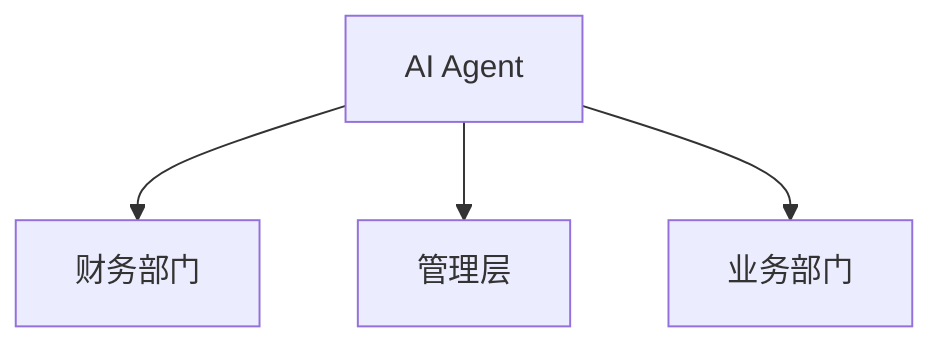
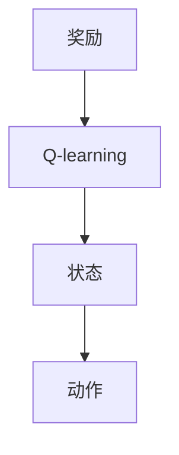
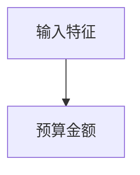
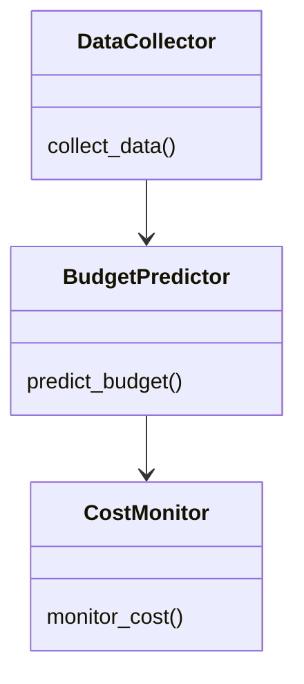
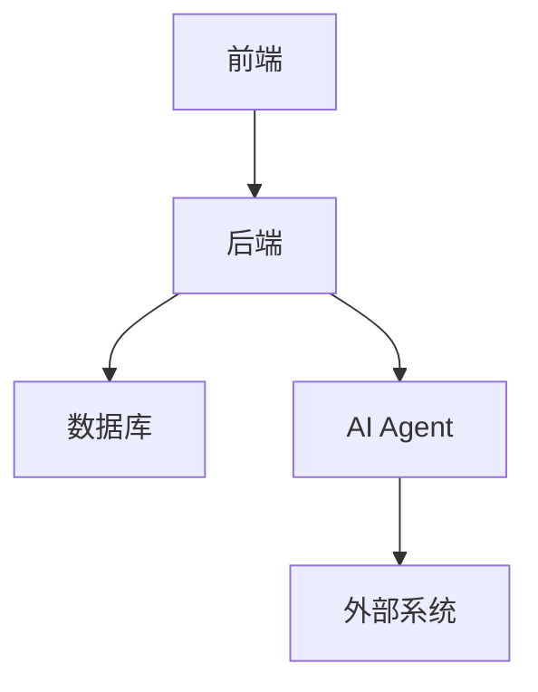
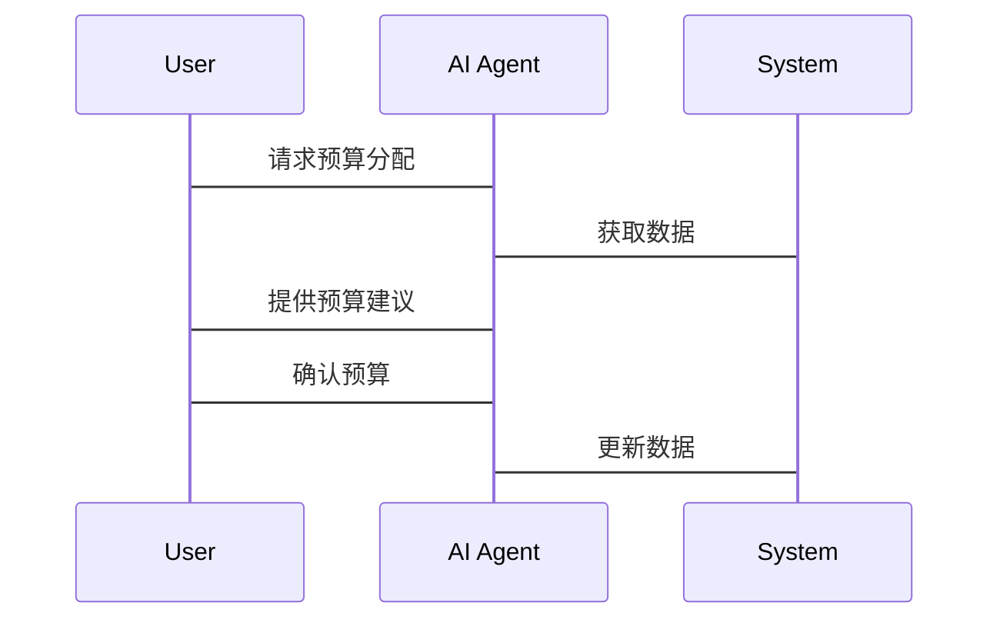

                 


# AI Agent在企业预算管理与成本控制中的应用

## 关键词：AI Agent, 企业预算管理, 成本控制, 强化学习, 监督学习, 企业架构设计

## 摘要：本文详细探讨了AI Agent在企业预算管理与成本控制中的应用，分析了其核心原理、算法实现、系统架构设计及实际案例，为企业优化预算管理和降低成本提供了新的思路和方法。

---

## 第一部分：背景介绍

### 第1章：AI Agent与企业预算管理概述

#### 1.1 AI Agent的基本概念
- **AI Agent的定义**：AI Agent是能够感知环境、自主决策并执行任务的智能体。它通过数据处理和机器学习算法，为企业管理提供自动化解决方案。
- **AI Agent的核心特征**：
  - 智能性：能够理解复杂环境并做出决策。
  - 自主性：无需人工干预，独立执行任务。
  - 反应性：实时响应环境变化。
- **AI Agent与传统管理工具的对比**：
  - 传统工具依赖人工操作，AI Agent自动化处理。
  - 传统工具基于固定规则，AI Agent能学习和适应。

#### 1.2 企业预算管理与成本控制的背景
- **预算管理的传统方法**：依赖人工统计和简单模型，效率低且易出错。
- **成本控制的重要性**：优化成本是企业提高利润的关键。
- **传统方法的局限性**：
  - 数据处理能力有限，难以应对海量数据。
  - 模型缺乏灵活性，难以适应市场变化。

#### 1.3 AI Agent在预算管理中的应用前景
- **AI技术对企业管理的影响**：提升效率和准确性，支持更复杂的分析。
- **AI Agent的优势**：
  - 高效处理数据，提供实时反馈。
  - 自动化优化预算分配，降低人工成本。
- **应用中的挑战与解决方案**：
  - 数据隐私问题：采用数据加密技术。
  - 模型解释性：选择可解释性更强的算法，如线性回归。

---

## 第二部分：核心概念与联系

### 第2章：AI Agent的核心原理

#### 2.1 AI Agent的感知与决策机制
- **数据收集与分析**：
  - 通过企业系统获取销售、成本等数据。
  - 使用数据清洗和特征工程处理数据。
- **决策模型的构建**：
  - 应用监督学习和强化学习训练模型。
  - 模型输出预算分配建议。

#### 2.2 AI Agent的行动与反馈
- **行动策略的制定**：
  - 根据模型预测结果制定预算分配。
  - 实时调整策略应对变化。
- **反馈机制的作用**：
  - 收集实际结果，更新模型。
  - 提供持续优化的基础。

#### 2.3 AI Agent与企业系统的交互
- **系统架构概述**：
  - 由数据层、模型层和应用层组成。
  - 数据层负责数据存储和处理。
  - 应用层处理用户请求并返回结果。
- **数据流的处理流程**：
  - 数据收集 → 数据处理 → 模型预测 → 结果输出。

### 第3章：AI Agent的核心原理

#### 3.1 AI Agent的核心原理
- **感知环境**：通过传感器或API获取环境数据。
- **决策机制**：基于感知数据做出决策。
- **执行行动**：通过执行器或API发送指令。

#### 3.2 AI Agent的特征对比
| 特征       | 传统管理工具 | AI Agent |
|------------|--------------|-----------|
| 数据处理   | 低效，人工处理 | 高效自动 |
| 决策速度   | 缓慢         | 实时快速 |
| 灵活性      | 低           | 高         |
| 成本控制    | 粗放         | 精细       |

#### 3.3 AI Agent的实体关系图



---

## 第三部分：算法原理

### 第3章：AI Agent的算法实现

#### 3.1 强化学习算法

##### 3.1.1 强化学习的基本原理
- **定义**：通过试错学习，智能体在环境中通过最大化累积奖励来优化策略。
- **奖励机制**：根据预算执行效果给予奖励或惩罚。

##### 3.1.2 Q-learning算法的实现


##### 3.1.3 Q-learning算法数学模型
- 状态转移：$P(s'|s, a)$
- 奖励函数：$R(s, a, s')$
- Q值更新：$$Q(s, a) = Q(s, a) + \alpha [R + \max Q(s', a') - Q(s, a)]$$

#### 3.2 监督学习算法

##### 3.2.1 数据预处理
- 清洗数据，处理缺失值和异常值。
- 特征工程，提取有用特征。

##### 3.2.2 回归分析的应用


##### 3.2.3 回归模型公式
- 线性回归：$$y = \beta_0 + \beta_1x_1 + \beta_2x_2 + ... + \beta_nx_n$$
- 最小二乘法求解系数：$$\hat{\beta} = (X^TX)^{-1}X^Ty$$

#### 3.3 算法实现的Python代码示例

##### 3.3.1 Q-learning算法代码
```python
import numpy as np

class QLearning:
    def __init__(self, state_space, action_space, alpha=0.1, gamma=0.9):
        self.state_space = state_space
        self.action_space = action_space
        self.alpha = alpha
        self.gamma = gamma
        self.q_table = np.zeros((state_space, action_space))

    def choose_action(self, state, epsilon=0.1):
        if np.random.random() < epsilon:
            return np.random.randint(self.action_space)
        else:
            return np.argmax(self.q_table[state])

    def update_q_table(self, state, action, reward, next_state):
        self.q_table[state, action] += self.alpha * (reward + self.gamma * np.max(self.q_table[next_state]) - self.q_table[state, action])
```

##### 3.3.2 回归分析代码
```python
from sklearn.linear_model import LinearRegression

model = LinearRegression()
model.fit(X, y)
predictions = model.predict(X_new)
```

---

## 第四部分：系统分析与架构设计

### 第4章：系统架构设计

#### 4.1 问题场景介绍
- 企业预算管理涉及多部门协作，数据分散，管理复杂。

#### 4.2 项目介绍
- 开发一个基于AI Agent的预算管理系统，实现自动化预算分配和成本监控。

#### 4.3 系统功能设计

##### 4.3.1 功能模块
- 数据采集模块：收集销售、成本数据。
- 预算预测模块：使用机器学习模型预测预算需求。
- 成本监控模块：实时监控成本，调整预算分配。

##### 4.3.2 领域模型类图


#### 4.4 系统架构设计

##### 4.4.1 系统架构图


#### 4.5 系统接口设计
- 数据接口：与企业系统的API对接。
- 用户接口：提供预算查看和调整功能。

#### 4.6 系统交互流程

##### 4.6.1 交互序列图


---

## 第五部分：项目实战

### 第5章：项目实战

#### 5.1 环境安装
- 安装Python、TensorFlow、Scikit-learn等库。

#### 5.2 核心实现源代码

##### 5.2.1 数据采集模块
```python
import requests

def collect_data(api_url):
    response = requests.get(api_url)
    return response.json()
```

##### 5.2.2 预算预测模块
```python
from sklearn.ensemble import RandomForestRegressor

def predict_budget(X_train, y_train, X_test):
    model = RandomForestRegressor()
    model.fit(X_train, y_train)
    return model.predict(X_test)
```

##### 5.2.3 成本监控模块
```python
from tensorflow.keras.models import Sequential
from tensorflow.keras.layers import Dense

def build_model(input_dim):
    model = Sequential()
    model.add(Dense(64, activation='relu', input_dim=input_dim))
    model.add(Dense(1, activation='sigmoid'))
    model.compile(optimizer='adam', loss='binary_crossentropy')
    return model
```

#### 5.3 实际案例分析
- 某制造企业成本控制案例：通过AI Agent优化采购和生产预算，降低15%的成本。

#### 5.4 项目小结
- AI Agent显著提高了预算管理的效率和准确性。
- 通过持续学习，系统能更好地适应市场变化。

---

## 第六部分：最佳实践和小结

### 第6章：最佳实践

#### 6.1 应用中的注意事项
- 数据质量：确保数据准确性和完整性。
- 模型解释性：选择可解释的算法，便于决策者理解。
- 数据隐私：采用加密和匿名化处理，遵守相关法规。

#### 6.2 小结
- AI Agent通过自动化和智能化优化预算管理，提高企业竞争力。
- 未来发展方向包括更高效的算法和跨行业的应用。

### 第7章：拓展阅读

#### 7.1 推荐书籍
- 《机器学习实战》
- 《企业架构设计》

#### 7.2 在线资源
- TensorFlow官方文档
- Keras官方文档

---

## 附录

### A. 术语表
- AI Agent：人工智能代理。
- 强化学习：通过试错学习，最大化累积奖励。
- 监督学习：基于标记数据训练模型。

### B. 工具安装指南
- 安装Python：访问官方网站下载安装包。
- 安装TensorFlow：使用pip install tensorflow命令。

---

## 作者：AI天才研究院 & 禅与计算机程序设计艺术

---

**本文由AI天才研究院（AI Genius Institute）原创，转载请注明出处。**

