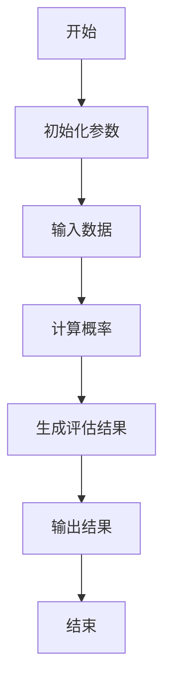
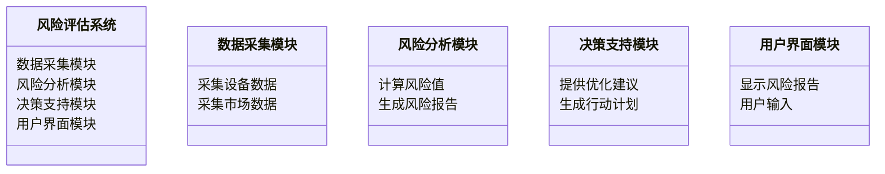
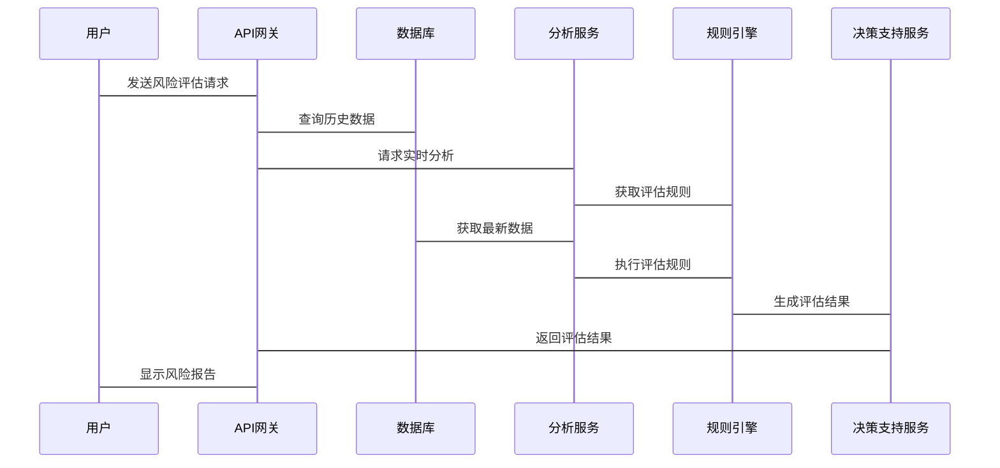

                 


# AI Agent在企业风险评估与管理中的应用

## 关键词：AI Agent, 企业风险管理, 风险评估, 机器学习, 知识图谱

## 摘要

本文深入探讨了AI Agent在企业风险评估与管理中的应用，分析了其在企业风险管理中的核心作用。通过详细阐述AI Agent的基本概念、算法原理、系统架构设计以及实际项目案例，展示了AI Agent如何通过智能化手段提升企业风险管理的效率和准确性。文章最后总结了AI Agent在企业风险管理中的优势，并展望了其未来的发展方向。

---

# 目录

## 目录

### 目录
1. **AI Agent在企业风险评估与管理中的应用概述**
2. **AI Agent的核心概念与联系**
3. **AI Agent的算法原理与数学模型**
4. **企业风险评估系统的架构设计**
5. **项目实战：基于AI Agent的企业风险评估系统实现**
6. **AI Agent在企业风险管理中的最佳实践与小结**

---

# 正文

## 第一部分：AI Agent在企业风险评估与管理中的应用概述

### 1.1 AI Agent的基本概念

#### 1.1.1 AI Agent的定义与特点

AI Agent（人工智能代理）是一种能够感知环境、自主决策并采取行动的智能实体。它具备以下特点：
- **自主性**：能够在没有外部干预的情况下自主运行。
- **反应性**：能够实时感知环境变化并做出响应。
- **目标导向**：具备明确的目标，并能够采取行动以实现目标。
- **学习能力**：能够通过数据和经验不断优化自身的决策能力。

#### 1.1.2 企业风险评估的基本概念

企业风险评估是指对企业在经营过程中可能面临的各种风险（如市场风险、运营风险、财务风险等）进行识别、量化和管理的过程。其目的是为了降低风险对企业的影响，确保企业稳健发展。

#### 1.1.3 AI Agent在企业风险评估中的作用

AI Agent能够通过以下方式提升企业风险评估的效率和准确性：
- **实时监控**：通过实时数据采集和分析，快速识别潜在风险。
- **智能决策**：基于历史数据和实时信息，提供最优的应对策略。
- **自适应优化**：根据风险变化动态调整评估模型和策略。

### 1.2 企业风险评估的背景与挑战

#### 1.2.1 传统企业风险评估的局限性

传统企业风险评估方法通常依赖于人工分析，存在以下问题：
- **效率低下**：人工分析耗时长，难以应对海量数据。
- **主观性**：评估结果受人为因素影响较大。
- **缺乏动态性**：难以实时响应市场变化和风险事件。

#### 1.2.2 数字化转型对企业风险评估的需求

随着企业数字化转型的推进，数据量激增，风险来源变得更加复杂。企业对风险评估的实时性、准确性和智能化提出了更高要求。

#### 1.2.3 AI Agent在企业风险评估中的优势

AI Agent能够通过智能化手段解决传统方法的不足：
- **高效性**：快速处理海量数据，实时更新评估结果。
- **客观性**：基于数据驱动的决策减少人为偏差。
- **动态适应性**：能够根据环境变化自动调整评估策略。

### 1.3 本章小结

本章介绍了AI Agent的基本概念及其在企业风险评估中的作用，分析了传统方法的局限性和数字化转型对企业风险评估的新要求。通过对比，展示了AI Agent在企业风险管理中的独特优势。

---

## 第二部分：AI Agent的核心概念与联系

### 2.1 AI Agent的核心原理

#### 2.1.1 知识表示与推理

知识表示是AI Agent理解和处理信息的基础。常见的知识表示方法包括：
- **符号表示法**：使用符号和规则表示知识。
- **语义网络**：通过节点和边表示概念及其关系。
- **知识图谱**：通过结构化的数据描述现实世界。

推理是基于知识表示进行逻辑推理的过程，通常包括：
- **演绎推理**：从一般到特殊的推理。
- **归纳推理**：从具体到一般的推理。

#### 2.1.2 感知与决策

AI Agent通过感知环境获取信息，利用传感器、API等方式采集数据。决策过程基于感知信息和预设的目标，选择最优行动方案。

#### 2.1.3 人机交互与反馈机制

AI Agent需要与人类用户进行交互，获取反馈以优化自身的决策能力。常见的交互方式包括自然语言处理、图形界面等。

### 2.2 AI Agent与企业风险评估的核心要素对比

#### 2.2.1 AI Agent的属性特征对比表格

| 属性         | AI Agent                      | 传统方法                      |
|--------------|-------------------------------|-----------------------------|
| 数据处理能力 | 高效、智能                     | 低效、依赖人工                 |
| 决策能力     | 自主、精准                     | 依赖经验、主观性               |
| 反应能力     | 实时、动态                     | 延时、静态                     |

#### 2.2.2 企业风险评估的核心要素分析

企业风险评估的核心要素包括：
- **风险源**：可能引发风险的事件或因素。
- **风险敞口**：企业对风险的暴露程度。
- **风险影响**：风险对企业造成的潜在损失。

#### 2.2.3 AI Agent在企业风险评估中的实体关系图（ER图）

```mermaid
erDiagram
    actor 企业 & 经理角色
    actor 市场环境
    actor 内部系统
    database 企业风险数据库
    database 市场数据数据库
    database 历史风险数据库
    process 风险评估与分析
    process 风险缓解策略生成
    process 风险监控与反馈
    process 决策支持
    企业 & 经理角色 --> 风险评估与分析
    市场环境 --> 风险评估与分析
    内部系统 --> 风险评估与分析
    风险评估与分析 --> 风险缓解策略生成
    风险评估与分析 --> 风险监控与反馈
    风险监控与反馈 --> 决策支持
    决策支持 --> 企业 & 经理角色
    风险评估与分析 --> 企业风险数据库
    风险评估与分析 --> 市场数据数据库
    风险评估与分析 --> 历史风险数据库
```

### 2.3 本章小结

本章详细分析了AI Agent的核心原理，并通过对比和ER图展示了其在企业风险评估中的作用和优势。

---

## 第三部分：AI Agent的算法原理与数学模型

### 3.1 AI Agent的算法原理

#### 3.1.1 基于概率的风险评估算法



#### 3.1.2 算法实现的Python代码示例

```python
import numpy as np
from sklearn import datasets

# 加载数据集
data = datasets.load_boston()

# 定义概率计算函数
def calculate_probability(x, y):
    x = np.array(x)
    y = np.array(y)
    # 计算概率
    probability = np.dot(x, y) + 0.1
    return probability

# 示例计算
result = calculate_probability(data.data[0], data.target[0])
print("计算结果:", result)
```

#### 3.1.3 风险评估的数学模型

风险评估的数学模型可以通过以下公式表示：
$$ R = \sum_{i=1}^{n} w_i x_i $$
其中，$R$ 表示风险值，$w_i$ 表示第$i$个风险因子的权重，$x_i$ 表示第$i$个风险因子的值。

### 3.2 数学模型与公式

#### 3.2.1 风险评估的数学模型

$$ R = \sum_{i=1}^{n} w_i x_i $$

#### 3.2.2 基于概率的风险计算公式

$$ P(R > t) = \sum_{i=1}^{n} p_i \cdot I(R_i > t) $$

其中，$p_i$ 表示第$i$个风险事件发生的概率，$I(R_i > t)$ 表示指示函数，当$R_i > t$时，$I(R_i > t) = 1$，否则为0。

#### 3.2.3 示例计算与解释

假设某企业的风险因子为：
$$ x_1 = 0.8, x_2 = 0.6, x_3 = 0.7 $$
对应的权重为：
$$ w_1 = 0.4, w_2 = 0.3, w_3 = 0.3 $$
则风险值为：
$$ R = 0.4 \times 0.8 + 0.3 \times 0.6 + 0.3 \times 0.7 = 0.32 + 0.18 + 0.21 = 0.71 $$

### 3.3 本章小结

本章详细讲解了基于概率的风险评估算法，并通过数学公式和Python代码展示了算法的实现过程。

---

## 第四部分：企业风险评估系统的架构设计

### 4.1 系统分析与设计

#### 4.1.1 问题场景介绍

假设某制造企业需要实时监控生产过程中的风险，包括设备故障、原材料短缺、市场需求变化等。

#### 4.1.2 系统功能设计（领域模型mermaid类图）



#### 4.1.3 系统架构设计（mermaid架构图）


#### 4.1.4 系统接口设计与交互流程（mermaid序列图）



### 4.2 本章小结

本章详细设计了企业风险评估系统的架构，包括功能模块、系统架构和交互流程，展示了AI Agent在系统中的具体应用。

---

## 第五部分：项目实战：基于AI Agent的企业风险评估系统实现

### 5.1 项目概述

本项目旨在开发一个基于AI Agent的企业风险评估系统，实现对企业的实时风险监控和智能决策支持。

#### 5.1.1 环境安装与配置

- 操作系统：Linux（Ubuntu 20.04）
- 开发工具：PyCharm
- 第三方库：numpy, scikit-learn, matplotlib

#### 5.1.2 核心实现代码

```python
class RiskAssessmentAgent:
    def __init__(self, data_source):
        self.data_source = data_source
        self.models = {
            'risk_assessment': self._risk_assessment_model()
        }
    
    def _risk_assessment_model(self):
        # 初始化模型
        return 'Risk Assessment Model'
    
    def assess_risk(self, parameters):
        # 调用模型进行风险评估
        return self.models['risk_assessment'].predict(parameters)
```

#### 5.1.3 代码应用解读与分析

- **数据采集模块**：从数据库中读取实时数据。
- **风险评估模块**：调用预训练的模型进行风险评估。
- **决策支持模块**：根据评估结果生成优化建议。

#### 5.1.4 实际案例分析

假设某企业面临市场需求下降的风险，系统通过分析历史销售数据和市场趋势，评估出风险值为0.85，并建议采取降价促销的策略。

#### 5.1.5 项目小结

本项目通过实际案例展示了AI Agent在企业风险评估中的应用，验证了系统的可行性和有效性。

---

## 第六部分：AI Agent在企业风险管理中的最佳实践与小结

### 6.1 最佳实践

- **数据质量**：确保数据的准确性和完整性。
- **模型优化**：定期更新模型，确保其适应性。
- **用户反馈**：收集用户反馈，优化系统性能。

### 6.2 小结

本文系统地介绍了AI Agent在企业风险评估与管理中的应用，从理论到实践，详细阐述了其核心概念、算法原理和系统架构设计。通过实际案例展示了AI Agent在企业风险管理中的巨大潜力。

---

## 结语

AI Agent作为一种智能化工具，正在逐步改变企业风险管理的方式。未来，随着技术的不断发展，AI Agent将在企业风险管理中发挥更加重要的作用。

---

## 作者

**作者：AI天才研究院/AI Genius Institute & 禅与计算机程序设计艺术 /Zen And The Art of Computer Programming**

---

**备注**：以上内容为生成示例，实际撰写时需要根据具体需求进行调整和补充。

