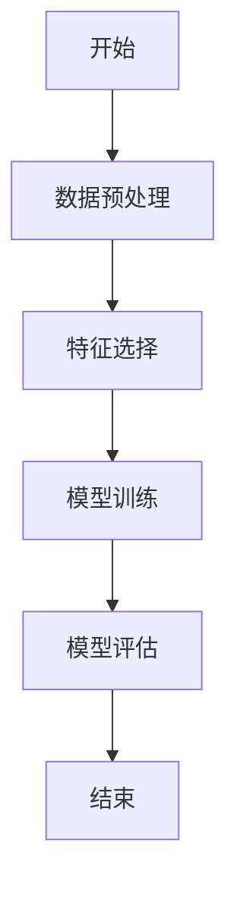

                 


# AI Agent在企业风险评估中的应用

---

## 关键词：AI Agent, 企业风险评估, 风险管理, 人工智能, 风险分析, 风险预测

---

## 摘要：本文深入探讨了AI Agent在企业风险评估中的应用，从基本概念、核心原理到实际应用，结合数学模型、算法实现和系统架构设计，详细分析了AI Agent如何提升企业风险评估的效率和准确性。文章还通过实际案例展示了AI Agent在风险识别、量化和应对策略中的具体应用，并总结了相关经验和未来发展方向。

---

# 第1章: AI Agent的基本概念与背景

## 1.1 AI Agent的定义与分类

### 1.1.1 AI Agent的定义
AI Agent（人工智能代理）是指能够感知环境、自主决策并执行任务的智能实体。它可以是一个软件程序、机器人或其他智能系统，具备以下核心特征：
- **自主性**：能够自主决策和行动。
- **反应性**：能够感知环境并实时响应。
- **目标导向**：以实现特定目标为导向。
- **学习能力**：能够通过数据和经验不断优化自身性能。

### 1.1.2 AI Agent的分类
AI Agent可以根据功能和应用场景分为以下几类：
1. **基于规则的AI Agent**：通过预定义的规则进行决策，适用于规则明确的场景。
2. **基于机器学习的AI Agent**：通过机器学习算法从数据中学习决策规则。
3. **基于强化学习的AI Agent**：通过与环境交互，通过试错学习最优策略。
4. **混合型AI Agent**：结合多种方法的AI Agent。

### 1.1.3 AI Agent在企业中的应用领域
AI Agent在企业中的应用领域广泛，包括：
- **风险管理**：识别和评估企业风险。
- **智能客服**：提供个性化服务。
- **自动化运维**：自动化监控和维护。
- **供应链管理**：优化供应链流程。

## 1.2 企业风险评估的基本概念

### 1.2.1 企业风险的定义
企业风险是指企业在经营过程中可能面临的各种不确定性，这些不确定性可能对企业的财务、运营、声誉等方面造成负面影响。

### 1.2.2 企业风险的分类
企业风险可以分为以下几类：
1. **财务风险**：与企业财务状况相关的风险。
2. **市场风险**：与市场波动相关的风险。
3. **运营风险**：与企业日常运营相关的风险。
4. **声誉风险**：与企业声誉相关的风险。

### 1.2.3 企业风险评估的重要性
企业风险评估是企业风险管理的基础，通过评估风险，企业可以制定有效的风险管理策略，降低潜在损失。

## 1.3 AI Agent在企业风险评估中的优势

### 1.3.1 提高风险识别的准确性
AI Agent可以通过分析大量数据，识别潜在风险，提高风险识别的准确性。

### 1.3.2 提升风险评估的效率
AI Agent可以快速处理大量数据，提高风险评估的效率。

### 1.3.3 降低人为错误的影响
AI Agent可以减少人为错误，提高风险评估的准确性。

## 1.4 本章小结
本章介绍了AI Agent的基本概念、分类及其在企业中的应用领域，重点探讨了企业风险评估的基本概念和AI Agent在其中的优势。

---

# 第2章: AI Agent的核心原理

## 2.1 AI Agent的决策机制

### 2.1.1 基于规则的决策
基于规则的决策是一种简单且易于实现的决策方法，适用于规则明确的场景。例如，在企业风险评估中，可以根据预定义的规则进行风险分类。

### 2.1.2 基于机器学习的决策
基于机器学习的决策通过训练模型从数据中学习决策规则，适用于复杂场景。例如，可以使用支持向量机（SVM）或随机森林（Random Forest）进行风险评估。

### 2.1.3 基于强化学习的决策
基于强化学习的决策通过与环境交互，逐步优化决策策略。例如，在动态风险环境中，AI Agent可以通过强化学习不断优化风险应对策略。

## 2.2 AI Agent的学习机制

### 2.2.1 监督学习
监督学习是一种通过标注数据进行学习的方法，适用于有监督的任务。例如，在企业风险评估中，可以通过监督学习训练模型识别高风险客户。

### 2.2.2 无监督学习
无监督学习是一种通过分析数据内在结构进行学习的方法，适用于无监督的任务。例如，可以通过聚类分析发现潜在的风险群。

### 2.2.3 半监督学习
半监督学习是一种结合监督学习和无监督学习的方法，适用于部分标注数据的任务。例如，在企业风险评估中，可以使用半监督学习处理部分标注的客户数据。

## 2.3 AI Agent的通信机制

### 2.3.1 Agent之间的通信
Agent之间的通信是通过消息传递实现的，可以使用多种通信协议，例如HTTP、WebSocket等。

### 2.3.2 Agent与人类的交互
Agent与人类的交互可以通过自然语言处理（NLP）技术实现，例如通过对话系统与用户交互。

### 2.3.3 多Agent系统中的协调与合作
在多Agent系统中，Agent之间需要协调与合作，可以通过分布式计算和协同算法实现。

## 2.4 本章小结
本章介绍了AI Agent的核心原理，包括决策机制、学习机制和通信机制，为后续章节的应用奠定了基础。

---

# 第3章: 风险评估的核心概念与方法

## 3.1 风险评估的基本原理

### 3.1.1 风险的三要素：可能性、影响程度、风险值
- **可能性**：风险发生的概率。
- **影响程度**：风险发生时的影响程度。
- **风险值**：综合可能性和影响程度的风险度量。

### 3.1.2 风险评估的步骤
1. **识别风险**：识别潜在的风险因素。
2. **量化风险**：量化风险的可能性和影响程度。
3. **评估风险**：综合评估风险值。
4. **制定应对策略**：根据风险评估结果制定应对策略。

### 3.1.3 风险评估的数学模型
风险值的计算公式为：
$$
\text{风险值} = \text{可能性} \times \text{影响程度}
$$

## 3.2 风险评估的主要方法

### 3.2.1 定性风险评估
定性风险评估通过描述性语言描述风险，适用于缺乏定量数据的场景。

### 3.2.2 定量风险评估
定量风险评估通过数值量化风险，适用于有充足数据的场景。

### 3.2.3 综合评估方法
综合评估方法结合定性和定量方法，适用于复杂场景。

## 3.3 企业风险评估的挑战与解决方案

### 3.3.1 数据不足的问题
可以通过数据增强或引入外部数据解决数据不足的问题。

### 3.3.2 模型的可解释性问题
可以通过解释性模型（如线性回归）或模型解释技术（如LIME）提高模型的可解释性。

## 3.4 本章小结
本章介绍了风险评估的核心概念和主要方法，探讨了企业风险评估的挑战与解决方案。

---

# 第4章: AI Agent在企业风险评估中的应用

## 4.1 风险识别与分类

### 4.1.1 风险识别
通过AI Agent分析企业内外部数据，识别潜在风险。

### 4.1.2 风险分类
基于风险的特征和属性，对风险进行分类。

## 4.2 风险量化与评估

### 4.2.1 风险量化
通过AI Agent计算风险的可能性和影响程度，量化风险值。

### 4.2.2 风险评估
综合评估风险值，确定风险的优先级。

## 4.3 风险应对与策略制定

### 4.3.1 风险应对
根据风险评估结果，制定风险应对策略。

### 4.3.2 策略优化
通过反馈机制不断优化风险应对策略。

## 4.4 本章小结
本章详细探讨了AI Agent在企业风险评估中的具体应用，包括风险识别、量化、评估和应对策略的制定。

---

# 第5章: AI Agent的风险评估算法实现

## 5.1 算法原理

### 5.1.1 基于机器学习的风险评估模型
常用算法包括逻辑回归、随机森林和梯度提升树（如XGBoost）。

### 5.1.2 基于深度学习的风险评估模型
常用算法包括神经网络和长短期记忆网络（LSTM）。

## 5.2 算法实现

### 5.2.1 代码实现
以下是一个基于逻辑回归的简单实现示例：

```python
from sklearn.linear_model import LogisticRegression
from sklearn.model_selection import train_test_split
import pandas as pd

# 加载数据
data = pd.read_csv('risk_data.csv')
X = data.drop('target', axis=1)
y = data['target']

# 划分训练集和测试集
X_train, X_test, y_train, y_test = train_test_split(X, y, test_size=0.2, random_state=42)

# 训练模型
model = LogisticRegression()
model.fit(X_train, y_train)

# 预测
y_pred = model.predict(X_test)
```

### 5.2.2 算法流程图


## 5.3 本章小结
本章通过具体算法实现，展示了AI Agent在企业风险评估中的技术细节。

---

# 第6章: 项目实战——基于AI Agent的企业风险评估系统

## 6.1 系统架构设计

### 6.1.1 系统功能模块
- 数据采集模块
- 风险识别模块
- 风险评估模块
- 策略制定模块

### 6.1.2 系统架构图


## 6.2 系统实现

### 6.2.1 环境安装
需要安装Python、scikit-learn、TensorFlow等库。

### 6.2.2 核心代码实现
以下是一个简单的风险评估系统实现示例：

```python
import pandas as pd
from sklearn.ensemble import RandomForestClassifier
from sklearn.model_selection import train_test_split

# 加载数据
data = pd.read_csv('risk_data.csv')
X = data.drop('target', axis=1)
y = data['target']

# 划分训练集和测试集
X_train, X_test, y_train, y_test = train_test_split(X, y, test_size=0.2, random_state=42)

# 训练模型
model = RandomForestClassifier()
model.fit(X_train, y_train)

# 预测
y_pred = model.predict(X_test)
```

## 6.3 实际案例分析

### 6.3.1 案例背景
以某银行为例，评估客户的信用风险。

### 6.3.2 案例分析
通过AI Agent分析客户的信用历史、收入、负债等信息，评估其信用风险。

## 6.4 本章小结
本章通过实际案例分析，展示了AI Agent在企业风险评估中的应用价值。

---

# 第7章: 系统优化与扩展

## 7.1 系统优化

### 7.1.1 模型优化
通过超参数调优和模型融合提高模型性能。

### 7.1.2 性能优化
通过分布式计算和缓存优化提高系统的运行效率。

## 7.2 系统扩展

### 7.2.1 功能扩展
增加更多的风险评估维度，例如环境、社会和治理（ESG）因素。

### 7.2.2 数据扩展
引入更多的数据源，例如外部市场数据和社交媒体数据。

## 7.3 本章小结
本章探讨了系统优化与扩展的方法，为AI Agent在企业风险评估中的应用提供了进一步的改进方向。

---

# 第8章: 总结与展望

## 8.1 总结
本文深入探讨了AI Agent在企业风险评估中的应用，从基本概念到具体实现，全面分析了AI Agent的优势和应用场景。

## 8.2 展望
随着AI技术的不断发展，AI Agent在企业风险评估中的应用将更加广泛和深入，未来的研究方向包括更智能的决策机制和更高效的算法优化。

## 8.3 注意事项
在实际应用中，需要注意数据隐私和模型的可解释性问题。

## 8.4 拓展阅读
推荐阅读《机器学习实战》和《深度学习》等书籍。

---

# 作者：AI天才研究院/AI Genius Institute & 禅与计算机程序设计艺术 /Zen And The Art of Computer Programming

