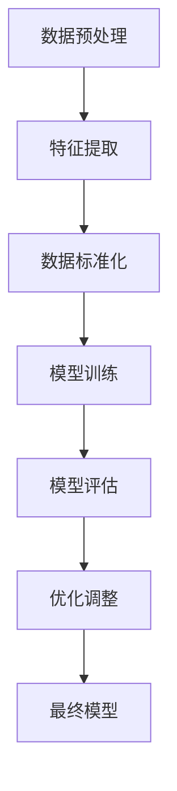
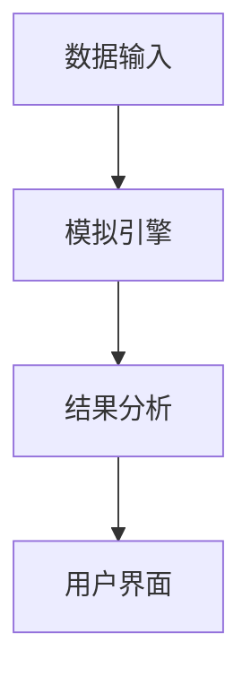

                 


# AI Agent在企业风险预测与情景模拟中的前沿应用

## 关键词：AI Agent, 风险预测, 情景模拟, 企业应用, 强化学习

## 摘要：  
本文深入探讨AI Agent在企业风险预测与情景模拟中的前沿应用，分析其核心技术、算法原理及系统设计。通过实际案例，展示AI Agent在帮助企业识别潜在风险、优化决策中的价值，并展望其未来发展方向。

---

# 第一部分：AI Agent基础与背景

## 第1章：AI Agent概述

### 1.1 AI Agent的基本概念

- **1.1.1 AI Agent的定义与核心特征**
  - AI Agent是一种智能体，具备感知环境、自主决策、执行任务的能力。
  - 核心特征：自主性、反应性、目标导向、社会性。

- **1.1.2 AI Agent与传统AI的区别**
  - 传统AI：任务驱动，依赖规则。
  - AI Agent：环境驱动，具备主动性。

- **1.1.3 AI Agent在企业中的应用前景**
  - 优化决策流程、提高效率、降低风险。

### 1.2 企业风险预测与情景模拟的背景

- **1.2.1 企业风险预测的定义与重要性**
  - 识别潜在风险，提前制定应对策略。
  - 通过AI Agent分析数据，提供精准预测。

- **1.2.2 情景模拟在企业决策中的作用**
  - 模拟不同策略的效果，优化决策。
  - 提供多种可能性，降低决策风险。

- **1.2.3 AI Agent在风险预测与情景模拟中的优势**
  - 高效性：快速处理大量数据。
  - 智能性：动态调整策略。

---

# 第二部分：AI Agent的核心技术

## 第2章：AI Agent的核心技术与原理

### 2.1 自然语言处理（NLP）

- **2.1.1 NLP的基本概念与技术**
  - 分词、实体识别、情感分析。
  - 用于文本数据处理，提取有用信息。

- **2.1.2 NLP在风险预测中的应用**
  - 分析新闻、报告，识别潜在风险。

### 2.2 强化学习（Reinforcement Learning）

- **2.2.1 强化学习的基本原理**
  - 通过试错学习，优化策略。
  - 奖励机制：最大化累计奖励。

- **2.2.2 强化学习在情景模拟中的应用**
  - 模拟决策过程，优化策略。
  - 动态调整模拟环境中的变量。

### 2.3 图神经网络（Graph Neural Networks）

- **2.3.1 图神经网络的基本概念**
  - 处理图结构数据，节点关系。
  - 用于复杂关系网络分析。

- **2.3.2 图神经网络在企业关系分析中的应用**
  - 分析供应链、合作伙伴关系。
  - 预测潜在风险。

---

# 第三部分：AI Agent在风险预测中的算法原理

## 第3章：风险预测的算法原理

### 3.1 数据预处理

- **3.1.1 数据清洗与特征提取**
  - 清洗：去除无效数据，处理缺失值。
  - 特征提取：从文本、数值数据中提取有用特征。

- **3.1.2 数据标准化与归一化**
  - 标准化：消除量纲影响。
  - 归一化：统一数据范围。

### 3.2 风险预测模型

- **3.2.1 基于机器学习的风险预测模型**
  - 线性回归、逻辑回归、随机森林。
  - 常见于中小型企业风险预测。

- **3.2.2 基于深度学习的风险预测模型**
  - 卷积神经网络（CNN）、循环神经网络（RNN）。
  - 适用于复杂数据和高维特征。

### 3.3 算法流程图



---

# 第四部分：AI Agent在情景模拟中的系统设计

## 第4章：情景模拟的系统架构

### 4.1 系统功能设计

- **4.1.1 情景模拟的功能模块划分**
  - 数据输入模块、模拟引擎、结果分析模块。
  - 每个模块负责不同的功能。

- **4.1.2 各模块之间的交互关系**
  - 数据输入模块提供初始数据，模拟引擎运行，结果分析模块生成报告。

### 4.2 系统架构图



---

# 第五部分：项目实战

## 第5章：AI Agent在企业风险预测中的实战

### 5.1 项目环境安装

- **5.1.1 安装必要的开发工具与库**
  - Python、TensorFlow、Scikit-learn、NLTK。
  - 安装命令示例：`pip install tensorflow scikit-learn`

### 5.2 数据准备与处理

- **5.2.1 数据收集与清洗**
  - 使用公开数据集或企业数据。
  - 删除重复和无效数据。

- **5.2.2 数据特征工程**
  - 提取文本特征：TF-IDF、Word2Vec。
  - 数值特征标准化。

### 5.3 模型实现

- **5.3.1 模型训练与调优**
  - 选择模型：随机森林、XGBoost。
  - 调参：网格搜索、交叉验证。

- **5.3.2 模型评估与优化**
  - 使用准确率、召回率、F1分数评估。
  - 优化模型参数，调整特征。

### 5.4 代码实现

```python
import pandas as pd
from sklearn.ensemble import RandomForestClassifier
from sklearn.metrics import accuracy_score, recall_score, f1_score

# 数据加载
data = pd.read_csv('risk_data.csv')
X = data.drop('label', axis=1)
y = data['label']

# 特征工程
from sklearn.preprocessing import StandardScaler
scaler = StandardScaler()
X_scaled = scaler.fit_transform(X)

# 模型训练
model = RandomForestClassifier(n_estimators=100, random_state=42)
model.fit(X_scaled, y)

# 模型预测
y_pred = model.predict(X_scaled)

# 模型评估
print(f'Accuracy: {accuracy_score(y, y_pred)}')
print(f'Recall: {recall_score(y, y_pred)}')
print(f'F1 Score: {f1_score(y, y_pred)}')
```

---

# 第六部分：总结与展望

## 第6章：总结与未来展望

### 6.1 总结

- AI Agent在企业风险预测与情景模拟中的应用具有巨大潜力。
- 通过AI Agent，企业可以更高效地识别风险，优化决策。

### 6.2 未来展望

- 技术进步：更复杂的模型，如GPT-4。
- 数据共享：建立更广泛的数据共享机制。
- 行业应用：在金融、医疗等领域深入应用。

### 最佳实践 Tips

- 数据隐私：确保数据安全。
- 模型可解释：选择可解释性高的模型。
- 持续优化：定期更新模型和数据。

---

# 作者：AI天才研究院 & 禅与计算机程序设计艺术

---

通过以上结构和内容的撰写，文章系统地介绍了AI Agent在企业风险预测与情景模拟中的应用，从理论到实践，层层深入，为读者提供了全面的知识和实际操作指南。

